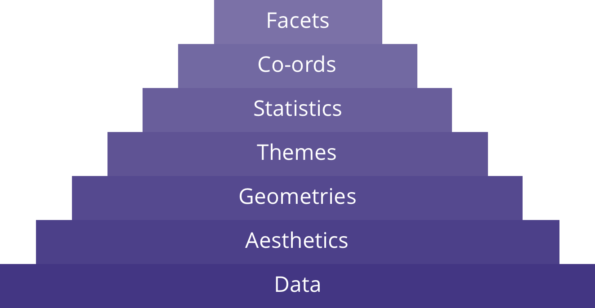

```{r setup, include=FALSE}
# Author: Russell McCreath
# Original Date: June 2021

library(learnr)
library(gradethis)
library(readr)
library(dplyr)
library(ggplot2)
library(datasauRus)
library(magrittr)
library(tidyr)
knitr::opts_chunk$set(echo = FALSE)

tutorial_options(
  exercise.checker = gradethis::grade_learnr
)

borders_data <- read_csv("www/data/BORDERS (inc Age).csv")

```

```{r phs-logo, echo=FALSE, fig.align='right', out.width="40%"}
knitr::include_graphics("images/phs-logo.png")
```


## Introduction

Welcome to an Introduction to Data Visualisation in R. This course is designed as a self-led introduction for anyone in Public Health Scotland. Throughout this course there will be quizzes to test your knowledge and opportunities to modify and write R code (building your own visualisations). This course focusses on the use of the package `ggplot2` but will introduce some concepts from `plotly`.

<div class="info_box">
  <h4>Course Info</h4>
  <ul>
    <li>This course is built to flow through sections and build on previous knowledge. If you're comfortable with a particular section, you can skip it.</li>
    <li>Most sections have multiple parts to them. Navigate the course by using the buttons at the bottom of the screen to Continue or go to the Next Topic.</li>
    <li>The course will also show progress through sections, a green tick will appear on sections you've completed, and it will remember your place if you decide to close your browser and come back later.</li>
  </ul>
</div>
</br>

### What is Data Visualisation?

Data visualisation is an essential skill across the spectrum of data science. It is a form of graphical data analysis, which emphasises the accurate representation and interpretation of data. On the other hand, data viz also relies on good design choices, not only to make the outputs attractive but also aiding the understanding of the results. 

There are two main types of data viz:

* **Exploratory** - easily generated, data-heavy, intended for a small specialist audience. This use case here is for graphical data analysis.
* **Explanatory** - labour intensive, data specific, and intended for a broad audience. This use case could be in publications or presentations.

*Render 2 plots to visualise the difference?*

```{r intro-quiz}
quiz(
  question("Let's get started. Which of the following are exploratory plots typically NOT?",
    answer("Pretty", correct = TRUE),
    answer("Meant for a specialist audience"),
    answer("Data-heavy"),
    answer("Rough first drafts"),
    answer("Part of our data science toolkit as graphical data analysis"),
    incorrect = "Not quite, have another go!",
    allow_retry = TRUE,
    random_answer_order = TRUE
  )
)
```


### Ineffective Data Visualisation

Visualising data is an art as much as a science. There are a number of issues to be aware of, including presenting multi-dimensional data, human perception and accessibility, and just generally misleading presentations. 

Let's take these visualisations as an example, what do you think is common across all of them?

```{r datasauRus-plot, echo=FALSE}
ggplot(datasaurus_dozen, aes(x=x, y=y))+
    geom_point(colour = "#433683", alpha = 0.5) +
    theme_void() +
    theme(legend.position = "none", aspect.ratio = 1) +
    facet_wrap(~dataset, ncol=5)
```

```{r datasaurus-quiz}
quiz(
  question("What are the common features across these sets of data?",
    answer("Mean", correct = TRUE),
    answer("Standard Deviation", correct = TRUE),
    answer("Correlation", correct = TRUE),
    correct = "That's right, summary statistics for all the datasets are the same.",
    incorrect = "Is that all?",
    allow_retry = TRUE,
    random_answer_order = TRUE
  )
)
```


### Effective Data Visualisation

The previous visualisations are a *fun* variant on Anscombe's Quartet, called the [The Datasaurus Dozen](https://www.autodesk.com/research/publications/same-stats-different-graphs). The summary statistics are shown below:

```{r datasaurus-stats, echo=FALSE, rows.print=14}
datasaurus_dozen %>% 
    group_by(dataset) %>% 
    summarize(
      mean_x    = mean(x),
      mean_y    = mean(y),
      std_dev_x = sd(x),
      std_dev_y = sd(y),
      corr_x_y  = cor(x, y)
    ) %>%
  mutate(across(2:6, round, 3))
```

The key takeaway should be to model your data, visualise to understand your data attributes. However, there are also other considerations for how plot's should be:

* **Conceptually** correct - data is represented visually in a way that makes sense.
* **Technically** correct - details of the data representation are complete and accurate.
* **Aesthetically** correct - data is represented in a visually pleasing way.


## Foundations

We're going to use the package `ggplot2` for most of this course. So, let's start by building a plot to see what all of this is about. We can then take the code apart bit by bit to understand what's going on (and what's possible). Feel free to adjust the code and see how it affects the output.

```{r prepare-foundations-plot}
borders_data_plot <- borders_data %>%
  filter(Sex %in% c("Male", "Female"),
         ageonadmission >= 0) %>% 
  drop_na(Sex)
```

```{r foundations-plot, exercise=TRUE, exercise.setup='prepare-foundations-plot', warning=FALSE}
library(ggplot2)

borders_data_plot %>%
  ggplot() +
  geom_point(aes(x = ageonadmission, y = LengthOfStay, colour = Sex), 
             alpha = 0.5) +
  theme_minimal() +
  ylab("Length of Stay (days)") +
  xlab("Age on Admission (years)") +
  ggtitle("Length of Stay by Age on Admission")

```

</br>

There we have it, in just a few lines of code, we've created a plot. You may even have already worked out what some of the code does. We're now going to take a step back to understand how all of this comes together. 

It comes from an underlying grammar of graphics, a framework which follows a layered approach to describe and construct visualisations or graphics in a structured manner. There are 7 grammatical elements:

```{r, echo=FALSE}
graphics_grammar_table <- data.frame(
  "Element" = c("**Data**", "**Aesthetics**", "**Geometries**", "**Themes**", "**Statistics**", "**Coordinates**", "**Facets**"),
  "Description" = c("The data-set being plotted.", "The scales/axes based on the data dimensions. Any form of encoding, including size, shape, color and so on which are useful for plotting multiple data dimensions.", "These are popularly known as ‘geoms’. This would cover the way we would depict the data points on the visualisation. Should it be points, bars, lines and so on.", "The additional, non-data, ink on our outputs. These add value and make things look pretty.", "Statistical measures in the visualisation like measures of central tendency, spread, confidence intervals.", "What kind of a coordinate system should the visualization be based on?", "Subplots based on specific data dimensions."),
  "Common Options" = c("", "<code>x-axis</code> <code>y-axis</code> <code>colour</code> <code>fill</code> <code>size</code> <code>labels</code> <code>alpha</code> <code>shape</code> <code>line-width</code> <code>line-type</code>", "<code>point</code> <code>line</code> <code>histogram</code> <code>bar</code>", "", "<code>binning</code> <code>smoothing</code> <code>descriptive</code> <code>inferential</code>", "<code>cartesian</code> <code>fixed</code> <code>polar</code> <code>limits</code>", "<code>columns</code> <code>rows</code>"),
  check.names = FALSE
)

knitr::kable(graphics_grammar_table)

```

</br>

<div class="viz-layers">
```{r viz-layers, echo=FALSE, fig.align='center', out.width="90%"}

```
</div>

This shows how the layers of the grammar of graphics build up. It's also important to know that while data is required, the layers above become more optional (not every plot needs additional statistical measures). The use of these layers will depend on the use of the visualisation, the audience, and even the medium it's being shared on (i.e., web, pdf, image). You may also see similar representations with slightly different names or ordering.

Using only the first 4 layers (data, aesthetics, geometries, and themes), we'll be able to create publication-quality plots. The final 3 layers will be explored at a higher level for those who are interested.

</br>


## Data

This is going to be a short section but important nonetheless. The basis for any visualisation is the data, however it's rarely useful to look at the numbers and characters that make up a dataset. Some visualisation is required to show relationships. 

As mentioned, we're going to mainly use the `ggplot2` package in this course. There are a few reasons for this but it breaks down to being able to create relatively complex and aesthetically pleasing plots using syntax that is intuitive and comparatively easy to remember. However, a requirement for using the package effectively is that the data must be [tidy data](https://vita.had.co.nz/papers/tidy-data.pdf). *This can be summarised as observations in rows and variables as columns*. Have a look at the [`tidyr`](https://tidyr.tidyverse.org/) package to explore how to make data tidy in the Tidyverse.

The dataset we used in the last exercise and will continue popping up is the borders training dataset. Have a look at its structure below using `glimpse()` (a tidy-output of `str()`).

```{r data-view, exercise=TRUE}
___(borders_data)

```

```{r data-view-hint-1}
glimpse(borders_data)

```

Let's build another plot too. Run the code below and feel free to play around with it. We'll learn how it all comes together in the next chapters. Just remember we're using that tidy data as our solid foundation.

```{r data-plot, exercise=TRUE, warning=FALSE}
borders_data %>%
  ggplot(aes(x = spec_1, y = ageonadmission)) +
  geom_boxplot(outlier.colour = "magenta4") +
  xlab("Specialty Grouping") +
  ylab("Age on Admission (years)") +
  ggtitle("Boxplot of Patient Age on Admission by Specialty Grouping")
```

