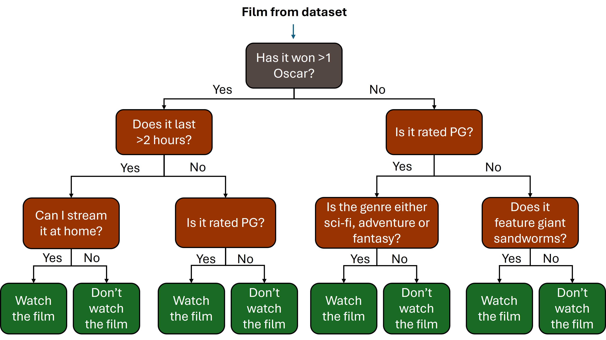
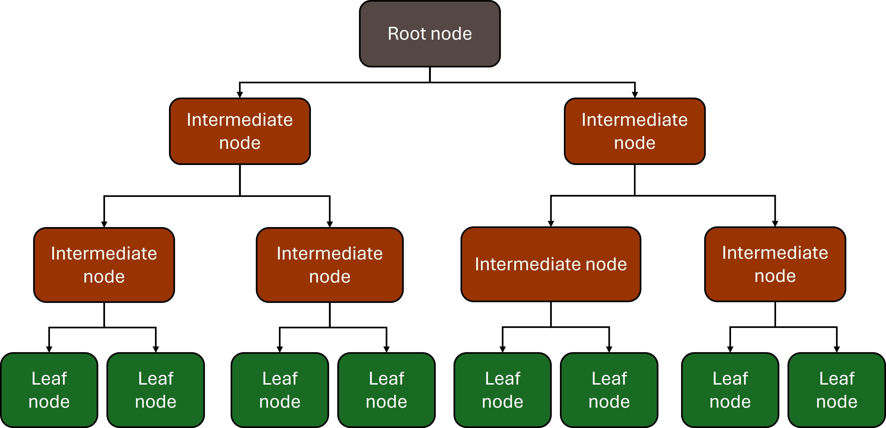
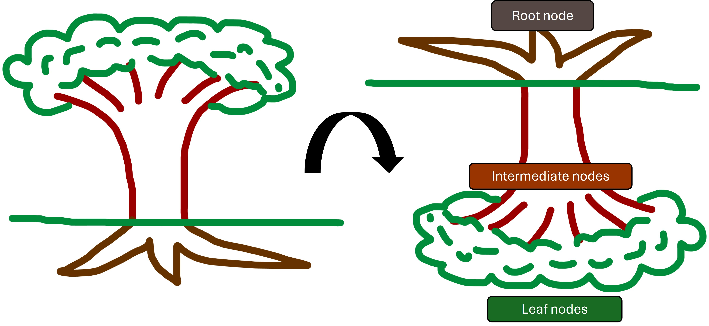

```{r setup, include=FALSE}
# Author: Al Morgan
# Original Date: Dec 2024
# Version of R: 3.6.1

library(learnr)
library(gradethis)
library(readr)
library(dplyr)
library(ggplot2)
library(rpart)
library(rpart.plot)
knitr::opts_chunk$set(echo = FALSE)

tutorial_options(
  exercise.checker = gradethis::grade_learnr
)

titanic_data <- read_csv("www/data/titanic_decision_tree_data.csv")
set.seed(19)
```

```{r phs-logo, echo=FALSE, fig.align='right', out.width="40%"}

```


## Introduction

Welcome to an Introduction to Decision Trees. This course is designed as a self-led introduction to decision trees for anyone in Public Health Scotland. Throughout this course there will be quizzes to test your knowledge and opportunities to modify and write R code.

```{r intro-pathway, echo=FALSE, fig.align='center', out.width="100%", fig.cap = "source: vecteezy.com"}

```

<br>

<div class="info_box">
  <h4>Course Info</h4>
  <ul>
    <li>This course is built to flow through sections and build on previous knowledge. If you're comfortable with a particular section, you can skip it.</li>
    <li>Most sections have multiple parts to them. Navigate the course by using the buttons at the bottom of the screen to Continue or go to the Next Topic.</li>
    <li>The course will also show progress through sections, a green tick will appear on sections you've completed, and it will remember your place if you decide to close your browser and come back later.</li>
  </ul>
</div>
</br>

### What is a decision tree?

* A useful type of model that allow us to make predictions from our data
* A map of the possible outcomes of a series of related choices, often seen in businesses as ‘decision flowcharts’ or ‘process flowcharts’
* A series of choices/questions that are read downwards, that lead to a final prediction for any given data point

Similar to a regression model (see [Intro to Linear Regression](https://scotland.shinyapps.io/phs-learnr-linearmodelling/)), we can build a decision tree using our data, and subsequently predict the chosen outcome variable based on the predictor variables used to build a model.

One major advantage of using a decision tree is that the predicted outcome variable can be numeric:

> e.g. if I consumed four eggs, two slices of toast, and a cup of coffee for breakfast, how many miles will I cycle today?

or categorical:

> e.g. if it’s a Monday morning with high wind and rain, will John go for a bike ride, yes or no?

<br>

### Example: films worth watching

Imagine you have a data set containing many films: with information on genre, awards won, run time etc. for each and, critically, a binary (yes/no) variable on whether you would enjoying watching each movie.

Below is an example of a tree, created using this fictional data, that you could use to decide whether to watch a given film. The process of creating a decision tree produces questions (or 'branches') that the algorithm deems are the best ways of separating our data - in this case, the films we consider watchable from those we do not. By simply answering questions about said film, we could work our way from top to bottom to reach a decision. 

```{r echo=FALSE, fig.align='center', out.width="75%"}

```


</br>

```{r intro-quiz}
quiz(
  question("What would the decision tree above recommend for a fantasy film with 0 Oscars, a duration of 1 hour and 43 mins, an age rating of 15, streamable at home, an enjoyable soundtrack, and no giant sandworms?",
    answer("Watch the film", correct = FALSE),
    answer("Don't watch the film", correct = TRUE),
    incorrect = "Not quite, have another go!",
    allow_retry = TRUE,
    random_answer_order = TRUE
  )
)
```

<br>

### Decision tree structure

```{r echo=FALSE, fig.align='center', out.width="75%"}

```

Notice that, when interpreting a decision tree, we start at the top of the tree. Unintuitively, this top node is referred to as the **root node**. Associated with this is a question/branch that leads to **intermediate nodes** which, following more branches, eventually lead to **leaf nodes** at the bottom.

<br>

```{r echo=FALSE, fig.align='center', out.width="75%"}

```


You can think of it as an upside-down tree, really. Starting from the root at the top to the leaves at the bottom.

<br>


## Goal of this course

In this course, we’re going to build a decision tree based off a dataset about passengers onboard the Titanic. This model will allow us to predict who was most likely to survive the unfortunate sinking of the vessel (apologies for the morbid nature of this data!).

To do this we’re going to:

1.	Read in the relevant data

2.	Wrangle the data and perform some **feature engineering**

3.	Optional: Create some simple plots to help identify useful predictors for our model

4.	Build a decision tree model using `rpart()` from the `{rpart}` package

5.	Visualise the decision tree using `rpart.plot()` from the `{rpart.plot}` package

6.	Interpret the model

7.	Test the model’s predictive power by comparing predicted values to those in our data

Following this, we will create a **random forest** model and see how if this improves the predictive power we can attain.

<br>

## Exploring the dataset

We can read in our Titanic data using `read_csv()` from the `{readr}` package:
```{r, echo = TRUE, eval = FALSE}
library(readr)
titanic_data <- read_csv("www/data/titanic_decision_tree_data.csv")
```

```{r, echo = TRUE, eval = TRUE}
# check out the first 10 rows of the data
head(titanic_data)
```

### Data dictionary

What variables do we have here?

•	`passenger_id`: a unique number given to each passenger

•	`pclass` : ticket class, 1 = 1st (upper class), 2 = 2nd (middle class), 3 = 3rd (lower class)

•	`name`: passenger name

•	`sex`: biological sex, male or female

•	`age`: passenger age

•	`sib_sp` : number of siblings / spouses on board

•	`parch`: number of parents / children aboard the Titanic; some children travelled only with a nanny, therefore `parch` = 0 for them

•	`ticket`: ticket ID

•	`fare`: the cost of the passenger’s ticket

•	`cabin`: cabin number (if known/relevant)

•	`embarked`: city of embarkation; C = Cherbourg, Q = Queenstown, S = Southampton

•	`survived` : did they survive? 0 = No, 1 = Yes

<br>

## Data wrangling and feature engineering

Prior to building a model, cleaning and wrangling our data is always the first step.

Here is what we’ll do in this section:

1.	Filter down to only observations which have a `survived` flag (i.e. that aren’t missing)

2.	Turn the relevant variables into factors (`sex`, `survived`, `pclass`, `embarkation`)

      *	This way the model will identify `sex`, for example, as a factor with 2 levels as opposed to a         character variable

3.	Create an `age_status` variable which groups individuals under (and including) 16 years of age into a category called “child” category and those over 16 into a category called “adult”.

      *	This is an example of **feature engineering** in which we are creating a new child/adult variable        based on a variable we already have, `age`

4.	Drop any variables we don’t need

      *	It’s important to identify and remove the variables which will be of no use inside a decision tree         prior to building it

      *	We’ll remove those variables that are unique to each row and can’t be grouped into meaningful            categories: `passenger_id`, `name`, `ticket`

      *	We’ll remove `fare` and `cabin` as the information in these is better represented in the categorical `pclass` variable already 

5.	Drop any rows with `NA`

      *	It’s important to do this after we’ve trimmed down our data to the columns we’re interested in as        otherwise we sacrifice rows for the sake of variables we don’t want anyway


Try having a go at the above list of cleaning/wrangling tasks on your own before looking at the answers below.
```{r wrangle-input, exercise = TRUE}
titanic_clean <- titanic_data %>%
## start coding here
```

<details>
<summary>Data cleaning code - ***click here to expand***</summary>

```{r, echo = TRUE, eval = TRUE}
titanic_clean <- titanic_data %>%
  # Filter out those without a survived flag
  filter(survived %in% c(0,1)) %>%
  # Convert to factor level
  mutate(sex = as.factor(sex), 
         age_status = as.factor(if_else(age <= 16, "child", "adult")),
         class = factor(pclass, levels = c(3, 2, 1), labels = c("lower", "middle", "upper")), 
         survived_flag = factor(survived, levels = c(0, 1), labels = c("No", "Yes")), 
         port_embarkation = as.factor(embarked)) %>%
  # Select variables of interest
  select(sex, age_status, class, port_embarkation, sib_sp, parch, survived_flag) %>%
  # Drop NAs
  tidyr::drop_na()

head(titanic_clean)
```
</details>

<br>

Now our data is trimmed and consists of:

a) the outcome variable of interest, named `survived_flag` in the answer above

b) a collection of potential predictors that may be useful in our model when predicting survival

<br>

## Visualise the data

This isn’t a strictly necessary step when building a decision tree, but it’s good practice to understand your data before building a model with it. Creating some quick visualisations is a great way to better understand your data.

Use `ggplot()` to create some visualisations to see which variables appear to have the greatest effect on survival. If you don't feel confident using `ggplot()`, feel free to skip this section for now and make sure to check out our [data visualisation course](https://scotland.shinyapps.io/phs-learnr-dataviz/).

*Hint: try plotting* `survived_flag` *and colour-coding by different variables.*

```{r ggplot-input-setup, include = FALSE}
titanic_clean <- titanic_data %>%
  filter(survived %in% c(0,1)) %>%
  mutate(sex = as.factor(sex), 
         age_status = as.factor(if_else(age <= 16, "child", "adult")),
         class = factor(pclass, levels = c(3, 2, 1), labels = c("lower", "middle", "upper")), 
         survived_flag = factor(survived, levels = c(0, 1), labels = c("No", "Yes")), 
         port_embarkation = as.factor(embarked)) %>%
  select(sex, age_status, class, port_embarkation, sib_sp, parch, survived_flag) %>%
  tidyr::drop_na()
```


```{r ggplot-input, exercise = TRUE, exercise.setup = 'ggplot-input-setup'}
titanic_clean %>%
  ggplot() +
  ## start coding here
```
Once we create the model in the next section, we’ll see if your predictions were correct.

<br>

## Build and plot the decision tree

In this section, we’re going to build the decision tree itself. However, we will want to **test** the performance of the model on some of our `titanic_clean` data. For this reason, we will split the data randomly into an 80%/20% split: building the model on 80% of the data and holding aside 20% to test if the predicted `survived_flag` values it returns are similar to the true values in the data.

### Train/test split

The following code will split the data into ‘training’ and ‘testing’ subsets.
```{r echo = TRUE, eval = TRUE}
# number of rows in the data
n_data <- nrow(titanic_clean)

# create a test sample index, i.e. a collection of row numbers for the test sample
set.seed(123)
test_index <- sample(1:n_data, size = n_data*0.2)

# create the test set, i.e. keep rows from the data using the index above
titanic_test  <- slice(titanic_clean, test_index)

# create the training set, i.e. remove rows from the data using the index above
titanic_train <- slice(titanic_clean, -test_index)
```

::: {style="color: blue;"}
Note the use of `set.seed()`. This just means that the random sampling carried out by the `sample()` function on the next line is done in the same way each time. This means if *you* run this code you will get the same values that are *presented in this course*. You won't need `set.seed()` outside of this course unless you need a random sample to remain the same across several iterations!
:::

<br>

This now gives us two data frames to work with: the larger training data `titanic_train` with which we’ll build the decision tree, and the smaller testing data `titanic_train` with which we’ll test the tree with later. It’s important that we leave this testing data aside until then.

We can check how *balanced* the data frames are, in terms of our outcome variable of interest `survived_flag`, by using the `tabyl()` function from the `{janitor}` package. If one side of the train/test split had the large majority of passengers who survived, and the other side had the large majority of passengers who did not, it would be a good idea to resample the data.

```{r, echo = TRUE, eval = TRUE}
# check for balanced sets
titanic_train %>%
 	janitor::tabyl(survived_flag)
```
This shows us that 41.2% of passengers in the training data survived and 58.8% did not.

*Note: be aware that the* `percentage` *column actually represents proportions (i.e. between 0 and 1)*

```{r, echo = TRUE, eval = TRUE}
titanic_test %>%
 janitor::tabyl(survived_flag)
```
And this shows us that 37.3% of passengers in the testing data survived and 62.7% did not.

It’s very unlikely that we’ll get an exact match between data sets, but in general the gap between the two will be smaller with larger datasets. For now, this seems like a pretty even split.

<br>

### Build the tree using training data

Now we've got our training data ready, we can build the tree using the `rpart()` function from the `{rpart}` package. `rpart` stands for *recursive partitioning and regression trees* - catchy name.

This function requires:

1) The target variable of interest, `survived_flag`, to be passed to the `formula` argument. The syntax used here is: `target_variable ~ .`, specifying that we want to predict `target_variable` using all available variables as predictors (denoted by the `.`).

2) The training data, `titanic_train`, to be passed to the `data` argument

3) The type of variable we are interested in to be passed to the `method` argument: `class` for  predicting categorical variables (e.g. survived or not), `anova` for predicting continuous variables.

We'll call the tree model `titanic_fit`. Have a go at creating the model below:

```{r tree-setup, include = FALSE}
titanic_clean <- titanic_data %>%
  filter(survived %in% c(0,1)) %>%
  mutate(sex = as.factor(sex), 
         age_status = as.factor(if_else(age <= 16, "child", "adult")),
         class = factor(pclass, levels = c(3, 2, 1), labels = c("lower", "middle", "upper")), 
         survived_flag = factor(survived, levels = c(0, 1), labels = c("No", "Yes")), 
         port_embarkation = as.factor(embarked)) %>%
  select(sex, age_status, class, port_embarkation, sib_sp, parch, survived_flag) %>%
  tidyr::drop_na()

n_data <- nrow(titanic_clean)
set.seed(123)
test_index <- sample(1:n_data, size = n_data*0.2)
titanic_test  <- slice(titanic_clean, test_index)
titanic_train <- slice(titanic_clean, -test_index)
```

```{r tree-build, exercise = TRUE, exercise.setup = 'tree-setup'}
library(rpart)

titanic_fit <- rpart(
  formula = , 
  data = ,
  method = '' # method argument needs to be in quotation marks
)
```

```{r tree-build-check}
grade_this({
  pass_if(
    identical(
      .result$call,
      rpart(
        formula = survived_flag ~ .,
        data = titanic_train,
        method = 'class'
      )$call
    ),
    "Great job! Your answer is correct."
  )
  fail_if(
    !all.equal(.result$call$formula, survived_flag ~ .),
    "The formula argument is incorrect. Make sure it's `target_variable ~ .`."
  )
  fail_if(
    !all.equal(as.character(.result$call$data), "titanic_train"),
    "The data argument is incorrect. Ensure you're using the appropriate training dataset."
  )
  fail_if(
    .result$call$method != "class",
    "The method argument is incorrect - and remember it should be in quotation marks."
  )
  fail("Something isn't quite right. Check your code and try again.")
})
```

<br>

<div class="info_box">
  <h4>Classification algorithm</h4>
  We won't go into much detail here, but the default algorithm used by `rpart()` to build a classification tree like this is the **Gini impurity** method:
  
  * Gini impurity tells us how "mixed" a group of items is.
  
  * Imagine you have a jar with two types of sweets: red and blue. If the jar has only red sweets or only blue sweets, it's *pure* (Gini impurity is 0). But if the jar has a mix of both colors, it's *impure* (Gini impurity is higher).
  
  * In a decision tree, we want to split the data into groups that are as pure as possible — meaning each group should have mostly one type of outcome. The Gini impurity helps the tree figure out **which split makes the groups the purest**.
</div>

<br>

### Plot the decision tree

Great! Now we have our tree model, let's do the exciting part and plot it.

For visualising trees, we use the `rpart.plot()` function from the `{rpart.plot}` package. Don't worry about all the other arguments for now, just notice that the first argument we pass to it (`x`) is the tree model object itself.

```{r, include = FALSE}
titanic_fit <- rpart(
  formula = survived_flag ~ ., 
  data = titanic_train,
  method = 'class'
)
```


```{r, echo = TRUE, eval = TRUE}
library(rpart.plot)

rpart.plot(x = titanic_fit,
           yesno = 2,
           fallen.leaves = TRUE,
           faclen = 6,
           digits = 4)
```

<br>

Voila! Here is our decision tree in visual form. See if you can interpret it yourself before we investigate it properly in the next section.

<br>

## Interpret the decision tree

One advantage to decision trees over other types of machine learning models is that they are more easily-interpretable due to their 'flow chart' format.

```{r, echo = FALSE, eval = TRUE}
rpart.plot(titanic_fit,
           yesno = 2,
           fallen.leaves = TRUE,
           faclen = 6,
           digits = 2)
```

Let's start from the top and interpret the tree along a single route top to bottom (or root to leaf).

* All of the training data, before being split up by any questions, is represented in the **root node** at the top: the tree predicts that `survived = No` is the most likely outcome overall, with a probability of surviving of 0.41.  The % value shown in each node represents the proportion of the dataset that passes through that node (here, 100%).

* The first 'question' asked of our data is `sex = male` (think of it like an operator, `sex == male`) with two potential branches: `yes` or `no`.

* `yes` (or male) leads us left down to an **intermediate node**, which predicts `No` to survival, with a probability of survival of 0.22. 64% of the training data ends up here, essentially meaning that 64% of the data are males.

* From this node, the question `class = lower, middle` is asked (i.e. `class %in% c("lower", "middle")`).

* `yes` leads us to another **intermediate node**, which again predicts `No` to survival ($prob(survival = 0.16)$) and contains 49% of the data.

* This node asks whether `age_status = adult` and, if `yes`, leads us along a branch to a **leaf node** at the bottom left that predicts `No`, with $prob(survival) = 0.13$. 43% of the data set ends up at this node.

The algorithm used to build the model uses a probability of 0.5 as the threshold for classification: i.e. if $prob(survival) < 0.5$, the model predicts `No`. Furthermore, the colour of each node represents the probability: dark blue -> light blue -> light green -> dark green as the probability of survival increases.

Now, to test your ability to interpret the tree, a quiz...

```{r tree-quiz}
quiz(
  question("What outcome does our tree predict for a female passenger in lower class with a husband and sister on board?",
    answer("Did not survive", correct = TRUE),
    answer("Did survive", correct = FALSE),
    incorrect = "Not quite, have another go!",
    allow_retry = TRUE,
    random_answer_order = TRUE
  ),
  question("What outcome does our tree predict for a young boy in lower or middle class with no siblings and both parents on board?",
    answer("Did not survive", correct = FALSE),
    answer("Did survive", correct = TRUE),
    incorrect = "Not quite, have another go!",
    allow_retry = TRUE,
    random_answer_order = TRUE
  )
)
```

<br>

### Formatting the tree's appearance

Now we will take a look at the `rpart.plot()` arguments. Below is a reminder of the code we used above: 

```{r, echo = TRUE, eval = FALSE}
rpart.plot(x = titanic_fit,
           yesno = 1,
           fallen.leaves = TRUE,
           faclen = 3,
           digits = 2)
```

* `yesno` adjusts the presence/location of the "yes" and "no" boxes in the plot.

* `fallen.leaves` is a binary argument that sets the leaf nodes to all lie in a row at the bottom.

* `faclen` is a numeric argument that dictates the maximum number of characters the levels of each categorical variable can displayed as (when `faclen` < word length, abbreviation is used).

* `digits` is a numeric argument that specifies the number of decimal places to display for each node's probability.

Play around with code below to get an idea of how these arguments, plus some new ones, can alter the look of your decision tree:

```{r plot-format-exercise-setup}
titanic_clean <- titanic_data %>%
  filter(survived %in% c(0,1)) %>%
  mutate(sex = as.factor(sex),
         age_status = as.factor(if_else(age <= 16, "child", "adult")),
         class = factor(pclass, levels = c(3, 2, 1), labels = c("lower", "middle", "upper")),
         survived_flag = factor(survived, levels = c(0, 1), labels = c("No", "Yes")), 
         port_embarkation = as.factor(embarked)) %>%
  select(sex, age_status, class, port_embarkation, sib_sp, parch, survived_flag) %>%
  tidyr::drop_na()

n_data <- nrow(titanic_clean)
set.seed(123)
test_index <- sample(1:n_data, size = n_data*0.2)
titanic_test  <- slice(titanic_clean, test_index)
titanic_train <- slice(titanic_clean, -test_index)

titanic_fit <- rpart(
  formula = survived_flag ~ .,
  data = titanic_train,
  method = 'class'
)
```


```{r plot-format-exercise, exercise = TRUE, exercise.setup = 'plot-format-exercise-setup'}
rpart.plot(x = titanic_fit,
           yesno = , # try 0, 1, and 2
           fallen.leaves = , # try TRUE and FALSE
           varlen = , # try any values
           faclen = , # try any values
           digits = , # try any values
           extra = 101, # this displays the number of observations that fall into Yes and No
           under = TRUE, # this changes where each node's text lies
           box.palette = "Blues", # try plurals of colours (with a capital letter)
           shadow.col = "grey" # try different colours (no capital needed)
           )
```


## Testing the decision tree

To summarise: we have now wrangled our data and done some feature engineering (i.e. new variables from old ones), we split the data up into train and test subsets, built a decision tree and plotted it.

Now we will use our **test** data subset on our tree to see how well the model can predict who survived the Titanic and who did not. This is called **supervised learning**, as our data already contains the 'answers' (i.e. the `survived_flag` variable) with which we can compare our tree's predictions against.

<br>

### Predicting with the `{modelr}` package

`{modelr}` gives us access to some useful functions to aid in examining model predictions.

```{r, echo = TRUE, eval = FALSE}
install.packages("modelr")
```

Here, we will use the `add_predictions()` function. Note that we are now using the `titanic_test` data that we put aside earlier. We just need to pass to it the model (`titanic_fit`) and the prediction `type` (`class` as before) - optionally, we can use the `var` argument to name the predictions column.

```{r, echo = TRUE, eval = TRUE}
library(modelr)

titanic_test_pred <- titanic_test %>%
  add_predictions(titanic_fit, type = "class", var = "survived_pred")

titanic_test_pred
```

You can see that we have the original `survived_flag` column and now, next to it, the new `survived_pred` column. Comparing the two gives us an idea of how effective our decision tree is at predicting.

<br>

### Checking model performance

Because we are building a **classification algorithm**, i.e. a model that classifies each row as 1 (survived) or 0 (died), we can check its predictive performance by creating a **confusion matrix**.

Despite the name, a confusion matrix can help you understand your model's capabilities at predicting the variable of interest. We will use the `conf_mat()` function from the `{yardstick}` package.

```{r, eval = FALSE, echo = TRUE}
install.packages("yardstick")
```

The `conf_mat()` function just requires the test data with the model's predictions, as well as both the  true target variable (`truth`) and the predicted target variable (`estimate`):

```{r, eval = TRUE, echo = TRUE, message = FALSE}
library(yardstick)

conf_mat <- titanic_test_pred %>%
              conf_mat(truth = survived_flag, estimate = survived_pred)

conf_mat
```

* The columns, i.e. `Truth`, represent the true numbers of survivors and non-survivors from the test data set.

* The rows, i.e. `Prediction` represent the tree's predicted numbers of survivors and non-survivors.

* The main diagonal (top left and bottom right) values show the number of predictions our model got correct: 81 "No's" and 38 "Yes's" correctly predicted.

* The antidiagonal values show the number of predictions our model got incorrect: 14 "No's" that should have been "Yes's" and 8 "Yes's" that should have been "No's".

<br>

>`{yardstick}` provides a few more useful functions to assess our model:

#### 1. Accuracy

`accuracy()` calculates the proportion of correct predictions out of all predictions.

```{r, eval = TRUE, echo = TRUE}
titanic_test_pred %>% 
  accuracy(truth = survived_flag, estimate = survived_pred)
```

The `.estimate` column in the output shows us the *accuracy* measure, i.e. the probability of correctly predicting whether a passenger survived or not: $0.84$

<br>

#### 2. Sensitivity

`sensitivity()` calculates the **true positive rate**, i.e. the proportion of times our model predicted "Yes" correctly. Be aware that the next two functions don't automatically know which outcome of the target variable is positive (i.e. the 'event'), and will choose the first column or row name from the confusion matrix by default. We use the `event_level` parameter to specifically tell these functions the position of `"Yes"`.

```{r, eval = TRUE, echo = TRUE}
titanic_test_pred %>% 
  sensitivity(truth = survived_flag, estimate = survived_pred, event_level = "second")
```

The model *sensitivity* is: $0.72$ 


<br>

#### 3. Specificity

`specificity()` calculates the **true negative rate**, i.e. the proportion of times our model predicted "No" correctly.

```{r, eval = TRUE, echo = FALSE}
titanic_test_pred %>% 
  specificity(truth = survived_flag, estimate = survived_pred, event_level = "second")
```

The model *specificity* is: $0.91$ 

<br>

So, our decision tree is better at predicting who did *not* survive the Titanic than it is at predicting who *did* survive.

<div class="info_box">
You might wonder why it's necessary to have different calculations for this. In some situations, it's crucial for a model to identify as many positive cases as possible (e.g. cancer screening - so it is caught early), even if it occasionally predicts "Yes"/positive incorrectly. This indicates the model has **high sensitivity**.

In other cases, it's more important for the model to correctly identify negative cases (e.g. absence of a serious but treatable diseases - want to avoid costly and invasive treatment unless completely necessary), even if it means occasionally predicting "No"/negative incorrectly, which indicates **high specificity**.
</div>

<br>

### Summary

And there we go - you've built a decision tree and tested it's predictive power on a test data set.

```{r summary-quiz}
quiz(
  question("Imagine you've built a decision tree (or some other binary classification model) that predicts whether a person will choose to go holiday abroad or in their country of residence. If `holiday_abroad = \"Yes\"` is the positive outcome (i.e. the 'event'), what does a sensitivity of 92% and a specificity of 68% tell you about the model?",
    answer("The model is very good at predicting who will go abroad while fairly good at predicting who will stay home.", correct = TRUE),
    answer("The model is not good at predicting who will go abroad but is good at predicting who will stay home.", correct = FALSE),
    answer("The model is very good at predicting who will go abroad and who will stay home.", correct = FALSE),
    incorrect = "Not quite, have another go!",
    allow_retry = TRUE,
    random_answer_order = TRUE
  )
)
```

<br>

## Decision trees with a numeric outcome variable

Up until now we've focused on building a **classification** decision tree (remember, when building the model we specified `method = class`). This enabled us to predict a categorical variable with 2+ outcomes/levels.

However, we can also use `rpart()` to build a decision tree that predicts a **numeric** variable. The main difference is specifying `method = anova`. Numeric data can be discrete (something we *count*, e.g. people) or continuous (something we *measure*, e.g. height).

**Step 1**: Try building a decision tree that predicts the number of siblings (+ spouse) a person on board the Titanic has (`sib_sp`). Don't worry about splitting the data and testing the model, just build it using `titanic_clean`.

```{r continuous-tree-exercise1-setup, include = FALSE}
titanic_clean <- titanic_data %>%
  filter(survived %in% c(0,1)) %>%
  mutate(sex = as.factor(sex),
         age_status = as.factor(if_else(age <= 16, "child", "adult")),
         class = factor(pclass, levels = c(3, 2, 1), labels = c("lower", "middle", "upper")),
         survived_flag = factor(survived, levels = c(0, 1), labels = c("No", "Yes")), 
         port_embarkation = as.factor(embarked)) %>%
  select(sex, age_status, class, port_embarkation, sib_sp, parch, survived_flag) %>%
  tidyr::drop_na()
```

```{r continuous-tree-exercise1, exercise = TRUE, exercise.setup = 'continuous-tree-exercise1-setup'}
titanic_fit_cont <- rpart(
  formula = , # insert the relevant formula
  data = , # insert titanic_clean
  method = '' # insert the correct method
)
```

```{r continuous-tree-exercise1-check}
grade_this({
  pass_if(
    identical(
      .result$call,
      rpart(
        formula = sib_sp ~ .,
        data = titanic_clean,
        method = 'anova'
      )$call
    ),
    "Great job! Your answer is correct."
  )
  fail_if(
    !all.equal(.result$call$formula, sib_sp ~ .),
    "The formula argument is incorrect. Make sure it's `target_variable ~ .`."
  )
  fail_if(
    !all.equal(as.character(.result$call$data), "titanic_clean"),
    "The data argument is incorrect. Ensure you're using the complete dataset."
  )
  fail_if(
    .result$call$method != "anova",
    "The method argument is incorrect - and remember it should be in quotation marks."
  )
  fail("Something isn't quite right. Check your code and try again.")
})
```


**Step 2**: Plot the decision tree using `rpart.plot()` with whatever formatting you desire.

```{r continuous-tree-exercise2-setup, include = FALSE}
titanic_clean <- titanic_data %>%
  filter(survived %in% c(0,1)) %>%
  mutate(sex = as.factor(sex),
         age_status = as.factor(if_else(age <= 16, "child", "adult")),
         class = factor(pclass, levels = c(3, 2, 1), labels = c("lower", "middle", "upper")),
         survived_flag = factor(survived, levels = c(0, 1), labels = c("No", "Yes")), 
         port_embarkation = as.factor(embarked)) %>%
  select(sex, age_status, class, port_embarkation, sib_sp, parch, survived_flag) %>%
  tidyr::drop_na()

titanic_fit_cont <- rpart(
  formula = sib_sp ~ ., # insert the relevant formula
  data = titanic_clean, # insert titanic_clean
  method = 'anova' # insert the correct method
)
```

```{r continuous-tree-exercise2, exercise = TRUE, exercise.setup = 'continuous-tree-exercise2-setup'}
rpart.plot(x = , # enter the name of the new model
           yesno = 2,
           fallen.leaves = TRUE,
           faclen = 6,
           digits = 2)
```


Once you have plotted a decision tree, try to interpret what the values shown in each node represent. (*Hint: the first value shown is no longer probability.*)

<br>


## Random forest

We've managed to build one decision tree, but what if we built a **forest** out of **many** decision trees? Then we could harness the power of many models to predict a target variable. This is known as the **random forest** method and we'll cover that now.

For a given observation/data point, each tree in the forest will make a prediction with their own algorithm and the prediction with the most 'votes' becomes the *model* prediction. This is generally considered more powerful and more stable than just using one tree.

> e.g. If 50 trees predict an outcome as `true` and 10 predict an outcome as `false`, the overall prediction of the forest will be `true`.

We can create a random forest classifier using the `{ranger}` package.

```{r eval = FALSE, echo = TRUE}
install.packages("ranger")
```

See below as we create a random forest to predict Titanic survival:

* The `data` and `formula` are the same as with our original decision tree.
* `importance` tells the algorithm which method to use to determine a good 'split' in the data versus a bad one.
    * We are using Gini `"impurity"` as was the default in our single `rpart()` decision tree.
* `num.trees` simply tells the algorithm how many decision trees to create in the forest.
* `mtry` tells the algorithm how many variables (selected randomly from the data set) to consider for splitting.
    * In other words: in each tree, `mtry` number of variables are considered at each branch, providing a lot of variation across trees.
* `min.mode.size` sets the minimum number of data points a node can contain - branching stops when the data is filtered down to this number
    * smaller values allow trees to grow deeper, capturing more nuances in the data but at the risk of *overfitting*
    * larger values result in shallow trees, improving the their ability to generalise to other data sets but at the risk of *underfitting*

```{r eval = TRUE, echo = TRUE}
library(ranger)

set.seed(123) # set.seed for the purposes of this course
rf_classifier <- ranger(data = titanic_train,
                        formula = survived_flag ~ .,
                        importance = "impurity",
                        num.trees = 1000,
                        mtry = 2,
                        min.node.size = 5)

rf_classifier
```

The output shown here tells us that our random forest has an 'out-of-bag' (OOB) prediction error of 19.65%. Check the information box below to get a better understanding of what this means.

<div class="info_box">
  <h4>Bootstrapping</h4>
  For those who are interested, OOB samples are selected during training of the random forest. Each tree is built using approximately two thirds of the available data, with one third left out to test on afterwards (known as an OOB sample).
  
  This is a form of **bootstrapping**, wherein the algorithm randomly samples some of our data and treats it like a new data set for each tree. The OOB prediction error is calculated by i) taking each observation in the training set and ii) getting the trees that *did not* use this observation during training to make a prediction with it.
  
  By comparing the predicted values for these OOB samples to their actual values, the random forest can output an OOB prediction error using the training data alone.
</div>

<br>

As the decision trees are created, a measure of how important each variable is to the final prediction performance is built up, **i.e. the variables that divide the data best (according to the target variable) are ranked highest**.

`importance()` allows us to see this metric:

```{r eval = TRUE, echo = TRUE}
importance(rf_classifier)
```

We can see that `sex` and `class` are the most important predictors of survival.

<br>

### Testing the random forest on the test data

Unfortunately, `ranger()` doesn't work with `{modelr}`'s `add_predictions()` function, so we have to use a small bit of `{dplyr}` combined with the `predict()` function from `{stats}` to get what we want:

```{r, eval = TRUE, echo = TRUE}
titanic_test_pred_rf <- titanic_test %>%
  mutate(survived_pred = predict(rf_classifier, data = titanic_test)$predictions)

titanic_test_pred_rf
```


Now we've added a column of predicted values to our test data, we can examine the resulting **confusion matrix** as well as the **sensitivity** and **specificity** metrics (using the `{yardstick}` package from before):

```{r, eval = TRUE, echo = TRUE}
titanic_test_pred_rf %>%
              conf_mat(truth = survived_flag, estimate = survived_pred)

titanic_test_pred_rf %>%
              sensitivity(truth = survived_flag, estimate = survived_pred, event_level = "second")

titanic_test_pred_rf %>%
              specificity(truth = survived_flag, estimate = survived_pred, event_level = "second")

```

It would appear that the random forest has higher *specificity* compared to the single decision tree from earlier ($0.91$ up to $0.94$) but lower *senstivity* ($0.72$ down to $0.66$). This can happen as a result of the process of combining the predictions of many decision trees: this averaging process can lead to a more conservative model that is less likely to make a positive prediction unless there is a strong agreement among the trees.

Click [here](https://www.statology.org/decision-tree-vs-random-forest/) to learn more about the differences between decision trees and random forests.

<br>

## Review & Feedback

Congratulations on completing this course on **Decision Trees**! We hope you found it useful and you know have confidence to go and try to build your own.

#### Helpful links

* [statology.com page on building a decision tree in R](https://www.statology.org/how-to-build-decision-trees-r/)
* [statology.com page on decision trees vs random forests](https://www.statology.org/decision-tree-vs-random-forest/)

#### Help

* [R User Group Teams](https://teams.microsoft.com/l/team/19%3ae9f55a12b7d94ef49877ff455a07f035%40thread.tacv2/conversations?groupId=ec4250f9-b70a-4f32-9372-a232ccb4f713&tenantId=10efe0bd-a030-4bca-809c-b5e6745e499a) / [Technical Queries](https://teams.microsoft.com/l/channel/19%3a9620ef6cf8234d50a0f95caba65a3edf%40thread.tacv2/Technical%2520Queries?groupId=ec4250f9-b70a-4f32-9372-a232ccb4f713&tenantId=10efe0bd-a030-4bca-809c-b5e6745e499a)
* `?<function_name>` (or press `F1` while cursor is on relevant function)
* Data Science Team email: phs.datascience@phs.scot

#### Feedback

<iframe width="100%" height= "2300" src= "https://forms.office.com/Pages/ResponsePage.aspx?id=veDvEDCgykuAnLXmdF5JmibxHi_yzZ9Pvduh8IqoF_5UQzVRTUE2NEZPQktaR1BUMkZKWE05S1lETSQlQCN0PWcu&embed=true" frameborder= "0" marginwidth= "0" marginheight= "0" style= "border: none; max-width:100%; max-height:100vh" allowfullscreen webkitallowfullscreen mozallowfullscreen msallowfullscreen> </iframe>
