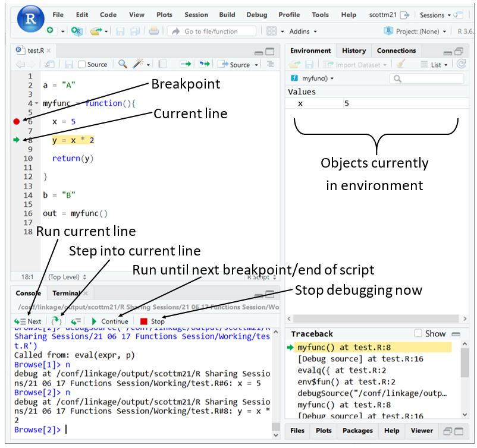
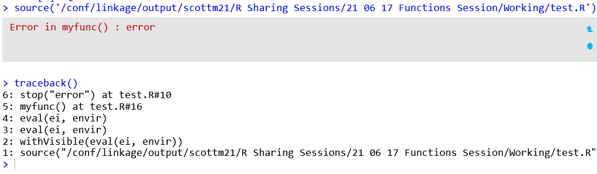

```{r setup, include=FALSE}
# Author: Scott McLaren-Gow
# Original Date: 17/6/22
# Version of R: 3.6.1

# See here for learnr package documentation: https://rstudio.github.io/learnr/

# Include packages here that are required throughout the training
library(learnr)         # Required to build the Shiny app
library(gradethis)      # Required for specific code checking and specific feedback
library(dplyr)
library(rlang)

knitr::opts_chunk$set(echo = FALSE)

tutorial_options(
  exercise.checker = gradethis::grade_learnr
)
```

```{r phs-logo, echo=FALSE, fig.align='right', out.width="40%"}
knitr::include_graphics("images/phs-logo.png")
```

## Introduction

[Insert some introductory text about the training here.]

<div class="info_box">
  <h4>Course Info</h4>
  <ul>
    <li> [Add some details about how the app works here. Include the following items if they are relevant.]</li>
    <li>This course is built to flow through sections and build on previous knowledge. If you're comfortable with a particular section, you can skip it.</li>
    <li>The course will also show progress through sections, a green tick will appear on sections you've completed, and it will remember your place if you decide to close your browser and come back later.</li>
  </ul>
</div>
</br>

### What is [topic]?

[Detailed description of topic with overview of course.]

## The Basics

There's more to it than the basics, but just the information here will get you well on your way to writing useful functions.

### What is a function?

We use functions all the time. To find the mean horsepower for the cars in the mtcars dataset, for example, we could use the mean() function - go ahead and run this code to see the output:

```{r example-predefined, exercise=TRUE}
horsepower_values = mtcars$hp

mean_horsepower = mean(horsepower_values)

mean_horsepower
```

We're used to treating functions as a 'black box'. We provide the function with an input (horsepower_values), the function works some kind of magic that we know nothing about, and it gives us back an output (mean_horsepower).

But the inside of a function isn't really a black box, it's just more code like the code we write ourselves; a function is just code that is grouped together to perform a specific task.

### Defining our own functions

To use a function of our own, we must first define it. This has a standard format:

```{r example-format, echo=TRUE, eval=FALSE}

my_function_name = function(arg1, arg2, arg3) {
  
  <Your Code Goes Here>
  
  return(my_output)
  
}
  
```

* **my_function_name**: what the function is called, the name you need to use when you want to run the function
* **function**: a keyword that tells R you are defining a function
* **(arg1, arg2, arg3)**: specifies what inputs the function needs - these are objects that the function will use. You don't need to list any objects that are created inside the function. There can be any number of inputs, and they can be called anything you like
* **{ and }**: set the start and end of the function body - the function body contains all the code inside the function. { and } are used in other contexts also, for example if statements, and have the same general meaning: a block of code to be treated as a single unit
* **\<Your Code Goes Here>**: write your code like normal, using the inputs you specified and creating any new objects you like
* **return(my_output)**: the object you want to get back when you run the function

An example of using this function:

```{r example-format-use, echo=TRUE, eval=FALSE}

val = my_function_name(A, B, C)
  
```

Note that the names of the input and output objects don't need to match what you called them in the function definition. Inside the function, A will become arg1, B will become arg2 etc. Likewise the name of the output in the function doesn't need to match what you call it outside the function.

Let's look at an example of a working function. Say we want to get some summary values for a column of data:

```{r example-summary, echo=TRUE, eval=FALSE}

get_summary_data = function(df, col_name) {
  
  summary_data =
    df %>%
    # col_name is a character vector containing the column name
    # This doesn't work with dplyr - it expects summarise(min = min(col_name)) 
    # rather than summarise(min = min("col_name"))
    # But .data[[]] will get the data in a column using a character vector
    summarise(min = min(.data[[col_name]]),
              mean = mean(.data[[col_name]]),
              max = max(.data[[col_name]]))
  
  return(summary_data)
  
}

```

(There may be better ways of doing this, without defining our own function, but it serves as a nice example.)

The function definition above has been run behind the scenes, and the function is now ready for use. We use it by calling it like any other - run the code to see the result:

```{r example-summary-use-setup}

get_summary_data = function(df, col_name) {
  
  summary_data =
    df %>%
    # col_name is a character vector containing the column name
    # This doesn't work with dplyr - it expects summarise(min = min(col_name)) 
    # rather than summarise(min = min("col_name"))
    # But .data[[]] will get the data in a column using a character vector
    summarise(min = min(.data[[col_name]]),
              mean = mean(.data[[col_name]]),
              max = max(.data[[col_name]]))
  
  return(summary_data)
  
}

```

```{r example-summary-use, exercise=TRUE}

car_summary = get_summary_data(mtcars, "mpg")

print(car_summary)

```

Try changing the function call to get summary data for the hp or wt columns instead of mpg, and you'll start to see how writing functions can make life easier: we can easily apply the same code to different data.

### Your turn

We've covered the basics now, so it's time for you to write your own function. This is what you need to do:

* Define a function that:
    * Has a single input
    * Multiplies the input by 10
    * Returns the new value
* Make sure the function is named my_function
* After you've defined the function, you need to use it. Call it with 5 as the input on the last line of your code

Enter your solution here, feel free to experiment using the run code button, and submit your answer when ready. If you get stuck, a solution is available:
```{r test-first-func, exercise=TRUE}

```
 
```{r test-first-func-check}

grade_this( 
  {
    
    # So we have access to the user defined function
    evaluate::evaluate(.user_code)
    
    if (!exists("my_function", mode = "function")) {
      fail("Make sure your function is called my_function, and that it follows 
           the standard format correctly")
    }
    
    if (my_function(5) != 50) {
      fail("Make sure your function output is 10 times the input value")
    } 
    
    if (!is.numeric(.result)) {
      fail("Make sure you call your function on the last line of your code")
    }

    if (.result != 50) {
      fail("Make sure you are calling your function with 5 as the input")
    }
    
    pass("Correct! In real life we don't need to define a function just to 
         multiply by 10, but this example is the foundation for writing all 
         kinds of useful functions")

  }
)

```

```{r test-first-func-solution}

my_function = function(x) {
  
  return(x * 10)
  
}

my_result = my_function(5)

```


## Why Define Functions?

At this point it seems fair to explain why we want to define functions. Eventually it'll become second nature, and you'll probably prefer it, but it will take practice to get there - read on to understand some of the benefits.

### Readability

As a script gets longer, it gets more and more difficult to figure out what the code actually does. 

Imagine you are new to a script that is 1000 lines long. How quickly could you get an overview of what is happening? How quickly could you go in and change one small part of the code?

Imagine this situation:

```{r example-long-script, echo=TRUE, eval=FALSE}

some_object = 
  input_data %>%
  some_processing_1() %>%
  some_processing_2() %>%
  some_processing_3() %>%
  etc()


# ...800 lines of code...


object_of_interest = 
  some_object %>%
  left_join(some_other_object) %>%
  some_different_processing()


```

To get an overview of what the script is doing, we need to at least skim those 800 lines. To understand what is happening to some_object, we may need to dig into those 800 lines of code in detail.

Compare with this, where the 800 lines of code is broken up into functions:

```{r example-long-with-functions, echo=TRUE, eval=FALSE}

some_object = prep_input(input_data)

unrelated_object_1 = gather_info(other_input_data)

unrelated_object_2 = extract_data(other_input_data)

some_object = more_processing(some_object, unrelated_object_1)

some_other_object = do_some_stuff(unrelated_object_1, unrelated_object_2)

object_of_interest = 
  some_object %>%
  left_join(some_other_object) %>%
  some_different_processing()


```

We can see the overall structure of the code without digging into the detail. We know what data each function is taking as an input and what it is returning. So we can see where some_object is being processed, and focus on the code in those functions if we want to make changes.

```{r quiz-readability}
quiz(
  question("Which functions do we need to look in to understand how some_object 
           is created and processed?",
    answer("prep_input", correct = TRUE),
    answer("gather_info", correct = FALSE),
    answer("extract_data", correct = FALSE),
    answer("more_processing", correct = TRUE),
    answer("do_some_stuff", correct = FALSE),
    incorrect = "Look for the functions that use some_object either as an input 
                 or as an output - these are the ones that are working with that 
                 data",
    allow_retry = TRUE,
    random_answer_order = FALSE
  )
)
```

### Easier code reuse

For similar reasons it's much easier to take a function and use it in another script than it is to copy and paste parts of the code. A function makes it easy to see where the code you want starts and ends, and see what inputs the code needs and the output it returns. 

You can simply copy and paste function definitions from one script to another, or you can have a separate file for your function definitions that you source into your scripts as needed (see the Sourcing functions section in Assorted tips).


### Reduce duplication of code

This is a real life example of a function, used to get different splits on Did Not Attend data:

```{r example-split-define, echo=TRUE, eval=FALSE}
get_split = function(data, groups) {
  
  groups_with_status = c(groups, "derived_appt_status")
  
  # Start by getting the number of appointments of each status in each group
  dna_pc = 
    data %>%
    group_by(across(groups_with_status)) %>%
    summarise(num_appts = n(), .groups="drop") %>%
    pivot_wider(names_from=derived_appt_status, values_from=num_appts) %>%
    mutate(dna_pc = round(DNA / (Attended + DNA) * 100, digits=2)) 
  
  return(dna_pc)
  
}

```

Exactly what this function does isn't important. What's important is that it can be used over and over again without repeating the code:

```{r example-split-call, echo=TRUE, eval=FALSE}
split_simd = get_split(appt_past_joined, "simd2020v2_sc_decile")

split_ur = get_split(appt_past_joined, "ur6_2016_name")

split_age = get_split(appt_past_joined, "pub_age_group")

split_hbres = get_split(appt_past_joined, "hb2019name")

split_hbres_age = get_split(appt_past_joined, c("hb2019name", "pub_age_group"))
```

If we hadn't defined a function, it would look like this:

```{r example-split-functionless, echo=TRUE, eval=FALSE}

split_simd =
  appt_past_joined %>%
  group_by(simd2020v2_sc_decile, derived_appt_status) %>%
  summarise(num_appts = n(), .groups = "drop") %>%
  pivot_wider(names_from = derived_appt_status, values_from = num_appts) %>%
  mutate(dna_pc = round(DNA / (Attended + DNA) * 100, digits = 2))

split_ur =
  appt_past_joined %>%
  group_by(ur6_2016_name, derived_appt_status) %>%
  summarise(num_appts = n(), .groups = "drop") %>%
  pivot_wider(names_from = derived_appt_status, values_from = num_appts) %>%
  mutate(dna_pc = round(DNA / (Attended + DNA) * 100, digits = 2))

split_age =
  appt_past_joined %>%
  group_by(pub_age_group, derived_appt_status) %>%
  summarise(num_appts = n(), .groups = "drop") %>%
  pivot_wider(names_from = derived_appt_status, values_from = num_appts) %>%
  mutate(dna_pc = round(DNA / (Attended + DNA) * 100, digits = 2))

split_hbres =
  appt_past_joined %>%
  group_by(hb2019name, derived_status) %>%
  summarise(num_appts = n(), .groups = "drop") %>%
  pivot_wider(names_from = derived_appt_status, values_from = num_appts) %>%
  mutate(dna_pc = round(DNA / (Attended + DNA) * 100, digits = 2))

split_hbres_age =
  appt_past_joined %>%
  group_by(hb2019name, pub_age_group, derived_appt_status) %>%
  summarise(num_appts = n(), .groups = "drop") %>%
  pivot_wider(names_from = derived_appt_status, values_from = num_appts) %>%
  mutate(dna_pc = round(DNA / (Attended + DNA) * 100, digits = 2))
  
```

The main advantage to the function approach is that all of the code is kept in one place. Imagine spotting a mistake in the DNA calculation here, or deciding to make an improvement to the code. Instead of making changes in 5 separate places, you only need to modify the function definition. That's faster than changing it in 5 different places, you don't need to check all of those 5 places to see if there are minor differences in any of them, and there's no risk of forgetting to change it in any of the places.

Unconvinced? There's an error in the code above, that could easily have been introduced when making a change in real life - how easy is it to find?

```{r quiz-duplication}

error_string = 
  "It's in split_hbres - derived_status in the group_by() should be 
  derived_appt_status like in all of the other group_by calls. Working with 
  duplicated code multiplies the opportunities for introducing this kind of 
  error and makes them harder to spot."

quiz(
  question("The code generating which object contains the error?",
    answer("split_simd", correct = FALSE),
    answer("split_ur", correct = FALSE),
    answer("split_age", correct = FALSE),
    answer("split_hbres", correct = TRUE, message = error_string),
    answer("split_hbres_age", correct = FALSE),
    answer("I agree, functions are the way! Tell me the answer", 
           correct = TRUE, message = error_string),
    incorrect = "It's not easy to find, feel free to just ask for the answer.",
    type = "learnr_radio",
    allow_retry = TRUE,
    random_answer_order = FALSE
  )
)
```


### Unit testing

Unit testing is a more advanced topic that you might come back to later in your journey with functions. Essentially it involves creating automated tests that check your functions are acting in the way they should, reducing the chance of introducing bugs both when the functions are first written and when they are later modified.

The [testthat](https://testthat.r-lib.org/) package can be used for unit testing in R, and writing tests is covered in the [R Packages](https://r-pkgs.org/testing-basics.html) book. 


### When are functions not so useful?

The more of these are true, the less likely it is worth the time to define functions:

* Script is short
* Script is being written for one-off use
* Code will not be useful in any other scripts
* Code isn't being duplicated in different parts of the script

Writing code in functions can take a little longer than it would otherwise, depending on the situation, so don't feel you need to put everything you do inside functions. But remember that the time investment is often worth it.


## Inputs and Outputs

Two key parts of writing functions are specifying the inputs the function expects and the output that it returns. You've already seen the basics, but this section goes into more detail and explains some of the flexibility you have. 

### Exiting a function

Functions always return a value. They can do so explicitly or implicitly, and they can do so visibly or invisibly.

#### Explicit vs implicit return value

To explicitly return a value, use the return() function:

```{r example-explicit, exercise=TRUE}

exitfunc_1 = function(A) {
  
  B = 2 * A
  
  return(B)
  
}

out = exitfunc_1(5)
print(out)
```

If you don't use the return() function, you're returning a value implicitly:

```{r example-implicit, exercise=TRUE}

exitfunc_2 = function(A) {
  
  B = 2 * A

}

out = exitfunc_2(5)
print(out)
```

If you run the code you can see we still get 10 back. That's because R will automatically return the value from the last line of code if you don't specify the return value yourself. 

Opinions vary on whether you should explicitly or implicitly return values. Some say that writing return() is clearer while others argue it is redundant; it's up to you which style you use.

#### Visible vs invisible

Let's go back to the earlier example, but this time don't print the output value ourselves:
```{r example-visible, exercise=TRUE}

exitfunc_1 = function(A) {
  
  B = 2 * A
  
  return(B)
  
}

exitfunc_1(5)
```

Run the code and the output of the function is printed, even though we've not used print(). 

The invisible function gives us control over this:
```{r example-invisible, exercise=TRUE}

exitfunc_3 = function(A) {
  
  B = 2 * A
  
  return(invisible(B))
  
}

exitfunc_3(5)

```

Notice that the output doesn't print itself this time - the code has run even though it looks like nothing happened.

You won't normally need to worry about making outputs invisible, but you do have the option should the need arise.

#### Returning multiple objects

A function returns one object only. R doesn't make it elegant, but you can get multiple objects back like this:

```{r example-multiple-return, exercise=TRUE}

exitfunc_4 = function(A, B, C) {
  
  X = 2 * A
  Y = 3 * B
  Z = 4 * C
  
  # Return a list of the objects we want
  return(list(X, Y, Z))
  
}

out = exitfunc_4(1, 2, 3)

# Get individual objects from the list
x = out[[1]]
y = out[[2]]
z = out[[3]]

# Example of using those objects
print(x + y + z)

```

We've still only returned one object - a list. That list just happens to contain the other objects we want. 

We could also make things clearer for the user of the list by naming the items it contains with list("name1" = value1, "name2" = value2) and accessing the values with list_name[["name1"]] etc.

### Function parameters

Now we swap to the other end - the inputs. An aside on terminology before we begin: strictly speaking, parameters are the inputs specified in the function definition (arg1, arg2, and arg3 in the example below), while arguments are the values that are actually supplied in a function call (1, 2, and 3 below). But these terms are basically used interchangeably.

You've already seen the basic way to define a function's parameters:

```{r example-basic-param, exercise=TRUE}

argfunc_1 = function(arg1, arg2, arg3) {
  
  print(paste0(arg1, arg2, arg3))
  
}

argfunc_1(1, 2, 3)
  
```

We actually don't need to specify any parameters at all, if our function doesn't need them:

```{r example-no-param, exercise=TRUE}

argfunc_2 = function() {
  
  print(paste0(1, 2, 3))
  
}

argfunc_2()
  
```

We can also supply a default value for each parameter:

```{r example-default-param-name, exercise=TRUE}

argfunc_3 = function(arg1=1, arg2=2, arg3=3) {
  
  print(paste0(arg1, arg2, arg3))
  
}

argfunc_3(arg3 = 5)
  
```

You can also include a mix of parameters with and without a default.

Note that if you want to skip arguments when you are calling the function - like with arg1 and arg2 above - you need to specify the argument's name. Look what happens when we don't:

```{r example-default-param-position, exercise=TRUE}

argfunc_3 = function(arg1=1, arg2=2, arg3=3) {
  
  print(paste0(arg1, arg2, arg3))
  
}

argfunc_3(5)
```

We've not specified the argument's name, so we are specifying the arguments by position. The first argument is therefore arg1.

### A Task

You now have the chance to go beyond the basics and use some of the knowledge above.

* Define a function that:
    * Takes 3 inputs: num (no default value), mult1 (default = 5), mult2 (default = 10)
    * Carries out 2 separate calculations:
        * num multiplied by mult1
        * num multiplied by mult2
    * Returns a named list:
        * The first element of your list should be named ans1 and contain the result of num \* mult1
        * The second should be named ans2 and contain the result of num \* mult2
* Make sure the function is named my_function
* Call your function with num = 5 and mult2 = 3. Leave mult1 to use the default
* Create two new objects, A and B
    * A should equal the first value in your list (ans1)
    * B should equal the second value in your list (ans2)

Enter your code here, and remember the solution is available if you get stuck:
```{r test-inout-func, exercise=TRUE}

```
 
```{r test-inout-func-check}

grade_this( 
  {
    
    # So we have access to the user defined function
    evaluate::evaluate(.user_code)

    if (!exists("my_function", mode = "function")) {
      fail("Make sure your function is called my_function, and that it follows 
           the standard format correctly")
    }
    
    func_params = names(formals(my_function))
    
    if (!all(c("num", "mult1", "mult2") %in% func_params)) {
      fail(paste0("Make sure your function has num, mult1, and mult2 as 
                  parameters. You currently have: ", 
                  str_flatten(func_params, collapse = ", ")))
    }
    
    if (!all(func_params %in%  c("num", "mult1", "mult2"))) {
      fail(paste0("Make sure your function doesn't have any extra parameters - 
                  you should only have num, mult1, and mult2. You currently 
                  have: ", 
                  str_flatten(func_params, collapse = ", ")))
    }
    
    if (!is_missing(formals(my_function)$num)) {
      fail("Make sure num does not have a default value")
    }
    
    if (formals(my_function)$mult1 != 5) {
      fail("Make sure mult1 has a default value of 5")
    }
    
    if (formals(my_function)$mult2 != 10) {
      fail("Make sure mult2 has a default value of 10")
    }

    if (!is.list(my_function(5))) {
      fail("Make sure your function returns a list")
    }
    
    return_names = names(my_function(5))
    
    if (!all(c("ans1", "ans2") %in% return_names)) {
      fail(paste0("Make sure the list your function returns contains values 
                  named ans1 and ans2. You currently have: ", 
                  str_flatten(return_names, collapse = ", ")))
    }
    
    if (length(my_function(5)) > 2) {
      fail(paste0("Make sure your function returns a list containing 2 values. 
                  It currently contains: ", length(my_function(5))))
    }
    
    # It would be best to check here whether the user actually called the
    # function in the requested way, but I can't think of a robust way to do
    # that
    
    if (!exists("A")) {
      fail("Make sure you create the object A to hold the first result from your 
           function")
    }
    
    if (!exists("B")) {
      fail("Make sure you create the object B to hold the second result from 
           your function")
    }
    
    if (is.list(A)) {
      fail("Make sure you fully extract the first value from the list into A - 
           my_list[\"name\"] returns a list, my_list[[\"name\"]] or my_list$name 
           return the value, so use double square brackets or the dollar sign")
    }
    
    if (is.list(B)) {
      fail("Make sure you fully extract the first value from the list into B - 
           my_list[\"name\"] returns a list, my_list[[\"name\"]] or my_list$name 
           return the value, so use double square brackets or the dollar sign")
    }

    if (A != 25) {
      fail(paste0("Make sure A is holding the first result, the function is 
                  called with the right inputs, and the calculations are correct
                  - A should equal 25, but it's currently ", A))
    }
    
    if (B != 15) {
      fail(paste0("Make sure B is holding the first result, the function is 
                  called with the right inputs, and the calculations are correct
                  - B should equal 15, but it's currently ", B))
    }
    
    pass("Correct! These techniques, along with the others you've learned in 
         this section, signifcantly increase the flexibility you can give your 
         functions.")

  }
)

```

```{r test-inout-func-solution}

my_function = function(num, mult1 = 5, mult2 = 10) {
  
  num1 = num * mult1
  num2 = num * mult2
  
  return(list("ans1" = num1, "ans2" = num2))
  
}

out = my_function(5, mult2 = 3)

A = out[["ans1"]] 
B = out[["ans2"]]

```


## Scope
### Environments
Before we can get into the main purpose of this section, we need to understand the concept of environments. You can think of an environment as a container of objects - functions, lists, dataframes, and so on - and you're hopefully familiar with the Environment pane in RStudio. This pane shows the objects you create as you work, which are objects stored in one specific environment: the global environment. 


Other environments exist too, and each function has its own environment. If we create and run this function, we do not see A show up in the global environment:

```{r example-function-env, echo=TRUE, eval=FALSE}

envfunc = function() {
  
  A = 5
  
  print(A)
  
}

envfunc()

```

That's because A is stored in the function's environment, not the global environment. 

Another important point is that environments can contain other environments; each environment has a parent environment. This allows R to search for objects across different environments. For example, it can check an enviroment for an object named X, see that it does not exist, then check the parent environment, and so on until the object is found or the final parent is reached.

There's much more to say about environments, and you can check out the [Environments](https://adv-r.hadley.nz/environments.html) chapter of Advanced R if you want some detailed technical reading. But we've covered enough ground to return to functions.

### Missing Objects
An important question, when writing functions, is what happens when we don't give a function all the objects it needs?

This function needs A and k to run all the code it contains, but we're only giving it A:

```{r example-scope-error, echo=TRUE, eval=FALSE}

scopefunc_1 = function(A) {
  
  print("scopefunc_1 output:")
  print(A)
  print(k)
  
}

scopefunc_1("A")

```

If we tried to run it, we'd get an error:

> Error in print(k) : object 'k' not found

That makes sense, there is no k. But were does R actually look for k? It's a bit more complicated than just looking for k inside the function definition and at the inputs the function is supplied with. R will actually start looking outside of the function.

#### Where?

Where will R look it look? R has "scoping" rules that decide this. Essentially it will look first inside the function, then it will look in the environments that contain the function definition.

This will work, because both l and the function are defined in the global environment:

```{r example-where-work, echo=TRUE, eval=FALSE}

l = 5

scopefunc_2 = function() {
  
  print(l)
  
}

scopefunc_2()

```

This will not work:

```{r example-where-error-2func, echo=TRUE, eval=FALSE}

scopefunc_3 = function() {
  
  m = 5
  
  print(m)
  
}

scopefunc_4 = function() {
  
  print(m)
  
}

scopefunc_3()

# Will give an error
scopefunc_4()

```

> Error in print(m) : object 'm' not found

The environment for scopefunc_3 does not contain scopefunc_4, so scopefunc_4 can't access m - remember that R will search through parent evironments only when looking for objects.

We also can't access objects that are inside functions more generally. This doesn't work:

```{r example-where-error-1func, echo=TRUE, eval=FALSE}

scopefunc_3 = function() {
  
  m = 5
  
  print(m)
  
}

# Will give an error
print(m)

```

> Error in print(m) : object 'm' not found

scopefunc_3's environment is a child - not a parent - of the global environment, so R will not look there.

#### When?

We know where R will look, but we also need to know when. Let's define another example function and try to use it:

```{r example-when-func, echo=TRUE, eval=FALSE}

scopefunc_5 = function() {
  
  print(p)
  
}

# Will give an error
scopefunc_5()

p = 5

# Will work
scopefunc_5()

```

R checks for the object each time the function is run, not when it is defined. So when we call the function the second time, after we define p in the global environment, it does work.

### Coping with scoping

These scoping rules increase the chance of mistakes happening, and aren't usually very useful. A big advantage of functions is making the inputs and outputs to a section of code explicit, and we lose that advantage if we rely on R to find objects defined outside a function for us.

We can get R to list any objects that will be searched for outside of a function like this:

```{r example-with-globals, echo=TRUE, eval=FALSE}
scopefunc_5 = function() {
  
  print(p)
  
}

codetools::findGlobals(scopefunc_5)
```

> "{"     "p"     "print"

Some of these we should ignore because it is normal to allow the scoping rules to bring in functions and special symbols, like "{" and "print" here, but it does show us that we are using "p" without defining it inside the function or specifying it as an input.

Try modifying this function so that all the inputs used in the calculation are listed as parameters. It is possible to find the missing parameters manually, but codetools::findGlobals should be easier.

```{r test-fix-globals, exercise=TRUE}

calc_func = function(y, d, j, w) {
  
  i = y + d
  e = i - o
  m = w * j
  v = b / r
  
  result = ((i + e) * (m / v) * j) / u
  
  return(result)
  
}

calc_func(1, 2, 3, 4)

```

```{r test-fix-globals-check}

grade_this( 
  {
    
    # So we have access to the user defined function
    evaluate::evaluate(.user_code)

    if (!exists("calc_func", mode = "function")) {
      fail("Make sure your function is called calc_func, and that it follows 
           the standard format correctly")
    }
    
    func_params = names(formals(my_function))
    
    expected_params = c("y", "d", "j", "w", "b", "o", "r", "u")

    if (!all(expected_params %in% func_params)) {
      fail(paste0("Make sure your function has all of the objects required for 
                  the caulcation as parameters. You currently have: ", 
                  str_flatten(func_params, collapse = ", ")))
    }
    
    if (!all(func_params %in% expected_params)) {
      fail(paste0("Make sure your function doesn't have any extra parameters - 
                  you should only have the objects required for the calculation.
                  You currently have: ", 
                  str_flatten(func_params, collapse = ", ")))
    }
    
    pass("Correct! The inputs the function requires are now clear to its users, and there's no risk of an input being forgotten and R finding a separate object that has the same name.")

  },
  maybe_code_feedback = FALSE
)

```

```{r test-fix-globals-solution}

calc_func = function(y, d, j, w, b, o, r, u) {
  
  i = y + d
  e = i - o
  m = w * j
  v = b / r
  
  result = ((i + e) * (m / v) * j) / u
  
  return(result)
  
}

calc_func(1, 2, 3, 4, 5, 6, 7, 8)

```

## Debugging


Debugging your code gets a little more complex when working with functions. Normally, if there's a problem you can just run a line of code in your script and see what it does, or you can source the script, let it stop where the error occurs, and look at the environment.

There are two aspects of functions that make things more difficult:

* when you run your function from your script, all of the lines inside the function are run as one block. You don't get to run each line individually
* functions store the objects they create and modify in their own environment - you can't see these from the global environment

You can avoid a lot of issues by developing your code interactively before putting it in a function, and by keeping your functions small. And you can always take your code back out of a function for testing, if you like.

### Debugging mode

But it is possible to debug functions by using debugging mode:


To enter debugging mode, you need to create a breakpoint. Your code will run until a breakpoint is reached, then it will pause to let you see what is going on. Note that in the image, the breakpoint is not reached until the function is actually called - line 2 has run, the function has been defined between lines 4 and 12, line 14 has run, and then you reach the breakpoint while line 16 is running. If you called the function multiple times, you would reach the breakpoint multiple times. You can also have multiple breakpoints.

To create a breakpoint:

1) click to the left of a line number in R Studio. The line must contain code, and some types of code won't let you create one (like the first line of a function definition).
1) Source your script. If you use Run, the breakpoint will not activate

Once you are in debugging mode:

* **Current line**: this line of code has not been run yet - it is the next line of code to run
* **Run current line**: the current line will be run, then R will pause again
* **Step into current line**: say the current line was something like myvar = myfunc(myarg). If you pressed the button to run the current line, the entirety of myfunc would be run in one go. But if you step into the current line, you will get to see the inside of myfunc and you can run each line of code individually
* **Run until next breakpoint/end of script**: if you have another breakpoint to come, all the lines between the current line and the breakpoint will run. If you don't, all of the rest of the script will run
* **Stop debugging now**: don't run the rest of the script, just stop right now and exit debugging mode
* **Objects currently in environment**: these are the objects that the current line of code can 'see'

To debug a function, then:

1) set a breakpoint inside the function, and source the script
1) run the function line by line
1) look for error messages if they exist, and investigate further
1) pay attention to what is in the environment at each step. does it make sense? At what exact point does it stop making sense?
1) fix the problem

Note that breakpoints don't work that well with pipes. You can't set a breakpoint for the lines inside a pipe, only the first line, and you can't run each line of the pipe individually, only the pipe as a complete unit. Keep pipes short.

Debugging can be a bit temperamental. Restarting/terminating R can help.

#### Debugging mode when you source() your functions

If you are sourcing in functions from another file, R makes things more difficult.

For example, you may have functions in functions.R:

```{r example-debugging-file, echo=TRUE, eval=FALSE}

myfunc = function(msg) {
  
  print(msg)
  
}

```

Then in main.R:

```{r example-debugging-source, echo=TRUE, eval=FALSE}

source("functions.R")

myfunc()

```

If you just set a breakpoint inside myfunc's definition, it will not work when you source main.R. Instead you can take one of these approaches:

* set a breakpoint inside myfunc's definition, use the source button on the toolbar for functions.R, then run the code that calls the function in main.R. Using the source button when there is a breakpoint in the file will use a special version of the source function that supports breakpoints. Don't run the source() line in main.R after using the source button, as this will just use the standard source function and the breakpoint will no longer work.
* set the breakpoint on the myfunc() line in main.R, source main.R, then step into the current line to reach the function
* or add browser() as a line inside myfunc's definition (see below) and source main.R:

```{r example-debugging-browser, echo=TRUE, eval=FALSE}

myfunc = function(msg) {
  
  browser()
  
  print(msg)
  
}

```

Using browser() is a bit less convenient, but can be more reliable when breakpoints are being temperamental.

### Traceback

It can also be useful to run traceback() in the console immediately after an error message, before you think about running in debugging mode:



The output tells you where the error occurred. You read it bottom to top, so the output here says I first sourced test.R, then some internal R magic happens on points 2, 3, and 4, then I called myfunc() on line 16 of test.R, then I got an error on line 10 of test.R.

Traceback isn't always so helpful - it won't give you a line number for errors raised inside a pipe, though it should give you a line number for the start of the pipe in question.


## Assorted tips

### Documentation

It's a good idea to document your functions, unless you're sure you'll never need the code again. This is an example:

```{r example-documentation, echo=TRUE, eval=FALSE}

# Closes a connection to the VDL in all modes
# Otherwise does nothing.
#
# Inputs
# conn - a connection to the VDL, or NULL
# mode - "live", "backup 1", or "backup 2"
#
# Returns logical indicating if close succeeded
close_vdl_conn = function(conn, mode) {

  if (mode == "live" | mode == "backup 1" | mode == "backup 2"){

    # This will return TRUE or FALSE to indicate if it succeeded
    out = odbcClose(conn)

  } else {
    stop("mode not recognised, must be live, backup 1, or backup 2.")
  }

  return(out)

}

```

### Sourcing functions

It can be a good idea to store your functions outside your main script file, unless your code is quite short already. This helps stop your script getting too long, improves the organisation of your code, and makes it easier for multiple people to work together on the same code without stepping on each other's toes.

For example, you could have processing_functions.R like this:

```{r example-sourcing-funcs, echo=TRUE, eval=FALSE}

do_some_processing = function() {
  
  <your code>
  
}

other_processing = function() {
  
  <your code>
  
}


```

Then a main_script.R like this:

```{r example-sourcing-main, echo=TRUE, eval=FALSE}

source(processing_functions.R)

<get your data>
  
my_data = do_some_processing(my_data)

my_data = other_processing(my_data, other data)

<do other things>

```

If you make a change to the function, you need to re-run the source() line for it to take effect.

### Working with dplyr

New challenges are introduced when you start using your functions in combination with dplyr, particularly if you want to choose which columns your function works with by supplying your column names as an argument.

This is really a complicated topic all of its own so there's too much to cover here, but these are some starting points if you want to learn more:

* Run vignette("programming") to get an intro on how to dynamically supply column names as arguments to your functions
* Run help("dplyr_data_masking") and help("dplyr_tidy_select") for more details on the two types of selection discussed by vignette("programming")
* Read through this [tutorial](https://www.rebeccabarter.com/blog/2020-07-09-across/) and view vignette("colwise") for information on the across() function. Combined with all_of(), it is a convenient way to perform operations on particular columns with functions like mutate.

Here are some examples of working with the mtcars dataset to give a taste of what is possible:

```{r example-dplyr, echo=TRUE, eval=FALSE}

# Normalise selected columns by maximum value
normalise_col = function(df, norm_cols) {
  
  df =
    df %>%
    mutate(across(all_of(norm_cols), ~(.x / max(.x))))
  
  return(df)
  
}

normalise_one = normalise_col(mtcars, "mpg")
normalise_several = normalise_col(mtcars, c("mpg", "hp", "wt"))

# Create a specified km/litre column from a specified mpg column
add_kml = function(df, mpg_col, kml_col) {
  
  df = 
    df %>%
    mutate("{kml_col}" := .data[[mpg_col]] / 2.352)
  
  return(df)
  
}

mtcars_kml = add_kml(mtcars, "mpg", "kml")
```

If you want to use your function within a pipe, keep in mind that pipes work by passing the dataframe to each function as the first argument. So you would need to define and use your function like this:

```{r example-pipe, echo=TRUE, eval=FALSE}

func_for_pipe = function(df, other_arg1, other_arg2) {
  # Your code
}

dataset %>%
  func_for_pipe(other_arg1, other_arg2)

```

### Useful other code

If statements can be helpful inside functions, so your functions can do different things depending on the situation:

```{r example-if, echo=TRUE, eval=FALSE}

if (colour == "blue") {
  
  <code here will run only when val is blue>
  
}


if (val == 5) {
  
  <code here will run only when val is five>
  
} else if (val < 2) {
  
  <code here will run only when val is less than two>
  
} else {
  
  <code here will run when val is not any of the above values>
}

```

stop() can be useful - you can make R give an error with a message you specify like this:

```{r example-stop, echo=TRUE, eval=FALSE}
stop("error message")
```

This can be combined with an if statement to throw an error when the inputs aren't what you expect:

```{r example-check-input, echo=TRUE, eval=FALSE}

my_func = function(val) {
  # do things when val <= 6, otherwise give an error
  
  if (val > 6) {
    stop("val cannot be greater than 6")
  }
  
  <do things>
    
}

```


## [Functionality]

### Knowledge Check

```{r example-quiz}
quiz(
  question("[Question]",
    answer("[Incorrect answer]", correct = FALSE),
    answer("[Incorrect answer with feedback]", correct = FALSE, message = "[Specific feedback.]"),
    answer("[Correct answer]", correct = TRUE),
    incorrect = "[General feedback for any incorrect answer.]",
    allow_retry = TRUE,
    random_answer_order = TRUE
  )
)
```

### Code Exercise

```{r example-code-q, exercise=TRUE}
# Hello World example
hello_world <- "Hello World"

print(hello_world)
```

```{r example-code-q-check}
grade_result(
  pass_if(~ startsWith(.result, "Hello") & .result != "Hello World"),
  fail_if(~ identical(as.character(.result), "Hello World"), "Try changing the output from Hello World."),
  fail_if(~ TRUE, "Have you entered a string to say Hello?")
)
```


## Help & Feedback

#### Feedback

[Insert iframe for Google/Microsoft Forms]

