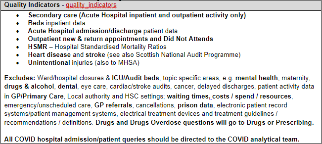

```{r setup, include=FALSE}
# Author: Vay Ly
# Original Date: February 2024

library(learnr)
library(gradethis)
library(stringr)
library(readr)
library(haven)
library(dplyr)
library(purrr)
library(ggplot2)

test

knitr::opts_chunk$set(echo = FALSE)

tutorial_options(
  exercise.checker = gradethis::grade_learnr
)

```

```{r phs-logo, echo=FALSE, fig.align='right', out.width="40%"}
knitr::include_graphics("images/phs-logo.png")
```


## Introduction

checkboxInput("checkboxId", "Check me", value = FALSE)

Welcome to the Parliamentary Questions & Information Requests course. This course is designed to provide an overview of the Information Request (IR) and Parliamentary Question (PQ) process. 

```{r intro-pathway, echo=FALSE, fig.align='center', out.width="100%"}

```

<div class="info_box">
  <h4>Course Info</h4>
  <ul>
    <li>This course is built to flow through sections and build on previous knowledge. If you're comfortable with a particular section, you can skip it.</li>
    <li>Most sections have multiple parts to them. Navigate the course by using the buttons at the bottom of the screen to Continue or go to the Next Topic.</li>
  </ul>
</div>
</br>


## Parliamentary Questions

PQs are questions posted by MSPs to the Scottish Government (SG), or the Scottish Parliamentary Corporate Body. They serve as a mechanism for MSPs to obtain factual and statistical information. 

The nature and themes of the questions may change to reflect the ever changing social and political climate in Scotland at the time.

For instance, during the flu seasons SG may receive a number of PQs such as:

**To ask the Scottish Government how many vaccinations took place in Glasgow this year, and it compares to the amount of vaccinations which took place last year.**

**To ask the Scottish Government how many vaccines are available in preparation for the 2024 Flu season.**


While topical questions are not certain to be asked, it is a good idea for teams to be aware of possible trends, so that they are not caught unaware.

PQs (both answered and unanswered) can be found on the <a href="https://www.parliament.scot/chamber-and-committees/questions-and-answers" target="_blank">Scottish Parliament's Questions and Answers page</a>. 

In the next few sections, we will cover how a Parliamentary Question is created, information concerning the deadlines, and how the Statistical Governance team at PHS handle the PQs so that they (hopefully) reach the appropriate teams. 


### About PQs

PQs can asked in two ways:

**Oral Questions** are asked in Parliament during First Minister's Questions, and are submitted on a Wednesday, one week before they are to be asked in Parliament. The timescale to respond to the MSP is 5 working days.


**Written Questions** are submitted daily. The timescale to respond to the MSP is 10 working days, and 20 working days during a recess.

An overview of the PQ process can be seen below:

```{r PQ-process, echo=FALSE, fig.align='center', out.width="100%"}
knitr::include_graphics("images/irpq-pq-sg-process.png")
```

<div class="info_box">
  <h4>Important</h4>
  <ul>
    <li>While it is true that there is a short turnaround time in responding to PQs, the timeframe in which PHS should respond to SG (this will be known as our *Policy Deadline Date*) can be negotiated with SG.
    
    <li>All attempts should be made to adhere to the above timeline.
    
  </ul>
</div>
</br>


Once the questions are available, the PHS Statistical Governance Team (phs.statsgov@phs.scot) retrieves the PQs and distributes them to the appropriate team(s) who may be able to offer a response, or have relevant interest in the PQ.

Next we will learn how the PQs are retrieved. 

</br>
</br>

#### Retrieving new PQs 

Every Tuesday and Thursday morning, Stats Gov runs a script which scrapes **all** the PQs from the Parliamentary website, up till midnight of the previous day.


Questions which hit certain keywords relating to health (NHS, blood, etc.) are flagged in order to aid Stats Gov by highlighting important health-related questions.

Through the retrieval process, all questions (flagged and non-flagged)are retrieved and are manually reviewed by Stats Gov. 

Throughout the year, there may be times where Stats Gov will increase the frequency of these retrievals (such as around Holiday periods).


```{r pq-review-quiz}
quiz(
  question("Which of the following PQ's have Stats Gov reviewed? 'To ask the Scottish Government...",
    answer("how many stoats have there been in Orkney in each of the last seven years, and what it estimates the figure will be for 2019?", correct = TRUE),
    answer("what plans it has to reduce the working week for public sector staff", correct = TRUE),
    answer("whether guidance on flying flags from its buildings changed in 2021; what any such changes were, and what the reasons were for any changes made.", correct = TRUE),
    answer("to ask the Scottish Government how many full-time equivalent British Sign Language tutors are currently employed by each local authority.", correct = TRUE),
    incorrect = "Not quite, have another go!",
    allow_retry = TRUE,
    random_answer_order = TRUE
  )
)
```


### Assigning PQs

PQs are manually reviewed by StatsGov, who decide the following:

#### Topic Area

The team will decide what topic areas the question corresponds to, and to which teams it should be assigned to.

The following is an excerpt from the topic area/team allocation guide which Stats Gov uses to allocated the PQs to the appropriate team. It includes what topics should be allocated to the team (in this case, Quality Indicators) and what should not.

```{r echo=FALSE, fig.align='center', out.width="75%"}

```

All teams are encouraged to provide Stats Gov with updates and amendments to their topic areas, especially if they are receiving questions not relevant to their service area.


#### Action

Assigned PQs are given one of two actions:

* **For Information** - this indicates that the question is of interest to your service area. While there is no expectation to reply, be prepared should SG contact you to request any relevant assistance.

* **For Review** - this indicates that the question may require you to take action. 

Regardless of the action assigned to the PQ, the recipients should read said PQ and make a decision whether any further action is necessary (we will discuss this later in the course).

#### Notes

Any relevant notes (such as previously answered PQ's relating to this PQ, and to what other teams this PQ has been allocated to, including the action).

<div class="info_box">
  <h4>Important</h4>
  <ul>
  <li>It is important to remember that Stats Gov are not specialists within the individual topic areas, and may occasionally assign a PQ's Topic Area or Action in error. Teams are expected to read through all PQs assigned to them and collaborate with appropriate teams and personnel in order to provide SG with as much assistance as possible.
  
  <li>Stats Gov (phs.statsgov@phs.scot) welcomes any and all corrections in order to improve their services. 
  </ul>
</div>
</br>


###  Assigned PQ

Once the PQ has been assigned by StatsGov, it is then sent out to the relevant teams, relating to the topic areas. Each topic area will generate one email, containing all the PQs for that allocation session. 

The email contains information on how to proceed, the SG contact email, as well as the deadline dates. 

**The 'Answer expected' date is for when the question will need to be sent to the relevant MSP. It is not the deadline for PHS to supply relevant information.

Here is an example of the email which teams will receive if they are assigned PQs, which holds all the information we have discussed so far:

```{r echo=FALSE, fig.align='center', out.width="100%"}
knitr::include_graphics("images/irpq-allocatedTeamEmail.png")
```


### Quiz

```{r PQ-AllocationsQuiz}
quiz(
  question("You have received a PQ which is not related to your service area, and has only been sent to your team. What should you do?",
           answer("Contact Stats Gov and inform them of the error", correct = TRUE),
           answer("Pass the PQ on to the appropriate team, ccing Stats Gov into the email", correct = TRUE),
           answer("Contact Scottish Government, and tell them PHS cannot assist", correct = FALSE),
           answer("Do nothing and wait for Scottish Government to ask for assistance", correct = FALSE),
           incorrect = "Not quite, have another go!",
           allow_retry = TRUE,
           random_answer_order = TRUE
           ),
  question("If you receive a PQ with Action 'For Information', you do not need to take any further action other than reading the PQ",
           answer("TRUE"),
           answer("FALSE", correct = TRUE),
           incorrect = "Not quite, have another go!",
           allow_retry = TRUE,
           random_answer_order = TRUE
           )
)
```
In the next section, we will cover what you should consider when you receive a PQ.


## PQ - Types & Considerations

The template used to respond to a PQ can be found in Appendix 3 of the <a href="https://spark.publichealthscotland.org/corporate-guidance/statistical-governance/parliamentary-questions/" target="_blank">Parliamentary Questions Protocol Guide.</a>

Within this template, you can see two key sections:

* **Draft Answer** - this is where you will supply your answer to the PQ.

* **Background Note** - this is additional/background information which could provide greater understanding or references.

There are multiple considerations you should bear in mind when answering a PQ. 

First of all, you should know that there are 3 types of PQs you may receive, and how to respond to them.

### PQs which can be answered with a specific answer

These are answers which are relatively straightforward PQs, such as when a table of figures would be enough to answer the PQ. 

Some interpretation or explanation may still be required to give the MSP a clear understanding of the provided statistics.

For example:

**To ask the Scottish Government how many patients have received care or treatment at the (a) Vale of Leven and (b) Inverclyde Maternity unit in each year since May 2007**

**Draft answer example:**

*The information is provided in the table below:*

*Table 1: Number of patients recorded as having received care or treatment at the Vale of Leven and Inverclyde maternity unit*


**If the data is available on a website a standard reply should be used.**

**Draft answer Example:**

*The information is published on PHS's website under (insert section of website and link).*


Relevant background notes should be provided. Keep it brief, but provide enough information to ensure the question is answered and understood.


### PQs which require interpretation

A question may seem straightforward, but might not map to a specific available data source, or if it does, it may require interpretation of how to answer it. You may need to get specialist advice, or be flexible with your response in order to cover multiple interpretations of the same question.

Below are some examples of PQs which require interpretation. 

What information might you need to interpret in order to fully answer the question?


```{r interpretationQuestions}
quiz(
  question("To ask the Scottish Government how many (a) adults and (b) children have been registered with a dentist in each year since 2005.",
           answer("Definition of Adult - over 16, over 18", correct = TRUE),
           answer("NHS or Private Dentist", correct = TRUE),
           answer("Definition of Children - under 16s, under 18s", correct = TRUE),
           answer("Reason for visiting the dentist", correct = FALSE),
           incorrect = "Not quite, have another go!",
           allow_retry = TRUE,
           random_answer_order = TRUE
           ),
  question("To ask the Scottish Government how many people have been prescribed drugs for depression in each year since 2005, broken down into (a) children, (b) adolescents, (c) adults and (d) elderly people in each NHS board area.",
           answer("Time Period - since Jan 2005 or April 2005?", correct = TRUE),
           answer("Definition of adult, child, elderly?", correct = TRUE),
           answer("Could the prescribed drug also be prescribed to treat other conditions? Do we need specialist advicep?", correct = TRUE),
           answer("Is it possible for us to differ between the number of people, and the number of prescriptions?", correct = TRUE),
           answer("How long have the individuals been on the prescribed drugs?", correct = FALSE),
           incorrect = "Not quite, have another go!",
           allow_retry = TRUE,
           random_answer_order = TRUE
           )
)
```

**To ask the Scottish Government how many attendances at GP surgeries by prostate cancer patients there have been in each year since 1997-98, also broken down by (a) NHS Board and (b) parliamentary constituency.**

For this question, the data is not collected by PHS, but a similar data set may be available. It may also require some advice from SMs or Medical Colleagues.

**Example Draft Answer:**

*This information is not available centrally. However estimates based on data from a small sample of general practices in Scotland, which are representative of Scotland, is presented in Table 1.*

*Table 1 shows the estimated numbers of patients attending consultations at Scottish GP Practices for prostate cancer related conditions during financial years 2003/04 to 2008/09.*


### Policy focussed questions where background data is helpful for the SG

These are questions which do not specifically ask for statistical information but for which data held by PHS could provide useful background context. 

The data would be provided to the SG as a background note.

**To ask the Scottish Government whether it plans to review beta blocker prescribing recommendations following a study recently published in The Journal of the American Medical Association suggesting that beta blockers did not prolong the lives of patients.**

**Example Draft Answer:**

*The question relating to whether the Scottish Government plans to review beta blocker prescribing cannot be answered from data held centrally by PHS.*

**Background Note**

*Information on the number of items dispensed and the gross ingredient cost for beta blockers for financial years 2010/11 and 2011/12 by NHS board can be found in the table 1 below…*


### Considerations 

In the event you receive a PQ, you should carefully consider whether or not you are able to provide a response, and what it may involve, and what you may need to discuss with your, or another, team.

The following are a list of considerations which you could refer to during this process:

#### Is your team able to answer the question?

* If your team is unable to answer the question, why is that? Perhaps you incorrectly received the PQ, and that error needs to be fed back to the StatsGov team?

* Is input from a specialist (medic/HOP/Clinical Coding Helpdesk) required?

* Perhaps there is another team or organisation better suited with the appropriate data? For example, questions about Deaths would be more suited to NRS.

* If the question is being answered by multiple sources, who is taking the lead?


#### Is the deadline achievable?

* If the deadline is not achievable, discuss the matter with the SG contact contained in the PQ email. 

**It is often possible to negotiate deadlines with SG, especially when further analysis is required.**


#### Other considerations

* If the question cannot be answered, what background information should be considered? (If any)

* Can the question be interpreted in more than one way? If yes, how can you get clarification?

* Has a similar question been answered before? (Where would you check for this?)

* Is there a published source, which they can be referred to?

* What data completeness/quality issues may arise?


### Guiding Principles

It is important to remember that PHS staff should know best about the quality of the data that we are providing. As such, we should not be leaving those who receive the PHS draft answer to interpret the data for themselves.

If are providing a response to the PQ, the following are some Guiding Principles which you should always bear in mind in order to provide a clear and effective response.


#### Draft Answer

* Be brief but ensure enough information is supplied.
* Always have a purpose to every phrase.
* Provide data to answer the question or say why you cannot.


#### Data Quality/Incomplete Data

* Data must be understandable, and fit for purpose.
* Explain why question cannot be answered e.g. *This dataset is not held by PHS*
* If the quality of the Data is not fit for a draft answer, then it should generally not be used as a Background Note.

#### Unwise to Carry Out Speculative Analysis 

* Do not do it if it will offer very limited insight. 
* Seek specialist advice (e.g. CPHM, Clinical Coders, Nurse, Pharmacist) before proceeding.


#### View Answer as a Publication

* Plain English
* Non technical
* Tables should be clearly and fully labelled
* Acronyms explained
* No first release of stats if there is a plan to release in next 12 weeks

#### Background Notes

* To provide additional contextual information
* State why question is answered in a certain way
* Explain issues with data over and above Draft Answer
* Sources and other useful briefings
* Ordered in importance

**SG may leave this out of their final response.**

<div class="info_box">
  <h4>Important</h4>
  <ul>
  <li>The SG may change the response provided by the PHS when preparing the final answer for the MSP. Such changes are often checked with PHS, but not always. 
  
  <li>For particularly hot topics, PHS staff should specifically request they be consulted of any proposed hcanges to the content or wording of the PQ by the SG.
  
  <li>If there are any issues with the process, please get in touch with Stats Gov and your Service Manager in the first instance.
  
  <li>The above considerations and guiding principles provide an advisory basis for how you should tackle the PQs posed to you. Teams will have their own methods in responding effectively.
  
  </ul>
</div>
</br>

## PQ - Processing and Responding

For ease of understanding, the following is 

### Assess the PQ

Upon receiving a PQ, assess if it is:

* **Incorrectly assigned** - Forward the question to the appropriate team, coping Stats Gov for future reference. If there are no appropriate teams, contact Stats Gov and make them aware. No further action is required.

* **Correctly assigned, For Information** - No further action required, unless SG makes contact to request input.

* **Correctly assigned, For Review, Unable to Answer** - No further action required, unless SG makes contact to request input.

* **Correctly assigned, For Review, Able to Answer** - Follow the steps below.


#### Contact the SG

**Contact SG** using the contact details within the PQ email, and find out if a response is required.

If no response is required, no further action is needed.


#### Response Required

Should a response be required, a discussion should be had with SG:

* Obtain SG's contact details.

* Record PQ in IRS (refer to later section on 'IR - Using Information Request Service')

* Clarify SG understanding of PQ.

* Advise if Background notes will be provided.

* Establish/negotiate deadlines.

* If SG suggests a response that is not consistent with intended PHS response: discuss with Head of Service/Service Manager


### Checks Before Responding

Once a response is determined to be required, then the following should be undertaken:

* Check <a href="https://www.parliament.scot/chamber-and-committees/questions-and-answers" target="_blank">Scottish Parliament's Questions and Answers page</a> for previous responses, consistency in codes/definitions, etc.

* If a previous response contains statistics based on methodology that has changed, this should be explained either in the answer itself, or the background note.

* If further expertise is required, this should be sought after immediately.

* If data is available on a website, a standard reply should be used. For example, ‘The information is published on PHS’s website under (insert section of website and link).’ Where relevant, background notes should be provided. 

* Information should not be the first public release of the data.

* **Follow <a href="https://spark.publichealthscotland.org/corporate-guidance/statistical-governance/statistical-disclosure-control/overview-of-disclosure-control-protocol/" target="_blank">PHS's Statistical Disclosure Control flowchart</a>. ** If required, contact Stats Gov for assistance.


### Producing Draft Answer

All answers should be produced using Appendix 3 of the <a href="https://spark.publichealthscotland.org/corporate-guidance/statistical-governance/parliamentary-questions/" target="_blank">Parliamentary Questions Protocol Guide.</a>

The following rules should be applied:

* Font should be Arial size 12 for text and tables.

* Only Word tables should be included in the answer.

* All tables should be portrait.

* The left hand column in a table should be left justified, including the heading.

* The table rows containing information/figures should be right justified.

* Table headings and titles should not be in bold.

* Very large tables should not be included in the answer. Instead, save these as separate Excel sheets and include that with the answer.

* Check draft answer for accuracy, typing mistakes, etc. *Best practise is to have a colleague check the answer.*

* Submit for Sign Off

### Example of PQ Response

‘To ask the Scottish Government how many hedgehog deaths on the roads there have been in each of the last 10 calendar years, broken down by local council area.’


What we know:

* Since 1970, we have collected information on the information on hedgehog deaths on its PHS(H)1 dataset. 
* It is possible to identify the place of death=highway from this dataset. 
* Local council area is not identified on this dataset. 
* Data for 2020 is currently being processed and will be available soon.


```{r echo=FALSE, fig.align='center', out.width="100%"}
knitr::include_graphics("images/irpq-ExampleAnswer.png")
```


### Sign Off


Once your answer has been completed and checked, then it has reached the sign off stage.

Here, your answer will undergo a two-stage sign off process, conducted by two separate senior personnel - authorised personnel/roles can be found in the following table:

```{r echo=FALSE, fig.align='center', out.width="75%"}
knitr::include_graphics("images/irpq-signOff.png")
```

The sign off process is as follows:

```{r echo=FALSE, fig.align='center', out.width="75%"}
knitr::include_graphics("images/irpq-signOffProcess.png")
```


<div class="info_box">
  <h4>Important</h4>
  <ul>
  <li>First and final sign offs must be undertaken by different people.
  
  <li>Service Managers can only approve responses from their own area.
  
  <li>If further work is advised, this must be clearly explained and agreed with the service area.
  
  </ul>
</div>
</br>


### Submit answer to SG and Close PQ.


* Following sign off, send draft answer via email to the assigned SG contact. Confirmation of receipt of the answer should be requested.

* If sub-Scotland analysis has been provided in the draft answer, then a copy of this should be sent to the relevant NHS Board(s). Email phs.releasepreview@phs.scot detailing:

• the NHS Board/Boards who are to receive a copy 

•	that it is a PQ 

•	a copy of the draft answer 


* Update the IRS and close the record

* Review answer published on PQ website to check if answer provided by PHS was used.

<div class="info_box">
  <h4>Important</h4>
  <ul>
  <li>A copy of your draft answer will be submitted to the relevant NHS boards using the standard template found within the IR Protocol (insert link)
  
</div>
</br>


## PQ - Knowledge Check

Input some questions about the previous 

```{r final_PQ_knowledge_check}
quiz(
  question("Question 1",
           answer("Camilla"),
           answer('Cathy'),
           answer("Sadia"),
           answer("Vay", correct = TRUE),
           incorrect = "Not quite, have another go!",
           allow_retry = TRUE,
           random_answer_order = TRUE
           ),
  question("Question 2",
           answer("TRUE", correct = TRUE),
           answer("FALSE"),
           incorrect = "Not quite, have another go!",
           allow_retry = TRUE,
           random_answer_order = TRUE
           )
)
```

### Conclusion

Summarise PQ's and the importance of them, and the role we play in supplying information.

Lead on to information requests. 

## Information Requests

### About Information Requests

In the previous sections of this course, you have covered what PQ's are - they are a type of Information Request from MSP's. On a broader level, etc.

Define what an IR is. 
Talk about the responsibilities and duties of the PHS. 
Talk about how anyone can request them.

Note that FOIs are dealt with by the FOI team and link to them.

#### When PHS will provide analysis

PHS will provide a bespoke analysis in response to an IR, subject to resource, 
priority assessment and potentially a charge, provided that:

* The user is able to justify that other information already published or held as 
unpublished analysis by PHS is not suitable;

* The user has stated clearly what they want to find out and if possible why, to 
enable PHS staff to understand the request;

* PHS’s statistical governance rules are met


#### When PHS will not provide analysis

PHS will not provide information in response to an IR where to do so would breach 
rules on early access to Official Statistics. Where the requested data is scheduled for 
publication within the next 12 weeks then it will not be released in response to the IR. 
Exceptions to this are where data is made available for the following purposes:

* In compliance with Pre-Release Access legislation on Official Statistics

* Early Access for Quality Assurance

* Early Access for Management Information


## IR - Guidelines & Charging

### General Principles

Understand customer requirements

Dependent upon available resources

Subject to rules of statistical governance

Answer within 20 days where possible

Repeat or similar request?

May be chargeable and/or require ‘new work approval’ by senior team

No first release of most recent data (except management information, where there are no plans to publish within the next 12 weeks)

Prioritised to standard (SG, Boards, LAs, H&SCP), lower (SPICe) and lowest (non-core customers)


### Data Quality / Incomplete Data

Be aware of this

Data must be fit for purpose, and not misleading

Be upfront with customer about data availability and limitations

Record on the Information Request Service (IRS3 - Login (scot.nhs.uk)) 


### Confidential Information

Avoid releasing confidential data where possible

Data relating to their own treated patients can be released to consultants

Release where a completed Data Release & Linkage Form has been approved by the Data Protection Team or Caldicott Guardian – phs.dataprotection@phs.scot

Release where Public Benefit & Privacy Panel (PBPP) have given approval

IRs from the media – phs.comms@phs.scot 


### Charging

Charge for IRs that require new data extraction, aggregation, analysis and reporting to be carried out

Charge when the estimated time to produce this analysis is more than 3.5 hours work for non-core customers and >2 days for core customers

Do not charge for IRs where the analytical work is already available

Do not charge when work is part of our normal business activity i.e. part of a planned programme of work, funded project, etc


```{r echo=FALSE, fig.align='center', out.width="75%"}
knitr::include_graphics("images/irpq-Charging.png")
```

* Core customers - no charge for all work requiring <= 2 working days.

* Non-core customers - no charge for all work requiring <3.5 hours.

* No charge for dicsussing specification.

* If charge is applied, issue a notification of the charge (a fees notice) and explain.

* There will be three months from the date of the issue of the fees notice for them to decide whether to pay the charge to obtain the information.

### sign off

## IR - Using Information Request Service

include various screenshots and information about using the IR system

```{r echo=FALSE, fig.align='center', out.width="75%"}

```


## IR - Example

include an example of an IR, much like the PQ example

## IR - Knowledge Check

```{r final_IR_knowledge_check}
quiz(
  question("Question 1",
           answer("Camilla"),
           answer('Cathy'),
           answer("Sadia"),
           answer("Vay", correct = TRUE),
           incorrect = "Not quite, have another go!",
           allow_retry = TRUE,
           random_answer_order = TRUE
           ),
  question("Question 2",
           answer("TRUE", correct = TRUE),
           answer("FALSE"),
           incorrect = "Not quite, have another go!",
           allow_retry = TRUE,
           random_answer_order = TRUE
           )
)
```


### Conclusion

End with the fact that each team has their own way of answering IRs, and consultation should be made with your team and supervisor. 

## Help & Feedback

Thank User for completing the course.

Include the Stats Gov contact here, advising users to contact them in the first instance if there are any issues.


#### Useful Documentation & Links

Spark PQ Protocol Guide

Spark IR Guide

Link to PHS FOI Page

SDC Documentation & Flow Charts

## test


