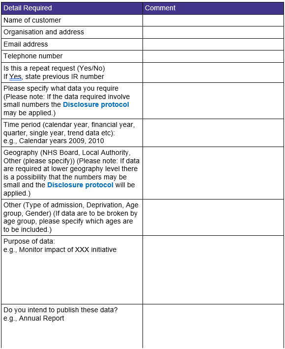
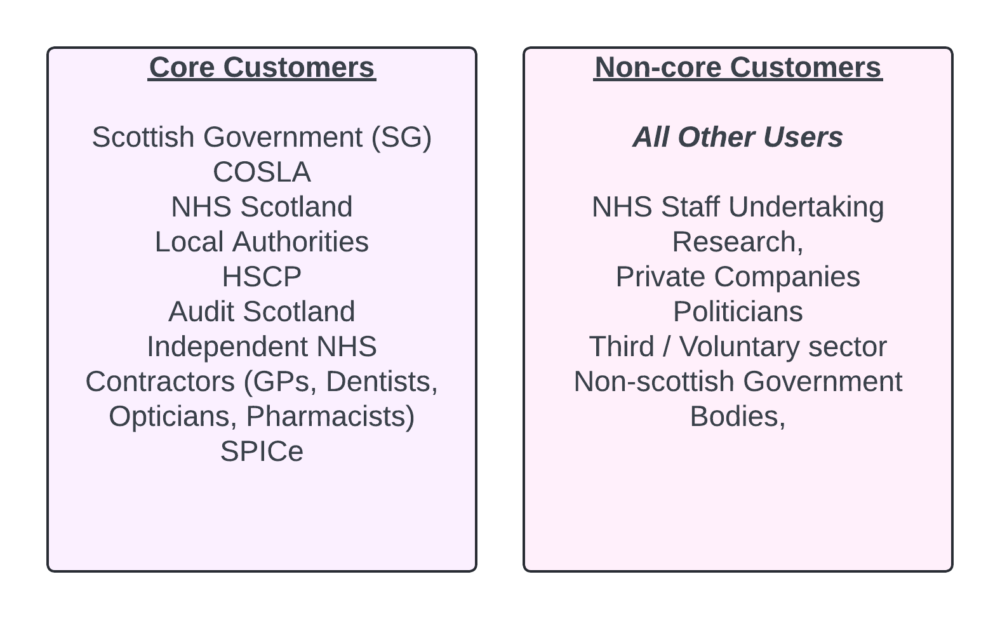
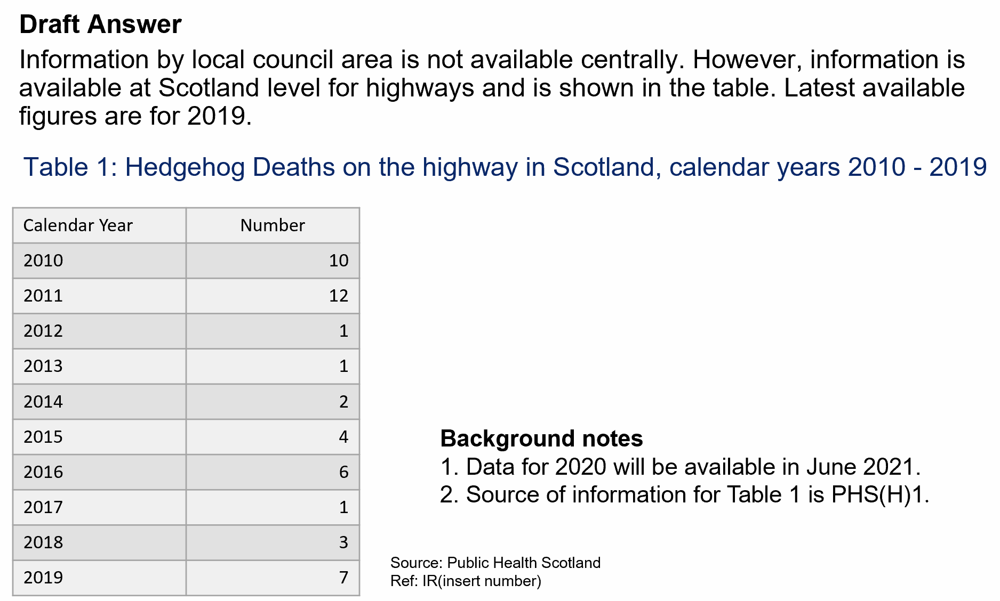

```{r setup, include=FALSE}
# Author: Vay Ly
# Original Date: February 2024

library(learnr)
library(gradethis)
library(stringr)
library(readr)
library(haven)
library(dplyr)
library(purrr)
library(ggplot2)

knitr::opts_chunk$set(echo = FALSE)

tutorial_options(
  exercise.checker = gradethis::grade_learnr
)

```

```{r phs-logo, echo=FALSE, fig.align='right', out.width="40%"}
knitr::include_graphics("images/phs-logo.png")
```


## Introduction


Welcome to the Parliamentary Questions & Information Requests course. This course is designed to provide an overview of the Information Request (IR) and Parliamentary Question (PQ) process. 

<div class="info_box">
  <h4>Course Info</h4>
  <ul>
    <li>This course is separated into two main sections: **Information Requests** and **Parliamentary Questions** </li>
    <li>Most sections have multiple parts to them. Navigate the course by using the buttons at the bottom of the screen to Continue or go to the Next Topic.</li>
    <li>If you are comfortable with the content and are looking for specific information or guidance, feel free to navigate through to the appropriate section located in the navigation banner.
    <li>If this is your first exposure to PQs and IRs, it is highly recommended to work through the course from beginning till end.
    <li>Should you have any difficulties whilst navigating the course please contact the Statistical Governance team at phs.statsgov@phs.scot.
    </br>
  </ul>
</div>

</br>

<div class="info_box">
  <h4>Reset</h4>
  If you wish to reset all the quizzes and start over from the beginning, locate and press the *Start Over* button beneath the navigation banner on the left hand side.
</div>

## Information Requests

In the following sections, we will cover what Information Requests are, and how to process them. 

In later sections, we will move on to PQs, which are a type of Information Request from MSPs.

Information Requests are requests for bespoke analysis of information and data which PHS holds.

IRs can be requested by anyone, so long as the requests are made in line with legislation, agreed principles, and public expectations regarding access to statistical information under which public bodies operate.


<div class="info_box">
  <h4>Important</h4>
  <ul>
  <li> Freedom of Information Requests and Environmental Information Regulation Requests are dealt with by the FOI team to ensure all FOI obligations are met under the Freedom Of Information Act 2002. Guidance can be found on <a href="https://spark.publichealthscotland.org/corporate-guidance/information-governance/data-protection/data-protection-handbook/freedom-of-information-foi/" target="_blank">The Spark.</a>
  
  <li> Information Requests from the media should be directed to PHS Comms at phs.comms@phs.scot.
  
  <li> All responses made to IR are subject to PHS overarching rules regarding <a href="https://spark.publichealthscotland.org/corporate-guidance/statistical-governance/releasing-statistics/" target="_blank">statistical governance</a>, which includes <a href="https://spark.publichealthscotland.org/corporate-guidance/information-governance/data-protection/" target="_blank">data protection</a>, <a href="https://spark.publichealthscotland.org/corporate-guidance/statistical-governance/statistical-disclosure-control/overview-of-disclosure-control-protocol/" target="_blank">statistical disclosure control </a> and <a href="https://code.statisticsauthority.gov.uk/" target="_blank">Code of Practise for Statistics </a>obligations.
  
  <li> PHS generally aims to answer IRs within 20 working days from the point where the specification is agreed with the customer.
  
</div>
</br>


### When PHS will provide analysis

PHS will provide a bespoke analysis in response to an IR, subject to resource, 
priority assessment and potentially a charge, provided that:

* The user is able to justify that other information already published or held as 
unpublished analysis by PHS is not suitable;

* The user has stated clearly what they want to find out and if possible why, to 
enable PHS staff to understand the request;

* PHS’s statistical governance rules are met.


### When PHS will not provide analysis

**PHS will not provide information in response to an IR if said information is due to be released in a publication within 12 weeks.**

Exceptions to this are where data is made available for the following purposes:

* In compliance with Pre-Release Access legislation on Official Statistics

* Early Access for Quality Assurance

* Early Access for Management Information

<div class="info_box">
  <h4>Important</h4>
  <ul>
  <li> Stats Gov (phs.statsgov@phs.scot) can be contacted in the first instance, should there be any concerns whether or not an IR should be answered.
</div>
</br>

## IR - Workflow

While individual teams may have their own local protocols for responding to IRs, the following is a general workflow which PHS users may use:

<ol>
  <li>Team receives IR.</li>
  </br>
  </br>
  <li>IR is logged in the IRS (see section *IR - Using Information Request Service*) and given a reference number.</li>
  </br>
  <li>IR is assessed by the team (see section *IR - Assessing the Request*)</li>
  </br>
  <li>If the request has not been made via the **Information Request Form** (see section *IR - Information Request Form*), teams are encouraged to send this form to the customer and request it be filled out and returned. Proceed to the next stage once it has been returned.
  </br>
  <li>Team makes contact with the customer to discuss the IR, and communicate what is being provided, the timescale required, and any applicable charges.</li>
  </br>
  <li>Once all parties are in agreement, analysis can be performed. **Note: If a charge is applicable, payment must be received before proceeding.**</li>
  </br>
  <li>Once complete, a second team member should check the work.</li>
  </br>
  <li>Complete <a href="https://spark.publichealthscotland.org/corporate-guidance/statistical-governance/statistical-disclosure-control/overview-of-disclosure-control-protocol/" target="_blank">Disclosure Risk Assessment form</a> and apply Statistical Disclosure Control as required.</li>
  </br>
  <li>The analysis must be approved by an appropriate member of the team (e.g. Principal Analyst or Service Manager).</li>
  </br>
  <li>If this is the first time the information is being released, it should be sent to preview 48 hours before it is released to the customer as follow: 
    <ul>
      <li> Analysis relating to specific Health Board: Email PHS preview mailbox. Request that the IR is sent to the Chief Executive and Communications Manager at that specific board.</li>
      <li> Analysis at national level: Email the IR to your policy contact at the Scottish Government using the e-mail templates in Appendix 1 of the <a href="https://spark.publichealthscotland.org/corporate-guidance/statistical-governance/information-requests/" target="_blank">Information Request Protocol.</a> 
      </li>
    </ul>
  </br>
  <li>Send the IR to the customer.</li>
  </br>
  <li>Close the IR on the IRS.
  </br>
</ol>

In the next section, we will cover the first few stages of the IR workflow.

## IR - Form & Service

### Information Request Form

While teams may have their own local procedures in dealing with Information Requests, it is encouraged to have customers fill in and return an *Information Request Form* after the request has been assessed and deemed feasible. We have provided an example form for teams to adapt for their purposes.

This form not only aids in the team assessment stage of dealing with IRs, but also directs customers to relevant policies and protocols concerning data and statistical governance. 

A screen grab of the form can be seen below. The attachable document file (with working hyperlinks) can be found in the *Useful Documentation & Links* section of this course, as well as on Spark (insert hyperlink for document).

**Please ensure you enter an appropriate team email address where prompted in the document.**

```{r echo=FALSE, fig.align='center', out.width="80%"}

```

<div class="info_box">
  <h4>Important</h4>
  <ul>
    <li>The 20 working day deadline to fulfil the IR will begin from when the specification has been agreed with the customer, following the team's assessment of the IR Form.
    <li>The use of the **Information Request Form** is a suggestion only, and may not be appropriate for all cases (such as when requested data is complex and requires detailed discussion). Individual teams should operate by their own discretion. 
  </ul>
</div>
</br>

### Information Request Service

The Information Request Service is where all Information Request should be logged. 

By doing so, users are able to be allocated to Information Requests, the time spent on the requests are able to be logged, and Information Request reference numbers are able to be generated. 

Users who require access to the IRS should contacts the Stats Gov team (phs.statsgov@phs.scot) via email to request access. 

Below is a step by step tutorial of how to log and close IRs in the system.

1) Log on and select *New Record*

```{r echo=FALSE, fig.align='center', out.width="75%"}

```

2) **Summary** - Select *Information Request (Non ISD)* as the Request Type, and fill in relevant information as shown below. 
*Note: The default deadline is 20 working days from when IR is received. This should be updated after discussion with the customer.* 

```{r echo=FALSE, fig.align='center', out.width="75%"}

```

3) **Customer** - As a minimum, fill in the name, telephone and email.

```{r echo=FALSE, fig.align='center', out.width="75%"}

```

4) **Time Log** - Click *Define New Role* and select a Lead Analyst (this can initially be the individual logging the request, and can be changed later).

```{r echo=FALSE, fig.align='center', out.width="75%"}

```

5) Once the Lead Analyst has been found and chosen, click *Submit Record*.

```{r echo=FALSE, fig.align='center', out.width="75%"}

```

6) **Closing Record** - Click *Search* and find the IR using the IR number. Once found, click *edit* to proceed.

```{r echo=FALSE, fig.align='center', out.width="75%"}

```

7) **Update Time Log** - You must update the amount of time worked in order to close the request. At this stage, you can also re-assign who is the lead analyst.

```{r echo=FALSE, fig.align='center', out.width="75%"}

```

8) **Complete and Close** - Back in the *Summary* screen, fill in the *Completion Date* and click *Submit Record* and confirm. You can then log off.

```{r echo=FALSE, fig.align='center', out.width="75%"}

```

Next, we will move onto the guidelines surrounding Charges.

## IR - Charging 

### Core / Non-Core Customers

There are two types of customers who will make IRs to PHS - **Core Customers** and **Non-Core Customers**.

It is important to distinguish between the two, as charging principles will differ depending on the customer.

Below are the two categories, as well as what certain organisations/individuals would fall under:


```{r echo=FALSE, fig.align='center', out.width="75%"}

```

### Charging

IRs should be charged if PHS is required to carry out new work in fulfilling the request. 

Customers are charged based on their type, and only if the work required exceeds a certain estimated timescale.

**Core Customers** are charged when the estimated work time exceeds 2 days.

**Non-Core Customers** are charged when the estimated work time exceeds 3.5 hours.

If a customer is to be charged, a fees notice and explanation of the fees must be sent when the specification of the IR is being discussed. 

From the issuance of the fees notice, the customer will have 3 months to decide whether or not to pay the charge to obtain the information.

Below is a table of Estimated Day Rates, dependent on the Type of Analysis required in responding to an IR.


```{r echo=FALSE, fig.align='center', out.width="75%"}

```


<div class="info_box">
  <h4>Important</h4>
  <ul>
  <li> Do not charge for IRs where the data is already available.
  <li> Do not charge when work is part of our normal business activity i.e. part of a planned programme of work, funded project, etc.
  <li> Do not charge for discussing specification.
  <li> For further information on Charging and the fees notice, consult the PHS Charging Mechanism and your respective teams.
  <li> The most up to date details on charging rates are available via Service Now 'Finance and Procurement'.
</div>
</br>


## IR - Assessing the Request

Once you have received the IR Form from the customer and logged the IR within the IRS, you should then assess the request with your team.

Each team will have their own local methods to assess the request. 

Below are some general considerations which should be understood and discussed with your team before proceeding to agree the specifications of the request with the customer.

### Considerations

Please work through the following checklist when assessing the IR with your team.

<input type="checkbox" unchecked> Is the request clear? Do we need further clarification from the customer or specialists?</input> 
</br>
</br>
<input type="checkbox" unchecked> Do we have the resources available to respond to the IR?</input> 
</br>
</br>
<input type="checkbox" unchecked> Is the information readily available?</input> 
</br>
</br>
<input type="checkbox" unchecked> Does responding to the IR impact on any Statistical Governance or Data Protection principles?</input> 
</br>
</br>
<input type="checkbox" unchecked> Can the IR be responded to within 20 working days from the specification being agreed with the customer?</input> 
</br>
</br>
<input type="checkbox" unchecked> Is this a repeat or similar request?</input> 
</br>
</br>
<input type="checkbox" unchecked> Is this request chargeable?</input> 
</br>
</br>
<input type="checkbox" unchecked> Who will be the Lead Analyst?</input> 
</br>
</br>


<div class="info_box">
  <h4>Important</h4>
  <ul>
  <li> Avoid releasing confidential data, where possible. Ensure appropriate sign-off processes have been followed.
  <li> Data relating to own treated patients can be released to consultants, so long as a <a href="https://spark.publichealthscotland.org/corporate-guidance/information-governance/data-protection/data-protection-handbook/data-release-and-linkage-form/" target="_blank">Data Release and Linkage Form</a> is filled out and approved by the Data Protection Team (phs.dataprotection@phs.scot).
  <li> Information Requests from the media should be directed to PHS Comms at phs.comms@phs.scot.
</div>
</br>

### Completing the IR

Once an agreement of the specifications has been made with customer, and any necessary Charges have been paid, the work can be carried out.

Teams will have their own methods and resources in carrying out the work necessary to fulfill an Information Request.

Users should apply <a href="https://spark.publichealthscotland.org/corporate-guidance/statistical-governance/statistical-disclosure-control/overview-of-disclosure-control-protocol/" target="_blank">Statistical Disclosure Control</a> as required (e.g. If there are small figures, etc.).


### Sending and Closing the IR

If this is the first release of the information, the IR should be sent for preview 48 hours before it is released to the customer, using the templates contained within the Appendix of the <a href="https://spark.publichealthscotland.org/corporate-guidance/statistical-governance/information-requests/" target="_blank">Information Request Protocol.</a>

Once all the appropriate works and checks have been completed and the preview of the answer is sent off (if necessary) then the IR can be sent to the customer.

The IRS file should then be updated and closed.


## IR - Example


The below is a well-answered IR, and may be used as an example of how teams may tackle such requests.

### Example

A PHS team received an IR via email, requesting the **list size of patients aged 18-74 per practice in NHS Tayside**.

In discussion with the customer, the team was able to clarify the following:

* What the requirements were.
* If existing data was sufficient to answer the question.
* Confirmation customer would like to proceed with the IR.
* Confirmation of IR Number and Deadline, which was conveyed to the customer.

Following this discussion, the team outputted the following spreadsheet to the customer via email:

```{r echo=FALSE, fig.align='center', out.width="75%"}

```

```{r echo=FALSE, fig.align='center', out.width="75%"}

```

<div class="info_box">
  <h4>Important</h4>
  <ul>
  <li> This section only shows one example of how an IR has been answered. Individual teams will be able to provide their own examples of how they have answered IRs in the past.
  <li> Unlike with PQs, there is no standardised template to be used when answering an IR, as teams will have their own methods, and each IR may be different in their requirements to eachother.
</div>
</br>

## IR - Knowledge Check

```{r final_IR_knowledge_check}
quiz(
  question("Only specific people and organisations are permitted to submit an IR to PHS.",
           answer("TRUE", correct = FALSE),
           answer("FALSE", correct = TRUE),
           incorrect = "Not quite, have another go!",
           correct = "Anyone is allowed to submit an IR to PHS.",
           allow_retry = TRUE,
           random_answer_order = TRUE
           ),
  question("The customer is making an IR which specifically requires small numbers to be disclosed. What should you do? (select all that apply)",
           answer("Contact Stats Gov and seek guidance.", correct = TRUE),
           answer("Release the information. It is only going to one customer, so it is fine.", message = "The information should not be released without consulting Stats Gov, and discussing the issue with the customer."),
           answer("Have a discussion with the customer regarding the issues with supplying the information.", correct = TRUE),
           incorrect = "Not quite, have another go!",
           correct = "A discussion should be had with the Stats Gov and the customer (seperately) to discuss the issue and find a way forward.",
           allow_retry = TRUE,
           random_answer_order = TRUE
           ),
  question("All work must be approved by an appropriate member of the team (e.g. Service Manager/Principal Analyst) prior to being sent to the customer.",
           answer("TRUE", correct = TRUE),
           answer("FALSE", correct = FALSE),
           incorrect = "Not quite, have another go!",
           correct = "Well done!",
           allow_retry = TRUE,
           random_answer_order = TRUE
           ),
  question("An IR has been sent to your team from a researcher in a Private Company. They have asked for national level information which has not been released before. What additional stages would you have to do when processing this IR?",
           answer("It must be sent for preview to your policy contact at SG using the template in Appendix 1 of the IR Protocol, at least 48 hours before being released to the customer.", correct = TRUE),
           answer("Nothing. As this is new information, it is fine to pass it on to the customer.", correct = FALSE),
           answer("It should be checked very thoroughly by a member of the team.", correct = FALSE),
           incorrect = "Not quite, have another go!",
           correct = "First release of information should be sent to preview 48 hours before being released to the customer. Details can be found in the IR - Workflow section of this course",
           allow_retry = TRUE,
           random_answer_order = TRUE
           )
)
```


### Conclusion

You have reached the end of the Parliamentary Question and Information Request course. 

We realise that the processes we have discussed may have been a lot to take in, and may require refreshing when and if PQs and IRs are posed to yourself and your team.

The next few sections will contain various helpful documents, links and contacts in order to aid you in dealing with PQs and IRs.


## Parliamentary Questions

PQs are questions posted by MSPs to the Scottish Government (SG), or the Scottish Parliamentary Corporate Body. They serve as a mechanism for MSPs to obtain factual and statistical information. 

The nature and themes of the questions may change to reflect the ever changing social and political climate in Scotland at the time.

For instance, during the flu seasons SG may receive a number of PQs such as:

**To ask the Scottish Government how many vaccinations took place in Glasgow this year, and how it compares to the amount of vaccinations which took place last year.**

**To ask the Scottish Government how many vaccines are available in preparation for the 2024 Flu season.**


While topical questions are not certain to be asked, it is a good idea for teams to be aware of possible trends and topics they may be faced with.

PQs (both answered and unanswered) can be found on the <a href="https://www.parliament.scot/chamber-and-committees/questions-and-answers" target="_blank">Scottish Parliament's Questions and Answers page</a>. 

In the next few sections, we will cover how a Parliamentary Question is created, information concerning the deadlines, and how the Statistical Governance team at PHS handle the PQs so that they (hopefully) reach the appropriate teams. 


### About PQs

PQs can be asked in two ways:

**Oral Questions** are asked in Parliament during First Minister's Questions, and are submitted on a Wednesday, one week before they are to be asked in Parliament. The timescale to respond to the MSP is 5 working days.


**Written Questions** are submitted daily. The timescale to respond to the MSP is 10 working days, and 20 working days during a recess.

An overview of the PQ process can be seen below:

```{r PQ-process, echo=FALSE, fig.align='center', out.width="80%"}

```

<div class="info_box">
  <h4>Important</h4>
  <ul>
    <li>While it is true that there is a short turnaround time in responding to PQs, the timeframe in which PHS should respond to SG (this will be known as our *Policy Deadline Date*) can be negotiated with SG.
    <li>All attempts should be made to adhere to the above timeline.
  </ul>
</div>
</br>


## PQ - Workflow

The following section contains a general workflow for PHS Users to understand the PQ process. 

More detailed breakdowns of each stage of the process can be found in later sections of this course.

<ol>
  <li>PQs are made available.</li>
  </br>
  <li>The PHS Statistical Governance Team (phs.statsgov@phs.scot) retrieves and assigns the PQs to the appropriate PHS teams (see section *PQ - Retrieving & Assigning PQs*).</li>
  </br>
  <li>Teams receive and assess the PQ. </li>
  </br>
  <li>If correctly assigned and the team are able to answer, contact SG to enquire whether a response is required (see section *PQ - Processing & Responding* for further information on the process at this stage, including for instances where PQs have been incorrectly assigned, or unable to be answered).</li>
  </br>
  <li>If a response is required, log the PQ in the IRS. (see section *IR - Using Information Request Service*)</li>
  </br>
  <li>Discuss the PQ with SG, gaining clarification as necessary, establishing deadlines, and conveying all relevant information.</li>
  </br
  <li>Once all is agreed, proceed with answering the PQ. **Follow <a href="https://spark.publichealthscotland.org/corporate-guidance/statistical-governance/statistical-disclosure-control/overview-of-disclosure-control-protocol/" target="_blank">PHS Statistical Disclosure Control flowchart</a>. ** If required, contact Stats Gov for assistance. </li>
  </br>
  <li>Produce draft answer in accordance with style guidelines, using the appropriate template. (see section *PQ - Processing & Responding*)</li>
  </br>
  <li>Complete the sign-off procedure. (see section *PQ - Sign Off*)</li>
  </br>
  <li>Send the draft answer to the SG contact.</li>
  </br>
  <li>Update IRS and close the record.</li>
  </br>
  <li>Review the answer once it has been published at the <a href="https://www.parliament.scot/chamber-and-committees/questions-and-answers" target="_blank">Scottish Parliament's Questions and Answers page</a>. </li>
  </br>
</ol>

<div class="info_box">
  <h4>Important</h4>
  <ul>
    <li>PHS Teams may, at times, receive PQs directly from Scottish Government contacts. In this instance, teams should carry out the PQ process above as normal proceeding from **Teams receive and assess the PQ.**
  </ul>
</div>
</br>

Next, we will cover the first stages of the above workflow - how PQs are retrieved and assigned by Stats Gov. 

## PQ - Retrieving & Assigning PQs

In this section, we will look at how the PHS Statistical Governance Team (phs.statsgov@phs.scot) retrieves the PQs from the Parliament website, and assigns them to teams within PHS.

### Retrieving new PQs

Every Tuesday and Thursday morning, Stats Gov runs a script which scrapes **all** the PQs from the Parliamentary website, until midnight of the previous day.


Questions which hit certain keywords relating to health (NHS, blood, etc.) are flagged in order to aid Stats Gov by highlighting important health-related questions.

Through the retrieval process, all questions (flagged and non-flagged) are retrieved and are manually reviewed by Stats Gov. 

Throughout the year, there may be times where Stats Gov will increase the frequency of these retrievals if necessary due to large volumes.


```{r pq-review-quiz, results='asis'}
quiz(
  question("Which of the following PQ's have Stats Gov reviewed? 'To ask the Scottish Government... (select ALL that apply)",
    answer("how many stoats have there been in Orkney in each of the last seven years, and what it estimates the figure will be for 2019?", correct = TRUE),
    answer("what plans it has to reduce the working week for public sector staff", correct = TRUE),
    answer("whether guidance on flying flags from its buildings changed in 2021; what any such changes were, and what the reasons were for any changes made.", correct = TRUE),
    answer("to ask the Scottish Government how many full-time equivalent British Sign Language tutors are currently employed by each local authority.", correct = TRUE),
    incorrect = "There are a few more!",
    allow_retry = TRUE,
    random_answer_order = TRUE
  )
)
```


### Assigning PQs

PQs are manually reviewed by Stats Gov, who decide the following:

#### Topic Area

The team will decide what topic areas the question corresponds to, and to which teams it should be assigned to.

The following is an excerpt from the topic area/team allocation guide which Stats Gov uses to allocated the PQs to the appropriate team. It includes what topics should be allocated to the team (in this case, Quality Indicators) and what should not.

```{r echo=FALSE, fig.align='center', out.width="75%"}

```

It is important to note that questions may pertain to multiple teams. If this is the case, it will be allocated to all related teams, and such an allocation be detailed in the *Notes* section explained below. 

#### Action

Assigned PQs are given one of two actions:

* **For Information** - this indicates that the question is of interest to your service area. While there is no expectation to reply, be prepared should SG contact you to request any relevant assistance.

* **For Review** - this indicates that the question may require you to take action. 

Regardless of the action assigned to the PQ, the recipients should read said PQ and make a decision whether any further action is necessary (we will discuss this later in the course).

#### Notes

Any relevant notes (such as previously answered PQs relating to this PQ, and to what other teams this PQ has been allocated to, including the action).

If the question has been assigned to multiple teams, it is expected that the teams will make contact with one another when processing the PQ.

<div class="info_box">
  <h4>Important</h4>
  <ul>
  <li>Stats Gov are not specialists within the individual topic areas, and may occasionally assign a PQ’s Topic Area or Action in error. Teams are expected to read through all PQs assigned to them. If incorrectly reassigned please contact Stats Gov and, where possible, cc the correct team who may be able to respond to the PQ. Stats Gov will update their allocation guide and process to mitigate future incorrect allocation. 
  
  <li>Stats Gov (phs.statsgov@phs.scot) welcomes any and all corrections in order to improve their services. 
  </ul>
</div>
</br>


###  Assigned PQ

Once the PQ has been assigned by Stats Gov, it is then sent out to the relevant teams, relating to the topic areas. Each topic area will generate one email containing all the PQs for that allocation session. 

The email contains information on how to proceed, the SG contact email, as well as the deadline dates. 

**The 'Answer expected' date is for when the question will need to be sent to the relevant MSP. It is not the deadline for PHS to respond to the SG.**


#### Example

```{r echo=FALSE, fig.align='center', out.width="100%"}

```


### Knowledge Check 

```{r PQ-AllocationsQuiz}
quiz(
  question("You have received a PQ which is not related to your service area, and has only been sent to your team. What should you do? (select ALL that apply)",
           answer("Contact Stats Gov and inform them of the error.", correct = TRUE),
           answer("If possible, forward the answer to the appropriate PHS team.", correct = TRUE),
           answer("Contact Scottish Government, and tell them PHS cannot assist", message="You should not contact Scottish Government, as this PQ has been incorrectly assigned to your team."),
           answer("Do nothing and wait for Scottish Government to ask for assistance", message="You should make every effort to ensure the PQ is received by the correct team, and that Stats Gov are informed of this error."),
           allow_retry = TRUE,
           random_answer_order = TRUE
           ),
  question("If you receive a PQ with Action 'For Information', you can ignore it as you will not need to provide a response.",
           answer("TRUE", message = "Teams should still read the PQs and take further action if necessary."),
           answer("FALSE", correct = TRUE),
           allow_retry = TRUE,
           random_answer_order = TRUE
           )
)
```
In the next section, we will cover what you should consider when you receive a PQ.


## PQ - Types & Considerations

The template used to respond to a PQ can be found in Appendix 3 of the <a href="https://spark.publichealthscotland.org/corporate-guidance/statistical-governance/parliamentary-questions/" target="_blank">Parliamentary Questions Protocol Guide.</a>

Within this template, you can see two key sections:

* **Draft Answer** - this is where you will supply your answer to the PQ.

* **Background Note** - this is additional/background information which could provide greater understanding or references.

Before you start to respond to the PQ, there are a number of considerations to bear in mind.


### Considerations 

In the event you receive a PQ, you should carefully consider whether or not you are able to provide a response, what it may involve, and what you may need to discuss with your, or another, team.

The following are a list of considerations which you should discuss with your team:

### <blank>
#### Is your team able to answer the question?

* If your team is unable to answer the question, why is that? Did you incorrectly receive the PQ, and that error needs to be fed back to the Stats Gov team?

* Is input from a specialist (medic/HOP/Clinical Coding Helpdesk) required?

* Perhaps there is another team or organisation better suited with the appropriate data? For example, questions about Deaths would be more suited to NRS.

* If the question is being answered by multiple sources, who is taking the lead?

* Should the PQ require considerable resource and/or new analytical input please ensure this has been discussed with senior management.

### <blank>
#### Is the deadline achievable?

* If the deadline is not achievable, discuss the matter with the SG contact contained in the PQ email. 

**It is often possible to negotiate deadlines with SG, especially when further analysis is required.**

### <blank>
#### Other considerations

* If the question cannot be answered, what background information should be considered? (If any)

* Can the question be interpreted in more than one way? If yes, how can you get clarification?

* Has a similar question been answered before? (This could be searched for on the <a href="https://www.parliament.scot/chamber-and-committees/questions-and-answers" target="_blank">Scottish Parliament's Questions and Answers page</a>)

* Is there a published source, which they can be referred to?

* What data completeness/quality issues may arise?


Hopefully, after spending some time on the above considerations, you will have decided on whether it is appropriate for your team to respond to the PQ.

Next we will discuss the 3 types of PQs you could receive, and provide some guidance on how best to answer them.

### PQs which can be answered with a specific answer

These are answers which are relatively straightforward PQs, such as when a table of figures would be enough to answer the PQ. 

Some interpretation or explanation may still be required to give the MSP a clear understanding of the provided statistics.


**To ask the Scottish Government how many patients have received care or treatment at the (a) Vale of Leven and (b) Inverclyde Maternity unit in each year since May 2007**

**Draft answer example:**

*The information is provided in the table below:*

*Table 1: Number of patients recorded as having received care or treatment at the Vale of Leven and Inverclyde maternity unit*


**If the data is available on a website a standard reply should be used.**

**Draft answer Example:**

*The information is published on the PHS website under (insert section of website and link).*


Relevant background notes should be provided. Keep it brief, but provide enough information to ensure the question is answered and understood.


### PQs which require interpretation

A question may seem straightforward, but might not map to a specific available data source, or if it does, it may require interpretation of how to answer it. You may need to get specialist advice, or be flexible with your response in order to cover multiple interpretations of the same question.

Below are some examples of PQs which require interpretation. 


```{r interpretationQuestions}
quiz(caption = "What information might you need to interpret in order to fully answer the question?",
  question("To ask the Scottish Government how many (A) adults and (B) children have been registered with a dentist in each year since 2005. (select ALL that apply)",
           answer("Definition of Adult and Children - Over 16 or over 18? Under 16 or under 18?", correct = TRUE),
           answer("NHS or Private Dentist", correct = TRUE),
           answer("Calendar year or financial year?", correct = TRUE),
           answer("Reason for visiting the dentist", message = "There is no need to know the reason for visiting the dentist. Try again."),
           allow_retry = TRUE,
           random_answer_order = TRUE
           ),
  question("To ask the Scottish Government how many people have been prescribed drugs for depression in each year since 2005, broken down into (A) children, (B) adolescents, (C) adults and (D) elderly people in each NHS board area. (select ALL that apply)",
           answer("Time Period - since Jan 2005 or April 2005? (calendar year or financial year)", correct = TRUE),
           answer("Definition of adult, child, elderly?", correct = TRUE),
           answer("Could the prescribed drug also be prescribed to treat other conditions? Do we need specialist advice?", correct = TRUE),
           answer("Is it possible for us to differ between the number of people, and the number of prescriptions?", correct = TRUE),
           answer("How long have the individuals been on the prescribed drugs?", message = "There is no need to know how long an individual has been prescribed drugs. Try again."),
           allow_retry = TRUE,
           random_answer_order = TRUE
           )
)
```

### <blank>

**To ask the Scottish Government how many attendances at GP surgeries by prostate cancer patients there have been in each year since 1997-98, also broken down by (a) NHS Board and (b) parliamentary constituency.**

For this question, the data is not collected by PHS, but a similar data set may be available. It may also require some advice from Medical Colleagues and will need to be checked by an appropriate Service Manager.

**Example Draft Answer:**

*This information is not available centrally. However estimates based on data from a small sample of general practices in Scotland, which are representative of Scotland, is presented in Table 1.*

*Table 1 shows the estimated numbers of patients attending consultations at Scottish GP Practices for prostate cancer related conditions during financial years 2003/04 to 2008/09.*


### Policy focussed questions where background data is helpful for the SG

These are questions which do not specifically ask for statistical information but for which data held by PHS could provide useful background context. 

The data would be provided to the SG as a background note.


**To ask the Scottish Government whether it plans to review beta blocker prescribing recommendations following a study recently published in The Journal of the American Medical Association suggesting that beta blockers did not prolong the lives of patients.**

**Example Draft Answer:**

*The question relating to whether the Scottish Government plans to review beta blocker prescribing cannot be answered from data held centrally by PHS.*

**Background Note**

*Information on the number of items dispensed and the gross ingredient cost for beta blockers for financial years 2010/11 and 2011/12 by NHS board can be found in the table 1 below…*


## PQ - Guiding Principles


When you are in a position where you are required to provide a response, there are certain Guiding Principles which you should adhere to, in order to provide an answer that is clear and effective.

Below are some guiding principles which draft answer producers should consider and adhere to.

It is important to remember that PHS staff should know best about the quality of the data that we are providing. As such, we should not be leaving those who receive the PHS draft answer to interpret the data for themselves.

```{r echo=FALSE, fig.align='center', out.width="75%"}

```


#### Background Notes

Background notes are provided to give additional contextual information. 

This could include:

* Explain why the question has been answered in a certain way 

* Explain issues with data used within the draft answer

* Sources and other useful briefings 


**SG will most likely leave Background Notes out of their final response.**


<div class="info_box">
  <h4>Important</h4>
  <ul>
  <li>The SG may change the response provided by the PHS when preparing the final answer for the MSP. Such changes are often checked with PHS, but not always. 
  
  <li>For particularly hot topics, PHS staff should request they be consulted of any proposed changes to the content or wording of the PQ by the SG.
  
  <li>If there are any issues with the process, please get in touch with Stats Gov and your Service Manager in the first instance.
  
  <li>The above considerations and guiding principles provide an advisory basis for how you should tackle the PQs posed to you. Teams will have their own methods in responding effectively.
  
  <li>For further guidance on releasing information in line with the Code of Practise, the <a href="https://spark.publichealthscotland.org/downloads/scenarios-on-code-of-practice/" target="_blank">Scenarios on Code of Practise</a> document on Spark provides a number of appropriate examples.
  
  </ul>
</div>
</br>

### Knowledge Check

```{r PQ-GuidingPrinciples}
quiz(
  question("You have received a PQ which you have been asked to respond to by the SG. The data you have access to is not clear, and as such, you cannot fully answer the question. What do you do? (select ALL that apply)",
           answer("Do not pass on the data that is not clear.", correct = TRUE),
           answer("Contact Scottish Government, and explain why you cannot assist.", correct = TRUE),
           answer("Send the SG the data, and explain why you cannot answer it.", message = "You should not be sending unclear data to SG."),
           answer("Contact specialists on the data to gain clarity, to assist in answering.", correct = TRUE),
           answer("Do nothing. You cannot answer the question so it is better not to confuse anyone.", message = "You have been asked to respond by SG, and you should provide a response of some kind."),
           correct = "That is correct! You should be open and transparent about your capabilities in answering a PQ, and specialist assistance should be sought in helping to answer a question.",
           allow_retry = TRUE,
           random_answer_order = TRUE
           ),
  question("Your response to a question will include data that is contained in a publication due to be released in 12 weeks. You should release the answer with the data since PQs are important, and should be answered as soon as possible.",
           answer("TRUE"),
           answer("FALSE", correct = TRUE),
           incorrect = "You should not be releasing data that is due to to be released within the next 12 weeks of an official release.",
           allow_retry = TRUE,
           random_answer_order = TRUE
           )
)
```


## PQ - Processing & Responding

The following is the workflow when processing and responding to a PQ:

### Assess the PQ

Upon receiving a PQ, assess if it is:

* **Incorrectly assigned** - Stats Gov will have assigned the PQ according to their existing team allocation guide therefore if the correct team is known please forward the question to the appropriate team, copying Stats Gov for future reference and allocation processes will be updated to mitigate this in future. If there are no appropriate teams, contact Stats Gov and make them aware. No further action is required.

* **Correctly assigned, For Information** - No further action required, unless SG makes contact to request input.

* **Correctly assigned, For Review, Unable to Answer** - Inform SG that this data is not held. 

* **Correctly assigned, For Review, Able to Answer** - Follow the steps below.

<div class="info_box">
  <h4>Important</h4>
  <ul>
  <li>If multiple teams have been assigned to the PQ, it is expected for teams to liaise with other teams when processing the PQs.
  </ul>
</div>
</br>


#### Contact the SG

**Contact SG** using the contact details within the PQ email, and find out if a response is required.

If no response is required, no further action is needed.


#### Response Required

Should a response be required, a discussion should be had with SG:

* Obtain SG's contact details from the PQ allocation email from Stats Gov.

* Record PQ in IRS (refer to later section on 'IR - Form & Service').

* Clarify SG understanding of PQ.

* Advise if Background notes will be provided.

* Establish/negotiate deadlines.

* If SG suggests a response that is not consistent with intended PHS response: discuss with Head of Service/Service Manager


### Checks Before Responding

Once a response is determined to be required, then the following should be undertaken:

* Check <a href="https://www.parliament.scot/chamber-and-committees/questions-and-answers" target="_blank">Scottish Parliament's Questions and Answers page</a> for previous responses, consistency in codes/definitions, etc.

* If a previous response contains statistics based on methodology that has changed, this should be explained either in the answer itself, or the background note.

* If further expertise is required, this should be sought after immediately.

* If data is available on a website, a standard reply should be used. For example, ‘The information is published on PHS’s website under (insert section of website and link).’ Where relevant, background notes should be provided. 

* Information should not be the first public release of the data.

* **Follow <a href="https://spark.publichealthscotland.org/corporate-guidance/statistical-governance/statistical-disclosure-control/overview-of-disclosure-control-protocol/" target="_blank">PHS Statistical Disclosure Control flowchart</a>. ** If required, contact Stats Gov for assistance.


### Producing Draft Answer

All answers should be produced using Appendix 3 of the <a href="https://spark.publichealthscotland.org/corporate-guidance/statistical-governance/parliamentary-questions/" target="_blank">Parliamentary Questions Protocol Guide.</a>

The following style guidelines checklist should be applied:

<input type="checkbox" unchecked> Font should be Arial size 12 for text and tables.</input> 

<input type="checkbox" unchecked> Only Word tables should be included in the answer.</input> 

<input type="checkbox" unchecked> All tables should be portrait.</input> 

<input type="checkbox" unchecked> The left hand column in a table should be left justified, including the heading.</input> 

<input type="checkbox" unchecked> The table rows containing information/figures should be right justified.</input> 

<input type="checkbox" unchecked> Table headings and titles should not be in bold.</input> 

<input type="checkbox" unchecked> Very large tables should not be included in the answer. Instead, save these as separate Excel sheets and include that with the answer.</input> 

Check draft answer for accuracy, typing mistakes, etc. *Best practise is to have a colleague check the answer.*


Once checks are done, and the answer is produced in accordance with the above, it can proceed to the sign-off stage.

## PQ - Example


In this section, we will consider a case study as an example of how to create a draft answer for the PQs.

Further examples can be found in the *Further PQ Examples* document located in the *Useful Documentation & Links* section of the course.

### Example Scenario

Your team has received the following PQ and have been asked by SG to respond to it:


**To ask the Scottish Government how many hedgehog deaths on the roads there have been in each of the last 10 calendar years, broken down by local council area.**


What we know:

* Since 1970, we have collected information on hedgehog deaths on its PHS(H)1 dataset. 
* It is possible to identify the place of death=highway from this dataset. 
* Local council area is not identified on this dataset. 
* Data for 2020 is currently being processed and will be available soon.

Take a moment and think about how you would create a draft answer in the above scenario. When you are ready, click next in order to see an example of how this has been answered.


### Example Draft Answer


```{r echo=FALSE, fig.align='center', out.width="100%"}

```

The draft answer above is appropriate in answering the question, as it:

* Explains why the question cannot be answered.
* Gives alternative information relating to the same type of question which may be used by SG.
* Supplies a table of the information in the correct style format.
* Provides appropriate Background Information, including source of data.

How did you do? Did you meet all the points above? 

<div class="info_box">
  <h4>Important</h4>
  <ul>
    <li>Please remember to use the template located in Appendix 3 of the <a href="https://spark.publichealthscotland.org/corporate-guidance/statistical-governance/parliamentary-questions/" target="_blank">Parliamentary Questions Protocol Guide</a> when Drafting PQ Answers.
  </ul>
</div>
</br>

## PQ - Sign Off


Once your answer has been completed and checked, then it has reached the sign off stage.

Here, your answer will undergo a two-stage sign off process, conducted by two separate senior personnel - authorised personnel/roles can be found in the following table:

```{r echo=FALSE, fig.align='center', out.width="75%"}
knitr::include_graphics("images/irpq-signOff.png")
```

The sign off process is as follows:

```{r echo=FALSE, fig.align='center', out.width="50%"}
knitr::include_graphics("images/irpq-signOffProcess.png")
```


<div class="info_box">
  <h4>Important</h4>
  <ul>
  <li>First and final sign offs must be undertaken by different people.
  
  <li>Service Managers can only approve responses from their own area.
  
  <li>If further work is advised, this must be clearly explained and agreed with the service area.
  
  <li>Teams should ensure records of the PQ sign-offs are retained for proper record-keeping - this could be storing the email chain with the sign-off request and approval in a designated Sharepoint team folder, for example.
  
  </ul>
</div>
</br>


### Submit answer to SG and Close PQ.


Following sign off, you should send the draft answer via email to the assigned SG contact. 

Confirmation of receipt of the answer should be requested.


If sub-Scotland analysis has been provided in the draft answer, this should be sent to the relevant NHS Board(s). Email phs.releasepreview@phs.scot detailing:

* the NHS Board/Boards who are to receive a copy 

* that it is a PQ 

* a copy of the draft answer 


Update the IRS and close the record

Review answer published on PQ website to check if answer provided by PHS was used.

<div class="info_box">
  <h4>Important</h4>
  <ul>
  <li>A copy of your draft answer will be submitted to the relevant NHS boards using the standard template found within 
  <a href="https://spark.publichealthscotland.org/corporate-guidance/statistical-governance/information-requests/" target="_blank">Appendix 2 of the IR Protocol</a>.
  
</div>
</br>


## PQ - Knowledge Check

You have reached the end of the PQ portion of this course. Here is a short quiz to see how familiar you are with the process.

```{r final_PQ_knowledge_check}
quiz(
  question("All PQs require a response.",
           answer("TRUE", correct = FALSE),
           answer("FALSE", correct = TRUE),
           incorrect = "That is not correct. Have another go!",
           correct = "Not all PQs require a response. SG and Stats Gov will inform teams when a response is required from them.",
           allow_retry = TRUE,
           random_answer_order = TRUE
           ),
  question("If you receive a PQ with Action ‘For Information’, you can ignore it as you will not need to provide a response.",
           answer("TRUE", correct = FALSE),
           answer("FALSE", correct = TRUE),
           incorrect = "Not quite, have another go!",
           correct = "Whether you receive a PQ under the action 'For Information' or 'For Review', all PQs must be read and appropriate action should be taken by the recipients.",
           allow_retry = TRUE,
           random_answer_order = TRUE
           ),
  question("I MUST supply a response by the PQ's policy deadline.",
           answer("TRUE", correct = FALSE),
           answer("FALSE", correct = TRUE),
           incorrect = "Not quite, have another go!",
           correct = "The deadline can be negotiated with the SG. It is important to have enough time and resources to sufficiently answer the question.",
           allow_retry = TRUE,
           random_answer_order = TRUE
           )
)
```

### Conclusion

Parliamentary Questions are extremely important functions which facilitate the democratic process.

It is important to ensure that the process detailed in previous sections are understood and adhered to. If there are any issues, the Statistical Governance team (phs.statsgov@phs.scot) is available to answer any queries.


## Useful Documentation & Links

#### Documents

|  Document                       |
|---------------------------------|
| <span class="center-align"><a href="https://spark.publichealthscotland.org/corporate-guidance/statistical-governance/parliamentary-questions/" target="_blank">Parliamentary Questions Protocol</a></span> | 
| <span class="center-align"><a href="https://spark.publichealthscotland.org/corporate-guidance/statistical-governance/information-requests/" target="_blank">Information Request Protocol</a></span> | 
| <span class="center-align"><a href="https://spark.publichealthscotland.org/corporate-guidance/statistical-governance/statistical-disclosure-control/overview-of-disclosure-control-protocol/" target="_blank">SDC Protocol / Risk Assessment Form / SDC Flowchart</a></span> | 
| <span class="center-align"><a href="https://spark.publichealthscotland.org/corporate-guidance/information-governance/data-protection/data-protection-handbook/freedom-of-information-foi/" target="_blank">FOI/EIR Protocol</a></span> |
| <span class="center-align"><a href="https://spark.publichealthscotland.org/corporate-guidance/statistical-governance/information-requests/" target="_blank">INSERT LINK TO Information Request Form</a></span> | 
| <span class="center-align"><a href="https://spark.publichealthscotland.org/corporate-guidance/statistical-governance/information-requests/" target="_blank">INSERT LINK TO PQ EXAMPLES</a></span> | 


#### Contacts

| Team                            | Email                       |
|---------------------------------|-----------------------------|
| PHS Statistical Governance Team | phs.statsgov@phs.scot       |
| PHS Communications Team         | phs.comms@phs.scot          |
| PHS Preview Mailbox             | phs.releasepreview@phs.scot |
| PHS FOI Team                    | phs.foi@phs.scot            |
| Scottish Government Generic Contact | HSCAnalysisHub@gov.scot |


## Feedback

Thank User for completing the course.

Please take some time to give some feedback so that we may improve the course for future users.

<iframe width="640px" height="480px" src="https://forms.office.com/Pages/ResponsePage.aspx?id=veDvEDCgykuAnLXmdF5Jmr6qmxVdaxdPt6Pzcihf4zhUODkxTTRQNlBQR1lBRExGNEkwTVVHREVJVS4u&embed=true" frameborder="0" marginwidth="0" marginheight="0" style="border: none; max-width:100%; max-height:100vh" allowfullscreen webkitallowfullscreen mozallowfullscreen msallowfullscreen> </iframe>


