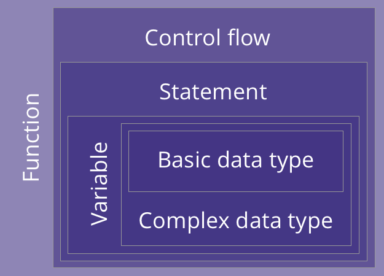

```{r setup, include=FALSE}
# Author: Russell McCreath
# Original Date: Aug 2020
# Version of R: 3.6.1

library(learnr)
library(gradethis)
library(stringr)
library(readr)
library(haven)
library(dplyr)
library(ggplot2)
knitr::opts_chunk$set(echo = FALSE)

tutorial_options(
  exercise.checker = gradethis::grade_learnr
)

borders_data <- readRDS("www/data/borders.rds")
borders_age_data <- read_csv("www/data/BORDERS (inc Age).csv")
baby5 <- read_csv("www/data/Baby5.csv")
baby6 <- read_csv("www/data/Baby6.csv")
```

```{r phs-logo, echo=FALSE, fig.align='right', out.width="40%"}
knitr::include_graphics("images/phs-logo.png")
```


## Introduction

Welcome to an Introduction to R. This course is designed as a self-led introduction to R for anyone in Public Health Scotland. Throughout this course there will be quizzes to test your knowledge and opportunities to modify and write R code. Below is an overview of the learning pathway.

```{r intro-pathway, echo=FALSE, fig.align='center', out.width="100%"}
knitr::include_graphics("images/r-intro-pathway-2.png")
```

<div class="info_box">
  <h4>Course Info</h4>
  <ul>
    <li>This course is built to flow through sections and build on previous knowledge. If you're comfortable with a particular section, you can skip it.</li>
    <li>Most sections have multiple parts to them. Navigate the course by using the buttons at the bottom of the screen to Continue or go to the Next Topic.</li>
    <li>The course will also show progress through sections, a green tick will appear on sections you've completed, and it will remember your place if you decide to close your browser and come back later.</li>
  </ul>
</div>
</br>

### What is R?

* A programming language widely used for data analysis, statistics, and graphics
* Open source and available on all major operating systems
* Has the functionality to go from raw data to interactive reports, web apps, and more
* A part of the PHS analytical strategy

</br>

Since we're getting started, here's a quiz to get familiar with the layout:

```{r intro-quiz}
quiz(
  question("Which of the following can R help to produce?",
    answer("Tidy Data", correct = TRUE),
    answer("Dashboards", correct = TRUE),
    answer("Static/Interactive Reports", correct = TRUE),
    answer("Web Apps", correct = TRUE),
    answer("Magic", message = "It may seem like R is magic but unfortunately not"),
    answer("Databases", correct = TRUE),
    answer("Presentations", correct = TRUE),
    incorrect = "Not quite, have another go!",
    allow_retry = TRUE,
    random_answer_order = TRUE
  )
)
```


## Foundations

We're going to start with a high-level overview of programming concepts which will help lay the foundations for building your R skills. We'll then build on these concepts with the specific syntax in R, hopefully having some fun along the way. This graphic shows the structure of the concepts and how they come together to form a program:

<div class = "building-blocks">
```{r foundations-buildingblocks, echo=FALSE, fig.align='center', out.width="75%"}

```
</div>

1. **Basic data types** - representing fundamental data, like numbers and text.

2. **Complex data types** - taking basic data types and forming more complex, composite data types, e.g. tables.

3. **Variables** - named storage to track "objects" across a program.

4. **Statements** - a complete line of code, made of expressions and operators.

5. **Control Flow** - branching (if statements) and iteration (loops).

6. **Functions** - reusable chunks of code that can take inputs and give outputs.

</br>


### R Foundations

Base R is the fundamental language and what we'll explore in this section. 

#### Anatomy of a Program

Below is an example of R code, it includes various types of R syntax:

* `# Hello World example` - **comments** are just for us humans and ignored by R. They help to aid understanding of code, think more "why" than "what". Comments are created using the `#` symbol at the start of a line. 
* `hello_world` - **variables** are names (containers) we give to 'objects'.
* `<-` - **assignment operator** (shortcut: `alt` + `-`) is how we give variables their content.
* `"Hello World"` - **character** / string (`'` or `"`) is one of the *basic data types* in R, we go over the others next.
* `print()` - **functions** allow us to get R to do something by passing in arguments (the stuff inside the brackets).

In most cases, if you're not assigning something the result will be printed to the console. This is the same as using the `print()` function.

Have a look and click 'Run Code' below to see the output. Then, change the code to get R to print "Hello \<your name\>".

```{r foundations-input, exercise=TRUE}
# Hello World example
hello_world <- "Hello World"

print(hello_world)
```

```{r foundations-input-check}
grade_result(
  pass_if(~ startsWith(.result, "Hello") & .result != "Hello World"),
  fail_if(~ identical(as.character(.result), "Hello World"), "Try changing the output from Hello World."),
  fail_if(~ TRUE, "Have you entered a string to say Hello?")
)
```

</br>

#### Style Guide

Maintaining a style guide ensures that code can be more easily shared and understood. The [PHS R Style Guide](https://github.com/Public-Health-Scotland/R-Resources/blob/master/PHS%20R%20style%20guide.md) is the style guidance for everyone using R within PHS. It is designed to allow flexibility for working across different projects but is detailed enough to provide benefit.

A couple of high-level important points to take forward:

* **Naming** - variables and filenames should have meaningful names in *`snake_case`* format, preferring all lower case.
* **Structure**:
    * Spaces after commas (just like in English prose).
    * No spaces before or after parenthesis.
    * Comments are used to explain code and create sections/structure.
    * Prefer `"` over `'` for character strings.

### Basic Data Types

R has some basic/primitive data types:

* **Character**, also called strings, are written in single `'` or double `"` quotes around text, numbers, or symbols. It may be necessary to store a "number" as a character object, e.g. CHI numbers to preserve formatting. *Example:* `"Hello World!"`
* **Numerical** type holds the whole set of real numbers. *Example:* `321` or `123.5`
* **Logical** (Boolean) can be `TRUE`, `FALSE`, `T`, or `F`, other variations (e.g. lowercase) will result in an error.  *Example:* `TRUE`
* **Complex** stores complex number objects, e.g. imaginary numbers. *Example:* `2i`

Have a look and click 'Run Code' below to see the output. `typeof()` is a function that returns the argument's basic data type, `is.<data_type>()` returns a Boolean `TRUE` or `FALSE` depending on whether the argument provided is the data type in the name of the function.

```{r foundations-basic-types, exercise=TRUE}
typeof("Hello World")
is.numeric(123.5)
print(typeof(2 + 2i))
```

</br>

#### Type Conversion

It's sometimes necessary to convert from one basic data type to another. For example, we may receive a data-set with Boolean values stored as `1` and `0` or lowercase `true` and `false`. The function `as.<data_type>()` performs this function for us with some considerations required:

* `as.character()` conversions tend to succeed without fault.
* `as.numeric()` - `TRUE` and `FALSE` become `1` and `0`, character types need to be formatted correctly.
* `as.logical()` - all numeric values except `0` become `TRUE`, character values can be upper, lower, or proper case versions.

Have a look and click 'Run Code' below to see the output.

```{r foundations-type-conversion, exercise=TRUE}
as.character(123.5)
as.numeric("123.5") 
as.logical("False")
```

</br>

#### Operators

These operators are common to most programming languages. The table shows the appropriate R syntax in the ‘operator’ column and are shown in order of operation/precedence. In terms of precedence, it is advisable to use brackets to avoid anything ambiguous.

```{r, echo=FALSE}
operators_table <- data.frame(
  "Precedence" = c(1, 2, 3, 4, 5, 6, 7, 8),
  "Operator" = c("`^`", "`%%`", "`*` `/`", "`+` `-`", "`<` `>` `<=` `>=` `==` `!=`", "`!`", "`&` `&&`", "<code>&#124;</code> <code>&#124;&#124;</code>"),
  "Description" = c("Exponentiation (right to left)", "Modulus", "Multiplication, Division", "Addition, Subtraction", "Comparison Operators (Less Than, More Than, Less Than or Equal To, More Than or Equal To, Equal To, Not Equal To", "Logical NOT", "Logical AND", "Logical OR")
)

knitr::kable(operators_table)

```

</br>

### Knowledge Check

```{r foundations-basics-quiz}
quiz(
  question("What would `typeof(as.logical(0))` return and what is its value?",
           answer("Numeric - `0`"),
           answer('Character - `"0"`'),
           answer("Logical - `TRUE`"),
           answer("Logical - `FALSE`", correct = TRUE),
           incorrect = "Not quite, have another go!",
           allow_retry = TRUE,
           random_answer_order = TRUE
           ),
  question("If `x = 5`, what does this return: `x < 10 || x == 4`?",
           answer("TRUE", correct = TRUE),
           answer("FALSE"),
           incorrect = "Not quite, have another go!",
           allow_retry = TRUE,
           random_answer_order = TRUE
           ),
  question("What makes an **invalid** name for a variable?",
           answer("Starting with an underscore (`_`)", correct = TRUE),
           answer("Starting with a dot (`.`)"),
           answer("Symbols other than an underscore (`_`) or dot (`.`)", correct = TRUE),
           answer("Starting with a number", correct = TRUE),
           answer("Reserved names, e.g. `TRUE`", correct = TRUE),
           incorrect = "Not quite, have another go!",
           allow_retry = TRUE,
           random_answer_order = TRUE
           )
)
```


## Data Structures

This is a list of the main data structures (complex data types) available in R:

* **Vectors** contain multiple objects of the same basic class
* **Lists** are a special type of vector that can contain objects of *different* basic classes, including other lists
* **Matrices** expand the dimensions with `nrow` (number of rows) and `ncol` (number of columns) arguments, these are constructed column-wise
* **Factors** are used to represent categorical data
* **Data Frames** store tabular data, each column contains one variable, each row contains an observation

It's possible to use `str()` to get an overview and description of the data structure

#### Vectors

* Create: `vector("<data_type>", <length>)` or `c(...)`
* Access: `<vector_name>[<index>]`

Have a look and click 'Run Code' below to see the output.

```{r foundations-structures-vector, exercise=TRUE}
vector("logical", 4)
c("a", "c", "f", "b")[1]
c(2, 5, 1, "abc")[2]
```

</br>

#### Lists

* Create: `list(...)`
* Sub-list: `<list_name>[<index>]`
* Access: `<list_name>[[<index>]]`

Have a look and click 'Run Code' below to see the output.

```{r foundations-structures-list, exercise=TRUE}
list("abc", 4, FALSE, 2.5)[1:2]
list(list(2, 3), "abc")[2]
```

</br>

##### Naming Lists

It's possible to name list items, this can be done during creation or after with the `names()` function.

* At creation: `list("<name>", = <item>)`
* After creation: `names(<list_name>) <- c("<name>")`

This adds the ability to access list items with the `$` operator and using the list item's name.

Have a look and click 'Run Code' below to see the output.

```{r foundations-structures-list-naming, exercise=TRUE}
x <- list("Ch" = "a", "Nm" = 2) 
names(x) <- c("Char", "Num") 
x$Char
```

</br>

#### Matrices

* Create: `matrix(<data>, nrow = <int>, ncol = <int>)`
* Access: `<matrix_name>[<row_num>, <col_num>]`

Have a look and click 'Run Code' below to see the output.

```{r foundations-structures-matrix, exercise=TRUE}
x <- matrix(1:6, 2, 3) 
x
x[2, 3]
```

</br>

#### Factors

* Create: `factor(c(...))`
* Levels: `factor(c(...), levels = c(...))`

Have a look and click 'Run Code' below to see the output.

```{r foundations-structures-factors, exercise=TRUE}
factor_ex <- factor(c("low", "high", "medium", "high", "low", "medium", "high"))
factor_ex
factor_ex <- factor(factor_ex, levels = c("low", "medium", "high"))
levels(factor_ex)
```

</br>

#### Data Frames

* Create: `data.frame("<name>" = <element(s)>)`
* Subset: `[]`
* Access: `[[]]` or `$`

Have a look and click 'Run Code' below to see the output.

```{r foundations-structures-dataframe, exercise=TRUE}
data.frame(name = c("Harry", "Sarah"), score = c(62, 91))
```


### Knowledge Check

```{r foundations-structures-quiz}
quiz(
  question("What will `c('abc', 5, TRUE, 123.5)[3]` return?",
           answer("`TRUE`", message = "This is a vector so only holds one basic data type."),
           answer("`5`"),
           answer("`123.5`", message = "R has a 1-based indexing system and this is a vector so only holds one basic data type."),
           answer("`'123.5'`", message = "R has a 1-based indexing system."),
           answer("`'TRUE'`", correct = TRUE),
           allow_retry = TRUE,
           random_answer_order = TRUE
           ),
  question("How do you return the second element from this list (not a sub-list)? (Select all that apply) `example_list <- list('Number' = 123, 'List' = list(1, 2, 3), TRUE, FALSE)`",
           answer("`example_list[2]`", message = "Remember it's the element to be returned, not a sub-list"),
           answer("`example_list[[2]]`", correct = TRUE),
           answer("`example_list$List`", correct = TRUE),
           answer("`c(1, 2, 3)`"),
           allow_retry = TRUE,
           random_answer_order = TRUE
           ),
  question("What result did Zac get? `patient_list <- data.frame(name = c('Tom', 'Jen', 'Zac', 'Kat'), \n result = c(97.6, 54.3, 21.0, 83.8))`",
           answer("97.6"),
           answer("54.3"),
           answer("21.0", correct = TRUE),
           answer("83.8"),
           allow_retry = TRUE
           ),
  question("How do you get the 2nd, 3rd, and 4th item from this list? `example_list <- list('x', 'a', 'b', 'c', 'y', 'z')`",
           answer("`example_list[2:4]`", correct = TRUE),
           answer("`example_list[1:3]`", message = "R has a 1-based indexing system"),
           answer("`example_list[[2:4]]`"),
           answer("`example_list[[1:3]]`"),
           random_answer_order = TRUE,
           allow_retry = TRUE
           )
)
```


## Functions & Packages

#### Anatomy of a Function

It's a good point here to have a look at how a function is created. This is at a high level and just to help understand what is happening when you utilise functions. 

Functions, at a basic level, allow us to bundle code for reuse, taking inputs, doing something and providing outputs. 

```
<name> <- function(<inputs>){
  <code>
  return(<outputs>)
}
```
The above shows a basic template of a function, below is a basic function. Have a look and determine what you think happens. Run the code and see if the output matches your expectations. Feel free to play around with the function code.

```{r foundations-function-anatomy, exercise=TRUE}
mult_2 <- function(x){
  x <- x * 2
  return(x)
}

mult_2(4)
```

</br>

### Packages

On top of base R are packages, these are bundles of code to expand the functionality of base R. This allows people to write and share functions that share expertise. There are over 4000 packages available on CRAN (Comprehensive R Archive Network) and more available outside of this network. PHS have their own suite of packages too, including `phsmethods` (a bundle of functions that are common for PHS staff) and `phsopendata` (functions for interacting with the Scottish Health and Social Care Open Data platform).

It's on top of both base R and packages that user codes sits. Not all user code make use of packages but it can make writing code easier and improve efficiency.

```{r foundations-rstructure, echo=FALSE, fig.align='center', out.width="100%"}
knitr::include_graphics("images/r-foundations-structure.png")
```

To use packages, they must first be installed on your system. This only needs to be done once, it's like installing new software on your computer. Packages are installed by using `install.packages("<package_name>")`. 

To utilise the functions within a package, they have to be loaded for each new session of R. This is done with `library(<package_name>)`. *Another function that loads packages is `require(<package_name>)`, however, this will not halt the execution of a program where an error occurs and is typically only used within other functions with supporting code.*

When loading a package, it is common that a warning (not an error) will be thrown. This warning is when a function within the package has the same name as another function already available in the R session (potentially from base R or another package). The most recent package's function will "mask" the other. To be explicit on the function to use, you can use `<package_name>::<function>()`, e.g. `dplyr::filter()`.

</br>

#### Tidyverse

<div class = "tidyverse-logo">
```{r packages-tidyverse, echo=FALSE, fig.align='center', out.width="60%"}
knitr::include_graphics("images/r-packages-tidyverse.png")
```
</div>

Tidyverse is a suite of packages and have a common theme throughout. We’ll look at a couple of the Tidyverse packages later in [Wrangle]. It is not recommended to load Tidyverse in its entirety though, but rather each package that you’ll specifically use (e.g. `dplyr`). Tidyverse has grown dramatically so loading the whole suite will unnecessarily utilise a lot of resource.

</br>

While it's not possible to install packages on this course page, you can load them, dplyr has been pre-loaded for you and the below is a typical output. 

```{r dplyr-load, eval=FALSE, include=TRUE, echo=TRUE}
library(dplyr)
```

```{r dplyr-load-output, eval=FALSE, include=TRUE, echo=TRUE}
Attaching package: 'dplyr'

The following objects are masked from 'package:stats':
  
  filter, log

The following objects are masked from 'package:base':
  
  intersect, setdiff, setequal, union
```

You can see that `dplyr` has the same function names as in a package called `stats`, `filter()` and `log()`, and from `base`, `intersect()`, `setdiff()`, `setequal()`, and `union()`. As `dplyr` was the latest package to be loaded, the functions from `dplyr` "mask" the functions from the other packages.


</br>

#### PHSMethods

PHS have developed a package, `phsmethods`, with the aim to tackle some of the most common tasks, e.g. dealing with CHI numbers and working with postcodes.


## RStudio


## Data Flow

The chances are, that when you're working in R, you'll be working with some kind of data-set. The typical workflow involves bringing that data in, exploring, wrangling, creating visualisations, and then creating some kind of output. This workflow is outlined below with important foundations for projects to follow.

```{r workflow, echo=FALSE, fig.align='center', out.width="100%"}
knitr::include_graphics("images/r-workflow.png")
```

*Unfortunately, it's not possible have the code exercises in this course reach directories for reading and writing code. To test these functions for yourself, the data we'll be working with is available [here](https://github.com/Public-Health-Scotland/learnr-intro/tree/master/data) on GitHub. The data will be pre-loaded for you in later exercises.*

### Working Directory

The working directory is the current directory/file associated with your project. Working directories allow for more efficient file paths that are *relative* to your working directory. This is associated with the use of [R Projects](https://r4ds.had.co.nz/workflow-projects.html). Base R has it's own functions for navigating your working directory:

* Current working directory: `getwd()`
* Set new working directory: `setwd("<filepath>")`

However, the recommended method is **using the `here` package**. This gives us the `here()` function which works similar to `getwd()` but is more forgiving in how it searches for files and directories.

RStudio also provides options through the user interface for navigating directories. Also, other commands, such as `ls()` are available in R. 

### CSV

Working with CSVs requires the use of an R package, the recommended package to use is `readr`.

* Read: `read_csv("<filepath>")`
* Write: `write_csv(<object>, "<filepath>")`

```{r csv-read, eval=FALSE, include=TRUE, echo=TRUE}
library(readr)
borders_csv <- read_csv("data/Borders.csv")
```

### SPSS

Working with SPSS files requires the use of an R package, the recommended package to use is `haven`.

* Read: `read_sav("<filepath>")`
* Write: `write_sav(<object>, "<filepath>")`

```{r spss-read, eval=FALSE, include=TRUE, echo=TRUE}
library(haven)
borders_spss <- read_sav("data/Borders.sav")
```

### RDS

RDS (R Data Single) stores a single R object. 

* Read: `readRDS("<filepath>")`
* Write: `saveRDS(<object>, "<filepath>")`

```{r rds-read, eval=FALSE, include=TRUE, echo=TRUE}
borders_rds <- readRDS("data/borders.rds")
```

### Web

The packages/functions used will vary depending on the structure of the data hosted on the web. This example uses a CSV so the process in very similar to before.

* Read: `read_csv("<filepath>")`

```{r web-read, eval=FALSE, include=TRUE, echo=TRUE}
library(readr)
borders_csv <- read_csv("https://www.opendata.nhs.scot/dataset/cbd1802e-0e04-4282-88eb-d7bdcfb120f0/resource/c698f450-eeed-41a0-88f7-c1e40a568acc/download/current_nhs_hospitals_in_scotland_010720.csv")
```

### Databases (SMRA)

The packages/functions used will vary depending on the structure of the database. This example, for SMRA, uses the package `odbc`.

* Connect (running this will then prompt you for your user credentials): 
``` {r smra-connect, eval=FALSE, include=TRUE, echo=TRUE}
smra_connection <- dbConnect(drv = odbc(), 
dsn = "SMRA",
uid = .rs.askForPassword("SMRA Username:"),
pwd = .rs.askForPassword("SMRA Password:"))
```

* Extract:
``` {r smra-extract, eval=FALSE, include=TRUE, echo=TRUE}
smr01 <- dbGetQuery(smra_connection, paste("<sql_query>"))
```


## Explore

### Mean/Median & Summary

* `mean()` and `median()` are passed arrays of values (usually from a data frame) to return the mean and median value.

* `summary()` returns all summary statistics based on a given array.

You now have the borders data-set loaded as `borders_data`. See if you can get the mean value for `LengthOfStay`. Use the hint button if you need some help.

```{r mean, exercise=TRUE, exercise.eval=TRUE}
borders_data
```

```{r mean-hint-1}
mean(borders_data$...)
```

```{r mean-solution}
mean(borders_data$LengthOfStay)
```

```{r mean-check}
grade_code()
```

### Frequencies & Crosstabs

* Frequency: `table(<df_name>$<col_name>)`
* Crosstab: `table(<df_name>$<col_name1>, <df_name>$<col_name2>)`
* Add Col/Row Totals: `addmargins()`

Create a crosstab for `HospitalCode` and `Sex`, add column and row totals. Use the hint button if you need some help.

```{r freq, exercise=TRUE}

```

```{r freq-hint-1}
...(table(...))
```

```{r freq-hint-2}
addmargins(table(...))
```

```{r freq-hint-3}
addmargins(table(borders_data$..., borders_data$...))
```

```{r freq-solution}
addmargins(table(borders_data$HospitalCode, borders_data$Sex))
```

```{r freq-check}
grade_code()
```


## Wrangle - Part 1

<div class = "tidyverse-logo">
```{r packages-dplyr, echo=FALSE, fig.align='center', out.width="60%"}
knitr::include_graphics("images/r-packages-dplyr.png")
```
</div>

In [Packages] we spoke about Tidyverse, a suite of packages for data exploration, manipulation, and visualisation. Within the suite of packages, we get `dplyr`, the grammar of data manipulation. This package provides as with a set of "verbs" to help solve most data manipulation challenges:

</br>

`filter()` `mutate()` `arrange()` `select()` `group_by()` `summarise()` `count()` `rename()` `recode()`

### Pipe Operator

Before going on to the functions that make up `dplyr`, we need to talk about the pipe `%>%` (shortcut: `ctrl` + `shift` + `M`). This is used to link functions together, passing the result of the previous into the next. Using the pipe makes R code more readable and prevents extensive parenthesis building up with multiple function calls. An example is below, you can see the results are the same. Don't worry too much about the functions, we get into that next (`dplyr` has been loaded).

```{r pipe-example, exercise=TRUE}
# Not using pipe operator
arrange(filter(borders_data, HospitalCode == "B120H"), Dateofbirth)

# With pipe operator
borders_data %>%
  filter(HospitalCode == "B120H") %>%
  arrange(Dateofbirth)
```

In each example for all the following `dplyr` functions, the pure function will be given first and then the second point will be how it's used with a pipe.

### Filter

Picks cases based on their values:

* `filter(<data>, <logical_expression>)`
* With pipe: `<data> %>% filter(<logical_expression>)`

Filter the `borders_data` data-set to where `HospitalCode` is "B120H" and `LengthOfStay` is more than 10. Use the hint button if you need some help.

```{r filter-example, exercise=TRUE}

```

```{r filter-example-hint-1}
borders_data %>%
  ...(... == ... & ... > ...)
```

```{r filter-example-hint-2}
borders_data %>%
  filter(... == ... & ... > ...)
```

```{r filter-example-hint-3}
borders_data %>%
  filter(HospitalCode == ... & LengthOfStay > ...)
```

```{r filter-example-solution}
borders_data %>%
  filter(HospitalCode == "B120H" & LengthOfStay > 10)
```

```{r filter-example-check}
grade_result(
  pass_if(~ identical(as.character(.result$URI[1]), "28") & identical(as.character(.result$URI[1000]), "12598")),
  fail_if(~ identical(as.character(.result$URI[1]), "4"), "Did you forget to include LengthOfStay?"),
  fail_if(~ identical(as.character(.result$URI[10]), "138"), "Did you forget to include HospitalCode?"),
  fail_if(~ identical(as.character(.result$URI[1000]), "10838"), "Did you filter to include where LengthOfStay is 10 or more? We're looking for more than 10 days."),
  fail_if(~ TRUE)
)
```

### Mutate

Adds new variables that are functions of existing variables:

* `mutate(<data>, <new-col> = <expression>)`
* With pipe: `<data> %>% mutate(<new-col> = <expression>)`

Create a new column in `borders_data` that is equal to `LengthOfStay` divided by 2. Name this column `los_div2`. Use the hint button if you need some help.

```{r mutate-example, exercise=TRUE}

```

```{r mutate-example-hint-1}
borders_data %>%
  ...(... = ...)
```

```{r mutate-example-hint-2}
borders_data %>%
  mutate(... = ...)
```

```{r mutate-example-hint-3}
borders_data %>%
  mutate(los_div2 = ... / 2)
```

```{r mutate-example-solution}
borders_data %>%
  mutate(los_div2 = LengthOfStay / 2)
```

```{r mutate-example-check}
grade_result(
  pass_if(~ identical(as.character(.result$los_div2[1]), "2") & identical(as.character(.result$los_div2[1000]), "4.5")),
  fail_if(~ TRUE)
)
```

### Arrange

Orders rows in ascending order:

* `arrange(<data>, <variables>)`
* `arrange(desc(<data>), <variables>)` to sort in descending order
* With pipe: `<data> %>% arrange(<variables>)`

Sort `borders_data` by `HospitalCode`. Use the hint button if you need some help.

```{r arrange-example, exercise=TRUE}

```

```{r arrange-example-hint-1}
borders_data %>%
  ...(...)
```

```{r arrange-example-hint-2}
borders_data %>%
  arrange(...)
```

```{r arrange-example-solution}
borders_data %>%
  arrange(HospitalCode)
```

```{r arrange-example-check}
grade_result(
  pass_if(~ identical(as.character(.result$URI[1]), "1763") & identical(as.character(.result$URI[1000]), "19971")),
  fail_if(~ identical(as.character(.result$URI[1]), "7503"), "Did you arrange in descending order?"),
  fail_if(~ TRUE)
)
```

### Select 

Picks variables based on their names:

* `select(<data>, <variable>)`
* With pipe: `<data> %>% select(<variable>)`
* pre-pend `-` to a variable to remove

Remove the `Postcode` variable from `borders_data`. Use the hint button if you need some help.

```{r select-example, exercise=TRUE}

```

```{r select-example-hint-1}
borders_data %>%
  ...(...)
```

```{r select-example-hint-2}
borders_data %>%
  select(...)
```

```{r select-example-hint-3}
borders_data %>%
  select(-...)
```

```{r select-example-solution}
borders_data %>%
  select(-Postcode)
```

```{r select-example-check}
grade_result(
  pass_if(~ (!"Postcode" %in% colnames(.result)) & (c("URI", "HospitalCode", "Specialty", "MOP", "Main_Condition", "Main_op", "Dateofbirth", "DateofAdmission", "DateofDischarge", "Sex", "LinkNo", "LengthOfStay", "HBRes") %in% colnames(.result))),
  fail_if(~ TRUE)
)
```

### Knowledge Check

Let's put some of your new knowledge into action. Using the `borders_data` data-set, answer the questions below.

* What patients had a `LengthOfStay` of between 2 and 10 days?
* Of these patients, which were under `Specialty` "E12" or "C8"?
* Remove all columns from the output other than `URI`, `Specialty`, and `LengthOfStay`. 
* Order by `Length Of Stay`

``` {r wrangle-1, exercise=TRUE}

```

``` {r wrangle-1-solution}
borders_data %>%
  filter(LengthOfStay >= 2 & LengthOfStay <= 10) %>%
  filter(Specialty == "E12" | Specialty == "C8") %>%
  select(URI, Specialty, LengthOfStay) %>%
  arrange(LengthOfStay)
```

```{r wrangle-1-check}
grade_result(
  fail_if(~ identical(as.character(.result$HospitalCode[1]), "B114H"), "Did you select the right columns?"),
  fail_if(~ identical(as.character(.result$URI[1000]), "5980"), "Did you filter from 2 up to and including 10?"),
  fail_if(~ identical(as.character(.result$URI[1000]), "15061"), "Did you filter from including 2 up to 10?"),
  pass_if(~ identical(as.character(.result$URI[1]), "2") & identical(as.character(.result$Specialty[1]), "E12") & identical(as.character(.result$LengthOfStay[1]), "2") & identical(as.character(.result$URI[985]), "24791")),
  fail_if(~ TRUE)
)
```


## Wrangle - Part 2

### Group By

Groups variables to perform other operations:

* `group_by(<data>, <col_name>)`
* With pipe: `<data> %>% group_by(<col_name>)`

We're not performing another operation but to see that it works, this is the output of `group_by()` on `borders_data` by `HospitalCode`. Notice the `"Groups: HospitalCode[48]"` output. This shows 48 groups, this means `HospitalCode` has 48 unique values. 

```{r group-by-example, eval=FALSE, include=TRUE, echo=TRUE}
borders_data %>%
  group_by(HospitalCode)
```

```{r group-by-example-output, eval=FALSE, include=TRUE, echo=TRUE}
# A tibble: 25,299 x 14
# Groups: HospitalCode [48]
     URI HospitalCode Specialty   MOP Main_Condition Main_op Dateofbirth DateofAdmission DateofDischarge
   <dbl> <chr>        <chr>     <dbl> <chr>          <chr>         <dbl>           <dbl>           <dbl>
 1     1 B102H        E12           1 S4230          NA         19310212        20150419        20150423
 2     2 B114H        E12           1 C785           NA         19280416        20150421        20150423
 3     3 B114H        E12           1 G20X           NA         19310219        20150414        20150423
 4     4 B120H        C8            1 T814           W283       19230820        20150418        20150423
 5     5 B120H        AB            1 R02X           NA         19290213        20150423        20150423
 6     6 B120H        C7            3 H269           C751       19300927        20150420        20150423
 7     7 B120H        A1            1 I269           X558       19360306        20150418        20150423
 8     8 B120H        C8            1 M169           W371       19410127        20150419        20150423
 9     9 B120H        A1            1 K922           X339       19440509        20150417        20150423
10    10 B120H        A1            1 J969           NA         19500112        20150423        20150423
# … with 25,289 more rows, and 5 more variables: Sex <dbl>, Postcode <chr>, LinkNo <dbl>,
#   LengthOfStay <dbl>, HBRes <chr>
```

Let's go and make some use of the `group_by()` function now.

### Summarise

Reduces multiple values down to a single summary:

* `summarise(<data>, <name> = <expression>)`
* With pipe: `<data> %>% summarise(<name> = <expression>)`

What is the average `LengthOfStay` (name this `mean_los`) by `HospitalCode` in `borders_data`. Use the hint button if you need some help.

```{r summarise-example, exercise=TRUE}

```

```{r summarise-example-hint-1}
borders_data %>%
  ...(...) %>%
  ...(...)
```

```{r summarise-example-hint-2}
borders_data %>%
  ...(...) %>%
  summarise(mean_los = ...(...))
```

```{r summarise-example-hint-3}
borders_data %>%
  group_by(...) %>%
  summarise(mean_los = ...(...))
```

```{r summarise-example-hint-4}
borders_data %>%
  group_by(...) %>%
  summarise(mean_los = mean(...))
```

```{r summarise-example-solution}
borders_data %>%
  group_by(HospitalCode) %>%
  summarise(mean_los = mean(LengthOfStay))
```

```{r summarise-example-check}
grade_result(
  pass_if(~ identical(as.character(.result$HospitalCode[1]), "A210H") & identical(as.character(.result$mean_los[1]), "2")),
  fail_if(~ TRUE)
)
```

### Count

Useful for running frequencies, this calls `group_by()` and produces counts for specified column:

* `count(<data>, <variables>)`
* With pipe: `<data> %>% count(<variables>)`
* sort by descending order using `sort = TRUE` as an argument

What is the count of `Specialty` in `borders_data`, displayed in descending order. Use the hint button if you need some help.

```{r count-example, exercise=TRUE}

```

```{r count-example-hint-1}
borders_data %>%
  ...(...)
```

```{r count-example-hint-2}
borders_data %>%
  count(...)
```

```{r count-example-hint-3}
borders_data %>%
  count(..., sort = TRUE)
```

```{r count-example-solution}
borders_data %>%
  count(Specialty, sort = TRUE)
```

```{r count-example-check}
grade_result(
  pass_if(~ identical(as.character(.result$Specialty[1]), "A1") & identical(as.character(.result$n[2]), "3762")),
  fail_if(~ identical(as.character(.result$n[2]), "294"), "Did you forget to sort in descending order?"),
  fail_if(~ TRUE)
)
```

### Rename

Renames specific columns in a data frame:

* `rename(<data>, <new_name> = <existing_name>)`
* With pipe: `<data> %>% rename(<new_name> = <existing_name>)`

The column `Dateofbirth` in `borders_data` doesn't follow the style guide, rename it to `date_of_birth`. Use the hint button if you need some help.

```{r rename-example, exercise=TRUE}

```

```{r rename-example-hint-1}
borders_data %>%
  ...(...)
```

```{r rename-example-hint-2}
borders_data %>%
  rename(... = ...)
```

```{r rename-example-solution}
borders_data %>%
  rename(date_of_birth = Dateofbirth)
```

```{r rename-example-check}
grade_result(
  pass_if(~ (!"Dateofbirth" %in% colnames(.result)) & (c("URI", "HospitalCode", "Specialty", "MOP", "Main_Condition", "Main_op", "date_of_birth", "DateofAdmission", "DateofDischarge", "Postcode", "Sex", "LinkNo", "LengthOfStay", "HBRes") %in% colnames(.result))),
  fail_if(~ TRUE)
)
```

### Recode

Changes values within a column. Recode typically needs to be used within a `mutate()` function:

* `mutate(<data>, <col_name> = recode(<col_name>, "<existing_code>" = "<new_code>"))`
* With pipe: `<data> %>% mutate(<col_name> = recode(<col_name>, "<existing_code>" = "<new_code>"))`

The `HospitalCode` "B102H" in `borders_data` needs to be changed to "B102A". Use the hint button if you need some help.

```{r recode-example, exercise=TRUE}

```

```{r recode-example-hint-1}
borders_data %>%
  ...(... = ...)
```

```{r recode-example-hint-2}
borders_data %>%
  mutate(... = recode(...))
```

```{r recode-example-hint-3}
borders_data %>%
  mutate(HospitalCode = recode(..., ... = ...))
```

```{r recode-example-hint-4}
borders_data %>%
  mutate(HospitalCode = recode(HospitalCode, ... = ...))
```

```{r recode-example-solution}
borders_data %>%
  mutate(HospitalCode = recode(HospitalCode, "B102H" = "B102A"))
```

```{r recode-example-check}
grade_result(
  pass_if(~ (!"B102H" %in% .result$HospitalCode) & ("B102A" %in% .result$HospitalCode)),
  fail_if(~ TRUE)
)
```

### Joining Tables

For merging data by matching together common variables in 2 tables:

* `<type>_join(<data_1>, <data_2>, by = <common_variable(s)>)`

```{r join-tables-overview, echo=FALSE, fig.align='center', out.width="100%"}
knitr::include_graphics("images/r-joining-overview.png")
```

* `left_join` - taking all records from the "left", `data_1`, and adding matched records from the "right", `data_2`, introducing `na` where the "right", `data_2` had no matching records
* `right_join` - taking all records from the "right", `data_2`, and adding matched records from the "left", `data_1`, introducing `na` where the "left", `data_1` had no matching records
* `inner_join` - producing only records where there were matches on both given data sets
* `full_join` - retaining all records from both data sets and introducing `na` on either one where there was no matching records

2 new data-sets have been loaded, `baby5` and `baby6`, these have common variables `FAMILYID` and `DOB`. Using a left_join, merge them together. Use the hint button if you need some help.

```{r join-example, exercise=TRUE}

```

```{r join-example-hint-1}
...(..., ..., by = ...)
```

```{r join-example-hint-2}
left_join(..., ..., by = c(..., ...))
```

```{r join-example-hint-3}
left_join(baby5, baby6, by = c(..., ...))
```

```{r join-example-solution}
left_join(baby5, baby6, by = c("FAMILYID", "DOB"))
```

```{r join-example-check}
grade_result(
  pass_if(~ identical(as.character(.result$BABYNAME[1]), "Julie") & identical(as.character(.result$SURNAME[8]), "MacArthur") & identical(as.character(.result$DOB[3]), "1/6/2017") & !"FAMILYID.y" %in% colnames(.result)),
  fail_if(~ identical(as.character(.result$DOB.x[1]), "1/15/2017"), "Did you forget DOB as a common variable?"),
  fail_if(~ identical(as.character(.result$FAMILYID.y[1]), "1"), "Did you forget FAMILYID as a common variable?"),
  fail_if(~ TRUE)
)
```

### Knowledge Check

Another opportunity to exercise your new skills:

* Select the `URI`, `Specialty`, and `Dateofbirth` columns from `borders_data`
* Arrange this data in ascending order by `Specialty`
* Exclude the records with a missing `Dateofbirth` (*Hint: run `?filter` and look for the "Useful filter functions" section*)
* Finally, recode `Specialty` “A1” to be “General Medicine”

``` {r wrangle-2, exercise=TRUE}

```

``` {r wrangle-2-solution}
borders_data %>%
  select(URI, Specialty, Dateofbirth) %>%
  arrange(Specialty) %>%
  filter(is.na(Dateofbirth) == FALSE) %>%
  mutate(Specialty = recode(Specialty, "A1" = "General Medicine"))
```

```{r wrangle-2-check}
grade_result(
  fail_if(~ identical(as.character(.result$HospitalCode[1]), "B120H"), "Did you select the right columns?"),
  pass_if(~ identical(as.character(.result$URI[1]), "7") & identical(as.character(.result$Specialty[1]), "General Medicine") & identical(as.character(.result$Dateofbirth[1]), "19360306") & identical(as.character(.result$Dateofbirth[1000]), "19731006")),
  fail_if(~ identical(as.character(.result$Specialty[1]), "E12"), "Did you arrange the data frame by Specialty?"),
  fail_if(~ identical(as.character(.result$Dateofbirth[1000]), "19700114"), "Did you exclude na values from Dateofbirth?"),
  fail_if(~ identical(as.character(.result$Specialty[1]), "A1"), "Did you recode specialty A1 to be General Medicine?"),
  fail_if(~ TRUE)
)
```


## Visualise & Output

</br>

#### Data Visualisation

<div class = "tidyverse-logo">
```{r packages-ggplot2, echo=FALSE, fig.align='center', out.width="60%"}
knitr::include_graphics("images/r-packages-ggplot2.png")
```
</div>

Visualisations are incredibly valuable. We primarily use the `ggplot2` package but also `plotly` as you start including interactivity. Both of these packages are built the same underlying grammar of graphics, giving us a clear structure on how to construct meaningful visualisations of our data.

**PHS Online Course**: [Data Visualisation in R](https://scotland.shinyapps.io/phs-learnr-dataviz/). 

</br>

#### RMarkdown

<div class = "tidyverse-logo">
```{r packages-rmarkdown, echo=FALSE, fig.align='center', out.width="60%"}
knitr::include_graphics("images/r-packages-rmarkdown.png")
```
</div>

The `rmarkdown` package allows for the production of fully reproducible documents, with R (and other language) 'chunks' included. It supports many static and dynamic outputs, including PDF, MS Word, HTML, books, presentation, even this course is written using RMarkdown (and Shiny). RMarkdown is currently used across PHS in RAP publications, infographics, and more. 

**PHS Online Course**: [Introduction to RMarkdown](https://scotland.shinyapps.io/phs-learnr-rmarkdown/).
 
</br>
 
#### Shiny 

<div class = "tidyverse-logo">
```{r packages-shiny, echo=FALSE, fig.align='center', out.width="60%"}
knitr::include_graphics("images/r-packages-shiny.png")
```
</div>

When it comes to building interactive web apps, you're going to need the `shiny` package (with a lot of other supporting packages). This provides an interactive approach to sharing data and analyses and can be hosted online or embedded in RMarkdown documents. Shiny is used for some PHS publications and in development for more.

**PHS Course**: *in development*.

</br>
</br>


## Help & Feedback

Now it's time to embed your new knowledge and skills, expand with related technologies (e.g. git), and when you're ready *Take R Further* with more training opportunities.

#### Help

* Vignettes (Help) / `?<function_name>`
* Google / Stack Overflow (tag queries with "[r]")
* [R User Group Teams](https://teams.microsoft.com/l/team/19%3ae9f55a12b7d94ef49877ff455a07f035%40thread.tacv2/conversations?groupId=ec4250f9-b70a-4f32-9372-a232ccb4f713&tenantId=10efe0bd-a030-4bca-809c-b5e6745e499a) / [Technical Queries](https://teams.microsoft.com/l/channel/19%3a9620ef6cf8234d50a0f95caba65a3edf%40thread.tacv2/Technical%2520Queries?groupId=ec4250f9-b70a-4f32-9372-a232ccb4f713&tenantId=10efe0bd-a030-4bca-809c-b5e6745e499a)
* [Transforming Publishing Team email](mailto:phs.transformingpublishing@nhs.net?subject=Introduction to R Training Online - Help)

#### Feedback

<iframe width="100%" height= "2300" src= "https://forms.office.com/Pages/ResponsePage.aspx?id=veDvEDCgykuAnLXmdF5JmibxHi_yzZ9Pvduh8IqoF_5UQzVRTUE2NEZPQktaR1BUMkZKWE05S1lETSQlQCN0PWcu&embed=true" frameborder= "0" marginwidth= "0" marginheight= "0" style= "border: none; max-width:100%; max-height:100vh" allowfullscreen webkitallowfullscreen mozallowfullscreen msallowfullscreen> </iframe>
