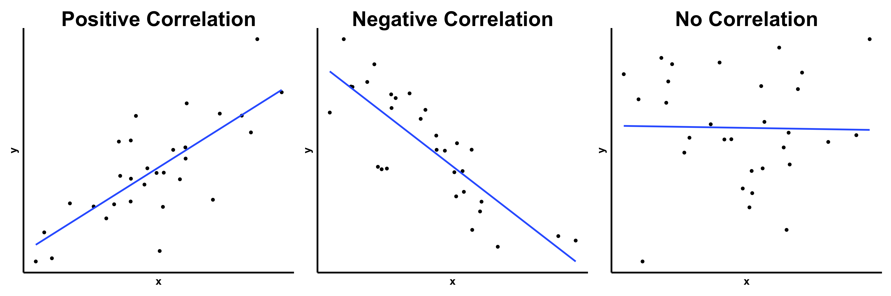
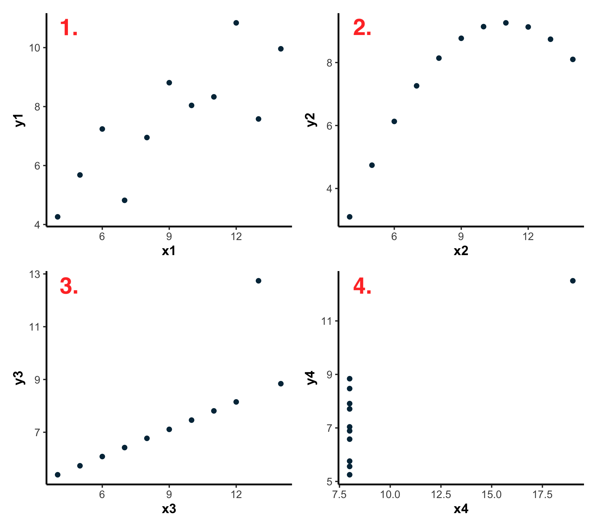
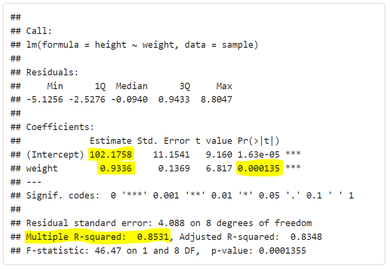
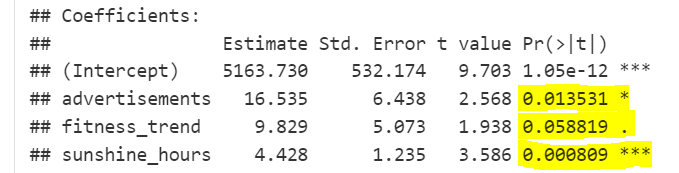
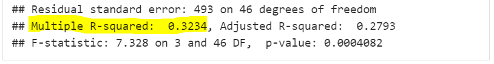
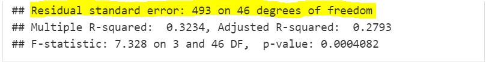

```{r setup, include=FALSE}
# Author: Al Morgan
# Date: Oct 2024
# R Version: 4.4.2

# Learnr Package Documentation: https://rstudio.github.io/learnr/

# Packages
library(learnr)
library(gradethis)
library(dplyr)
library(janitor)
library(stringr)
library(openxlsx)
library(ggplot2)
library(phsstyles)
library(modelr)
library(ggfortify)
library(GGally)

knitr::opts_chunk$set(echo = FALSE)

```

```{r phs-logo, fig.align='right', out.width="40%"}
knitr::include_graphics("images/phs-logo.png")
```

## Introduction

Welcome to an introduction to modelling in R. This course is designed as a self-directed introduction to statistical modelling for anyone in Public Health Scotland.

::: info_box
<h4>Course Info</h4>

<ul>

<li>This course is built to flow through sections and build on previous knowledge. If you're comfortable with a particular section, you can skip it.</li>

<li>Some sections have multiple parts to them. Navigate the course by using the buttons at the bottom of the screen to Continue or go to the Next Topic.</li>

<li>The course will also show progress through sections, a green tick will appear on sections you've completed, and it will remember your place if you decide to close your browser and come back later.</li>

</ul>
:::

</br>

## What is modelling?

Modelling is a broad term, encompassing many methods. In particular, statistical modelling consists of using mathematical equations and algorithms to represent, analyse and make predictions from data.

By using data we already have, we can make estimates about results we don't have. For example, if you sell 100 ice creams on a 20°C day and 300 ice creams on a 30°C day - you could use modelling to predict how many ice creams you would sell on a 25°C day.

This learning material will cover linear models, i.e. modelling relationships that can be expressed as a straight line. Imagine temperature on the x-axis and ice creams sold on the y-axis. A straight line on this plot could give us a prediction of how many ice creams we would sell at any given temperature.

```{r, echo = FALSE, eval = TRUE, warning = FALSE, fig.align='center', fig.alt="A line plot showing temperature (degrees Celcius) on the x-axis and 'number of ice creams sold' on the y-axis. A vertical dashed line at 25 degrees meets a horizontal dashed line at 200 ice creams, indicating the prediction mentioned in the text."}
# created a dataframe with the x and y values
data <- tibble(
  temperature_celsius = c(10, 20, 30),
  n_ice_creams_sold = c(-100, 100, 300)
)

# plot the points and line
data %>%
  ggplot(aes(x = temperature_celsius, y = n_ice_creams_sold)) +
  geom_line(colour = phs_colours("phs-rust"), linewidth = 2) +
  geom_point(size = 3) +
  coord_cartesian(ylim = c(0, NA)) +
  geom_segment(aes(x = 25, xend = 25,   # Vertical dashed line up to y_intercept
                   y = min(n_ice_creams_sold), yend = 200),
               linetype = "dashed", linewidth = 1.5, color = phs_colours("phs-blue")) +
  geom_segment(aes(x = min(temperature_celsius), xend = 25,   # Horizontal dashed line up to x_intercept
                   y = 200, yend = 200),
               linetype = "dashed", linewidth = 1.5, color = "blue") +
  theme_minimal() +
  labs(x = "\nTemperature (\u00B0C)",
       y = "Number of ice creams sold\n")
```

<br>

We will begin by covering **correlations** and **linear algebra** (i.e. relating to lines) before moving on to building actual models, as these topics can aid understanding of linear modelling greatly. If you're familiar with these topics, though, feel free to skip ahead.

More advanced modelling techniques (those that we might call **machine learning**) such as decision trees and neural networks are not covered here.

<br>

## Correlation

Let's start with correlation, a term you may be familiar with. Two numeric variables in our data are correlated when, as one increases in value, the other noticeably increases or decreases in value. We can often spot this by glancing at a scatter plot and seeing a 'direction' to the data points.

```{r echo=FALSE, fig.align='centre', out.width="100%", fig.alt="Three scatterplots are shown: the first showing a positive correlation, the second a negative correlation, and the third no correlation. Lines-of-best-fit are included."}

```

As the image above shows:

-   A *positive correlation* is when the y-variable increases as the x-variable increases.
-   A *negative correlation* is when the y-variable decreases as the x-variable increases.
-   When there is no discernible 'direction' to the data, we describe this as having *no correlation*.

<br>

If we notice that our data is linear (i.e. trends roughly in a line) correlated, we could begin building a model to see if one of our variables is capable of **predicting** the other.

<br>

We can assign a value to the direction and magnitude of the correlation by using the `cor()` function inside a `summarise()` to calculate **Pearson's correlation coefficient (**$r$**)**. 

### How do we interpret correlation coefficients?

$r$ is bound between $-1$ and $1$, with a positive value indicating a positive correlation and a negative value indicating a negative correlation.

As for the magnitude (i.e. size) of $r$, J. D. Evans (1996) suggests the following scale:

| magnitude of $r_{xy}$ | strength of correlation |
|-----------------------|-------------------------|
| 0                     | none                    |
| 0.01 - 0.19           | very weak               |
| 0.20 - 0.39           | weak                    |
| 0.40 - 0.59           | moderate                |
| 0.60 - 0.79           | strong                  |
| 0.80 - 0.99           | very strong             |
| 1                     | perfect                 |


<br>

Let’s calculate the correlation coefficient for the `wt` (weight) and `mpg` (miles-per-gallon) variables in the `mtcars` dataset:

```{r echo=TRUE, eval=TRUE}
mtcars %>%
  summarise(cor(mpg, wt))
```

This value of -0.87 tells us that these variables are strongly negatively correlated. (Note: the order of the variables does not matter when using the `cor()` function)

<br>

A word of warning: you can use `cor()` on any two variables, regardless of what the real trend (if any) may be! The four plots below each have the same correlation coefficient - even though you can see that most of them are not linear trends.

```{r echo=FALSE, fig.align='centre', out.width="100%", fig.alt="The Anscombes quartet of scatterplots is shown. All four are scatterplots with the same correlation coefficient, but only the first one is linear and therefore appropriate to measured using this method."}

```

The lesson here is: always visualise your data first to see if a correlation coefficient is a suitable metric to use! This same logic applies to whether we should build a linear regression model from our data or not, but we will get onto that.

```{r corr-quiz}
quiz(
  question("If we use `cor()` to calculate $r$ for our linear data and get a value of 0.43, how should we interpret this?",
           answer("A moderate positive correlation", correct = TRUE),
           answer("A strong negative correlation"),
           answer("A weak positive correlation"),
           answer("No correlation"),
           incorrect = "Not quite, have another go!",
           allow_retry = TRUE,
           random_answer_order = TRUE
  )
)
```

<br>

#### Correlation is not causation

This often-used phrased simply means that just because two of our variables may be correlated does not automatically mean a change in one *causes* a change in the other.

-   There may be a 'hidden variable' (also known as a confounding variable) that is causing the observed changes to both of our variables of interest. For example, it may appear as though increased ice cream sales and increased sunglasses sales are linked, but temperature (or, e.g. number of sunny days) is the likely hidden variable affecting both.
-   We don't usually know the direction of any effects without rigorous experimentation. For example, does more exercise lead to increased happiness, or do happier people exercise more?

<br>

Accidental correlations, or those with hidden/confounding variables, crop up in all kinds of places and can often be quite entertaining. Follow this [link](https://www.datasciencecentral.com/spurious-correlations-15-examples/) to see some examples of when correlation almost certainly does not mean causation.

<br>

## Lines

Linear models are very useful tools for explaining and predicting our data. For them to be useful, however, it is important to understand the building blocks of a **line**.

The general equation for a line is:

$$
y = a \times x + b
$$

We call $a$ the **gradient** (or slope) and $b$ the **intercept**. With these two values, we can plug in any value of $x$ and calculate the corresponding value of $y$. Note: you may be familiar with the equation $mx + c$, which denotes the same thing.

We call $y$ a function of $x$. For example, a gradient of 2 and an intercept of 1 would give us the following equation (written as an R function):

```{r, echo = TRUE}
line_function <- function(x){
  y <- 2*x + 1
  print(y)
}
```

-   Therefore, an $x$ of 0 would give a $y$ of 1:

```{r, echo = TRUE}
line_function(0)
```

-   An $x$ of 1 would give a $y$ of 3:

```{r, echo = TRUE}
line_function(1)
```

-   An $x$ of 2 would give a $y$ of 5:

```{r, echo = TRUE}
line_function(2)
```

We can look at these as (x,y) coordinates to be plotted:

(0, 1), (1, 3), (2, 5)

Plotting them would look like this:

```{r, echo = TRUE, fig.alt="A plot with the coordinates above plotted and a line joining these."}
# load in the necessary packages
library(dplyr)
library(ggplot2)

# created a dataframe with the x and y values
data <- tibble(
  x_values = c(0, 1, 2),
  y_values = c(1, 3, 5)
)

# plot the points and line
data %>%
  ggplot(aes(x = x_values, y = y_values)) +
  geom_point(size = 2) +
  geom_line(colour = "red") + # plot x,y values
  geom_vline(xintercept = 0) + # add a vertical line at x=0
  geom_hline(yintercept = 0) + # add a horizontal line at y=0
  theme_minimal()
```

This is the line that the equation $y = 2 \times x + 1$ represents! It's linear because each $x$ value plugged into the equation produces a corresponding $y$ value - joining these $x$-$y$ coordinates up gives us the line.

<br>

### Gradient

The gradient of the equation, referred to above as $a$, can be thought of as the answer to the question "How many units of $y$ do we travel if we travel one $x$ unit to the right?

-   A large positive gradient means a steep, upward-sloping line.
  -   e.g. $a = 6$ means +6 units upward along $y$ for every +1 unit rightward along $x$
-   A large negative gradient means a steep, downward-sloping line.
  -   e.g. $a = -6$ means -6 units downward along $y$ for every +1 unit rightward along $x$

<br>

```{r gradient-quiz}
quiz(
  question("Which one of these gradients would produce a line with a shallow descent?",
           answer("$a = -0.5$", correct = TRUE),
           answer("$a = -8$"),
           answer("$a = 5$"),
           answer("$a = 1$"),
           incorrect = "Not quite, have another go!",
           allow_retry = TRUE,
           random_answer_order = TRUE
  )
)
```

<br>

### Intercepts

We've covered the gradient, $a$, so now we will look at the intercept, $b$. This value simply tells us where the line will 'cross' the y-axis. In other words, when $x = 0$, what value is $y$?

Our line from before had an intercept of 1, and you can see from the plot above that the line crosses the y-axis at $y = 1$.

```{r intercept-quiz}
quiz(
  question("From examining the line plot below, what is the intercept?",
           answer("$b = 3$", correct = TRUE),
           answer("$b = 0$"),
           answer("$b = -5$"),
           answer("$b = 4$"),
           incorrect = "Not quite, have another go!",
           allow_retry = TRUE,
           random_answer_order = TRUE
  )
)
```

```{r, echo = FALSE, fig.alt="A simple line plot with 3 coordinates."}
# created a dataframe with the x and y values
data <- tibble(
  x_values = c(0, 1, 2),
  y_values = c(3, 7, 11)
)

# plot the points and line
data %>%
  ggplot(aes(x = x_values, y = y_values)) +
  geom_point() +
  geom_line(colour = "red") +
  geom_vline(xintercept = 0) +
  geom_hline(yintercept = 0) +
  theme_minimal()
```

<br>

Try playing around with the **gradient** and **intercept** values of the line function below to see the effects on the line that is subsequently plotted.

```{r line-building, exercise=TRUE, warning=FALSE, message=FALSE}
# Build the function - no need to change anything here for the exercise
line_function <- function(x, gradient, intercept){
  # linear equation
  y <- gradient*x + intercept
  
  # create dataframe of x and y values
  data <- tibble(
    x, y
  )    
  
  # plot line
  plot <- data %>% 
    ggplot(aes(x, y)) +
    geom_point() +
    geom_line(colour = "red") +
    geom_vline(xintercept = 0) +
    geom_hline(yintercept = 0) +
    theme_minimal() +
    lims(x = c(0,10), y = c(0,10)) # restrict axes from 0-10
  
  print(plot)
}


# Change values below:
line_function(x = c(0:10), gradient = 1, intercept = 0)
```

<br>

## The fundamentals of simple linear regression

You may be wondering, why all the algrebra? Well, linear regression is really all about creating an equation for a line that best 'fits' your data. This equation is our **model** which, if good enough, we can use to make further predictions.

<br>

### Fitting a line to your data

Earlier in this course, we saw that the weight (`wt`) and miles-per-gallon (`mpg`) values in the `mtcars` data set were strongly negatively correlated.

```{r, echo = FALSE, warning = FALSE, fig.alt="A scatterplot of the `wt` snd `mpg` variables from the `mtcars` dataset."}
mtcars %>%
  ggplot(aes(x = wt, y = mpg)) +
  geom_point() +
  theme_minimal()
```

If you were to draw a line-of-best-fit that was as close to as many data points as possible, it would look something like this:

```{r, echo = FALSE, warning=FALSE, message=FALSE, fig.alt="The above scatterplot with a line-of-best-fit overlaid."}
mtcars %>%
  ggplot(aes(x = wt, y = mpg)) +
  geom_point() +
  coord_cartesian(ylim = c(0, NA)) +
  geom_smooth(method = "lm", se = FALSE) +
  theme_minimal()
```

This can be achieved with the following code:

```{r mt-cars-plotter, exercise = TRUE, warning=FALSE, message=FALSE}
mtcars %>%
  ggplot(aes(x = wt, y = mpg)) +
  geom_point() +
  coord_cartesian(ylim = c(0, NA)) +
  geom_smooth(method = "lm", se = FALSE) +
  theme_minimal()
```

By telling `geom_smooth()` that we want the `lm` method (i.e. linear model), we can add this best-fitting line to our plot. (Note: `se` stands for [standard error](https://www.statology.org/standard-error-regression/) and setting this to FALSE removes the fairly redundant error bar from the plot)

If we know the equation of this line, we can plug in any `wt` value and calculate the corresponding `mpg` value - thereby producing a prediction from our model. The linear regression model-building process is what created this line, and that's what we're now going to learn.

<br>

### Regression basics

Up until now, we've been examining lines with the form $y = a \times x + b$. In the world of linear regression, however, this equation is represented in the form:

$$
y = b_0 + b_1x
$$

Don't panic, this means exactly the same thing, except the intercept $b_0$ is shown first. The gradient $b_1$ is next to $x$ without spaces to indicate multiplication.

Note: the act of applying a line-of-best-fit to our data points is known as **fitting a model to data**.

<br>

Let's make some sample data that we might want to fit a model to. Our numerical variables will be `height` (cm) and `weight` (kg).

```{r, echo = TRUE, eval = TRUE, fig.alt="A scatterplot showing height and weight values from the created sample."}
# create variables
height <- c(176, 164, 181, 168, 195, 185, 166, 180, 188, 174)
weight <- c(82, 65, 85, 76, 90, 92, 68, 83, 94, 74)

# place them into a dataframe
measurements_sample <- tibble(
  weight,
  height
)

# create a scatter plot
measurements_sample %>%
  ggplot(aes(x = weight, y = height)) +
  geom_point() +
  theme_minimal()
```

We've visualised our data, seen that it looks linear and correlated (we could calculate $r$ if we wanted) - perfect for building a linear regression model!

Our model will use an intercept $(b_0)$, gradient $(b_1)$, and predictor ($x$, here: $weight$) to predict values of $height$ ($y$):

$$
height = b_0 + b_1weight
$$ <br>

### Measuring 'best fit'

This sub-section covers the 'behind the scenes' calculations of building a linear regression model. In practice, we will simply use the `lm()` function (and we will get to that in the next sub-section!), but the concepts are very useful to know.

<br>

So we have our data frame with weight and height values, let's create another line function, and predict height based on weight using this model.

1.  Create a line function

```{r, eval = TRUE, echo = TRUE}
line <- function(x, b0, b1){
  return(b0 + b1*x)
}
```

2.  Let's pick an intercept of 95 and a gradient of 1 and use the line() function to get **fitted heights** for our data

```{r eval = TRUE, echo = TRUE}
measurements_sample <- measurements_sample %>%
  mutate(fit_height = line(weight, b0 = 95, b1 = 1))

measurements_sample
```

(see how we now have actual heights and fitted/predicted heights in our data)

3.  Plot these fitted heights, along with the fitted line, and the sample data we initially created

```{r, message=FALSE, warning=FALSE, eval=TRUE, echo=TRUE, fig.alt="A scatterplot showing height and weight values from the sample as filled circles, fitted values as open circles, and a red line through these fitted values to represent the linear model."}
measurements_sample %>%
  ggplot(aes(x = weight, y = height)) +
  geom_point() +
  geom_point(aes(y = fit_height), shape = 1) +
  geom_abline(slope = 1, intercept = 95, col = "red") +
  geom_segment(aes(xend = weight, yend = fit_height), alpha = 0.5) +
  theme_minimal()
```

On this graph, the solid circles are the sample data, the open circles are the fitted heights, and the fitted line is shown in red.

We also show the **residuals** as vertical line segments.

A **residual** is the difference between an actual outcome value and a fitted outcome value. These are also sometimes called **errors**, but ‘residuals’ is better, as the term ‘error’ gets used everywhere in statistics!

<br>

Task: If we wanted to add a `residual` column to our data, what calculation would we require? Enter the code into the `mutate()` below.

```{r setup-2, include=FALSE}
# need to recreate `sample` here for use in subsequent exercise code block
library(dplyr)
# create variables
height <- c(176, 164, 181, 168, 195, 185, 166, 180, 188, 174)
weight <- c(82, 65, 85, 76, 90, 92, 68, 83, 94, 74 )

# place them into a dataframe
measurements_sample <- tibble(
  weight,
  height
)
# line function
line <- function(x, b0, b1){
  return(b0 + b1*x)
}
# add predicted heights
measurements_sample <- measurements_sample %>%
  mutate(fit_height = line(weight, b0 = 95, b1 = 1))
```


```{r residual-input, exercise=TRUE, exercise.setup = "setup-2"}
measurements_sample <- measurements_sample %>%
  mutate() # enter code here
```

```{r residual-input-check}
grade_this({
  # Use `.result` to access the user's output
  if (!"residual" %in% colnames(.result)) {
    fail("The 'residual' column is missing. Did you use `mutate()`?")
  }
  
  # Check if the 'residual' column is calculated correctly
  if (!all.equal(.result$residual, .result$height - .result$fit_height, check.attributes = FALSE)) {
    fail("The 'residual' column is not calculated correctly - try again.")
  }
  
  # If all checks pass
  pass("Great job! The 'residual' column is correctly calculated.")
})
```

<br>

### Residuals

To calculate the residuals created by our line/model, we would just subtract the fitted/predicted height values from the actual height values in our data (or the reverse is fine).

```{r, echo = TRUE, eval = TRUE}
measurements_sample <- measurements_sample %>%
  mutate(residual = height - fit_height)

measurements_sample
```

When we **fit** the linear model to the data, we vary $b_0$ and $b_1$ to make the residuals **as small as possible**. We don't need to worry about doing this manually, as the `lm()` function will handle this - it's more important to understand the concept!

<br>

Let's calculate the sum of the residuals for an overall measure of how our model is fitting:

```{r, echo = TRUE, eval = TRUE}
measurements_sample %>%
  summarise(sum_residuals = sum(residual))
```

<br>

```{r residuals-quiz2}
quiz(
  question("Scroll up and look at the residuals column - can you spot the problem with taking the sum of these?",
           answer("Some values are positive and some are negative.", correct = TRUE),
           answer("Some values are much larger than others."),
           answer("Some values are odd and some are even."),
           incorrect = "Not quite, have another go!",
           allow_retry = TRUE,
           random_answer_order = TRUE
  )
)
```

<br>

### Sum of squares

If we simply summed the residuals, the positive and negative values would **cancel out**. For this reason, we tend to **square the residuals** before we sum them. This ensures no cancellation!

```{r, echo = TRUE, eval = TRUE}
measurements_sample <- measurements_sample %>%
  mutate(sq_residual = residual^2)

measurements_sample
```

```{r, echo = TRUE, eval = TRUE}
measurements_sample %>%
  summarise(sum_sq_residuals = sum(sq_residual))
```

Our fitting algorithms try to **minimise** this sum of squares, so the method is called **least squares**.

<br>

## Building a simple linear regression model using `lm()`

Hopefully you're now familiar with way in which the fitting algorithm used by R is seeking to **minimise the sum of squared residuals**.

At last, here is how we fit a simple linear regression model in R:

```{r, echo = TRUE, eval = TRUE}
model <- lm(formula = height ~ weight, data = measurements_sample)
```

Our **outcome variable**, height, goes *before* the tilde (\~) and our **predictor variable**, weight, goes *after* the tilde.

```{r, echo = TRUE, eval = TRUE}
model
```

Taking a look at the `model` object, we see that it initially echos the fit formula. It then provides us with the intercept ($b_0$) and gradient ($b_1$) values that it has calculated as giving the **smallest** sum of squared residuals!

With this information, we could write out our model as such:

$$
height = 102.1758 + 0.9336 × weight
$$

<br>

### The `{modelr}` package

Base R provides some fiddly functions for dealing with our model, but the `{modelr}` package offers functions that allow us to deal with our `lm()` output in a `tidyverse` way.

```{r, echo = TRUE, eval = FALSE}
install.packages("modelr")
library(modelr)
```

For example, we can add predicted values and residuals using the `add_predictions()` and `add_residuals()` functions (first we remove our earlier columns, leaving just `height` and `weight`):

```{r, echo = TRUE, eval = TRUE}
measurements_sample <- measurements_sample %>%
  select(-c(fit_height, residual, sq_residual)) %>%
  add_predictions(model, var = "predicted_height") %>% # adds the fitted values
  add_residuals(model) #  adds the residuals

measurements_sample
```

We can then use the predicted outcomes to plot the best fit line:

```{r, echo = TRUE, eval = TRUE, fig.alt= "A scatterplot showing weight and height from the vample, with the linear model overlaid."}
measurements_sample %>%
  ggplot(aes(x = weight)) +
  geom_point(aes(y = height)) +
  geom_line(aes(y = predicted_height), col = "red") +
  theme_minimal()
```

Note that we could also use `geom_smooth()` or `geom_abline()` to plot this line. However, the method above using the `add_predictions()` values is much more general and can be used when we move onto multiple regression.

We can also use `add_predictions()` to get predicted outcome values for unseen data, or to generate outcome values for a sequence of data points. e.g. to get predicted `height` values for a `weight` in the range from 50 to 120kg, we could do:

```{r, echo = TRUE, eval = TRUE}
# create a one-column data frame of weight values
weights_predict <- tibble(
  weight = 50:120
)
# use our model to predict corresponding height values
weights_predict %>%
  add_predictions(model, var = "predicted_height")
```

<br>

### Interpreting the slope

$$
height = 102.1758 + 0.9336 × weight
$$

The gradient $b_1$ (or we could refer to it as $b_{weight}$ as it affects the $weight$ variable) is often called the **regression coefficient**. This term appears a lot in linear regression and it sounds scarier than it is.

The regression coefficient here links the outcome and predictor variables in the following way:

::: {style="text-align: center;"}
**A 1kg increase in weight changes the predicted height by 0.9336cm**
:::

<br>

## Model diagnostics: part 1

So we've built a model that helps us explain our data and predict unseen values. But is it a good model? And what do we mean by a model being 'good'?

In this section, we'll cover how to examine the output from our `lm()` model and see if it's a good fit for our data (and a good prediction tool!).

<br>

### Using `summary()`

The base R function, `summary()`, provides an overview of the inner workings of the model:

```{r, echo = TRUE, eval = TRUE}
summary(model)
```


1. **Call:** the model formula, with outcome variable \~ predictor variable.

2. **Residuals:** the minimum, medium, maximum and quartile values of the residuals. We don't need to worry about these too much.

3. **Coefficients:**

- The `Estimate` column shows us the intercept and the coefficient (gradient) for the `weight` variable, i.e. $b_0$ and $b_1$.

- The `Std. Error` and `t value` columns, which we don't need to worry about for our purposes.

- The `Pr(>|t|)` column shows us the $p$-values for the intercept and coefficient. If you're unfamiliar with this term, we will cover them shortly don't worry. For now: if $p$ is very small, we consider this feature of the model to have a significant effect on the outcome variable.

4. **Signif. codes:** standard $p$ significance thresholds and their associated symbols, e.g. a $p$ < 0.001 is denoted with "***".

5. **Residual standard error:** is a value we can think about as being the ‘average error’ in the model’s estimated response variable values - i.e. by how far on average do our fitted values differ from the actual values? Therefore, small is better. Handily, it is measured in the same units as our outcome variable.

6. **Multiple r-squared:** the proportion of the variation in the outcome variable that can be **explained** by variation in the predictor variable (or variables plural for multiple regression). The closer to 1 this is the 'better' the model. 

- *Adjusted* r-squared includes a penalty based on the number of predictor variables and the the size of our sample to prevent overestimating of explained variance. Feel free to do some more research on this.

- Just make sure to correctly state the R-squared value you're reporting to keep things clear. 

7. **F-statistic:** tests whether there is a meaningful relationship between the outcome variable and predictor variable(s). A high value is better, as is a low $p$ associated with the statistic. This is another value we don't need to worry about too much.

```{r echo=FALSE, fig.align='centre', out.width="100%", fig.alt="A screenshot of the `summary()` function output, highlighting the intercept, coefficient, p-value of this coefficient, and the R-squared value."}

```

The highlighted components of the model summary above are the main ones to be aware of for now. We can quickly see our coefficient and whether it is considered statistically significant, as well as r-squared at the bottom.

Remember that R-squared is:

::: {style="text-align: center;"}
*The proportion of the variation in the outcome variable that can be* **explained** *by variation in the predictor variable (or variables plural for multiple regression).*
:::

So, in the case above, we have an r-squared of 0.853. This tells us that 85.3% of the variation in `height` in the sample data can be explained by variation in `weight`.

(Note that 'explained' does not equal 'caused by'!)

The higher this value, the better the line fits the data (and the more useful our model is at predicting).

<br>

### Coefficients and p-values

We looked at the $p$-value related to our `weight` coefficient earlier: 0.000135. As this is so small, i.e. lower than 0.001, R assigned it '\*\*\*'.

Without getting too complex, this $p$-value is the product of a hypothesis test of the coefficient. This tests whether the coefficient is **significantly different** from zero. A low $p$-value indicates a very low probability that the coefficient is zero, and therefore changes in the predictor variable are very likely to affect our outcome variable.

We typically set a $p$-value threshold of \<0.05 or \<0.01 for coefficient significance, but these are fairly arbitrary.

<br>

#### When to trust p-values

As much as we may want to trust our $p$-value and run off to tell the world that, based on our sampled data and the model we created, weight is a statistically-significant predictor of height, it's important that we check that the **residuals of our model fulfill certain conditions**. This is what we will cover now.

<br>

## Model diagnostics: part 2

We need to check that our residuals:

- are independent of each other
- are normally distributed
- show no systematic increase or decrease in variation across the range of data


This might sound technical and intimidating, but it's really not that bad. Spending a few minutes learning how to read diagnostic plots will make you a much better model builder and interpreter!

<br>

We will need to install the `{ggfortify}` package so we can use the `autoplot()` function on our model to quickly view all the residuals-based plots we're interested in.

```{r, eval = FALSE, echo = TRUE}
install.packages("ggfortify")
library(ggfortify)
```

```{r, eval = TRUE, echo = TRUE, fig.alt="The output of using the `autoplot()` function on our model is shown. These are four scatterplots representing different diagnostic elements of the model."}
autoplot(model)
```

This produces **four** diagnostic plots - we're concerned with the first three.

<br>

#### **1. Residuals vs Fitted: are the residuals independent of each other?**

We know both of these terms from earlier: the **fitted** values are the y values predicted by our model, and the **residuals** are the differences between these and the actual y values from our data sample.

```{r, eval = TRUE, echo = FALSE, fig.width= 10, fig.alt="The first of the diagnostic plots: 'Residuals vs Fitted values'."}
a <- autoplot(model)

a[1]
```

This plot tests the **independence** of residuals - we want to see them randomly scattered around 0 as opposed to e.g. increasing in size as the size of our fitted values increase. The blue line can help us - as long as it hovers somewhat close to 0 it's fine.

This is acceptable in our case, with so few data points.

#### **2. Normal Q-Q: are the residuals normally distributed?**

This **quantile-quantile** plot tests the **normality** of the residuals. For context: a normal variable is a numeric variable that, if we plotted it on a histogram, is distributed evenly around 0 in a bell shape.

```{r, eval = TRUE, echo = FALSE, fig.width= 10, fig.alt="The second of the diagnostic plots: 'Normal Q-Q plot'."}
a[2]
```

Here, we just want to see the data points lie close to the dashed line. If so, our residuals are well-described as normally-distributed. It's normal to see a some outliers at the extreme ends.

This looks fine here.

#### **3. Scale-Location: do the residuals show no systematic increase or decrease in variation across the range of data?**

This plot tests the **constancy of variation** of the residuals. This diagnostic plot has fitted values on the x-axis, like with plot 1, and the standardised, square-rooted residuals on the y-axis.

```{r, eval = TRUE, echo = FALSE, fig.width= 10, fig.alt="The third of the diagnostic plots: 'Scale-Location plot'."}
a[3]
```

We don't have a great many data points here, but what we're looking for is a 'scattershot' distribution of data points. With more points, we can view the data as a 'band' from left to right, and we don't want to see the band widening or narrowing. The blue line can help us: we want it to stay close to a constant value (or wobble around a constant value if we have little data).

This looks fine in our case.

Feel free to learn about the fourth plot, Residuals vs Leverage, in your own time but we don't need to worry about it here.

<br>

### Summary

What have we done here?

1. We checked our data and saw the two numeric variables, `height` and `weight`, show a linear relationship and are correlated.

2. Based on this, we built a linear regression model using `lm()`.

3. We used `summary()` to examine the $p$-value of the model's weight coefficient and the r-squared value. Both indicated a useful model with predictive power.

4. We used `autoplot()` to check out the diagnostic plots of the model to make sure it met the necessary assumptions.

5. These checks passed, meaning we can have confidence in using our model.

Have a look and click 'Run Code' below to see the output. Then, change the code to get R to print "Hello \<your name\>".


Task: when creating our model object using `lm()`, how do we structure the function call? Try on the dataset below.

```{r lm-input, exercise=TRUE}
# create a dataframe that you will use to build a model
fake_data <- tibble(
  predictor_variable = c(0:10),
  outcome_variable = c(20:30)
)
# create the regression model using the `lm()` function
model <- lm(formula = , data = ) # enter code here
```

```{r lm-input-check}
grade_this({  
  # Check if the user's code produced an `lm` object
  fail_if(
    !inherits(.result, "lm"),
    "Your code did not produce a linear model. Did you use the `lm()` function?"
  )
  
  # Verify the formula used in the mode
  model_formula <- formula(.result)
  correct_formula <- outcome_variable ~ predictor_variable
  fail_if(
    # !identical(model_formula, correct_formula),
    !isTRUE(all.equal(model_formula, correct_formula)),
    "The formula in your `lm()` is incorrect."
  )
  
  # Verify the data used in the model
  fail_if(
    !identical(.result$call$data, quote(fake_data)),
    "The `data` argument in the `lm()` function is incorrect. Did you use `fake_data`?"
  )
  
  # If all checks pass
  pass("Great job! Your model is correctly specified.")
})
```

```{r lm-quiz}
quiz(
  question("What does r-squared tell us about our model?",
           answer("The proportion of variance in the outcome variable explained by the predictor variable.", correct = TRUE),
           answer("The probability that, if we ran this on a new sample, our coefficient would be 0."),
           answer("The intercept multiplied by the coefficient."),
           incorrect = "Not quite, have another go!",
           allow_retry = TRUE,
           random_answer_order = TRUE
  )
)
```

<br>

### What if the checks fail?

If the assumptions about the residuals required to use a linear regression model don't hold up (i.e. the diagnostic plots look iffy), then there are several alternative models you could use.

These include [decision trees](https://medium.com/@MrBam44/decision-trees-91f61a42c724) and [generalised linear models (GLMs)](https://towardsdatascience.com/generalized-linear-models-9ec4dfe3dc3f), although these aren't covered here.

<br>

## Multiple linear regression: model building

You now have the tools and knowledge needed to effectively to build a **simple linear regression model**, i.e. a model that simply has one predictor variable. However, we often will have several predictors to insert into our models...

This is where **multiple linear regression** comes in.

### Gathering our data

Let's create a data frame to practice multiple regression on. We wouldn't normally do this but for our purposes in this course this is fine. You don't need to understand all the code below, it's just creating fictional data based on smoothie sales and several variables we will use as predictors.

```{r, echo = TRUE, eval = TRUE}
# Set seed for reproducibility
set.seed(123)

# Number of observations
n <- 50

# Generate fun independent variables
advertisements <- sample(10:50, n, replace = TRUE)  # Random number of smoothie ads each month
fitness_trend <- sample(50:100, n, replace = TRUE)  # Monthly fitness trend score out of 100
sunshine_hours <- sample(100:300, n, replace = TRUE)  # Monthly sunshine hours

# Generate dependent variable (smoothie sales) with a relationship to the independent variables
smoothie_sales_gbp <- 5000 + 15 * advertisements + 10 * fitness_trend + 5 * sunshine_hours + rnorm(n, mean = 0, sd = 500)

# Create a data frame
smoothie_data <- tibble(smoothie_sales_gbp, advertisements, fitness_trend, sunshine_hours)

# View the first few rows of the dataset
head(smoothie_data)
```

So, with each row representing a month, we have our smoothie sales in £, the  number of smoothie adverts shown, a score representing people's fitness interest, and the number of hours of sunshine.

In reality, you may have to/want to clean the data, create some new variables based on the ones you have (known as **feature engineering**), and remove variables that are intrinsically linked to other variables so as to avoid what we call **multicollinearity** in our model. 

The problem with multicollinearity of our predictor variables is that *"it becomes difficult for the model to estimate the relationship between each [predictor] variable and the [outcome] variable independently because the [predictor] variables tend to change in unison".* ([source](https://statisticsbyjim.com/regression/multicollinearity-in-regression-analysis/))

We won't cover these topics in any more detail here, though.

<br>

### Using `ggpairs()`

Before we start trying to build a model, let's see if we can spot any correlations. Whereas before we used the `cor()` function and examined a single scatter plot, with numerous variables we can use the `ggpairs()` function from the `{GGally}` package to see this information for all variable combinations in one go.

```{r, eval = FALSE, echo = TRUE}
install.packages("GGally")
library("GGally")
```

Simply insert the data frame object into the function:

```{r, eval = TRUE, echo = TRUE, fig.alt="The output of the `ggpairs()` function on the data. This is a collection of scatterplots, correlation coefficients and variable distributions."}
ggpairs(smoothie_data)
```

Don't panic. This may look like a horrendous mega-plot but if we take it part by part it is a lot easier to digest. Notice that each column and row is a variable in our data.

<ul>

<li>Several panels show the **correlation coefficient** we discussed earlier. This gives us a simple way of assessing the correlation of each combination of variables.</li>

<li>The scatter plos produced by all combinations of variables are also shown. Due to the repeated combinations shown in the plot, these scatter plots correspond to their associated correlation values on the other half of the whole plot.</li>

<li>The top-left to bottom-right diagonal is comprised of matching variable combinations (e.g. `smoothie_sales` vs `smoothie_sales`). In these cases, the distribution of the variable is shown. You can think of these as histograms represented by curves.</li>

</ul>

As `smoothie_sales` is our outcome variable of interest, examining the top row and/or left column is of most interest for us here. It seems as though all three predictors are somewhat correlated with `smoothie_sales` and will make good candidates as predictors in our model.

Luckily there is also very little correlation between our predictors so we don't have to worry about multicollinearity.

<br>

### Building our model

Like with our simple linear regression model, we can use `lm()` to build a multiple linear regression model - only this time we add in our multiple predictors, separated by `+`.

Note: all of our potential predictor variables are feasibly related to `smoothie_sales_gpb` here - so we're justified in adding them to our model. In your own modelling, try not to add strange assortments of variables that you'd struggle to explain (even if it makes your model more accurate).

```{r, eval = TRUE, echo = TRUE}
smoothie_model <- lm(formula = smoothie_sales_gbp ~ advertisements + fitness_trend + sunshine_hours, data = smoothie_data)
```

Note that the + in this formula doesn't mean 'add the two variables together' here. Instead, it means e.g. '*add predictor `fitness_trend` into the model with its own coefficient*'.

We can begin by examining the model with `summary()` (although it doesn't matter if we look at this or the diagnostic plots first).

```{r, eval = TRUE, echo = TRUE}
summary(smoothie_model)
```

Let's dig into this summary output now...

### What does the model look like as an equation?

If we wanted to write out the regression model we can use the intercept and coefficients (`Estimates`) from this summary to do so. Whereas before we only had $b_0$ and $b_1$, now we have $b_2$ and $b_3$:

$$
smoothie\_sales\_gbp = b_0 + b_1advertisements + b_2fitness\_trend + b_3sunshine\_hours
$$ Becomes...

$$
smoothie\_sales\_gbp = 5163.730 + (16.535 \times advertisements) + (9.829 \times fitness\_trend) + (4.428 \times sunshine\_hours)
$$

We can interpret this in the following way:

::: {style="text-align: center;"}
*With all other predictor variables held constant, a +1 increase in advertisements increases monthly smoothie sales by £16.535*

The same can be said for each of the predictors, just replacing the coefficient each time.
:::

We can no longer plot this as a 2D line without examining the predictors one at a time but the logic still stands: you can plug in values for all three predictors (or $x$s) and get a value for `smoothie_sales_gbp` (or $y$).

<br>

## Multiple linear regression: model evaluation

As with our simple linear model, there are several metrics we can use to evaluate how useful our multiple linear model is.

### p-values of the coefficients

```{r echo=FALSE, fig.align='centre', out.width="60%", fig.alt="Part of the `summary()` output of the model, with the p-values of the predictor coefficients highlighted."}

```

The output from `summary()` also shows us the $p$-values (in the rightmost column) are all small. We can ignore the intercept's $p$-value in most cases as this isn't very informative, but the others tell us that our chosen predictors are all significant (or close to).

-   the `advertisements` coefficient is \<0.05 and so is assigned a single `*`
-   the `fitness_trend` coefficient is \<0.1 and so is assigned a `.` (which many would see as not small enough)
-   the `sunshine_hours` coefficient is \<0.001 so is assigned `***`

<br>

### R-squared

```{r echo=FALSE, fig.align='centre', out.width="70%",  fig.alt="Part of the `summary()` output of the model, with the r-squared value of the model highlighted."}

```

The model's (multiple) r-squared is 0.3234, i.e. **32.34% of the variance in smoothie_sales is explained by the variance in the three predictors**. This isn't a huge amount, admittedly, but even a value as low as 32% can be useful when it comes real world data.

If we were a sales/marketing team, *knowing that these three predictors affect sales to this extent could encourage us to spend more on what is working or try to find new predictor variables to add to our model to try to increase this %*.

<br>

### Residual standard error

```{r echo=FALSE, fig.align='centre', out.width="70%", fig.alt="Part of the `summary()` output of the model, with the residual standard error (RSE) of the model highlighted."}

```

We touched on this briefly earlier: residual standard error (RSE), shown just above R-squared in our model summary, is also a useful metric of model 'goodness-of-fit'. It is a value representing the average amount by which our fitted values differ from our actual values.

Here, our RSE is £493, which isn't all that bad considering our smoothie sales are in the £6000-8000 range.

<br>

### Diagnostic plots

Now if we run `autoplot()` on the model we can check that it meets the necessary assumptions for a linear regression model.

```{r, eval = TRUE, echo = TRUE, fig.alt="The output of the `autoplot()` function on the model, showing four diagnostic plots."}
autoplot(smoothie_model)
```

How does it do?

<ol>

<li>The **Residuals vs Fitted plot** shows a random distribution of points around zero - so this looks fine, our residuals are independent ✓</li>

<li>The **Normal Q-Q plot** shows a nice, mostly-straight line of points along the dashed line - so we can rest easy knowing our residuals are normally distributed ✓</li>

<li>The **Scale-Location plot** shows a scattershot pattern of data points that neither expands or narrows as we move along the x-axis - so the variation of our residuals looks to remain constant ✓</li>

</ol>

Based on this, we can safely trust and rely on the $p$-values reported in our model summary.

<br>

### Summary

Our model tells us that the number of smoothie advertisements and number of sunshine hours in a month are, given their small $p$-values, **significant predictors** of smoothie sales (£).

The fitness trend score is still worth examining, even if its $p$-value didn't quite meet our arbitrary thresholds of \<0.05 or \<0.01. The argument *for* vs *against* strict $p$-value thresholds rages on in the stats community - so just be mindful of this.

We can use the `{modelr}` functions to view the predicted values our new model produced:

```{r, eval = TRUE, echo = TRUE}
smoothie_data %>% 
  # add predicted smoothie sales column
  add_predictions(smoothie_model, var = "predicted_sales") %>% 
  # add residuals column
  add_residuals(smoothie_model)
```

Or make a prediction based on a specific set of predictor values. Try calculating the predicted smoothie sales in a month with 50 `advertisements`, a `fitness_trend` score of 70, and 60 `sunshine_hours`. Feel free to play around with the values after this!

```{r setup-3, include = FALSE}
# Recreate the data:
## Set seed for reproducibility
set.seed(123)

## Number of observations
n <- 50

## Generate fun independent variables
advertisements <- sample(10:50, n, replace = TRUE)  # Random number of smoothie ads each month
fitness_trend <- sample(50:100, n, replace = TRUE)  # Monthly fitness trend score out of 100
sunshine_hours <- sample(100:300, n, replace = TRUE)  # Monthly sunshine hours

## Generate dependent variable (smoothie sales) with a relationship to the independent variables
smoothie_sales_gbp <- 5000 + 15 * advertisements + 10 * fitness_trend + 5 * sunshine_hours + rnorm(n, mean = 0, sd = 500)

## Create a data frame
smoothie_data <- tibble(smoothie_sales_gbp, advertisements, fitness_trend, sunshine_hours)

# Recreate the model
smoothie_model <- lm(formula = smoothie_sales_gbp ~ advertisements + fitness_trend + sunshine_hours, data = smoothie_data)
```

```{r prediction-input, exercise = TRUE, exercise.setup = "setup-3"}
# create a data frame of predictor values
smoothies_predict <- tibble(
  advertisements = , # enter here
  fitness_trend = , # enter here
  sunshine_hours =  # enter here
)
# use our model to predict corresponding sales value
smoothies_predict %>%
  add_predictions(smoothie_model, var = "predicted_sales")
```

<br>

## Review & Feedback

The world of modelling is vast and we've only covered basic concepts here. There are still [interactions between predictors](https://quantifyinghealth.com/why-and-when-to-include-interactions-in-a-regression-model/), [dealing with non-continuous numeric variables](https://www.statology.org/r-linear-regression-with-categorical-variables/), [degrees of freedom](https://articles.outlier.org/degrees-of-freedom) and so on.

However, the tools you've acquired here are a great start to build your own models! Just research what you need as you go.


#### Helpful links

-   [geeksforgeeks.org page on linear regression](https://www.geeksforgeeks.org/ml-linear-regression/)
-   [ibm.com page on supervised vs unsupervised learning](https://www.ibm.com/think/topics/supervised-vs-unsupervised-learning)

#### Help

-   Vignettes (Help) / `?<function_name>`
-   Google / Stack Overflow (tag queries with "[r]", "[ggplot]")
-   [R User Group Teams](https://teams.microsoft.com/l/team/19%3ae9f55a12b7d94ef49877ff455a07f035%40thread.tacv2/conversations?groupId=ec4250f9-b70a-4f32-9372-a232ccb4f713&tenantId=10efe0bd-a030-4bca-809c-b5e6745e499a) / [Technical Queries](https://teams.microsoft.com/l/channel/19%3a9620ef6cf8234d50a0f95caba65a3edf%40thread.tacv2/Technical%2520Queries?groupId=ec4250f9-b70a-4f32-9372-a232ccb4f713&tenantId=10efe0bd-a030-4bca-809c-b5e6745e499a)
-   [Data Science Team email](mailto:phs.datascience@phs.scot?subject=Linear%20Modelling%20Online%20R%20Training%20-%20Help)

#### Feedback

<iframe width="100%" height="2300" src="https://forms.office.com/Pages/ResponsePage.aspx?id=veDvEDCgykuAnLXmdF5JmibxHi_yzZ9Pvduh8IqoF_5UOVg1T0hCVDkzSUJNU0hYSkxSWUJLUzZEOCQlQCN0PWcu&amp;embed=true" frameborder="0" marginwidth="0" marginheight="0" style="border: none; max-width:100%; max-height:100vh" allowfullscreen webkitallowfullscreen mozallowfullscreen msallowfullscreen>

</iframe>
