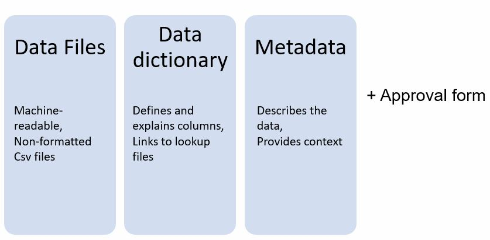

```{r setup, include=FALSE}
library(learnr)
library(gradethis)
library(dplyr)
library(kableExtra)
library(ckanr)
library(remotes)
library(phsopendata)
ckanr_setup(url = "https://www.opendata.nhs.scot/")
knitr::opts_chunk$set(echo = FALSE)
tutorial_options(
  exercise.checker = gradethis::grade_learnr
)
```

```{r phs-logo, echo=FALSE, fig.align='right', out.width="40%"}
knitr::include_graphics("images/phs-logo.png")
```


## Introduction

Welcome to an Introduction to Open Data. This course is designed as a self-led introduction to working with open data for anyone in Public Health Scotland. Throughout this course there will be quizzes to test your knowledge and opportunities to modify and write R code.


<div class="info_box">
<h4>Course Info</h4>
  <ul>
  <li>This course is built to flow through sections and build on previous knowledge. If you're comfortable with a particular section, you can skip it. In particular if you are familiar with open data standards used on the Scottish Health and Social Care Open Data platform, you may wish to skip straight to the section focusing on interacting with open data via API.</li>
  <li>Most sections have multiple parts to them. Navigate the course by using the buttons at the bottom of the screen to Continue or go to the Next Topic.</li>
  <li>The course will also show progress through sections, a green tick will appear on sections you've completed, and it will remember your place if you decide to close your browser and come back later.</li>
  </ul>
  </div>
</br>


### What is Open Data?

Open data is the name for publicly released data which is made __freely available to everyone to use and reuse__ in any way they like. With open data, anyone is able to make use of its potential: improving, innovating, and making better decisions. Open data is:

* Structured data
* Able to be linked with other data 
* Machine readable 
* **Never** patient identifiable and free of personal information

</br>

Since we're getting started, here's a quiz to get familiar with the layout:

```{r intro-quiz}
quiz(
  question("Which of the following is true of open data?",
    answer("It's free", correct = TRUE),
    answer("Anyone can access it", correct = TRUE),
    answer("Data can be re-used", correct = TRUE),
    answer("You need permission to use it", correct = FALSE),
    answer("It's disclosive", message = "Open data is non-personal and non-commercially sensitive, adhering to data protection principles. Disclosure control can be applied as necessary."),
    answer("It's in a structured format", correct = TRUE),
    answer("It can be shared", correct = TRUE),
    incorrect = "Not quite, have another go!",
    allow_retry = TRUE,
    random_answer_order = TRUE
  )
)
```

</br>


### Scottish Health and Social Care Open Data

The [Scottish Health and Social Care Open Data Portal](opendata.nhs.scot) provides a single location for all health and social care organisations in Scotland to release open data. The minimum requirements for open data on this platform are set out in the [Scottish Government Open Data Strategy](https://www.gov.scot/publications/open-data-strategy/). This strategy seeks to create a Scotland where non-personal and non-commercially sensitive data from public services is recognised as a resource for wider societal use and as such is made open in an intelligent manner and available for re-use by others.

Providing a single platform for the Scottish Health and Social Care data makes it much easier for users to explore the rich health and care data landscape that exists in Scotland. Users of open data are from a wide range of backgrounds: from individual citizens, health and care professionals, government and public sector, academic researchers and private businesses. 

The Scottish Health and Social Care open data portal is managed by the Open Data team, based within Public Health Scotland. Data is released on this platform under the [UK Open Government Licence](https://www.nationalarchives.gov.uk/doc/open-government-licence/version/3/).


#### CKAN

The Scottish Health and Social Care open data is hosted on a CKAN data portal. This is an open-source data management system with a fully-documented API (Application Programming Interface) allowing software access to all the data hosted on the site. We'll dive deeper into the CKAN API later in this course.


## Open Data Standards

The 5-star Open Data scheme (developed by Tim Berners-Lee) is a way to measure how well data is integrated and made available for use. The levels are outlined below:

* &#9733; - make your stuff available on the web (whatever format)
* &#9733;&#9733; - make it available as structured data (e.g. excel instead of image scan of a table)
* &#9733;&#9733;&#9733; - non-proprietary format (e.g. csv instead of excel)
* &#9733;&#9733;&#9733;&#9733; - use URIs to identify things, so that people can point at your stuff
* &#9733;&#9733;&#9733;&#9733;&#9733; - link your data to other data to provide context

Public Health Scotland publish 3-star open data. This means the data is in a structured, non-proprietary format (i.e. csv files) and can be utilised by a wide range of users ranging from the general public to more technical users like data scientists and app developers.


### Components of Open Data

Publishing open data doesn't simply translate to dumping your data as is out in the world expecting everyone to understand it and use it in an appropriate way. Including the actual data files themselves, various other components create what we call an 'open dataset':

```{r components, echo=FALSE, fig.align='center', out.width="90%"}

```

* __Data file__ - The data must be a machine-readable CSV file, and formatted according to uniform technical standards.
* __Metadata__ - Metadata describes characteristics and attributes of the data (eg who, what, where, why, how). It contextualises the data and explains what it represents. Providing accurate and comprehensive metadata alongside open data files is crucial to giving users a comprehensive understanding of the dataset enabling them to make the best use of your data file. It also makes finding content and data faster and easier. Metadata facilitates data discovery and linkage across relevant and different data sources. 
* __Data dictionary__ - The Data Dictionary defines and explains the columns that make up each dataset. A data dictionary template is automatically generated on the platform after uploading a dataset. A consistent, standardised vocabulary helps the end-user to fully understand the information contained within the dataset.
* __Supplementary documents__ - This could include a report specific to the data, explanatory documentation, a description of research benefits, survey findings, or information on data collection tools.

Before making a dataset available, the Open Data team at Public Health Scotland also requires a completed approval form, signed by all required parties. It is important for the data provider to demonstrate that their data has been approved for public release and to confirm compliance with data protection and confidentiality.


```{r components-quiz}
quiz(
  question("What components make up an open dataset?",
    answer("Data file", correct = TRUE),
    answer("Metadata", correct = TRUE),
    answer("Data dictionary", correct = TRUE),
    answer("Supplementary documentation", correct = TRUE),
    answer("All related PHS publications", correct = FALSE),
    answer("The PHS Information Request charging policy", correct = FALSE),
    incorrect = "Not quite, have another go!",
    allow_retry = TRUE,
    random_answer_order = TRUE
  ),
  question("Why is it crucial to include accurate metadata along with open data files?",
    answer("It helps prevent misinterpretation of the data", correct = TRUE),
    answer("It looks more professional"),
    answer("It contextualizes the data and helps users understand what it represents", correct = TRUE),
    answer("It makes finding data easier", correct = TRUE),
    answer("Your manager is making you do it"),
    incorrect = "Not quite, try again!",
    allow_retry = TRUE,
    random_answer_order = TRUE
  )
)
```


### File format and structure

Requirements:

* __CSV__ - Files should be produced in CSV format.
* __No formatting__ - Files should not be specially formatted before creating a CSV as this can lead to errors in the file structure. Style elements cannot be stored in CSV files. Avoid drop down lists and filters.
* __No merged cells__ - You must not include merged cells in your file. They cannot be reproduced in a CSV. Each column needs to have a unique header, contained in the top row, defining the data. 
* __No multiple items in cells__ - A cell may contain only one item of information; multiple lines within a cell will cause the import process to fail. Cells that contain collections of data are impossible to evaluate and could cause problems for end-users of your data.
* __No multi-row headers__ - Data should only contain one header row. Multi-row headers are not acceptable.
* __No blank rows/columns__ - Care must be taken to ensure that any blank rows/columns have been removed prior to creating your CSV files. Empty rows and empty columns among the data will not be accepted. Empty rows adversely impact sorting and analysis, and empty columns adversely impact initial import and refresh.  An easy way to check any blank rows or cells is opening your csv file in a text editor such as Notepad, and looking for a column of commas or a row of commas at the end of the document, indicating the presence of blank rows/columns.

Individual files should be kept compact by avoiding duplication which will reduce the time needed to download the data. One way of doing this is to exclude information that is already provided on the platform in the reference files such as geographies, hospitals and specialities. 

Datasets containing multiple independent categories should be split by those categories, for example ‘by age’, ‘by deprivation’, ‘by council area’. This helps to avoid accidental double-counting and allows better understanding of the data.


### Orientation

Vertical orientation should be used wherever possible. Vertical datasets are more easily understood, sortable, as well as more useful for creating visualisations, and improve consistency between the datasets. Datasets with a horizontal data orientation should be restructured to vertical. 

This specifically applies to datasets containing data by year, especially numerous years. Years should have their own rows, rather than columns, in the data. Presentation, consumption, ease of use, and refresh of the data become much more difficult as data files get wider with numerous columns. 

```{r, echo=FALSE}
wide_table <- data.frame(
  "Country" = rep("S92000003", 3),
  "Sex" = c("Male", "Female", "All"),
  "Coverage2018" = c(85, 86, 86),
  "Coverage2019" = c(87, 88, 87),
  "Coverage2020" = c(89, 83, 85),
  "Coverage2021" = c(86, 90, 88),
  check.names = FALSE
)
kableExtra::kbl(wide_table) %>%
  kable_paper(full_width = FALSE)
```

Horizontal orientation restricts the users ability to create visualisations and makes it difficult to perform analytics and observe time-based trends in a single view. Vertical data orientation not only makes the data machine-readable, but also human readable.

Vertical orientation provides maximum flexibility for reuse and application. Data can be sorted by year or to create visualisations with the data rolled up by year. The benefit of this more vertical orientation is that any grouping of variables is possibly facilitating complex analyses of the data. A user can use any number of third party business intelligence and data analysis visualisation tools to create pivot tables or graphs to identify patterns and trends over time.

```{r, echo=FALSE}
long_table <- data.frame(
  "Country" = rep("S92000003", 12),
  "Year" = c(2018, 2019, 2020, 2021),
  "Sex" = c(rep("Male", 4), rep("Female", 4), rep("All", 4)),
  "Coverage" = c(85, 87, 89, 86, 86, 88, 83, 90, 86, 87, 85, 88),
  check.names = FALSE
)
kableExtra::kbl(long_table) %>%
  kable_paper(full_width = FALSE)
```


###	Column header names

Column headers should fulfil the following requirements:

*	Meaningful, distinct, clear names in plain English.
*	48 characters or less in length (shortening should not result in misinterpretation).
* Avoid abbreviations or cryptic names, unless widely recognised, such as NHS (National Health Service). All abbreviations and acronyms have to be fully explained in the data dictionary.
*	Camel case – we use a version of camel case where the compound words or phrases such that each word or abbreviation begins with a capital letter, with no intervening spaces or punctuation, e.g. "CamelCase".
*	No spaces, underscores or hyphens.
*	Do not use special characters such as `%` or `+`. You may write the full word ‘Percentage’ or use common abbreviations such as ‘Pc’. If the special character is part of a construct, such as ‘50+’ or ‘5%’ it should be considered as one phrase and therefore translate to ‘50plus’ and ‘5pc’.  


###	Variable types

A variable/column can only contain one data type. CKAN recognises data types as numeric or string upon upload to the platform. A column should never consist of a mixture of numeric cells with text cells. This means special characters cannot be used in numeric data columns (no asterisks (`*`), no `NA`s). If a dataset contains missing and/or suppressed values these should be displayed as an empty cell and coded in a separate ‘Qualifier column’ - more on using statistical qualifiers later. 

Numeric values should always be plain numbers such as 12 or 1400.35. Do not use commas in values to increase readability for humans. As commas are used to separate columns in a CSV file values with a comma are exported as text field.


###	Coding conventions

Open data should always make use of standard codes and their descriptions. This is good practice for open data as it ensures consistent labelling across all data on a platform or from an organisation, as well as makes the data files more compact and can reduce the number of columns presented. A data file should never contain both codes and labels. Instead, the data dictionary needs to include the link to existing resource/look-up file that explains the labels of the code. 

Any codes used in open data need to be available for look-up in a reference file on the platform. All look-ups can be found within the [Reference Files grouping](https://www.opendata.nhs.scot/group/reference-files) on the platform.

The most commonly used codes in Scottish Health and Social Care open data are:

* __geography codes__ - Standard codes consist of a nine digit alpha-numeric code, and are referred to as GSS codes where the GSS refers to Government Statistical Service. Some additional, non-standard codes are also used by the NHS for reporting on other categories (eg. special health boards, residential categories). These are separate from the GSS codes and are found in the [Non-standard Geography Codes and Labels](https://www.opendata.nhs.scot/dataset/non-standard-geography-codes-and-labels) reference dataset.
* __practice details__ - Various reference files for Dental Practices and General Practices, including address and contact information, practice list sizes and practice population information
* __population__ - Population estimates and projections for all geographies in Scotland, and standardised populations.
* __deprivation__ - Scottish Index of Multiple Deprivation (population weighted)
* __location codes__ - Location codes used alongside geography areas, such as: Hospital locations, A&E sites, Dispenser Locations
* __specialty codes__ - Codes used for health specialties in NHS Scotland


###	Geography codes

The header for health boards and other geography levels needs to encompass:

*	Type of health board indicated, e.g. health board of residence (HBR), health board of treatment (HBT) etc.
* Configuration is specified in the data dictionary and mentions the configuration used:  "health board 2014", "health board 2019", "health board at time of event" (which can be a mixture of both 2019, 2018 and 2014 configurations).
* The corresponding health board names can be found in the reference files.

Various types of Geography should not be listed in a shared column, as this both makes the data more difficult to understand and increases the risk of double counting. Data should be presented as granular as possible with the smallest possible geography being used, considering confidentiality and suppression of small numbers. 

```{r, echo=FALSE}
wrong_geo_table <- data.frame(
  "Geography" = c("S92000003", "S08000015", "S08000016", "S12000005", "S12000006"),
  "NumberOfPatients" = c(90, 50, 40, 30, 60),
  check.names = FALSE
)
kableExtra::kbl(wrong_geo_table) %>%
  kable_paper(full_width = FALSE)
```

Where it makes sense to present the data on multiple levels, this should be done in separate files. The exception to this rule is the Scotland total. However, if this is included, it has to be made clear with the use of the qualifier `d`.

```{r, echo=FALSE}
hb_geo_table <- data.frame(
  "HB" = c("S92000003", "S08000015", "S08000016"),
  "NumberOfPatients" = c(90, 50, 40),
  "NumberOfPatientsQF" = c("d", "", ""),
  check.names = FALSE
)

ca_geo_table <- data.frame(
  "CA" = c("S12000005", "S12000006"),
  "NumberOfPatients" = c(30, 60),
  check.names = FALSE
)

kableExtra::kbl(hb_geo_table) %>%
  kable_paper(full_width = FALSE)

kableExtra::kbl(ca_geo_table) %>%
  kable_paper(full_width = FALSE)
```

An option to include more than one level of geography is to nest them. Nesting means to provide information on which higher geography a lower level belongs to as shown in the example below.

```{r, echo=FALSE}
nested_geo_table <- data.frame(
  "HB" = c("S08000019", "S08000019", "S08000017"),
  "CA" = c("S12000005", "S12000014", "S12000006"),
  "NumberOfPatients" = c(30, 20, 60),
  check.names = FALSE
)

kableExtra::kbl(nested_geo_table) %>%
  kable_paper(full_width = FALSE)
```


### Dates

The way the dates are formatted may depend on the structure of your data. Please keep in mind that open data should be as granular as possible. 

As CKAN only recognises numeric and string data types, not dates, dates should be presented as numeric data where possible. The following date formats can be used noting that a date should not be spread over multiple columns:

| Header        | Format      | Structure   |
| -----------   | ----------- | ----------- | 
| Date          | YYYYMMDD    | This is the preferred format for full dates when the exact date is available.   |   
| Month         | YYYMM       | This should be used if your data is available monthly - eg 201712.      | 
| Year          | YYYY        | This should be used if the data is presented annually - eg 2017     | 
| Quarter       | YYYYQN      | Quarters should be represented in the format 1 ≤ N ≤ 4 – eg 2017Q1.      | 
| FinancialYear | YYYY/YY     | Financial years - eg 2016/17      |

```{r, echo=FALSE}
date_table <- data.frame(
  "Date" = c(20210701:20210710),
  "NumberOfAdmissions" = c(11, 5, 7, 12, 15, 13, 17, 8, 9, 5),
  check.names = FALSE
)

kableExtra::kbl(date_table) %>%
  kable_paper(full_width = FALSE)
```


### Statistical Qualifiers

Blank fields, when left unexplained, risk confusion – particularly when the column is numeric:

* If the blank field represents zero, then the field should be zero.
* If the blank field represents ‘not collected’ or ‘unknown’, then this should be a blank field and explained in a separate qualifier column, adjacent to the data column this is referring to.

Equally important is consistency:

* If data is numeric, it should not also be presented as text within the same column. Blank fields should therefore not contain space: " ".
* Fields containing "NA", "-" or "unknown" should not be mixed within a numeric column as this will make sorting and analysis more difficult. 

Our advice is to follow the guidance of the Office for National Statistics on symbols in tables. This suggests the use of an extra column next to the data column the qualifier refers to. The column should have the identical name of the column it is referring to with the suffix QF (i.e. `NumberOfPatients` – `NumberOfPatientsQF` or `NewHires` - `NewHiresQF`). 

```{r, echo=FALSE}
qualifier_table <- data.frame(
  "CA" = c("S12000005", "S12000006", "S12000008", "S12000010"),
  "Year" = rep(2019, 4),
  "NumberOfCases" = c(13, "", 0, ""),
  "NumberOfCasesQF" = c("", "c", "", ":"),
  check.names = FALSE
)

kableExtra::kbl(qualifier_table) %>%
  kable_paper(full_width = FALSE)
```

A full list of qualifiers can be found on https://www.opendata.nhs.scot/dataset/statistical-qualifiers, some of the most important qualifiers are shown here.

| Symbol	          |  Guidance                       |
| ----------------- | ------------------------------- |
|c – confidential   |	The small letter ‘c’ should be used for suppressed data. |
|: – not available	| A colon is used for data that is not available. |
|z – not applicable |	The small ‘z’ indicates data that is not applicable.|
|r – revised	| The figure stated has been revised since it was first published. |
|d – derived |	A figure is derived for custom groupings and for totals; this includes totals for Geographies (ie Scotland when data is otherwise presented at council area level) and specialities (ie all cancers, all alcohol conditions) to prevent double counting. |


### Calculated fields

These data fields should be expanded to include each data component, especially when the creation of visualisations will rely upon this data. For example, if two figures were added together to create a summary value, you should include three columns: 

1. for the first added value, 
2. for the second added value, 
3. and a the sum of the two added values.

```{r, echo=FALSE}
calculated_table <- data.frame(
  "Country" = rep("S92000003", 4),
  "Year" = rep(2020, 4),
  "AgeGroup" = c("18 - 29", "30 - 39", "40 - 49", "50plus"),
  "Population" = c(350000, 190000, 180000, 560000),
  "NumberVaccinated" = c(3567, 189543, 178990, 545770),
  "PercentCoverage" = c(0.01, 0.99, 0.99, 0.97),
  check.names = FALSE
)

kableExtra::kbl(calculated_table) %>%
  kable_paper(full_width = FALSE)
```


### Disclosure Control

The Open Data team expect you to follow all necessary disclosure control protocols that are available within your organisation, this includes the suppression of small numbers. If you require help with disclosure control please get in touch with the [Statistical Governance Team](mailto::phs.statsgov@phs.scot) .
It is necessary that disclosure controls are applied to your data before this leaves your department and is sent to us.


### Data dictionary 

The data dictionary is an essential part of any open data dataset. It helps the users of your data to understand what it represents by giving a clear explanation for each of the column headers (variables) used. An empty data dictionary is created automatically after a resource is uploaded to the Scottish Health and Social Care Open Data Portal.

The following fields are created in the data dictionary:

* __Column__ - The column headers (variables) you have used in your dataset are automatically populated in the data dictionary.
* __Type__ - The variable type of the column (numeric or text). This is populated automatically on upload.
* __Description__ - A definition for each of the variables used in the data set. Where applicable, the description needs to contain all details on potentially used abbreviations and scales/rankings. 
* __Lookup__ - If a column contains codes, this field needs to be populated with the URL of the reference/look-up file. If the column does not contain codes this field can remain empty.


### Metadata

Metadata is an important feature of each dataset. Through metadata, users are given background information on the dataset which helps them to better understand and interpret the data increasing the use and re-use of the data. The following table gives an overview on the fields that are embedded on the platform. If you feel that a field is not applicable, you will need to add an explanation why this is the case.

```{r, echo=FALSE}
metadata_table <- data.frame(
  "Field" = c("**Title**", 
                "**Contact address**", 
                "**Subject**", 
                "**Frequency**", 
                "**Time frame of data and timeliness**", 
                "**Coverage**",
                "**Completeness**",
                "**Accuracy**", 
                "**Continuity of data**", 
                "**Concepts and definitions**", 
                "**Disclosure**",
                "**Revision statement**",
                "**Official statistics designation**",
                "**Relevance and key uses of the statistics**", 
                "**Format**", 
                "**Language**",
                "**Links**",
                "**Description**", 
                "**Tags**", 
                "**License**",
                "**Theme**",
                "**Source**", 
                "**Version**", 
                "**Author**",
                "**Author email**",
                "**Maintainer**",
                "**Maintainer email**"),
  "Description" = c("Short, descriptive and unique title for the dataset.",
                    "Postal address of the dataset author.", 
                    "Narrowing down from the theme eg Alcohol Misuse or Pharmacy services.", 
                    "Frequency of the release ie annually, quarterly, monthly, weekly or ad hoc.", 
                    "Provide information on timing between the data extraction and publication eg four months in arrears.", 
                    "Spatial and/or temporal coverage of the data.", 
                    "Explain any limitations or changes to data or data sources that may have had an effect on completeness.",
                    "Explain any errors, revisions or other changes that may have had an effect on accuracy and what that effect was.",
                    "Discuss factors that may have had an impact on continuity of data, for example methodological changes, geographical changes, framework changes, system/software changes, collection changes.  Explain the potential impact that this may have had on the dataset.",
                    "Terms and underlying concepts that help to better understand and interpret the data.",
                    "Disclosure control methods that have been applied to the data.",
                    "For example - These data are not subject to planned major revisions.",
                    "Official Statistics designation of the publication (National, Official, Experimental)",
                    "Explain what the relevance of the provided data is and known uses of the data.",
                    "Format in which the datafile is provided, typically CSV.",
                    "English",
                    "Links to similar resources.",
                    "A brief description of the dataset. The description is displayed beneath the title and should provide a better understanding on what can be expected of the dataset.",
                    "Keywords that will help users to find the dataset in searches.",
                    "UK Open Government Licence",
                    "On CKAN, datasets belong to a ‘Theme’: Health and Care; Blood, tissues and cells; Health protection; Information technology; Practitioner services; Logistics; Procurement.",
                    "A source where the data are extracted or derived from.",
                    "Current version number of the document.",
                    "Name of the team or organisation that created the resource.",
                    "Provide the email address for the author, to which queries about the data should be sent. This could be a generic team email addres.",
                    "Team name of the maintainer if different from author - otherwise not necessary",
                    "Team email of the maintainer for the dataset."),
  check.names = FALSE
)
kableExtra::kbl(metadata_table) %>%
  kable_paper(full_width = FALSE)
```


### File naming convention

When you create open data files and save them as CSV, you should choose a name that describes your dataset. A good rule of thumb in naming is to imagine that if you have downloaded a file and looked at the name a week later, would you still remember what it stands for? Avoid using cryptic names with not widely known acronyms. 

File names should remain consistent over time. This makes regular updates quicker and easier to maintain the dataset on the platform. 


### Knowledge Check

```{r standards-quiz}
quiz(
  question("Which of the following would be acceptable to use as column names in an open data file?",
    answer("Country", correct = TRUE),
    answer("ContactAddress", correct = TRUE),
    answer("num_patients", correct = FALSE),
    answer("Type Of Admission", correct = FALSE),
    answer("GestUnknown", correct = FALSE),
    incorrect = "Not quite, have another go!",
    allow_retry = TRUE,
    random_answer_order = TRUE
  ),
  question("What does an open data file's structure look like?",
    answer("Excel spreadsheet", correct = FALSE),
    answer("CSV format", correct = TRUE),
    answer("No special characters", correct = TRUE),
    answer("No strings", correct = FALSE),
    answer("No blank rows", correct = TRUE),
    answer("Vertical orientation", correct = TRUE),
    answer("Horizontal orientation", correct = FALSE),
    answer("No merged cells", correct = TRUE),
    answer("No commas in numeric data", correct = TRUE)
  ),
  question("Why does open data use standard codes where possible?",
    answer("It reduces file size", correct = TRUE),
    answer("It deters incompetent users from using data incorrectly", correct = FALSE),
    answer("It ensures consistency", correct = TRUE),
    answer("It helps prevent issues caused by typos or spelling differences in labels", correct = TRUE),
    answer("It allows easy data linkage", correct = TRUE)
  ),
  question("Which of the following are date formats accepted on our open data platform?",
    answer("07-08-2020", correct = FALSE),
    answer("7th August 2020", correct = FALSE),
    answer("2020", correct = TRUE),
    answer("20200807", correct = TRUE),
    answer("2020/21", correct = TRUE),
    answer("07082021", correct = FALSE)
  ),
  question("How should you flag up suppressed data?",
    answer("Mark it with `*` for suppressed", correct = FALSE),
    answer("Mark it with `c` for confidential", correct = FALSE),
    answer("Leave the cell blank, and use a `c` qualifier in the adjacent qualifier column", correct = TRUE),
    answer("Leave the cell blank", correct = FALSE),
    answer("Mark the cell 0")
  ),
  question("You have health board level data to publish. How should you present data for Scottish Borders (S08000016)?",
    answer("S08000016 in HB column", correct = TRUE),
    answer("S08000016 in HealthBoard column", correct = FALSE),
    answer("NHS Borders in HBT column", correct = FALSE),
    answer("Borders - S08000016 in HB column", correct = FALSE)
  )
)
```


## Open Data Resources

If you are interested in Open Data and would like to read more, the following resources are great starting points:

* [Open Data Institute](https://odi.org/)
* [Open Knowledge Foundation](https://okfn.org/) 
* [Scottish Government Open Data Strategy](https://www.gov.scot/publications/open-data-strategy/) 

For more information on CKAN, visit:

* [CKAN Association](https://ckan.org/)
* [CKAN Docs](https://docs.ckan.org/en/2.8/contents.html)

### Beyond Scottish Health and Social Care Open Data

You might be interested in other Scottish open data portals, and wish to understand the different ways open data can be published and shared. Various open data portals around the world can also be explored via the [Open Data Portal Watch](https://data.wu.ac.at/portalwatch).

Other CKAN portals in Scotland:

* [Aberdeen City](https://data.aberdeencity.gov.uk/)
* [Stirling City](https://data.stirling.gov.uk/)
* [Perth and Kinross](https://data.pkc.gov.uk/)

Bespoke platforms:

* [Edinburgh City](https://data.edinburghcouncilmaps.info/)
* [Scottish Government - 5-star open data](https://statistics.gov.scot/home)


## Introducing APIs

### What are APIs?

API stands for Application Programming Interface. It is a software intermediary that allows two applications, or computers, to talk to each other. In contrast to a user interface, which connects a computer to a person, an application programming interface connects computers or pieces of software to each other. 

What makes APIs particularly valuable and useful is they are highly standardised (typically following HTTP or REST protocols), well-documented, accessible and thus developer-friendly.


### Why use the API?

While most Web APIs will be used primarily by developers, interacting with open data via an API can be a valuable and efficient solution for a wider audience as well.

Some advantages to interacting with our open data through the CKAN API are:

* __speed__ - downloading multiple data files via API will be quicker than doing so manually
* __efficiency__ - the API allows extraction of only the relevant chunks of data you are interested in, without having to download a full file
* __automation__ - data extraction and subsequent manipulation can be easily automated when done via API


### How can I interact with it?

The CKAN DataStore offers an API for reading, searching and filtering data without the need to download the entire file first. Making a Data API request essentially consists of you posting a JSON dictionary in an HTTP POST request to an API URL, with the API also returning its response in a JSON dictionary. This may seem intimidating at first glance if you're not familiar with HTTP or JSON. Luckily, a lot of software development tools and languages allow you to make API requests packaged in a more familiar fashion:

* within R or RStudio
* Python
* Javascript
* SQL
* [Postman](https://www.postman.com/) or similar software made specifically for building API calls.

If you use R or python, check out the example scripts in our [github repository](https://github.com/Public-Health-Scotland/Open-Data) for extracting open data via the Data API. 

The [CKAN API documentation](https://docs.ckan.org/en/latest/api/index.html) also contains further examples in Python and Javascript, as well as SQL queries.

In this course, we will show you how to interact with the open data via API through R.


### What can I do with it?

CKAN’s Action API is a powerful, RPC-style API that exposes all of CKAN’s core features to API clients. All of the Scottish Health and Social Care Open Data platform’s core functionality (everything you can do with the web interface and more) can be used by external code that calls the CKAN API. 

All explored in the next chapter, you can:

*	Explore what datasets are available
*	Search datasets. You can search keywords, groups, or tags
*	Extract metadata
*	Extract a list of resources from a dataset
*	Download a resource (data file)
*	Download a filtered extract from a data file
*	Download all resources (data files) from a dataset


## Using the CKAN API

### Connect to CKAN

First, we have to set up a connection to the Scottish Health and Social Care Open Data CKAN platform. You can do this easily with a handy function from the `ckanr` package:

```{r ckan_setup, echo=TRUE}
ckanr_setup(url = "https://www.opendata.nhs.scot/")
```

Now that `ckanr` knows what website we want to get our data from, we can start exploring!


### List Datasets

You might want to know what datasets are available on the open data portal. To do this, we can make an API call querying the list of all datasets on the platform, using the `package_list` function from the `ckanr` package. Note that this function defaults to 31 datasets, so we need to set the limit ourselves in order to capture the full list. In this example, we are only returning 5 datasets. 

```{r dataset_list, exercise=TRUE, exercise.eval=TRUE}
dataset_list <- package_list(url = "https://www.opendata.nhs.scot/", as = "table", limit = 5)
dataset_list
```


### Dataset name, title and id

Note from the previous 'package_list' query that the dataset names used to identify a dataset differs from the title displayed on the open data platform. This is due to the fact that the title can be edited and may contain spaces, while the identifying name remains constant - you may notice this is reflected in the dataset URL as well, therefore, crucial for consistency. Just for good measure, datasets also have a unique identifier too.

Let's look at an example dataset to illustrate:

__Title__: Care Home Census

__url__: https://www.opendata.nhs.scot/dataset/care-home-census

__dataset name__: care-home-census

__dataset id__: 75cca0a9-780d-40e0-9e1f-5f4796950794

In a later section of this course we will show you how to extract metadata information for a dataset that includes the title as well as the dataset name. 


### Search Datasets

Rather than having to check through a long list of datasets, you may be only interested data relating to a specific topic or theme. You can search for the datasets of interest based on keywords in the dataset, tags associated with it, or the custom groups on the open data portal they belong to. 

To find out what groups and tags are used on the website, you can use the `group_list` and `tag_list` functions from the `ckanr` package:

```{r groups_tags, exercise=TRUE}
tags <- tag_list(url = "https://www.opendata.nhs.scot/", as = "table")
groups <- group_list(url = "https://www.opendata.nhs.scot/", all_fields = T, as = "table")
head(tags$name)
head(groups$name)
```

Now we can use these tag and group names to search datasets associated with them. For example, we may want to find all datasets that are in the "covid-19" group:

```{r search_group, exercise=TRUE}
group_query_datasets <- package_search(fq = 'groups:covid-19', as = "table")

group_query_datasets
```

Note that this will return a list object, which contains our datasets in the results item. We can extract just the results to view all the metadata information for each dataset in this group, or we can just view the titles to be able to determine which will be of further interest:

```{r search_group2, exercise=TRUE, exercise.setup='search_group'}
group_query_datasets[["results"]] %>%
  as_tibble() %>%
  head(1)

group_query_datasets[["results"]]$title
```

Searching by tags works much the same, simply using tags in the `package_search` function in place of groups:

```{r search_tag, exercise=TRUE}
tag_query_datasets <- package_search(fq = 'tags:alcohol', as = "table")

tag_query_datasets
```


### Extract metadata

Once you have identified the dataset you are interested in, you can use the dataset identifier or the dataset name to pull all the metadata information available. Note, here again you will need to use the `name` rather than the `display_name` variable for this - to avoid mixing these up, we recommend relying on the dataset ID instead. The `package_show` function from the `ckanr` package provides an easy way to extract this information as a list object, which you can then transform into a friendlier table format to view the metadata. 

```{r metadata, exercise=TRUE}
metadata <- package_show(id = "covid-19-vaccination-in-scotland", url = "https://www.opendata.nhs.scot/", as = "table")

metadata_extras <- metadata$extras %>% 
    as_tibble() %>%
    select(key, value)
  
  metadata_table <- as_tibble(unlist(metadata[-c(17, 19, 20, 28, 30)]))%>%
    cbind(key = names(metadata[-c(3, 17, 19, 20, 22, 28, 30)]))%>%
    select(key, value) %>%
    rbind(metadata_extras) %>%
    add_row(key = "organization_name", value = metadata$organization$name) %>%
    add_row(key = "organization_id", value = metadata$organization$id)
  
  head(metadata_table)
```

You can also extract the groups and tags this dataset is associated with and view these in a table:

```{r metadata_groups_tags, exercise=TRUE, exercise.setup='metadata'}
dataset_groups <- as_tibble(metadata[["groups"]]) %>%
    select(name, id) %>%
    rename(group = "name",
           group_id = "id")
  
dataset_tags <- as_tibble(metadata[["tags"]]) %>%
    select(name, id) %>%
    rename(tag = "name",
           tag_id = "id")

dataset_groups
dataset_tags
```


### Extract a list of resources from a dataset

Now that you found the dataset you are interested in, and read the relevant metadata, you are ready to see what resources - data files - are available. Luckily, the metadata contains this information, so all we have to do is extract this from the list object returned by the `package_show` query we use to get the dataset's metadata. 

```{r res_list, exercise=TRUE, exercise.setup='metadata'}
res_list <- metadata$resources %>% 
  as_tibble() %>%
  select(name, id, size, mimetype, last_modified, url, description)

res_list
```


### Download a resource (data file)

Once you have explored the available datasets and are familiar with the metadata, it is time to get to the most exciting part: the data itself. This is also where things become more flexible, as there are several ways to extract data from a resource depending on what you want:

1. Download the data file, with the option to retrieve a specific number of rows

You can use the [`get_resource`](https://github.com/Public-Health-Scotland/phsopendata/blob/master/R/get_resource.R) function from the [`phsopendata`](https://github.com/Public-Health-Scotland/phsopendata) package to do this, specifying the resource id and the number of rows to return. Not setting the rows will default to returning the full resource, as will any row number over 100,000 rows to avoid unnecessary pressure on the server.

In this example, we extract the first 100 rows from the Prescribed & Dispensed 2021 resource:

```{r get_res, exercise=TRUE}

full_resource <- get_resource(res_id = "2680b561-72f8-488a-91e0-10873ac9c649", rows = 100)

full_resource
```

2. Download the full data file as-is

An alternative to using the function above is relying directly on the datastore/dump API endpoint. We recommend this method particularly when downloading large data files, as it is quicker and kinder to the server to boot. 

```{r dump_res, exercise=TRUE}
ckan_url <- "https://www.opendata.nhs.scot"
res_id <- "427f9a25-db22-4014-a3bc-893b68243055"

dump_data <- readr::read_csv(glue::glue("{ckan_url}/datastore/dump/{res_id}?bom=true"))%>%
  dplyr::select(-"_id")

dump_data
```

3. Download a subset of the data {#filter_data}

When you are only interested in parts of the data file, it may make more sense to only extract the relevant bits rather than the full resource.

As we are not using the `phsopendata` or `ckanr` packages for this, note you will need to set the `ckan_url` first, and specify which resource to extract with the resource id.

In this example, we are extracting only the population estimates for All Ages in Scotland between 2000 - 2017:

```{r filter_res, exercise=TRUE}
ckan <- src_ckan("https://www.opendata.nhs.scot")
res_id <- "27a72cc8-d6d8-430c-8b4f-3109a9ceadb1"

filtered_data <- dplyr::tbl(src = ckan$con, from = res_id) %>% 
  as_tibble() %>%
  filter(HB == "S92000003" & 2000 <= Year & Year <= 2017 & Sex == "All")%>%
  select(Year, HB, AllAges)%>%
  arrange(Year)

filtered_data
```


### Download all resources from a dataset

If you are interested in several resources from a dataset, it can be more efficient to download all resources in one go rather than having to extract each resource individually. This can be done by first extracting the [list of resources](#list_res) from the dataset metadata, then looping through these resource IDs to [download the data](#get_res). 

In some cases, you may also want to merge the resources into a single data-frame - for example, linking up GP Practice Population files from all quarters published, or all geography codes and labels reference files into a single lookup.

The [`get_dataset`](https://github.com/Public-Health-Scotland/phsopendata/blob/master/R/get_dataset.R) function in the [`phsopendata`](hhttps://github.com/Public-Health-Scotland/phsopendata) package can be used to do this, using the dataset name to identify the dataset to retrieve. Note, the dataset name will differ from the display name that appears as the dataset title - you can either extract the dataset name from the [metadata via API](#metadata), or navigate to the dataset in your browser and select the dataset name from the URL:
opendata.nhs.scot/dataset/ __geography-codes-and-labels__


```{r get_dataset, exercise=TRUE}
# We are extracting only the first 10 rows of the first 2 resources in this example:
gp_pop <- get_dataset("gp-practice-populations", max_resources = 2, rows = 10)

gp_pop

```


## Exercise

Let's put all of this new-found knowledge to work! 

Can you extract information on live births in NHS Lothian over the past 5 years? You'll want to start by finding the relevant resource from the Births in Scottish Hospitals dataset, then filtering the data to only extract what you need. You can also rely on reference files to find the NHS Lothian locations we are interested in.

First, search for the relevant dataset on the platform to find the dataset ID. We will use this subsequently to see what resources are available in the dataset.

```{r filter_res1, exercise=TRUE}

```

``` {r filter_res1-solution}
package_search(q = "births")
```

``` {r filter_res1-check}
grade_code()
```

Now, use the dataset ID for the Births in Scottish Hospitals dataset to check the resources available, and find the resource ID we will be using to get the data.

```{r filter_res2, exercise=TRUE}

```

``` {r filter_res2-solution}
metadata <- package_show(id = "df10dbd4-81b3-4bfa-83ac-b14a5ec62296", as = "table")

res_list <- metadata$resources %>% 
  as_tibble() %>%
  select(name, id, size, mimetype, last_modified, url, description)

res_list

```

``` {r filter_res2-check}
grade_code()
```

Armed with the resource ID, it is a good idea to pull a single (or a few) rows of data first before making our final API call, to see the column names used and the data structure. 

```{r filter_res3, exercise=TRUE}

```

``` {r filter_res3-solution}
get_resource(res_id = "d534ae02-7890-4fbc-8cc7-f223d53fb11b", rows=5)

```

``` {r filter_res3-check}
grade_code()
```

Note what geography information is available in this resource - remember our task is to find births information in NHS Lothian, so we'll need to find all the council area codes that are within NHS Lothian. 

```{r filter_res4, exercise=TRUE}

```

``` {r filter_res4-hint-1}
package_search(q = "geography")
```

``` {r filter_res4-hint-2}
metadata_geo <- package_show(id = "9f942fdb-e59e-44f5-b534-d6e17229cc7b", as = "table")

```

``` {r filter_res4-solution}
package_search(q = "geography")

#this provides the dataset id - 9f942fdb-e59e-44f5-b534-d6e17229cc7b

metadata_geo <- package_show(id = "9f942fdb-e59e-44f5-b534-d6e17229cc7b", as = "table")

res_list_geo <- metadata_geo$resources %>% 
  as_tibble() %>%
  select(name, id, size, mimetype, last_modified, url, description)

res_list_geo

ca_codes <- get_resource(res_id = "967937c4-8d67-4f39-974f-fd58c4acfda5") %>%
  filter(HBName == "NHS Lothian")

print(ca_codes$CA)

```

``` {r filter_res4-check}
grade_code()
```

Now we have everything we need to build our API query. Remember, we want to extract data filtered for the last 5 years, for the NHS Lothian CA locations, and live births.

```{r filter_res5, exercise=TRUE}

```

``` {r filter_res5-hint-1}
#set the resource id for Births by Hospitals
res_id <- "d534ae02-7890-4fbc-8cc7-f223d53fb11b"

#set up connection to ckan
ckan <- src_ckan("https://www.opendata.nhs.scot")
```

``` {r filter_res5-hint-2}
#start the extraction call to which you can add your filters
filtered_data <- dplyr::tbl(src = ckan$con, from = res_id) %>% 
  as_tibble()

```

``` {r filter_res5-solution}
ckan <- src_ckan("https://www.opendata.nhs.scot")
res_id <- "d534ae02-7890-4fbc-8cc7-f223d53fb11b"

filtered_data <- dplyr::tbl(src = ckan$con, from = res_id) %>% 
  as_tibble() %>%
  filter(CA %in% c("S12000010", "S12000019", "S12000036", "S12000040") & FinancialYear %in% c("2020/21", "2019/20", "2018/19", "2017/18", "2016/17") & Outcome == "Live") %>%
  select(FinancialYear, CA, Hospital, Outcome, SMR02Births)

filtered_data

```

``` {r filter_res5-check}
grade_code()
```


## Help & Feedback

#### API Resources

The API is very flexible when combined with SQL queries, so you can do a whole lot more than the examples listed above. For more resources, you can visit the [PHS Open Data github repository](https://github.com/Public-Health-Scotland/Open-Data), which contains example scripts in R and python.

More detail about the CKAN API can also be found in the [CKAN docs](https://docs.ckan.org/en/latest/api/index.html).

</br>

#### Help

If you require further assistance, don't hesitate to get in touch with the [PHS Open Data Team](mailto:phs.opendata@phs.scot). 

</br>

#### Feedback

<iframe width="100%" height= "2300" src= "https://forms.office.com/Pages/ResponsePage.aspx?id=veDvEDCgykuAnLXmdF5JmibxHi_yzZ9Pvduh8IqoF_5UOFZRSTlVWE9aTVFNMUlEOTNZNFdOSTVFTiQlQCN0PWcu&embed=true" frameborder= "0" marginwidth= "0" marginheight= "0" style= "border: none; max-width:100%; max-height:100vh" allowfullscreen webkitallowfullscreen mozallowfullscreen msallowfullscreen> </iframe>


