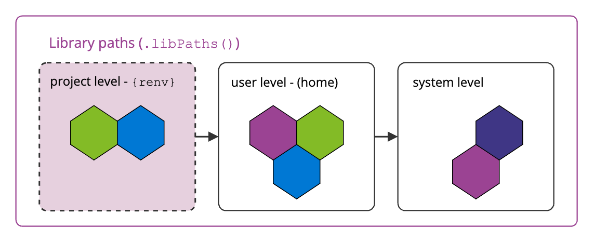
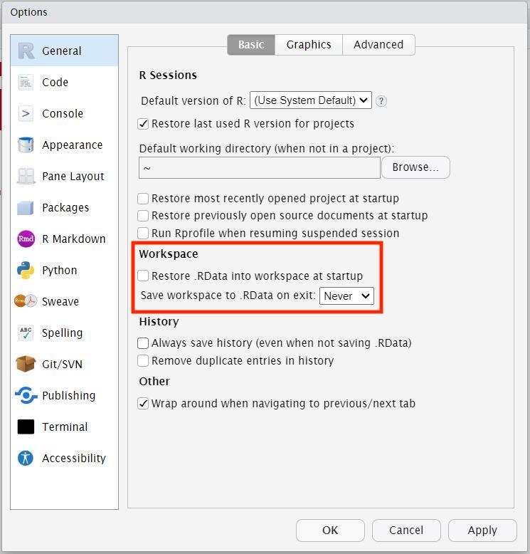
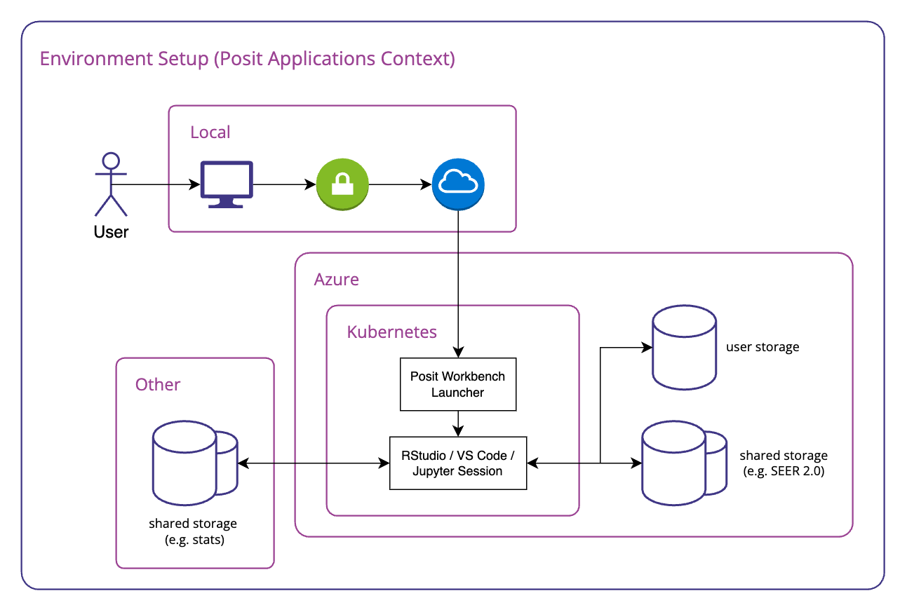

```{r setup, include=FALSE}
# Author: Russell McCreath
# Original Date: March 2024
# Version of R: 4.2.2

library(learnr)
library(gradethis)
library(renv)
knitr::opts_chunk$set(echo = FALSE)

tutorial_options(
  exercise.checker = gradethis::grade_learnr
)

```

```{r phs-logo, echo=FALSE, fig.align='right', out.width="40%"}
knitr::include_graphics("images/phs-logo.png")
```

## Introduction

Welcome to Reproducible Environments in R. If you've ever had code stop working at the next iteration of a run or it runs fine for you but not a colleague, this course is for you! This course is designed as a self-led dive into reproducible environments: what they are and how to use them, specifically using the `{renv}` package. Throughout this course there will be quizzes to test your knowledge and opportunities to modify and write R code.

::: info_box
<h4>Course Info</h4>

<ul>

<li>This course is built to flow through sections and build on previous knowledge. If you're comfortable with a particular section, you can skip it.</li>

<li>Most sections have multiple parts to them. Navigate the course by using the buttons at the bottom of the screen to Continue or go to the Next Topic.</li>

<li>The course will also show progress through sections, a green tick will appear on sections you've completed, and it will remember your place if you decide to close your browser and come back later.</li>

</ul>
:::

</br>

### Learning Outcomes

-   Reinforced understanding of the importance of reproducibility in data projects.
-   Be able to set up and configure `{renv}` for managing project dependencies.
-   Create reproducible environments for R projects using `{renv}`.
-   Understand best practices for version control and collaboration with `{renv}`.
-   Troubleshoot common issues related to reproducible environments.
-   Awareness of advanced features for customisation options.
-   Be able to confidently apply reproducibility principles to improve reliability and transparency of projects.

### What is `{renv}`?

R manages packages through a central library and shares this across all projects. In PHS Posit Workbench, we expand on this slightly, with a system-level library (used for base packages) and then user-level where each user-installed package will go. On any system, this location can be found using the `.libPaths()` function, where the list of locations is listed in order of priority.

This works well until versions of packages are considered. Each project may require different versions of packages, resulting in deprecated or missing functionality. This issue is only made worse the moment the project is shared with someone else, someone with their very own library of packages with different versions. The `{renv}` package solves this issue by creating a separate, reproducible environment that is attached to the project, creating:

-   a project-specific library, and
-   a list of dependencies and their version.

```{r renv-libraries, echo=FALSE, fig.align='center'}

```

#### Knowledge Check

```{r intro-quiz}
question("What are benefits of using `{renv}`?",
    answer("Tracks package versions", correct = TRUE),
    answer("Tracks package dependencies", correct = TRUE),
    answer("Links to a project and can be shared", correct = TRUE),
    answer("Supports reproducibility", correct = TRUE),
    answer("Tracks project history", message = "Unfortunately, {renv} doesn't track project history, that's where version control comes in... more on that later!"),
    incorrect = "Not quite, have another go!",
    allow_retry = TRUE,
    random_answer_order = TRUE
  )
```


## Foundations

Predictably, the foundations for this course lie in reproducibility and environments. The below sections go into a bit of detail to shape our mental model for these concepts and how to work so that we're able to use the `{renv}` package in the most effective way.

### Reproducibility

Reproducibility is the cornerstone of effective science and research. Packaged, a reproducible project should allow anyone with the original data to achieve the same results and draw the same conclusions, ultimately improving reliability and trustworthiness of any data products.

There are various components of setting up projects to enable reproducibility, this course isn't going to go through all of this but instead set out a foundation to benefit the use of `{renv}`.

#### Code

The R console is the interface for directly entering R code and having it be interpreted, any computation processed, and results either returned directly or variables be made available in the main environment pane. The mental model of considering the environment pane as reality is quickly broken when the R session restarts, you forgot the process, or have to start from the beginning due to a mistyped change in a long process. Instead, we should **use scripts for all code in our projects** to have any chance of being reproducible.

Including the packages used, **all the code is saved in context and documented with comments in scripts**. This also gives benefits such as syntax highlighting, diagnostics, auto-completion of functions, etc.

To support this way of working, changing the RStudio Global Options to not save or load previous .RData files (your workspace) will encourage you to work with a reproducible mindset and write code in scripts.

```{r renv-globalops, echo=FALSE, fig.align='center'}

```

*When using PHS Posit Workbench, your R session doesn't end or restart when you close your browser as it's hosted on a server. It's important to consider this in terms of your workflow for managing your R workspace and saving elements but also as a use of resources within the organisation. See [Best Practice with R in Posit Workbench](https://public-health-scotland.github.io/knowledge-base/docs/Posit%20Infrastructure?doc=Best%20Practice%20with%20R%20in%20Posit%20Workbench.md) guidance.*

From this, we can layer other best practice:

-   Follow [PHS R Style Guide](https://public-health-scotland.github.io/knowledge-base/docs/R?doc=R%20Style%20Guide.md)
-   File (script) names should be meaningful, machine- and human-readable.
-   Files should be ordered within a single project directory, provided with leading numbers for ordered lists.
-   Outputs are stored in a set location and excluded from version control.

</br>

#### Projects

The next major component of setting up a project for reproducibility is using RStudio Projects. R accesses a working directory, found using `getwd()`, and can be changed using `setwd()` (not recommended). This is likely to change between users but also between your projects which could cause confusion and issue when switching from one bit of work to another. This can be set up as below from File > New Project (we'll come back to setting up projects with renv - the green box):

```{r renv-newproj, echo=FALSE, fig.align='center'}
knitr::include_graphics("images/renv-newproj1.png")
```

Building on the solid foundations that RStudio Projects provide, we need to use relative paths within our code. A relative path is *relative* to the current working directory (set by the project). This means that if an output is saved using a relative path: `data/project_data.csv`, different users would access the same location regardless of where their working version of the project (i.e. `project`) is stored, e.g.:

* `/Projects/user1/project/data/project_data.csv`
* `/Projects/user2/phs_projects/project/data/project_data.csv`

While less of an issue in PHS as we all use Posit Workbench to access RStudio, there can also be differences introduced depending on operating systems. If you're working with external collaborators for instance, they may use a Windows system which would require different formatting for file paths. 

Taking this a step further, the [`{here}` package](https://here.r-lib.org/) offers up a simple function that protects this way of working even further, and is closely linked with RStudio Projects. The `data/project_data.csv` would be be accessed with `here::here('data', 'project_data.csv')`.

```{r renv-proj, echo=FALSE, fig.align='center'}
knitr::include_graphics("images/illustrations/r_cracked_setwd.png")
```

### Environments

Understanding environments in this context is the next fundamental. In the context of using computers to handle and analyse data, to developing outputs such as dashboards and applications, an environment refers to the collection of software tools, libraries, configurations, and dependencies that are required to run a particular program or project. Environments can vary based on factors such as programming language, project requirements, and external dependencies. Also, while we use Posit Workbench in PHS, this eliminates some problems as we're all starting from the same point, but each user can then set their own configuration and packages that will inevitably be different from the next person. Managing these environments effectively is crucial for ensuring that workflows are reproducible across time but also between users and, ultimately, across systems.

```{r renv-env, echo=FALSE, fig.align='center', out.width='100%'}

```

Using Posit Workbench means that our local environment has little impact on any development work. The main difference that can occur between projects and users for R projects is packages, which packages and which version of those packages. That's where `{renv}` comes in, so lets get a look at how to set it up...

