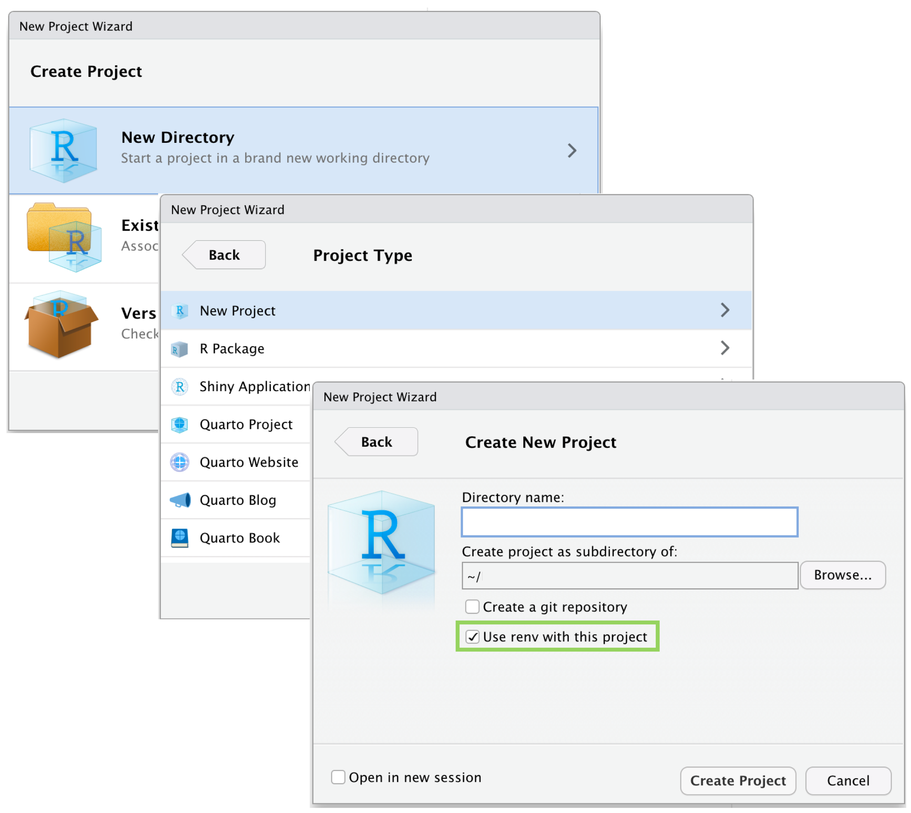
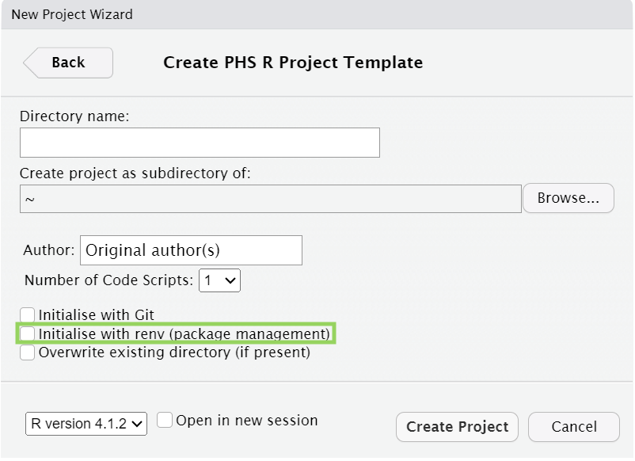
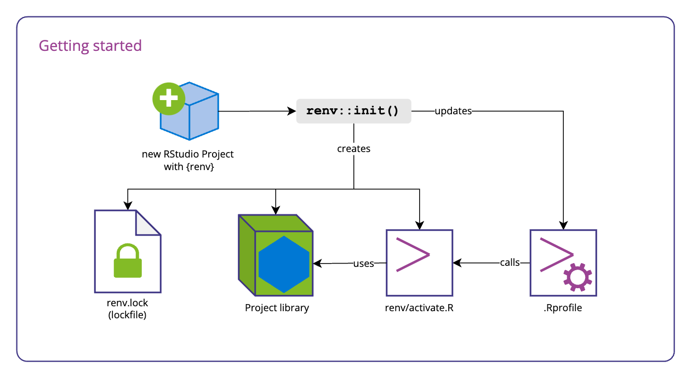
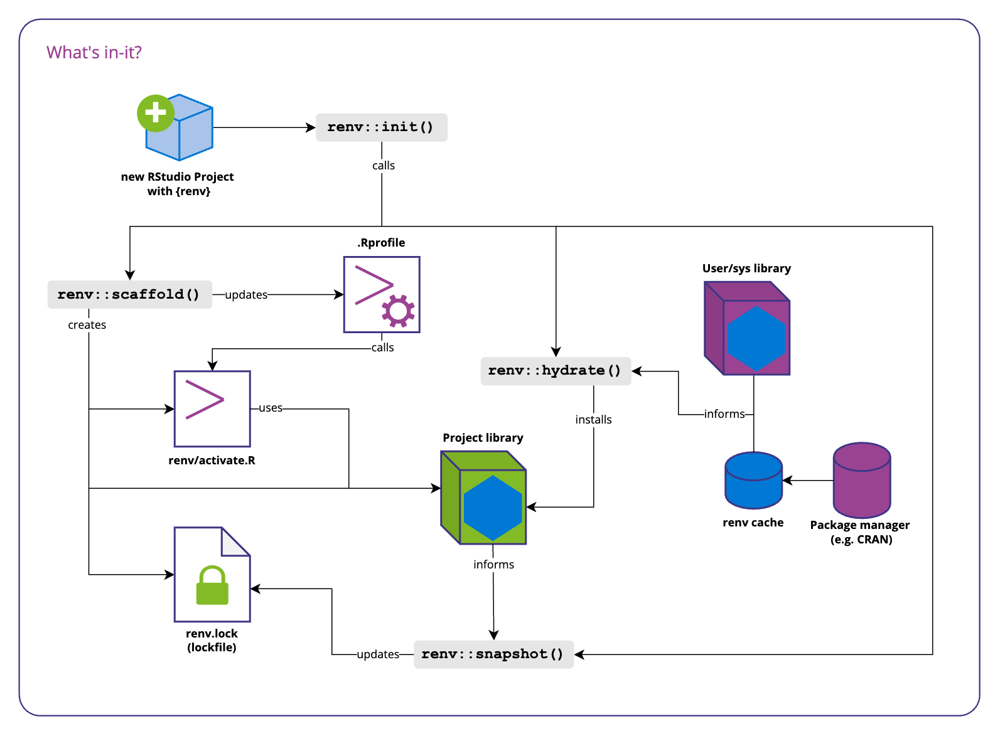
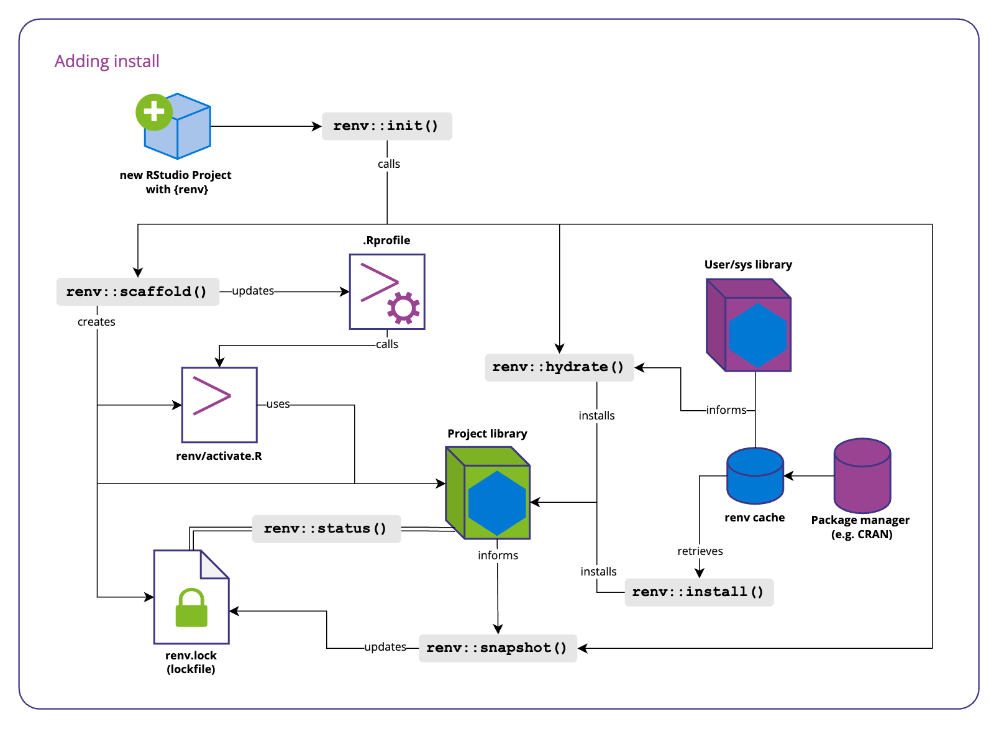
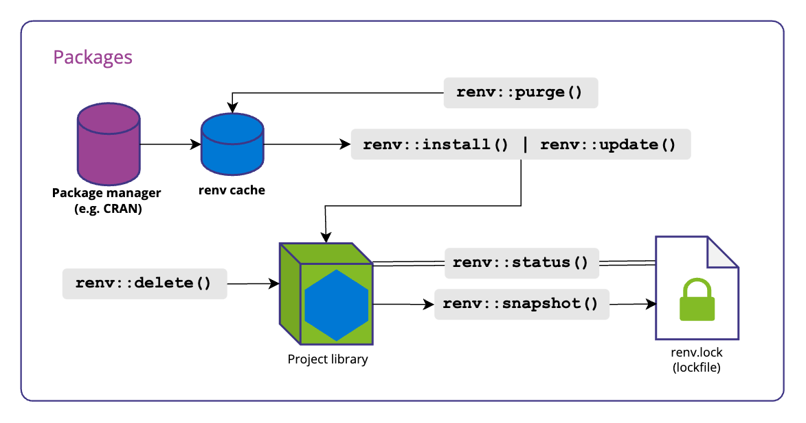
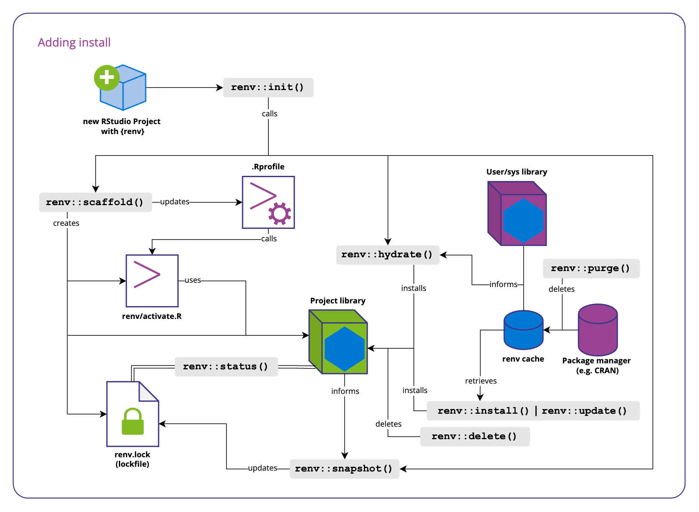
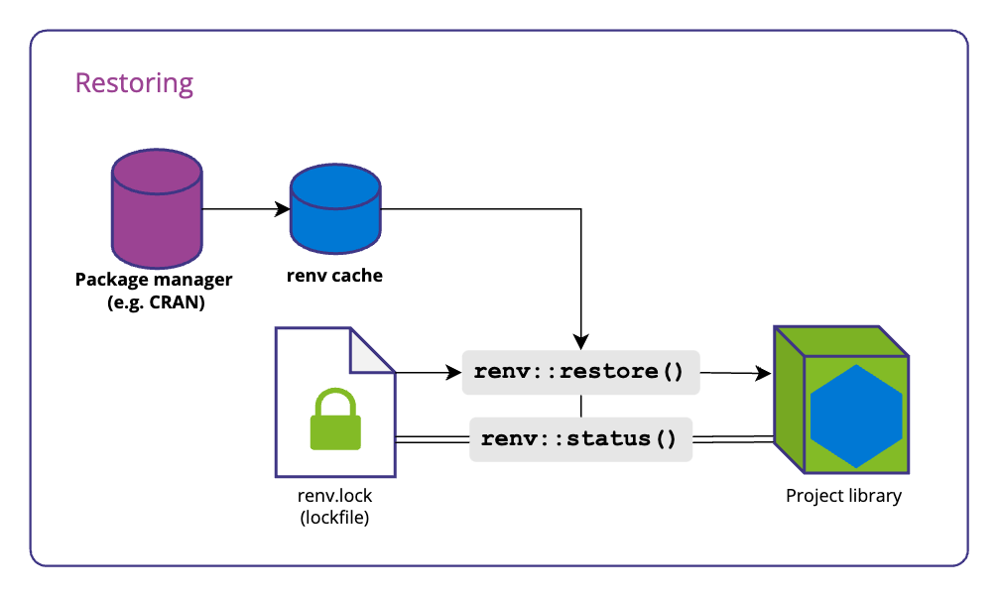
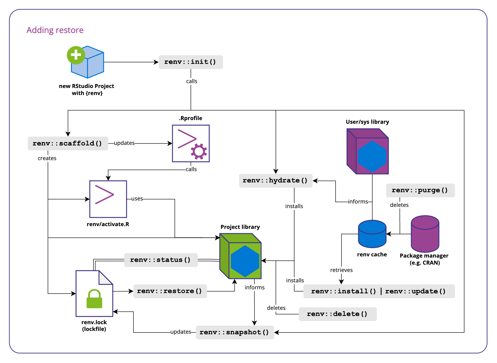

```{r setup, include=FALSE}
# Author: Russell McCreath
# Original Date: March 2024
# Version of R: 4.2.2

library(learnr)
library(gradethis)
library(renv)
knitr::opts_chunk$set(echo = FALSE)

tutorial_options(
  exercise.checker = gradethis::grade_learnr
)

```

```{r phs-logo, echo=FALSE, fig.align='right', out.width="40%"}
knitr::include_graphics("images/phs-logo.png")
```

## Introduction

Welcome to Reproducible Environments in R. If you've ever had code stop working at the next iteration of a run or it runs fine for you but not a colleague, this course is for you! This course is designed as a self-led dive into reproducible environments: what they are and how to use them, specifically using the `{renv}` package. Throughout this course there will be quizzes to test your knowledge and opportunities to modify and write R code.

::: info_box
<h4>Course Info</h4>

<ul>

<li>This course is built to flow through sections and build on previous knowledge. If you're comfortable with a particular section, you can skip it.</li>

<li>Most sections have multiple parts to them. Navigate the course by using the buttons at the bottom of the screen to Continue or go to the Next Topic.</li>

<li>The course will also show progress through sections, a green tick will appear on sections you've completed, and it will remember your place if you decide to close your browser and come back later.</li>

</ul>
:::

</br>

### Learning Outcomes

-   Reinforced understanding of the importance of reproducibility in data projects.
-   Be able to set up and configure `{renv}` for managing project dependencies.
-   Create reproducible environments for R projects using `{renv}`.
-   Understand best practices for version control and collaboration with `{renv}`.
-   Troubleshoot common issues related to reproducible environments.
-   Awareness of advanced features for customisation options.
-   Be able to confidently apply reproducibility principles to improve reliability and transparency of projects.

### What is `{renv}`?

R manages packages through a central library and shares this across all projects. In PHS Posit Workbench, we expand on this slightly, with a system-level library (used for base packages) and then user-level where each user-installed package will go. On any system, this location can be found using the `.libPaths()` function, where the list of locations is listed in order of priority.

This works well until versions of packages are considered. Each project may require different versions of packages, resulting in deprecated or missing functionality. This issue is only made worse the moment the project is shared with someone else, someone with their very own library of packages with different versions. The `{renv}` package solves this issue by creating a separate, reproducible environment that is attached to the project, creating:

-   a project-specific library, and
-   a list of dependencies and their version.

```{r renv-libraries, echo=FALSE, fig.align='center'}
knitr::include_graphics("images/renv-libraries.png")
```

#### Knowledge Check

```{r intro-quiz}
question("What are benefits of using `{renv}`?",
    answer("Tracks package versions", correct = TRUE),
    answer("Tracks package dependencies", correct = TRUE),
    answer("Links to a project and can be shared", correct = TRUE),
    answer("Supports reproducibility", correct = TRUE),
    answer("Tracks project history", message = "Unfortunately, {renv} doesn't track project history, that's where version control comes in... more on that later!"),
    incorrect = "Not quite, have another go!",
    allow_retry = TRUE,
    random_answer_order = TRUE
  )
```


## Foundations

Predictably, the foundations for this course lie in reproducibility and environments. The below sections go into a bit of detail to shape our mental model for these concepts and how to work so that we're able to use the `{renv}` package in the most effective way.

### Reproducibility

Reproducibility is the cornerstone of effective science and research. Packaged, a reproducible project should allow anyone with the original data to achieve the same results and draw the same conclusions, ultimately improving reliability and trustworthiness of any data products.

There are various components of setting up projects to enable reproducibility, this course isn't going to go through all of this but instead set out a foundation to benefit the use of `{renv}`.

#### Code

The R console is the interface for directly entering R code and having it be interpreted, any computation processed, and results either returned directly or variables be made available in the main environment pane. The mental model of considering the environment pane as reality is quickly broken when the R session restarts, you forgot the process, or have to start from the beginning due to a mistyped change in a long process. Instead, we should **use scripts for all code in our projects** to have any chance of being reproducible.

Including the packages used, **all the code is saved in context and documented with comments in scripts**. This also gives benefits such as syntax highlighting, diagnostics, auto-completion of functions, etc.

To support this way of working, changing the RStudio Global Options to not save or load previous .RData files (your workspace) will encourage you to work with a reproducible mindset and write code in scripts.

```{r renv-globalops, echo=FALSE, fig.align='center'}
knitr::include_graphics("images/renv-globalops.jpg")
```

*When using PHS Posit Workbench, your R session doesn't end or restart when you close your browser as it's hosted on a server. It's important to consider this in terms of your workflow for managing your R workspace and saving elements but also as a use of resources within the organisation. See [Best Practice with R in Posit Workbench](https://public-health-scotland.github.io/knowledge-base/docs/Posit%20Infrastructure?doc=Best%20Practice%20with%20R%20in%20Posit%20Workbench.md) guidance.*

From this, we can layer other best practice:

-   Follow [PHS R Style Guide](https://public-health-scotland.github.io/knowledge-base/docs/R?doc=R%20Style%20Guide.md)
-   File (script) names should be meaningful, machine- and human-readable.
-   Files should be ordered within a single project directory, provided with leading numbers for ordered lists.
-   Outputs are stored in a set location and excluded from version control.

</br>

#### Projects

The next major component of setting up a project for reproducibility is using RStudio Projects. R accesses a working directory, found using `getwd()`, and can be changed using `setwd()` (not recommended). This is likely to change between users but also between your projects which could cause confusion and issue when switching from one bit of work to another. This can be set up as below from File > New Project (we'll come back to setting up projects with renv - the green box):

```{r renv-newproj, echo=FALSE, fig.align='center'}
knitr::include_graphics("images/renv-newproj1.png")
```

Building on the solid foundations that RStudio Projects provide, we need to use relative paths within our code. A relative path is *relative* to the current working directory (set by the project). This means that if an output is saved using a relative path: `data/project_data.csv`, different users would access the same location regardless of where their working version of the project (i.e. `project`) is stored, e.g.:

* `/Projects/user1/project/data/project_data.csv`
* `/Projects/user2/phs_projects/project/data/project_data.csv`

While less of an issue in PHS as we all use Posit Workbench to access RStudio, there can also be differences introduced depending on operating systems. If you're working with external collaborators for instance, they may use a Windows system which would require different formatting for file paths. 

Taking this a step further, the [`{here}` package](https://here.r-lib.org/) offers up a simple function that protects this way of working even further, and is closely linked with RStudio Projects. The `data/project_data.csv` would be be accessed with `here::here('data', 'project_data.csv')`.

```{r renv-proj, echo=FALSE, fig.align='center'}
knitr::include_graphics("images/illustrations/r_cracked_setwd.png")
```

### Environments

Understanding environments in this context is the next fundamental. In the context of using computers to handle and analyse data, to developing outputs such as dashboards and applications, an environment refers to the collection of software tools, libraries, configurations, and dependencies that are required to run a particular program or project. Environments can vary based on factors such as programming language, project requirements, and external dependencies. 

While we use Posit Workbench in PHS, this eliminates some problems as we're all starting from the same point, but each user can then set their own configuration and packages that will inevitably be different from the next person. Our infrastructure also provides a benefit of multiple versions of R being available, but at the same time this raises issues when the project is being accessed by different people and across time. Managing these environments effectively is crucial for ensuring that workflows are reproducible across time but also between users and, ultimately, across systems.

```{r renv-env, echo=FALSE, fig.align='center', out.width='100%'}
knitr::include_graphics("images/renv-positenv.png")
```

Using Posit Workbench means that our local environment has little impact on any development work. The main difference that can occur between projects and users for R projects is packages, which packages and which version of those packages. That's where `{renv}` comes in, so let's look at how to set it up.

## Setting up `{renv}`

`{renv}` is a package like any other, so must first be installed. It is available through the PHS Package Manager (or generally through CRAN) and can be installed using `install.packages("renv")`. On PHS Posit Workbench, this will be installed in your user library as standard, this is then used to generate the project level library.

### Process

#### New project

Using `{renv}` is now so fundamental, RStudio provides the interface to get things set up as part of the normal interface for creating a new project. Go to File > New Project and follow the interface as below to find the 'use renv with this project' check box:

```{r renv-new, echo=FALSE, fig.align='center', out.width='100%'}

```

Similarly, when using [`{phstemplates}`](https://github.com/Public-Health-Scotland/phstemplates), when setting up projects from a template, the interface also allows you to start them with `{renv}`. 

```{r renv-phstemplates, echo=FALSE, fig.align='center', out.width='70%'}

```

</br>

#### Existing project

If you forget to set up alongside the project or have an existing project that's not using `{renv}`, it's not too late. In fact, it's always better late than never, so even older projects can get in on the action. It's worth highlighting at this point, while we're aware of the importance of using scripts for the codebase in a project, the work `{renv}` does occurs outside that scope so functions related to `{renv}` need to happen in the R console. To set up on a project, enter the below in the R console:

```R
renv::init()
```

### What's happened?

Setting up a project to use `{renv}` runs a couple of sub processes to generate:

* **Project library** - a nested directory structure containing the project dependencies. 
* **renv.lock file** - a file containing a description of the project's configuration and dependencies. This is the core of the reproducibility, like a recipe for getting the environment back to the necessary state. We interact with this through `{renv}` functions, not directly.
* **renv/activate.R** - the R code that pulls everything together and activates the environment.

To automate the process of running the `renv/activate.R` file, `.Rprofile` is also updated to automatically call the script and get things set up whenever you open the project. It's possible to use a user-level or project-level `.Rprofile` for other things, like environment variables. If it doesn't exist for the project, `{renv}` will create it with just the code to call `renv/activate.R`.

```{r renv-init, echo=FALSE, fig.align='center'}

```

#### Lockfile

A new project will produce the simplest lockfile, so it's a good place to start and see what's included. The lockfile is a JSON formatted file so is both human- and machine-readable, it describes:

* R settings:
  * R version used in the project
  * A repository to find packages (default CRAN mirror). 
* Packages:
  * Name of the package
  * Package version
  * Where to find the package for installation
  * Requirements (dependencies for that package)

```json
{
  "R": {
    "Version": "4.1.2",
    "Repositories": [
      {
        "Name": "CRAN",
        "URL": "https://packagemanager.posit.co/cran/latest"
      }
    ]
  },
  "Packages": {
    "renv": {
      "Package": "renv",
      "Version": "1.0.5",
      "Source": "Repository",
      "Repository": "RSPM",
      "Requirements": [
        "utils"
      ],
      "Hash": "21d2f84e8263f657ca5863272cb8ba6a"
    }
  }
}
```

### Knowledge Check

#### Exercise

What about an existing project? Well, this course is built in R, and a new environment is set up for each session. So, let's run the command to initiate `{renv}` and see what the output looks like for this:

```{r init, exercise=TRUE}

```

```{r init-hint-1}
renv::...()
```

```{r init-solution}
renv::init()
```

</br>

```{r init-quiz}
quiz(
  question("From the above output, what version of `{rmarkdown}` does this course use?",
           answer("2.26", correct = TRUE),
           answer("It doesn't use RMarkdown"),
           answer("2.25"),
           answer("2.20"),
           allow_retry = TRUE,
           random_answer_order = TRUE
           ),
  question("What does `renv::init()` \"create\"?",
    answer("A project-level library", correct = TRUE),
    answer("A lockfile for configuration", correct = TRUE),
    answer("An environment activation script", correct = TRUE),
    answer("The RStudio project (`.Rproj`) file", message = "While absolutely required, the .Rproj file isn't created by renv."),
    incorrect = "Not quite, have another go!",
    allow_retry = TRUE,
    random_answer_order = TRUE
  ),
  question("It's only possible to start renv for new projects?",
      answer("False", correct = TRUE),
      answer("True", message = "Thankfully not, the sooner the better but it's possible to start at any point."),
      incorrect = "Not quite, have another go!",
      allow_retry = TRUE,
      random_answer_order = TRUE
    )
)

```

## Tracking changes

When setting `{renv}` up on an existing project, we see more of the process and that it immediately captures the packages used in the project. The output could look something like this:

```shell
- Linking packages into the project library ... Done!
- Resolving missing dependencies ... 
# Installing packages --------------------------------------------------------
The following package(s) will be updated in the lockfile:

# CRAN -----------------------------------------------------------------------
- base64enc     [* -> 0.1-3]
- bslib         [* -> 0.6.1]
- glue          [* -> 1.7.0]
- here          [* -> 1.0.1]
- magrittr      [* -> 2.0.3]
- renv          [* -> 1.0.5]

The version of R recorded in the lockfile will be updated:
- R             [* -> 4.1.2]

- Lockfile written to '~/project/renv.lock'

Restarting R session...
```

The `[* -> 1.0.0]` syntax is telling us that it's going from not included, `*`, to the specified version, e.g. `1.0.0`. How does this work?

```{r renv-snapshot, echo=FALSE, fig.align='center', out.width='100%'}

```

We've had to take a step down into the workings of `{renv}`, and from this we can see that `renv::init()` calls 3 other functions to get things set up:

1. `renv::scaffold()` to create the files and structure, creating the `renv.lock` file and the project library, and updating .Rprofile to call the other created `renv/activate.R` file which not only creates the environment but we can see sets the project library as the one to use.
2. `renv::hydrate()` searches for currently installed packages and ensures they get installed in the project library.
3. `renv::snapshot()` updates the lockfile with the project installed packages.

*A worthy mention is the cache system used. You can probably imagine storing multiple versions of the same package across projects would become a storage issue. The cache resolves this issue and also makes everything much faster. Generally, it works by setting up the project library with links to the global cache for each package. The next time a package is installed, it goes to the cache first and if it's not there, it will retrieve from the defined package manager. This means that referencing the packages reduces the capacity issue but also each subsequent install of the package when using `{renv}` will be almost instantaneous.*

### New packages

As we start working on our projects, we're quickly going to want packages. At this point we need to remember that, with `{renv}`, we have created a project-level library. If set up from new, this library doesn't contain any of the packages we installed in our user-level library and we need to think of our workflow as starting from a blank slate. 

As we determine packages that we would like to use in our project, we should first install them. We already know a function that will do this, `install.packages()`, but `{renv}` offers a function, `renv::install()` taking arguments in the same way. When installing packages, you may need to follow additional prompts in the R console as it will alert and request approval for installing package dependencies where they occur.

```{r renv-install, echo=FALSE, fig.align='center', out.width='100%'}

```

We can see that the `renv::install()` function adds the package to our project library. Another useful function that we've been able to add to our toolkit is `renv::status()`, this compares the project library with the lockfile but considers packages only when they are installed *and used*, triggered with `library()` or `require()` functions across the codebase. When the package is used, we then need to update the lockfile, we directly use the `renv::snapshot()` function to do this. A workflow looks something like this...

```shell
> renv::install("here")
# Downloading packages -------------------------------------------------------
- Downloading here from CRAN ...                OK
- Downloading rprojroot from CRAN ...           OK
Successfully downloaded 2 packages.

The following package(s) will be installed:
- here      [1.0.1]
- rprojroot [2.0.4]
These packages will be installed into "~/Project/renv/library".

Do you want to proceed? [Y/n]: y

# Installing packages --------------------------------------------------------
- Installing rprojroot ...                      OK
- Installing here ...                           OK
Successfully installed 2 packages.

> renv::status()
No issues found -- the project is in a consistent state.

> renv::snapshot()
- The lockfile is already up to date.
```

... creates a script using the `{here}` package...

```shell
> renv::status()
The following package(s) are in an inconsistent state:

 package   installed recorded used
 here      y         n        y   
 rprojroot y         n        y   

See ?renv::status() for advice on resolving these issues.

> renv::snapshot()
The following package(s) will be updated in the lockfile:

# CRAN -----------------------------------------------------------------------
- here        [* -> 1.0.1]
- rprojroot   [* -> 2.0.4]

Do you want to proceed? [Y/n]: y

- Lockfile written to "~/Project/renv.lock".
```

### Updating packages

Updating packages works in much the same way as installing them, except the function used is `renv::update()`. Individual packages can be targeted for updating or by leaving the packages argument blank, all packages in the project library will be updated. It's worth noting that the update function will look in the same place the package was originally installed from only (e.g. if a GitHub package was installed before but a newer version is available via CRAN, this will not be identified).

```R
renv::update()
```

### Removing packages

The last thing to cover when dealing with our packages is if we need to remove them. To delete packages from our project library, we use `renv::delete()` with the name of any packages to remove. 

```R
renv::delete()
```

When a package that has a minor change but doesn't update the version number, or we need to remove a package not just from the project library but our system, we need to consider the cache system used. The cache is there to minimise installation of packages across projects but can impact our workflow when we do want to install a completely fresh version of a package. To do this, we need to "purge" the cache of the package, using:

```R
renv::purge()
```

</br>

With any of the functions used to handle packages in this section, `renv::install()`, `renv::update()`, or `renv::delete()`, we always need to update the lockfile with `renv::snapshot()`. This workflow can be considered separately like below:

```{r renv-packages, echo=FALSE, fig.align='center'}

```

Finally, let's update our complete map:

```{r renv-delete, echo=FALSE, fig.align='center', out.width='100%'}

```

### Knowledge Check

#### Exercise

Due to the way this course is set up, it's not possible to continue to run `{renv}` functions in this environment. However, you should now go to RStudio ([PHS Posit Workbench](https://pwb.publichealthscotland.org/)) and:

1. Set up a new RStudio Project with `{renv}` called `renv-test`.
2. Check the lockfile and look at the `renv/library/` directory.
3. Install `{dplyr}`.
4. Add a script that includes `{dplyr}`, further code is optional.
5. Check the status of `{renv}`, reading any output.
6. Update the lockfile using `{renv}` functions.
7. Check the lockfile and look at the `renv/library/` directory again.

</br>

```{r packages-quiz}
quiz(
  question("When installing `{dplyr}`, which of these other packages were installed?",
           answer("`{glue}`", correct = TRUE),
           answer("No other packages were installed."),
           answer("`{tidyverse}`"),
           answer("`{here}`"),
           allow_retry = TRUE,
           random_answer_order = TRUE
           ),
  question("What is the usual process for installing a package?",
           answer("`renv::install()` > `library()` > `renv::snapshot()`", correct = TRUE),
           answer("`renv::update()` > `library()` > `renv::snapshot()`"),
           answer("`renv::install()` > `renv::snapshot()` > `library()`"),
           answer("`renv::install()` > `library()` > `renv::status()`"),
           allow_retry = TRUE,
           random_answer_order = TRUE
           )
)

```


## Collaboration

It's more than likely you'll be working with others on projects, `{renv}` benefits this by describing the environment to allow it to be reproduced, not just for us but anyone working on the project. To share it with others, we use Git and GitHub (or Gitea). This in turn benefits `{renv}`, adding version control to track changes to the environment over time. This means that identifying issues from package changes are easier to identify and undo. That's why [Introduction to Git](https://public-health-scotland.github.io/knowledge-base/develop/introduction-to-git) is a prerequisite, and therefore out of scope, for this course. 

To get `{renv}` to work with Git, we need to include certain files as part of the repository. This should include:

* `renv.lock` - unsurprisingly, as the file that describes each dependency for the project, this file is crucial to be able to rebuild the project library and set up the environment.
* `renv/activate.R` - this file is just an R script but sets up the environment, including the project library so helps keep a standardised approach for everyone contributing to the project.
* `.Rprofile` - this is a project-level file that calls the above script but can include other project requirements, it's a good idea to get this included.

Helpfully, `renv.init()` produces a `.gitignore` file that stops some files from being committed. Most notably, the project library doesn't get added. The point of having the lockfile is to describe what's necessary to reproduce the environment, this approach saves significant storage, time, and complexity than storing the library along with the codebase on version control. 

Another important note is that any R project that uses `{renv}` on Git, should include this detail, ideally on the `README`. It's common to also include `CONTRIBUTE` files which can go into more detail. However, the expectation isn't to provide a course for using `{renv}` in every repo where it's used, a link to this course or other available guidance while letting people know about it is more than enough.

```{r renv-collab, echo=FALSE, fig.align='center', out.width='90%'}
knitr::include_graphics("images/illustrations/bakers.png")
```

### Knowledge Check

```{r collab-quiz}
quiz(
  question("Which file(s) should **not** be committed to Git on a `{renv}` project?",
           answer("`renv/library`", correct = TRUE),
           answer("`.Rproj.user`", correct = TRUE),
           answer("`renv.lock`"),
           answer("`renv/activate.R`"),
           allow_retry = TRUE,
           random_answer_order = TRUE
           )
)

```


## Restoring environments

We've set up a reproducible environment, know how to keep it updated, and have even version controlled and shared it using Git. How do we get from the files we included in the repo to a working environment? Well, `{renv}` helps us along the way. When we open a project that has the associated files, `{renv}` will show something like this in the R console:

```shell
* Downloading renv ... OK
* Installing renv ... Done!
* Successfully installed and loaded renv.
* Project '~/Project' loaded.
* The project library is out of sync with the lockfile.
* Use `renv::restore()` to install packages recorded in the lockfile.
```

```{r renv-restore, echo=FALSE, fig.align='center'}

```

Running `renv::status()` will give us a similar message, but even without this message or if we're coming to this point as part of a different workflow, use the R console to run:

```R
renv::restore()
```

This will follow up with installing the various packages required in the project and will require confirmation to go through these steps so follow along in the console until everything is complete. Feel free to double check with another `renv::status()`.

```{r renv-restored, echo=FALSE, fig.align='center', out.width='90%'}

```

## Getting advanced

### Complete `{renv}` workflow

The whole map with each element of `{renv}` is shown below. To take things further, have a look below at some more sections at what else you can do with `{renv}`.

```{r renv-complete, echo=FALSE, fig.align='center'}

```

### Geospatial packages

Geospatial R packages tend to have slightly different requirements of the system they are on than other packages. This often goes unnoticed as it's handled on the system you are using. However, in the PHS Posit infrastructure, there is some manual work involved to get things working. This is documented in [Installing and using geospatial R packages](https://public-health-scotland.github.io/knowledge-base/docs/Posit%20Infrastructure?doc=How%20to%20Install%20and%20Use%20Geospatial%20R%20Packages.md).

However, these instructions require code to be ran each time these packages are used within a relevant project. The using of `{renv}` can be a significant support.

### Python

It's possible to use `{renv}` when developing with Python using RStudio Projects. The workflow is effectively identical to working with R packages, and is started with by running:

```R
renv::use_python()
```

The lockfile will now include details about the Python version used, and with `renv::snapshot()` can be updated with package details as you go through development. For more see [renv::use_python()](https://rstudio.github.io/renv/reference/use_python.html)

### CI/CD pipelines

[Content to be added]

### Other advanced customisation

[Content to be added]


## Help & Feedback

Hope you enjoyed the course and now feel confident to take forward your new found knowledge of reproducible environments. The sooner you start working with the new technology in real projects, the better you'll be able to embed the skill and learn more about how it works for you.

### Help

* [`{renv}` reference docs](https://rstudio.github.io/renv/reference/index.html)
* Google / StackOverflow '[renv]'
* [Data & Intelligence Forum](https://teams.microsoft.com/l/team/19%3Ae9f55a12b7d94ef49877ff455a07f035%40thread.tacv2/conversations?groupId=ec4250f9-b70a-4f32-9372-a232ccb4f713&tenantId=10efe0bd-a030-4bca-809c-b5e6745e499a) - [Reproducible Environments channel](https://teams.microsoft.com/l/channel/19%3Aa786ffd4a70d4941b87f023942d21b6a%40thread.tacv2/Reproducible%20Environments?groupId=ec4250f9-b70a-4f32-9372-a232ccb4f713&tenantId=10efe0bd-a030-4bca-809c-b5e6745e499a)
* [Data Science team mailbox](mailto:phs.datascience@phs.scot?subject=R renv Training Online - Help)

We also received a workshop from Posit on the use of `{renv}`, while the aim is similar to this course, it is available here as an additional learning resource: [Posit renv workshop - Zoom recording](https://positpbc.zoom.us/rec/play/n8-spO05R8p9vp8dqJ9GxH_Zr8mk7IMvsiX3menvnbXEXmJOXK5mOA-HPMxEFQPJvh6bTkvhaK6_oHWT.e--Z8hkQVR5coU-F?continueMode=true&pwd=MjxDT7xc_SQJM8HkKz4ffvPvm0mU4s74&_x_zm_rtaid=7GmfdwjkRvidhayMImvvYQ.1680787485091.7d8be92495688fceb3b55c4b0f603018&_x_zm_rhtaid=747)

### Feedback

<iframe width="100%" height="2300" src="https://forms.office.com/e/qBthjqHbdx?embed=true" frameborder="0" marginwidth="0" marginheight="0" style="border: none; max-width:100%; max-height:100vh" allowfullscreen webkitallowfullscreen mozallowfullscreen msallowfullscreen>

</iframe>