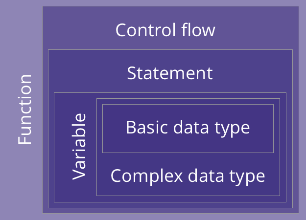

```{r setup, include=FALSE}
# Author: Russell McCreath
# Original Date: Oct 2020
# Version of R: 3.6.1

library(learnr)
library(gradethis)
library(stringr)
library(readr)
library(haven)
library(dplyr)
library(kableExtra)
knitr::opts_chunk$set(echo = FALSE)

tutorial_options(
  exercise.checker = gradethis::grade_learnr
)

borders_data <- readRDS("www/data/borders.rds")
borders_age_data <- read_csv("www/data/BORDERS (inc Age).csv")
baby5 <- read_csv("www/data/Baby5.csv")
baby6 <- read_csv("www/data/Baby6.csv")
```

```{r phs-logo, echo=FALSE, fig.align='right', out.width="40%"}
knitr::include_graphics("images/phs-logo.png")
```


## Introduction

Welcome to SPSS to R. This course is designed as a self-led introduction to R from SPSS and is for anyone in Public Health Scotland with experience of SPSS. The aim of this course is to bridge the understanding of each technology, giving translations where possible but generally supporting the transition. Throughout this course there will be quizzes to test your knowledge and opportunities to modify and write R code. 

This course aims to follow the path set out by the [Introduction to R](https://public-health-scotland.github.io/knowledge-base/develop/introduction-to-r) course, the structure of which is below. Both courses should be used in conjunction and neither replaces the other.

```{r intro-pathway, echo=FALSE, fig.align='center', out.width="100%"}
knitr::include_graphics("images/r-intro-pathway-2.png")
```

<div class="info_box">
  <h4>Course Info</h4>
  <ul>
    <li>This course is built to flow through sections and build on previous knowledge. If you're comfortable with a particular section, you can skip it.</li>
    <li>Most sections have multiple parts to them. Navigate the course by using the buttons at the bottom of the screen to Continue or go to the Next Topic.</li>
    <li>The course will also show progress through sections, a green tick will appear on sections you've completed, and it will remember your place if you decide to close your browser and come back later.</li>
  </ul>
</div>
</br>


#### Comparison of Technologies

```{r r-vs-spss, echo=FALSE}
r_vs_spss <- data.frame(
  "R" = c("A *programming language* widely used for data analysis, statistics, and graphics.",
          "Open source and available on all major operating systems",
          "Has the functionality to go from raw data to interactive reports, web apps, and more.",
          "A part of the PHS analytical strategy."),
  "SPSS" = c("Software used for statistical analysis mainly in the social sciences, providing users with an interface for building tasks as well as a *command syntax language*.",
             "Non-extensible, proprietary software.",
             "Predetermined statistical analysis tools and visualisations.",
             "Decreasing use across industry and PHS licenses will expire early 2023.")
)

kableExtra::kbl(r_vs_spss) %>% 
  kable_paper(full_width = FALSE) %>%
  column_spec(1:2, width = "50%")

```

</br>

While the use of SPSS is decreasing across industries and academia, the use of other tools such as R (and Python) are increasing, a large part due to their open source nature. Being open source allows communities to build around them for support, gives users more control in how they use and extend them, and maintains transferability (preventing work being locked into a single tool). PHS has and continues to invest in building the infrastructure to support R into the future, ensuring the whole workflow is as seamless as possible. 

</br>

Since we're getting started, here's a quiz to get familiar with the layout:

```{r intro-quiz}
quiz(
  question("Which of the following relate only to R (and not SPSS)?",
    answer("Programming language", correct = TRUE),
    answer("Proprietary software", message = "Thankfully, R is open-source and extendable through packages. SPSS is proprietary software."),
    answer("Open-source", correct = TRUE),
    answer("Interactive reports & web apps", correct = TRUE),
    answer("Presentations", correct = TRUE),
    incorrect = "Not quite, make sure to only select the statements that apply to R!",
    allow_retry = TRUE,
    random_answer_order = TRUE
  )
)
```


## Foundations

The [Introduction to R](https://public-health-scotland.github.io/knowledge-base/develop/introduction-to-r) course lays out the foundations of programming. However, with experience in SPSS (if you used the syntax), the logic of this will be familiar, it's just giving the concepts specific names and applies it in a slightly different way. One of the main differences between SPSS and R that's worth noting is with SPSS you're typically dealing with one whole dataset, in R you can be dealing with a single value through to multiple datasets and even an application all at the same time. The difference is important as some of the foundational skills built in [Introduction to R](https://public-health-scotland.github.io/knowledge-base/develop/introduction-to-r) deal with single values rather than whole datasets, it's hoped that a direct translation here can be useful.

The graphic of the structure of programming gives a simplified view of how those concepts come together and is similar in SPSS. Everything is translatable to a feature in SPSS except functions.

<div class = "supporting-image-left">
```{r foundations-buildingblocks, echo=FALSE, fig.align='center', out.width="75%"}

```
</div>


1. **Basic data types**

2. **Complex data types**

3. **Variables**

4. **Statements**

5. **Control Flow**

6. **Functions**

</br>
</br>

### Anatomy of a Program/Script

While it's not strictly accurate to call an SPSS syntax file a program, we can align them for this purpose. Taking these 2 examples, we can split down what each component is:

<div class="spss-r-row">
  <div class="spss-r-column">
<h4 class="colour-purple">SPSS</h4>
```{r eval=FALSE, echo=TRUE}
* A simple SPSS comment
compute x = 0.
```
  </div>
  <div class="spss-r-column">
<h4 class="colour-purple">R</h4>
```{r echo=TRUE}
# A simple R comment
x <- 0
```
  </div>
</div>

```{r}
# The below table has been built using Markdown rather than Kable - this was is because Kable seemed to be translating symbols within code elements to HTML codes, particularly useless for the R assignment operator example. 
```

| Concept | SPSS | R |
| ------- | ---- | - |
| **Comment** - just for us humans and ignored by the computer, they help add understanding and structure to our code. | `* A simple SPSS comment` | `# A simple R comment` |
| **Variables** - names (containers) we give to 'objects' | `x` | `x` |
| **Assignment Operator** - giving variables their content. | `=` | `<-` |
| **Basic data type** - in this case, numeric, it's one of the basic data types available. | `0` | `0` |

* In SPSS, the `compute` keyword is similar to a function, it tells the computer to do a specific set of things based on the parameters you provide. There are many functions available in R but when assigning a new variable, a function isn't required. 
* Each line in SPSS needs to be finished with a `.`, this tells the computer you have finished the statement and to execute that as one. In R, this isn't necessary and the computer determines what makes a complete statement. This does mean that you should be careful with how you structure your code, making it easy to read and review with proper spacing and breaks (see the [PHS R Style Guide](https://github.com/Public-Health-Scotland/R-Resources/blob/master/PHS%20R%20style%20guide.md)).


### Basic Data Types

| Type | SPSS | R |
| ---- | ---- | - |
| Character / String | `"Hello"` | `"Hello"` |
| Numeric | `321` or `123.5` | `321` or `123.5` |
| Logical | N/A | `TRUE` or `FALSE` |
| Complex | N/A | `2i` |

SPSS has 2 data types, string and numeric. The numeric data type then has formats available, this allows visual formatting to be added such as currency, but is also used for restricting decimal places. In R, the number is handled for us until we get to things like dates and times (for this we'd likely use the [lubridate](https://lubridate.tidyverse.org/) package for some helpful functions).

</br>

#### Type Conversion

To convert from one basic data type to another in SPSS, we follow this syntax `alter type <variable> (<data_type_format>).`, in R we can apply this to a single item that represents one instance of this data type using a function. The function we use depends on the resulting data type we'd like but it looks like this: `as.<data_type>(<variable>)`. If we want to apply this across a whole column in a dataset, we'd use `mutate()`, examples of both are shown below.

| Conversion | SPSS | R |
| ---------- | ---- | - |
| to string | `alter type Year (a4).` | `as.character(Year)` -> `data %<>% mutate(Year = as.character(Year))` |
| to numeric | `alter type Var1 (f2.0).` | `as.numeric(Var1)` -> `data %<>% mutate(Var1 = as.numeric(Var1))` |
| to logical | N/A | `as.logical(Var2)` -> `data %<>% mutate(Var2 = as.logical(Var2))`

*This is our first time coming across pipes (`%>%` or `%<>%`) in this course. They are really useful at allowing us to write "chained" processes, passing the result of the previous to the next. Have a look at this blog for more detail: [The Four Pipes of magrittr, R-bloggers](https://www.r-bloggers.com/2021/09/the-four-pipes-of-magrittr/).*

</br>

#### Operators

| Description | SPSS | R |
| ----------- | -------- | -------- |
| Exponentiation (right to left) | `**` | `^` |
| Modulus | `MOD` | `%` |
| Multiplication, Division | `*` `/` |  `*` `/` |
| Addition, Subtraction | `+` `-` | `+` `-` |
| Comparison Operators (Less Than, More Than, Less Than or Equal To, More Than or Equal To, Equal To, Not Equal To) | `<` (`LT`) `>` (`GT`) `<=` (`LE`) `>=` (`GE`) `=` (`EQ`) `<>` (`NE` `¬=` `~=`) | `<` `>` `<=` `>=` `==` `!=` |
| Logical NOT | `NOT` | `!` |
| Logical AND | `AND` | `&` `&&` | 
| Logical OR | `OR` | `|` `||` |


### Knowledge Check

```{r foundations-basics-quiz}
quiz(
  question("Convert `compute Var1 = 0.` from SPSS to R",
           answer("`compute(Var1, 0)`", message = "R doesn't need a function to assign a variable."),
           answer("`0 <- Var1`", message = "Be careful which way round you write the statement."),
           answer("`Var1 <- 0`", correct = TRUE),
           incorrect = "Not quite, have another go!",
           allow_retry = TRUE,
           random_answer_order = TRUE
           ),
  question("Convert `alter type Var1 (a1).` from SPSS to R",
           answer("`as.character(Var1)`", correct = TRUE),
           answer("`as.numeric(Var1)`"),
           answer("`mutate(Var1, numeric)`"),
           answer("`mutate(Var1, character)`"),
           incorrect = "Not quite, have another go!",
           allow_retry = TRUE,
           random_answer_order = TRUE
           ),
  question("Which of these are proper comparison operator conversions from SPSS to R?",
           answer("`<>` to `||`", message = "`<>` is a 'not equal' from SPSS to `||`, 'Logical OR', in R."),
           answer("`NOT` to `¬`", message = "The `¬` operator doesn't exist in R."),
           answer("`AND` to `&`", correct = TRUE),
           answer("`**` to `^`", correct = TRUE),
           answer("`MOD` to `%`", correct = TRUE),
           answer("`*` to `*`", correct = TRUE),
           incorrect = "Not quite, have another go!",
           allow_retry = TRUE,
           random_answer_order = TRUE
           )
)
```


## Data Flow

As previously mentioned, you're likely working with a single dataset in SPSS, compared to multiple datasets along with other components in R. This means you could be reading multiple files, wrangling, and outputting different things all within one 'script' in R. To be the most efficient, we'll be using functions from packages in R, these will clearly be included in any code block that uses them.

*As in the [Introduction to R](https://public-health-scotland.github.io/knowledge-base/develop/introduction-to-r) course, it's not possible to have any code exercises that reach 'directories' for reading and writing code on this app.*

### CSV

<div class="spss-r-row">
  <div class="spss-r-column">
<h4 class="colour-purple">SPSS</h4>
```{r eval=FALSE, echo=TRUE}
* Read a CSV file
GET DATA /TYPE=TXT
  /FILE = "data/Borders.csv" 
  /DELCASE = LINE 
  /DELIMITERS = "," 
  /ARRANGEMENT = DELIMITED
  /FIRSTCASE = 2
  /VARIABLES =
  Name A28
  Age F3.0
  DOB edate11.
CACHE.
EXECUTE.

* Write a CSV file
SAVE TRANSLATE
  /OUTFILE = "data/Borders.csv"
  /TYPE = CSV
  /REPLACE
  /FIELDNAMES.
```
  </div>
  <div class="spss-r-column">
<h4 class="colour-purple">R</h4>
```{r eval=FALSE, echo=TRUE}
library(readr)

# Read a CSV file
# Implicit naming and data types
borders_csv <- read_csv("data/Borders.csv") 

# Explicit naming and data types
borders_csv <- read_csv(
  "data/Borders.csv",
  col_names = c("Name", "Age", "DOB"),
  col_types = "ciD",
  skip = 1
  ) 

# Write a CSV file
write_csv(borders_csv, "data/Borders.csv") 
```
  </div>
</div>

### SPSS Files

<div class="spss-r-row">
  <div class="spss-r-column">
<h4 class="colour-purple">SPSS</h4>
```{r eval=FALSE, echo=TRUE}
* Read an SPSS file
GET FILE = "data/Borders.sav"

* Write an SPSS file
SAVE OUTFILE = "data/Borders.sav"
```
  </div>
  <div class="spss-r-column">
<h4 class="colour-purple">R</h4>
```{r eval=FALSE, echo=TRUE}
library(haven)

# Read an SPSS file
borders_spss <- read_sav("data/Borders.sav")

# Write an SPSS file
write_sav(borders_csv, "data/Borders.sav") 
```
  </div>
</div>


### Databases (SMRA)

<div class="spss-r-row">
  <div class="spss-r-column">
<h4 class="colour-purple">SPSS</h4>
```{r eval=FALSE, echo=TRUE}
INSERT FILE = pass.sps.
GET DATA
  /TYPE = ODBC
  /CONNECT = !connect
  /SQL = "SELECT LOCATION,
ADMISSION_DATE, DISCHARGE_DATE,
HBTREAT_CURRENTDATE, LINK_NO,
AGE_IN_YEARS, ADMISSION_TYPE,
CIS_MARKER, ADMISSION, DISCHARGE, URI "
    "FROM ANALYSIS.SMR01_PI "
    "WHERE ADMISSION_DATE >= '2006-4-1'".
CACHE.
EXECUTE.
```
  </div>
  <div class="spss-r-column">
<h4 class="colour-purple">R</h4>
```{r eval=FALSE, echo=TRUE}
smra_connection <- dbConnect(drv = odbc(), 
dsn = "SMRA",
uid = .rs.askForPassword("SMRA Username:"),
pwd = .rs.askForPassword("SMRA Password:"))

smra_query <- "SELECT LOCATION, ADMISSION_DATE,
  DISCHARGE_DATE, HBTREAT_CURRENTDATE,
  LINK_NO, AGE_IN_YEARS,
  ADMISSION_TYPE, CIS_MARKER,
  ADMISSION, DISCHARGE, URI
  FROM ANALYSIS.SMR01_PI
  WHERE ADMISSION_DATE >= '01-APR-2006"

smr01_data <- dbGetQuery(smra_connection, smra_query) %>%
  as_tibble()

dbDisconnect(smra_connection)
```
  </div>
</div>


## Help & Feedback

#### References

* SPSS Syntax to R paper (James McMahon, Chris Deans, Gavin Clark) - https://www.isdscotland.org/About-ISD/Methodologies/_docs/SPSS-syntax-to-R_v1-1.pdf


#### Help

If you continue to have support requirements for transitioning to using R instead of SPSS, it could be data access issues or technical skill, reach out to the [Data Science mailbox](mailto:phs.datascience@nhs.net?subject=SPSS to R - Help). 

For specific help with a technical issue, follow this hierarchy:

* Vignettes (Help) / `?<function_name>`
* Google / Stack Overflow (tag queries with "[r]", "[tidyverse]", etc.)
* [R User Group Teams](https://teams.microsoft.com/l/team/19%3ae9f55a12b7d94ef49877ff455a07f035%40thread.tacv2/conversations?groupId=ec4250f9-b70a-4f32-9372-a232ccb4f713&tenantId=10efe0bd-a030-4bca-809c-b5e6745e499a) / [Technical Queries](https://teams.microsoft.com/l/channel/19%3a9620ef6cf8234d50a0f95caba65a3edf%40thread.tacv2/Technical%2520Queries?groupId=ec4250f9-b70a-4f32-9372-a232ccb4f713&tenantId=10efe0bd-a030-4bca-809c-b5e6745e499a)
* [Transforming Publishing Team email](mailto:phs.transformingpublishing@nhs.net?subject=Introduction to R Training Online - Help)

#### Feedback

