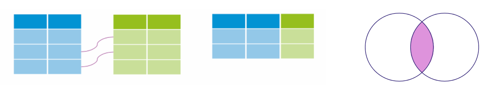
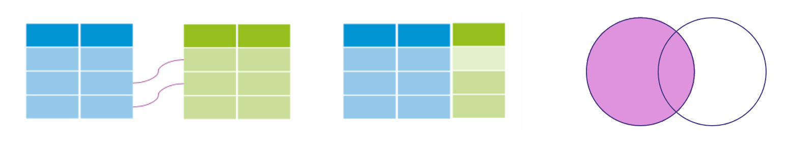
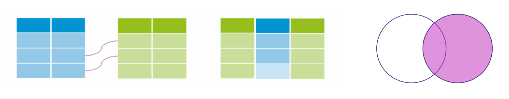
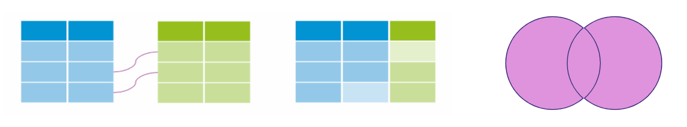

```{r setup, include=FALSE}
# Author: Russell McCreath
# Original Date: Feb 2022
# Version of R: 3.6.1

# See here for learnr package documentation: https://rstudio.github.io/learnr/

# Include packages here that are required throughout the training
library(learnr)         # Required to build the Shiny app
library(gradethis)      # For code checking and user-specific feedback
library(readr)          # For reading/writing data
library(RSQLite)        # For interfacing with SQLite databases
library(kableExtra)
library(shiny)

knitr::opts_chunk$set(echo = FALSE)

tutorial_options(
  exercise.checker = gradethis::grade_learnr
)

### Database Setup
# Load Borders data
borders_data <- readRDS("www/data/borders.rds")
# Load pantheon data
pantheon <- read_csv("www/data/gb_us_pantheon.csv")

# Create a connection to the database
conn <- dbConnect(RSQLite::SQLite(), ":memory:")

# Write Borders data into a table within the database
dbWriteTable(conn, "borders_data", borders_data, overwrite = TRUE)
# Write pantheon data into a table within the database
dbWriteTable(conn, "pantheon", pantheon, overwrite = TRUE)

# List tables available in the database
dbListTables(conn)
```


```{r phs-logo, echo=FALSE, fig.align='right', out.width="40%"}
knitr::include_graphics("images/phs-logo.png")
```

## Introduction

Welcome to **SQL in R**. This is a self-led course on accessing and utilising databases within Public Health Scotland, particularly SQL databases, in R. Throughout this course there will be quizzes to test your knowledge and opportunities to modify and write both R and SQL code. 

<div class="info_box">
  <h4>Course Info</h4>
  <ul>
    <li>This course is built to flow through sections and build on previous knowledge. If you're comfortable with a particular section, you can skip it.</li>
    <li>The course will also show progress through sections, a green tick will appear on sections you've completed, and it will remember your place if you decide to close your browser and come back later.</li>
  </ul>
</div>
</br>

### What is SQL?

SQL (you can read about the [pronounciation *conflict* here](https://database.guide/is-it-pronounced-s-q-l-or-sequel/)) is the **S**tructured **Q**uery **L**anguage used to interact with relational databases. This is, by far, the most popular database structure and for our purposes makes storing and interacting with data so much more efficient. 

A relational database is just like a collection of tables, rows and columns, like an Excel spreadsheet. Each table represents a single entity, columns (or fields) represent attributes, and rows (or records) represent information about a single entity. Have a look at the below table as an example, other tables in this database might include further information about the individual patients or Health Board areas (such as deprivation data):

```{r, echo=FALSE}
graphics_grammar_table <- data.frame(
  "ID" = c("1", "2", "3"),
  "Name" = c("Harry", "Luna", "Ronald"),
  "Specialty" = c("A1", "A11", "A2"),
  "LoS" = c("5", "7", "9"),
  "HB_Res" = c("S08000031", "S08000024", "S08000031"),
  "HB_Treat" = c("S08000031", "S08000031", "S08000031")
)

kableExtra::kbl(graphics_grammar_table) %>%
  kable_paper(full_width = FALSE)

```

```{r intro-quiz}
quiz(
  question("How many records are in the above table?",
           answer("0"),
           answer("1"),
           answer("2"),
           answer("3", correct = TRUE),
           answer("4"),
           incorrect = "Not quite, have another go!",
           allow_retry = TRUE,
           random_answer_order = FALSE
  ),
  question("What was the LoS (Length of Stay) for Luna?",
           answer("5"),
           answer("9"),
           answer("7", correct = TRUE),
           answer("2"),
           incorrect = "Not quite, have another go!",
           allow_retry = TRUE,
           random_answer_order = TRUE)
)
```

</br>

PHS have many databases for different purposes, with varying technical infrastructures (Oracle, PostgreSQL, MySQL) they all utilise a common language, SQL (albeit with some differences as things get more advanced). This course will minimise the need to interact with any live PHS database but still reference and make sure the knowledge gained is transferable. We'll stay practical in this course though, building knowledge and skill by:

1. Learning the basics of how to use SQL
2. Implementing SQL within R
3. Top it off with a Tidyverse package, [`dbplyr`](https://dbplyr.tidyverse.org/), used to interact with databases with the Tidyverse style of coding.

RStudio has functionality to make connecting to and interacting with databases slightly easier but the real power comes from including the SQL code in-line with your R code. This means there's no interruption to your workflow, you can include it within your automation pipelines, and add supporting data manipulation code in R. However, R relies on processing power and memory and larger data extracts can have an exponential impact on performance. We'll therefore go over writing efficient queries and other best practice to make our lives that bit easier. 


## Query Basics

The basics in this course start with understanding SQL, the language of interacting with databases. We can then plug this SQL into R to keep our code and workflows streamlined. However, as we're learning SQL, the syntax is quite different from R but with a straightforward structure, you're going to be able to do a lot with a little.

SQL can be used for creating and modifying databases but our focus will be querying databases. We work with and rely on data throughout our daily workload, and querying a database is how we can get this data from a database table (or combination of tables).

In the next couple of sections, we're going to be using the `pantheon` table, which is a list of well-known people from the United Kingdom and United States. There's some other variables but why don't you have a look yourself after running this SQL code to retrieve all the data from that table:

```{sql basics-1, connection="conn", exercise=TRUE}
SELECT * FROM pantheon;
```

</br>

```{r basics-1-quiz}
question("What is the listed occupation on the first record, that of Abraham Lincoln?",
         answer("President"),
         answer("Tennis Player"),
         answer("Politician", correct = TRUE),
         random_answer_order = TRUE)
```

```{r basics-welcome, echo=FALSE, fig.align='center', out.width="100%"}

```

### SELECT

`SELECT` and `FROM` are keywords in SQL, and make the foundation of a query. The `SELECT` statement refers to the attributes (columns) and the `FROM` is the table in the database where that data exists. This forms that most basic query. You can select some (or all) of the columns which will return a two-dimensional copy of the table with the columns requested and all the rows. To select all the columns, we use the wildcard character, asterisk (`*`):

```sql
-- This is a SQL comment
-- Selecting specific columns from the table
SELECT some_column, another_column, ...
FROM my_table;

-- Selecting all columns from the table
SELECT *
FROM my_table;
```

SQL keywords are not case-sensitive but it's here that we can introduce some of our best practice:

* Make SQL keyboards UPPER-CASE, this will distinguish them from other parts of your query.
* End queries with a semicolon, sometimes this is necessary to run the query, other times its not.
* We can already create efficiencies in our code at this stage. Limit the columns queried to what you require in your immediate workflow. If you want to explore/check the data across all columns, you can add a `LIMIT` to your query which will only pull the specified number of rows.

Feel free to play around with this on the `pantheon` table and then finish by creating a table of names (`name`), birth cities (`birthcity`), and occupations (`occupation`). Then, limit the number of results to 30:

```{sql, select-1, connection="conn", exercise=TRUE}
SELECT *
FROM pantheon
LIMIT 10;
```

```{sql, select-1-solution}
SELECT name, birthcity, occupation
FROM pantheon
LIMIT 30;
```

</br> 

#### DISTINCT

There may be a situation in which you need the unique values from a column, this is where the `DISTINCT` keyword comes in. As an example, we can get a list of all industries from the `pantheon` table:

```{sql distinct-1, connection="conn", exercise=TRUE}
SELECT DISTINCT industry
FROM pantheon;
```

*`DISTINCT` is attached to the column that you're looking for unique values from. This will completely remove any rows that are duplicated based on that simple identification. Later on, we'll find out about grouping (`GROUP_BY`).*

Now, `DISTINCT` needs to be used with care. To use it, the database system has to use a lot of processing and memory as literally every row is compared. It can also be misused based on how the rest of the query is created, `DISTINCT` will not resolve problems in your code. Only use `DISTINCT` where there are genuine duplicates in the data.

</br> 

#### COUNT

Occasionally, it's not even the data that we need, it's the number of records that match the query in the specified table. This is where the `COUNT()` function comes in, and as we learn more about forming SQL queries, each of these components can be used in different ways to return our desired result.

```sql
-- Count total number of rows in a table
SELECT COUNT(*) FROM my_table;

-- Count non-missing values of specific attribute
SELECT COUNT(column) FROM my_table;

-- Count the number of distinct values in a column
SELECT COUNT(DISTINCT column) FROM my_table;
```

Now, to get practical, let's get the number of unique cities (`birthcity`) from the `pantheon` table:

```{sql count-1, connection="conn", exercise=TRUE}

```

```{sql count-1-solution}
SELECT COUNT(DISTINCT birthcity)
FROM pantheon;
```


### WHERE

<div class="supporting-image-right">
```{r where-image, echo=FALSE, fig.align='center', out.width="90%"}

```
</div>

We often deal with datasets with millions of rows but it's not very often we need every row. It's much more efficient to only extract the data that we need. We can do this by adding constraints with the `WHERE` clause as part of your query. The clause is then applied to each record to determine if that record is included in the results, all at the database system side. This means that no processing is required locally and that only the required data is transferred. 


```sql
-- Selecting specific columns from the table with constraints
SELECT some_column, another_column, ...
FROM my_table
WHERE condition
  AND/OR another_condition
  ...;
```

</br>

We now need to focus on creating the conditions, these will have a familiar logic. Below are some useful operators to start us off:

| Numeric Operator  | Condition                               | Example       |
| :---------------: | --------------------------------------- | ------------- |
| `=`  `<>` | Equal to and not equal to | `col <> 100` |
| `<`  `<=`  `>`  `>=` | Comparison operators |   `col >= 18` |
| `BETWEEN ... AND ...` | Within inclusive range of 2 values | `col BETWEEN 0 AND 5.5` |
| `NOT BETWEEN ... AND ...` | Not within inclusive range of 2 values | `col NOT BETWEEN 0 AND 5.5` |
| `IN (...)` | Exists within list (short for multiple OR conditions) | `col IN (2, 4, 6)` |
| `NOT IN (...)` | Doesn't exist within list | `col NOT IN (1, 3, 5)` |


| String Operator  | Condition                               | Example       |
| :---------------: | --------------------------------------- | ------------- |
| `=`  `<>` | Equal to and not equal to | `col <> 'Glasgow'` |
| `LIKE` | Case insensitive exact string comparison |   `col LIKE 'Glasgow'` |
| `NOT LIKE` | Case insensitive exact string inequality comparison |   `col NOT LIKE 'Glasgow'` |
| `%` | Used anywhere in a string to match a sequence of zero or more characters (only with LIKE or NOT LIKE) | `col LIKE '%AT%'` (matches "AT", "ATTIC", "CAT" or "BATS") |
| `_` | Used anywhere in a string to match a single character (only with LIKE or NOT LIKE) | `col LIKE 'AN_'` (matches "AND", but not "AN") |
| `IN (...)` | Exists within list (short for multiple OR conditions) | `col IN ('EDI', 'GLA')` |
| `NOT IN (...)` | Doesn't exist within list | `col NOT IN ('G', 'E', 'A')` |

*For most purposes, this implementation of text search is efficient and works well. However, if the workflow becomes more specified, there are dedicated libraries designed around full text search.*

To test what we've been learning, build a query with the following constraints on the `pantheon` table:

* `birthcity` contains "burgh" in the name
* `domain` is the Arts
* `birthyear` is in the 1920s

```{sql where-1, connection="conn", exercise=TRUE}

```

```{sql where-1-hint-1}
SELECT name
FROM pantheon
WHERE birthcity ___
    AND domain ___
    AND birthyear ___
```

```{sql where-1-hint-2}
SELECT name
FROM pantheon
WHERE birthcity LIKE ___
    AND domain = ___
    AND birthyear BETWEEN ___
```

```{sql where-1-solution}
SELECT name
FROM pantheon
WHERE birthcity LIKE '%burgh%'
    AND domain = 'Arts'
    AND birthyear BETWEEN 1920 AND 1929;
```

```{r where-1-quiz}
question("Who is the result of the above query?",
         answer("Gene Kelly"),
         answer("F. Murray Abraham"),
         answer("Stuart Sutcliffe"),
         answer("Andy Warhol", correct = TRUE),
         random_answer_order = TRUE)
```

### ORDER BY

The final, and short, section on basics is about ordering. This isn't always necessary as part of a larger piece of work but can save time if you're looking to prettify a data dump without having to do anything else locally. This is achieved by using `ORDER_BY` which defaults to ascending order but you can append a `DESC` keyword after any of the specified columns to achieve a descending order.

```sql
SELECT some_column, another_column, ...
FROM my_table
WHERE condition(s)
ORDER BY some_column, another_column DESC;
-- some_column defaults to ASC (ascending) order
```


## Aggregate Queries

SQL also has the power to provide summarised information through aggregate expressions, rather than just returning the raw data from the database. Here's the template syntax and a list of the most common aggregate functions.

```sql
SELECT AGR_FUNC(column_or_expression), ...
FROM my_table
WHERE condition(s);
```

| Function          | Description                             | 
| :---------------: | --------------------------------------- | 
| `COUNT(*)` | A count of the total number of rows |
| `COUNT(some_column)` | A count of the total number of non-NULL rows from the specified column |
| `MIN(some_column)` | The smallest numerical value from the specified column |
| `MAX(some_column)` | The largest numerical value from the specified column |
| `AVG(some_column)` | The average numerical value from the specified column |
| `SUM(some_column)` | The total sum of all numerical values from the specified column |

#### AS 

Aggregate functions allow you to write efficient queries that save time and processing power locally. However, this can make the SQL and its output harder to read or understand. We can solve this using aliasing (`AS`). To do this, we provide an alias to any part of the `SELECT` line, including column names and our aggregate functions.

To get familiar, let's return the average birth year (`birthyear`) as "Average Birth Year of UK Writers". This will include writers (`occupation`) born in the United Kingdom (`countryName`) from the `pantheon` table. 

```{sql agr-1, connection="conn", exercise=TRUE}

```

```{sql agr-1-hint-1}
SELECT ___
FROM pantheon
WHERE occupation ___
    AND countryName ___
```

```{sql agr-1-hint-2}
SELECT AVG(birthyear) ___
FROM pantheon
WHERE occupation LIKE "writer"
    AND countryName LIKE "United Kingdom"
```

```{sql agr-1-solution}
SELECT AVG(birthyear) AS "Average Birth Year of UK Writers"
FROM pantheon
WHERE occupation LIKE "writer"
    AND countryName LIKE "United Kingdom";
```

</br> 

### GROUP BY

What's even more useful, perhaps, is the ability to perform these aggregate functions over groups. Similar to how `dplyr::group_by` works, you select the column(s) and every unique group will be generated by the `GROUP BY` clause. Here's some more template syntax:

```sql
SELECT AGR_FUNC(column_or_expression) AS agr_description, ...
FROM my_table
WHERE condition(s)
GROUP BY some_column;
```

</br>

Taking a slightly different version of the problem from the last section, let's find the youngest (`birthyear`) writers (`occupation`) from the UK and US (`countryName`) in the `pantheon` dataset, including a split on gender (`gender`). Let's be explicit and include details in the output such as writer's name (`name`). Think about assigning an alias to any columns too (*note: you can refer to the original column name or alias throughout the rest of your query*)

```{sql agr-2, connection="conn", exercise=TRUE}

```

```{sql agr-2-hint-1}
SELECT name AS Name,
        gender AS Sex, 
        countryName AS "Country of Birth", 
        ___(birthyear) AS "Birth Year"
FROM pantheon
WHERE occupation LIKE "writer"
___
```

```{sql agr-2-hint-2}
SELECT name AS Name,
        gender AS Sex, 
        countryName AS "Country of Birth", 
        MAX(birthyear) AS "Birth Year"
FROM pantheon
WHERE occupation LIKE "writer"
___
```

```{sql agr-2-hint-3}
SELECT name AS Name,
        gender AS Sex, 
        countryName AS "Country of Birth", 
        MAX(birthyear) AS "Birth Year"
FROM pantheon
WHERE occupation LIKE "writer"
GROUP BY ___
```

```{sql agr-2-solution}
SELECT name AS Name, 
        gender AS Sex, 
        countryName AS "Country of Birth", 
        MAX(birthyear) AS "Birth Year"
FROM pantheon
WHERE occupation LIKE "writer"
GROUP BY countryName, gender
```


#### HAVING

With all of this syntax under our belts, our queries can get quite complex. Something that you may encounter is the need to filter rows after your `WHERE` clause, and after they've been grouped and you've used an aggregate function. That's where the `HAVING` clause comes in and works with `GROUP BY` to filter the grouped rows exactly like we would with the `WHERE` clause.

```sql
SELECT group_column, AGR_FUNC(column_or_expression) AS agr_description, ...
FROM my_table
WHERE condition(s)
GROUP BY some_column
HAVING condition(s);
```

As an example, see if you can alter this query to list those occupations where there is more than 50 people. Then, order the table in descending count order.

```{sql agr-3, connection="conn", exercise=TRUE}
SELECT occupation, COUNT(occupation) AS number
FROM pantheon
WHERE birthyear > 1920
GROUP BY occupation;
```

```{sql agr-3-solution}
SELECT occupation, COUNT(occupation) AS number
FROM pantheon
WHERE birthyear > 1920
GROUP BY occupation
HAVING count(occupation) > 50
ORDER BY Number DESC;
```

### Summary

Now is a good point to reflect on our journey with SQL so far. We've looked at a complete SQL query:

```sql
SELECT DISTINCT some_column, AGR_FUNC(column_or_expression) AS agr_description, ...
FROM my_table
WHERE condition(s)
GROUP BY some_column
HAVING condition(s)
ORDER BY some_column ASC/DESC
LIMIT x OFFSET y;
```

However, you may have noticed that has only included a single table, we'll next take a look at how to query multiple related tables and join the data together. Before that, lets run through some questions and check the knowledge we've been building.

```{r queries-quiz}
quiz(
  question("In `SELECT * FROM patients;` what does patients represent?",
    answer("SQL query"),
    answer("SQL statement"),
    answer("Database"),
    answer("Table", correct = TRUE),
    incorrect = "Not quite, have another go!",
    allow_retry = TRUE,
    random_answer_order = TRUE
  ),
  question("What does the following SQL statement return? `SELECT * FROM patients WHERE name LIKE 'a%'`",
    answer("It records in the patients table where the value in the name column doesn't have an 'a'."),
    answer("It records in the patients table where the value in the name column has an 'a'."),
    answer("It records in the patients table where the value in the name column ends with 'a'."),
    answer("It records in the patients table where the value in the name column starts with 'a'.", correct = TRUE),
    incorrect = "Not quite, have another go!",
    allow_retry = TRUE,
    random_answer_order = TRUE
  ),
  question("Which choice is NOT a statement you would use to filter data?",
    answer("`WHERE`"),
    answer("`LIMIT`"),
    answer("`LIKE`"),
    answer("`GROUP_BY`", correct = TRUE),
    incorrect = "Not quite, have another go!",
    allow_retry = TRUE,
    random_answer_order = TRUE
  ),
  question("How can you filter duplicate data while retrieving records from a table?",
    answer("`WHERE`"),
    answer("`LIMIT`"),
    answer("`AS`"),
    answer("`DISTINCT`", correct = TRUE),
    incorrect = "Not quite, have another go!",
    allow_retry = TRUE,
    random_answer_order = TRUE
  ),
  question("How do you select every row in a given table named 'hospitals'?",
    answer("`SELECT all FROM hospitals;`"),
    answer("`FROM hospitals SELECT all;`"),
    answer("`FROM hospitals SELECT *;`"),
    answer("`SELECT * FROM hospitals;`", correct = TRUE),
    incorrect = "Not quite, have another go!",
    allow_retry = TRUE,
    random_answer_order = TRUE
  )
)
```


## Joins

Data is often split across multiple tables in a database as a result of a process known as [normalisation](https://docs.microsoft.com/en-us/office/troubleshoot/access/database-normalization-description). This is useful as it minimises duplication of data and simplifies the addition of new data. In some cases our internal databases have views created where tables are already joined but knowing how joins work and how to handle them will be useful.

Now, these tables that share information need to have a *primary key* that uniquely identifies the entity across the database. Commonly, this is a increasing integer referred to as an ID, but can be anything that is unique, e.g. a CHI number. 

### INNER JOIN

The first type of join we're going to look at is the inner join. This process involves matching rows from the first table with the second to create a combination, where there is a match existing in both on the given key (defined by the `ON` constraint). The other arguments we learned about in the previous sections can then be applied as required.

```{r join-inner, echo=FALSE, fig.align='center', out.width="100%"}

```

```sql
SELECT some_column_table1, another_column_table2, ...
FROM my_table
INNER JOIN another_table
  ON my_table.id = another_table.id;
```

*You may see queries where an `INNER JOIN` is simply written as `JOIN`. This is the default behaviour, however, it's better practice to be explicit.*

#### USING

The IDs from each table don't have to have the same name, this is where the explicit naming of the columns using the `ON` keyword works well. However, it's likely that the columns will have the same name as they are referring to the same thing. When this happens we can use the `USING` keyword and just include the common column name within brackets, like this:

```sql
SELECT some_column_table1, another_column_table2, ...
FROM my_table
INNER JOIN another_table
  USING (id);
```

### OUTER JOINS

Restricting the data to what's available in both tables might not always be suitable. If the tables are asymmetrical then you might need to use an outer join: left join, right join, or full join. 

#### LEFT JOIN

When joining table A to table B, a `LEFT JOIN` includes all rows from A regardless of if a matching row is found in B. 

```{r join-left, echo=FALSE, fig.align='center', out.width="100%"}

```

```sql
SELECT some_column_table1, another_column_table2, ...
FROM my_table
LEFT JOIN another_table
  ON my_table.id = another_table.id;
```

</br>

#### RIGHT JOIN

The `RIGHT JOIN` is the same as `LEFT JOIN` but reversed. This means that all rows are kept from table B regardless of if a matching row is found in A.

```{r join-right, echo=FALSE, fig.align='center', out.width="100%"}

```

```sql
SELECT some_column_table1, another_column_table2, ...
FROM my_table
RIGHT JOIN another_table
  ON my_table.id = another_table.id;
```

</br>

#### FULL JOIN

A `FULL JOIN` means that all rows from both tables are kept regardless of any match from either side. 

```{r join-full, echo=FALSE, fig.align='center', out.width="100%"}

```

```sql
SELECT some_column_table1, another_column_table2, ...
FROM my_table
FULL JOIN another_table
  ON my_table.id = another_table.id;
```

## Connect


## Help & Feedback

#### Feedback

[Insert iframe for Google/Microsoft Forms]

