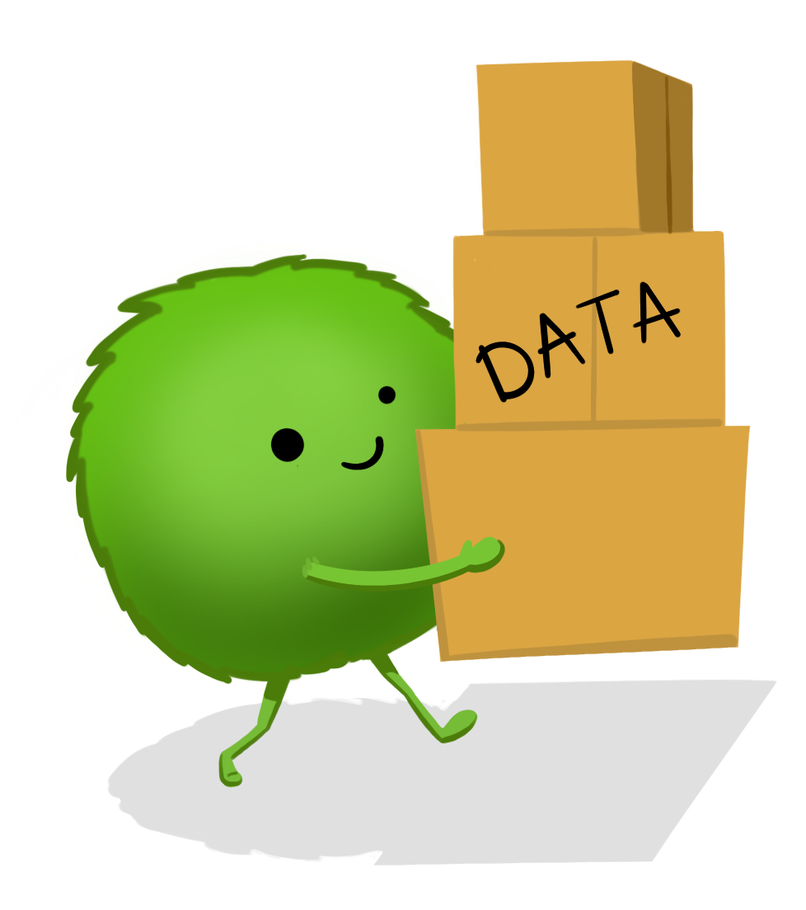
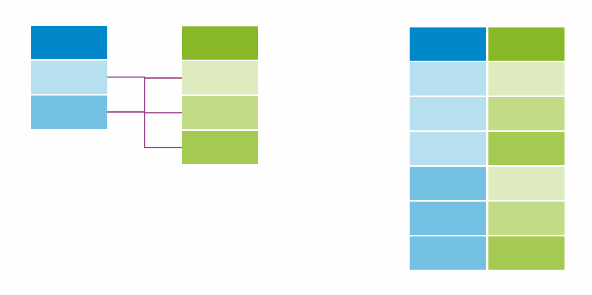

```{r setup, include=FALSE}
# Author: Russell McCreath
# Original Date: Feb 2022
# Version of R: 3.6.1

# See here for learnr package documentation: https://rstudio.github.io/learnr/

# Include packages here that are required throughout the training
library(learnr)         # Required to build the Shiny app
library(gradethis)      # For code checking and user-specific feedback
library(readr)          # For reading/writing data
library(RSQLite)        # For interfacing with SQLite databases
library(odbc)           # For interacting with databases
library(kableExtra)
library(shiny)
library(dplyr)
library(dbplyr)

knitr::opts_chunk$set(echo = FALSE)

tutorial_options(
  exercise.checker = gradethis::grade_learnr
)

### Database Setup
# Load Borders data
borders_data <- readRDS("www/data/borders.rds")
# Load pantheon data
pantheon <- read_csv("www/data/gb_us_pantheon.csv")
# Load baby names data
baby <- read_csv("www/data/Baby5.csv")
baby_family <- read_csv("www/data/Baby6.csv") %>%
  select(FAMILYID, SURNAME)
# Load hospital lookup data
hospital_lookup <- read_csv("www/data/hospital_lookup.csv")

# Create a connection to the database
conn <- dbConnect(RSQLite::SQLite(), ":memory:")

# Write Borders data into a table within the database
dbWriteTable(conn, "borders_data", borders_data, overwrite = TRUE)
# Write pantheon data into a table within the database
dbWriteTable(conn, "pantheon", pantheon, overwrite = TRUE)
# Write baby data into a table within the database
dbWriteTable(conn, "baby", baby, overwrite = TRUE)
dbWriteTable(conn, "baby_family", baby_family, overwrite = TRUE)
# Write hospital lookup data into a table within the database
dbWriteTable(conn, "hospital_lookup", hospital_lookup, overwrite = TRUE)

# List tables available in the database
dbListTables(conn)
```

```{r phs-logo, echo=FALSE, fig.align='right', out.width="40%"}
knitr::include_graphics("images/phs-logo.png")
```

## Introduction

Welcome to **SQL in R**. This is a self-led course on accessing and utilising databases within Public Health Scotland, specifically SQL databases, in R. The first part is a complete introductory course on SQL, then the knowledge of integrating that within R is next. Throughout this course there will be quizzes to test your knowledge and opportunities to modify and write both R and SQL code. 

<div class="info_box">
  <h4>Course Info</h4>
  <ul>
    <li>This course is built to flow through sections and build on previous knowledge. If you're comfortable with a particular section, you can skip it.</li>
    <li>The course will also show progress through sections, a green tick will appear on sections you've completed, and it will remember your place if you decide to close your browser and come back later.</li>
  </ul>
</div>
</br>

### What is SQL?

SQL (you can read about the [pronounciation *conflict* here](https://database.guide/is-it-pronounced-s-q-l-or-sequel/)) is the **S**tructured **Q**uery **L**anguage used to interact with relational databases. This is, by far, the most popular database structure and for our purposes makes storing and interacting with data so much more efficient. 

<div class="supporting-image-right">
```{r intro-image, echo=FALSE, fig.align='center', out.width="90%"}

```
</div>

A relational database is just like a collection of tables, rows and columns, like an Excel spreadsheet. Each table represents a single entity, columns (or fields) represent attributes, and rows (or records) represent information about a single entity. The columns then have rules applied to show what kind of data they should contain, e.g. a text string that is maximum 4 characters long, or a number less than 10. Other rules and logic can also be applied to the setup of the database to ensure consistency and accuracy of data. Have a look at the below table as an example, other tables in this database might include further information about the individual patients or Health Board areas (such as deprivation data):

```{r, echo=FALSE}
graphics_grammar_table <- data.frame(
  "ID" = c("1", "2", "3"),
  "Name" = c("Harry", "Luna", "Ronald"),
  "Specialty" = c("A1", "A11", "A2"),
  "LoS" = c("5", "7", "9"),
  "HB_Res" = c("S08000031", "S08000024", "S08000031"),
  "HB_Treat" = c("S08000031", "S08000031", "S08000031")
)

kableExtra::kbl(graphics_grammar_table) %>%
  kable_paper(full_width = FALSE)

```

```{r intro-quiz}
quiz(
  question("How many records are in the above table?",
           answer("0"),
           answer("1"),
           answer("2"),
           answer("3", correct = TRUE),
           answer("4"),
           incorrect = "Not quite, have another go!",
           allow_retry = TRUE,
           random_answer_order = FALSE
  ),
  question("What was the LoS (Length of Stay) for Luna?",
           answer("5"),
           answer("9"),
           answer("7", correct = TRUE),
           answer("2"),
           incorrect = "Not quite, have another go!",
           allow_retry = TRUE,
           random_answer_order = TRUE)
)
```

</br>

PHS have many databases for different purposes, with varying technical infrastructures (Oracle, PostgreSQL, MySQL). All of these utilise a common language, SQL although there are differences as things get more advanced. This course will minimise the need to interact with any live PHS database but will still reference familiar databases and make sure the knowledge gained is transferable. We’ll stay practical in this course though, building knowledge and skill by:

1. **Learning SQL**
    * [Query Basics](#query-basics)
    * [Aggregate Queries](#aggregate-queries)
    * [Joins](#joins)
    * [Subqueries](#subqueries)
    * [Table Management](#table-management)
2. **Implementing SQL within R** 
    * [SQL in R](#sql-in-r)
3. Top it off with a **Tidyverse package, [`dbplyr`](https://dbplyr.tidyverse.org/),** used to interact with databases with the Tidyverse style of coding 
    * [Tidyverse](#tidyverse)

RStudio has functionality to make connecting to and interacting with databases slightly easier but the real power comes from including the SQL code in-line with your R code. This means there’s no interruption to your workflow as you can include it within your automation pipelines, and add supporting data manipulation code in R. However, R relies on processing power and memory and larger data extracts can have an exponential impact on performance. We’ll therefore go over writing efficient queries and other best practice to make our lives that bit easier.


## Query Basics

The basics in this course start with understanding SQL, the language of interacting with databases. We can then plug this SQL into R to keep our code and workflows streamlined. However, as we're learning SQL, the syntax is quite different from R but with a straightforward structure, you're going to be able to do a lot with a little.

SQL can be used for creating and modifying databases but our focus will be querying databases. We work with and rely on data throughout our daily workload, and querying a database is how we can get this data from a database table (or combination of tables).

In the next couple of sections, we're going to be using the `pantheon` table, which is a list of well-known people from the United Kingdom and United States. There's some other variables but why don't you have a look yourself after running this SQL code to retrieve all the data from that table:

```{sql basics-1, connection="conn", exercise=TRUE}
SELECT * FROM pantheon;
```

</br>

```{r basics-1-quiz}
question("What is the listed occupation on the first record, that of Abraham Lincoln?",
         answer("President"),
         answer("Tennis Player"),
         answer("Politician", correct = TRUE),
         random_answer_order = TRUE)
```

```{r basics-welcome, echo=FALSE, fig.align='center', out.width="100%"}
knitr::include_graphics("images/sql/tables-welcome.png")
```

</br>

### SELECT

`SELECT` and `FROM` are keywords in SQL, and make the foundation of a query. The `SELECT` statement refers to the attributes (columns) and the `FROM` is the table in the database where that data exists. This forms that most basic query. You can select some (or all) of the columns which will return a two-dimensional copy of the table with the columns requested and all the rows. To select all the columns, we use the wildcard character, asterisk (`*`):

```sql
-- This is a SQL comment
-- Selecting specific columns from the table
SELECT some_column, another_column, ...
FROM my_table;

-- Selecting all columns from the table
SELECT *
FROM my_table;
```

SQL keywords are not case-sensitive but it's here that we can introduce some of our best practice:

* Make SQL keyboards UPPER-CASE, this will distinguish them from other parts of your query.
* End queries with a semicolon, sometimes this is necessary to run the query, other times its not.
* We can already create efficiencies in our code at this stage. Limit the columns queried to what you require in your immediate workflow. If you want to explore/check the data across all columns, you can add a `LIMIT` to your query which will only pull the specified number of rows.

Feel free to play around with this on the `pantheon` table and then finish by creating a table of names (`name`), birth cities (`birthcity`), and occupations (`occupation`). Then, limit the number of results to 30:

```{sql, select-1, connection="conn", exercise=TRUE}
SELECT *
FROM pantheon
LIMIT 10;
```

```{sql, select-1-solution}
SELECT name, birthcity, occupation
FROM pantheon
LIMIT 30;
```

</br> 

#### DISTINCT

There may be a situation in which you need the unique values from a column, this is where the `DISTINCT` keyword comes in. As an example, we can get a list of all industries from the `pantheon` table:

```{sql distinct-1, connection="conn", exercise=TRUE}
SELECT DISTINCT industry
FROM pantheon;
```

*`DISTINCT` is attached to the column that you're looking for unique values from. This will completely remove any rows that are duplicated based on that simple identification. Later on, we'll find out about grouping (`GROUP_BY`).*

Now, `DISTINCT` needs to be used with care. To use it, the database system has to use a lot of processing and memory as literally every row is compared. It can also be misused based on how the rest of the query is created, `DISTINCT` will not resolve problems in your code. Only use `DISTINCT` where there are genuine duplicates in the data.

</br> 

#### COUNT

Occasionally, it's not even the data that we need, it's the number of records that match the query in the specified table. This is where the `COUNT()` function comes in, and as we learn more about forming SQL queries, each of these components can be used in different ways to return our desired result.

```sql
-- Count total number of rows in a table
SELECT COUNT(*) FROM my_table;

-- Count non-missing values of specific attribute
SELECT COUNT(column) FROM my_table;

-- Count missing values of a specific attribute (more on WHERE next)
SELECT COUNT(column) FROM my_table WHERE column IS NULL;

-- Count the number of distinct values in a column
SELECT COUNT(DISTINCT column) FROM my_table;
```

Now, to get practical, let's get the number of unique cities (`birthcity`) from the `pantheon` table:

```{sql count-1, connection="conn", exercise=TRUE}

```

```{sql count-1-solution}
SELECT COUNT(DISTINCT birthcity)
FROM pantheon;
```

</br>

### WHERE

<div class="supporting-image-right">
```{r where-image, echo=FALSE, fig.align='center', out.width="90%"}
knitr::include_graphics("images/sql/where.jpg")
```
</div>

We often deal with datasets with millions of rows but it's not very often we need every row. It's much more efficient to only extract the data that we need. We can do this by adding constraints with the `WHERE` clause as part of your query. The clause is then applied to each record to determine if that record is included in the results, all at the database system side. This means that no processing is required locally and that only the required data is transferred. 

```sql
-- Selecting specific columns from the table with constraints
SELECT some_column, another_column, ...
FROM my_table
WHERE condition
  AND/OR another_condition
  ...;
```

</br>

We now need to focus on creating the conditions, these will have a familiar logic. Below are some useful operators to start us off:

| Numeric Operator  | Condition                               | Example       |
| :---------------: | --------------------------------------- | ------------- |
| `=`  `<>` | Equal to and not equal to | `col <> 100` |
| `<`  `<=`  `>`  `>=` | Comparison operators |   `col >= 18` |
| `BETWEEN ... AND ...` | Within inclusive range of 2 values | `col BETWEEN 0 AND 5.5` |
| `NOT BETWEEN ... AND ...` | Not within inclusive range of 2 values | `col NOT BETWEEN 0 AND 5.5` |
| `IN (...)` | Exists within list (short for multiple OR conditions) | `col IN (2, 4, 6)` |
| `NOT IN (...)` | Doesn't exist within list | `col NOT IN (1, 3, 5)` |


| String Operator  | Condition                               | Example       |
| :---------------: | --------------------------------------- | ------------- |
| `=`  `<>` | Equal to and not equal to | `col <> 'Glasgow'` |
| `LIKE` | Case insensitive exact string comparison |   `col LIKE 'Glasgow'` |
| `NOT LIKE` | Case insensitive exact string inequality comparison |   `col NOT LIKE 'Glasgow'` |
| `%` | Used anywhere in a string to match a sequence of zero or more characters (only with LIKE or NOT LIKE) | `col LIKE '%AT%'` (matches "AT", "ATTIC", "CAT" or "BATS") |
| `_` | Used anywhere in a string to match a single character (only with LIKE or NOT LIKE) | `col LIKE 'AN_'` (matches "AND", but not "AN") |
| `IN (...)` | Exists within list (short for multiple OR conditions) | `col IN ('EDI', 'GLA')` |
| `NOT IN (...)` | Doesn't exist within list | `col NOT IN ('G', 'E', 'A')` |

*For most purposes, this implementation of text search is efficient and works well. However, if the workflow becomes more specified, there are dedicated libraries designed around full text search.*

To test what we've been learning, build a query with the following constraints on the `pantheon` table:

* `birthcity` contains "burgh" in the name
* `domain` is the Arts
* `birthyear` is in the 1920s

```{sql where-1, connection="conn", exercise=TRUE}

```

```{sql where-1-hint-1}
SELECT name
FROM pantheon
WHERE birthcity ___
    AND domain ___
    AND birthyear ___
```

```{sql where-1-hint-2}
SELECT name
FROM pantheon
WHERE birthcity LIKE ___
    AND domain = ___
    AND birthyear BETWEEN ___
```

```{sql where-1-solution}
SELECT name
FROM pantheon
WHERE birthcity LIKE '%burgh%'
    AND domain = 'Arts'
    AND birthyear BETWEEN 1920 AND 1929;
```

```{r where-1-quiz}
question("Who is the result of the above query?",
         answer("Gene Kelly"),
         answer("F. Murray Abraham"),
         answer("Stuart Sutcliffe"),
         answer("Andy Warhol", correct = TRUE),
         random_answer_order = TRUE)
```

</br>

### ORDER BY

The final, and short, section on basics is about ordering. This isn't always necessary as part of a larger piece of work but can save time if you're looking to prettify a data dump without having to do anything else locally. This is achieved by using `ORDER_BY` which defaults to ascending order but you can append a `DESC` keyword after any of the specified columns to achieve a descending order.

```sql
SELECT some_column, another_column, ...
FROM my_table
WHERE condition(s)
ORDER BY some_column, another_column DESC;
-- some_column defaults to ASC (ascending) order
```


## Aggregate Queries

SQL also has the power to provide summarised information through aggregate expressions, rather than just returning the raw data from the database. Here's the template syntax and a list of the most common aggregate functions.

```sql
SELECT AGR_FUNC(column_or_expression), ...
FROM my_table
WHERE condition(s);
```

| Function          | Description                             | 
| :---------------: | --------------------------------------- | 
| `COUNT(*)` | A count of the total number of rows |
| `COUNT(some_column)` | A count of the total number of non-NULL rows from the specified column |
| `MIN(some_column)` | The smallest numerical value from the specified column |
| `MAX(some_column)` | The largest numerical value from the specified column |
| `AVG(some_column)` | The average numerical value from the specified column |
| `SUM(some_column)` | The total sum of all numerical values from the specified column |

#### AS 

Aggregate functions allow you to write efficient queries that save time and processing power locally. However, this can make the SQL and its output harder to read or understand. We can solve this using aliasing (`AS`). To do this, we provide an alias to any part of the `SELECT` line, including column names and our aggregate functions.

To get familiar, let's return the average birth year (`birthyear`) as "Average Birth Year of UK Writers". This will include writers (`occupation`) born in the United Kingdom (`countryName`) from the `pantheon` table. 

```{sql agr-1, connection="conn", exercise=TRUE}

```

```{sql agr-1-hint-1}
SELECT ___
FROM pantheon
WHERE occupation ___
    AND countryName ___
```

```{sql agr-1-hint-2}
SELECT AVG(birthyear) ___
FROM pantheon
WHERE occupation LIKE "writer"
    AND countryName LIKE "United Kingdom"
```

```{sql agr-1-solution}
SELECT AVG(birthyear) AS "Average Birth Year of UK Writers"
FROM pantheon
WHERE occupation LIKE "writer"
    AND countryName LIKE "United Kingdom";
```

</br> 

### GROUP BY

What's even more useful, perhaps, is the ability to perform these aggregate functions over groups. Similar to how `dplyr::group_by` works, you select the column(s) and every unique group will be generated by the `GROUP BY` clause. Here's some more template syntax:

```sql
SELECT AGR_FUNC(column_or_expression) AS agr_description, ...
FROM my_table
WHERE condition(s)
GROUP BY some_column;
```

</br>

Taking a slightly different version of the problem from the last section, let's find the youngest (`birthyear`) writers (`occupation`) from the UK and US (`countryName`) in the `pantheon` dataset, including a split on gender (`gender`). Let's be explicit and include details in the output such as writer's name (`name`). Think about assigning an alias to any columns too (*note: you can refer to the original column name or alias throughout the rest of your query*)

```{sql agr-2, connection="conn", exercise=TRUE}

```

```{sql agr-2-hint-1}
SELECT name AS Name,
        gender AS Sex, 
        countryName AS "Country of Birth", 
        ___(birthyear) AS "Birth Year"
FROM pantheon
WHERE occupation LIKE "writer"
___
```

```{sql agr-2-hint-2}
SELECT name AS Name,
        gender AS Sex, 
        countryName AS "Country of Birth", 
        MAX(birthyear) AS "Birth Year"
FROM pantheon
WHERE occupation LIKE "writer"
___
```

```{sql agr-2-hint-3}
SELECT name AS Name,
        gender AS Sex, 
        countryName AS "Country of Birth", 
        MAX(birthyear) AS "Birth Year"
FROM pantheon
WHERE occupation LIKE "writer"
GROUP BY ___
```

```{sql agr-2-solution}
SELECT name AS Name, 
        gender AS Sex, 
        countryName AS "Country of Birth", 
        MAX(birthyear) AS "Birth Year"
FROM pantheon
WHERE occupation LIKE "writer"
GROUP BY countryName, gender
```

</br>

#### HAVING

With all of this syntax under our belts, our queries can get quite complex. Something that you may encounter is the need to filter rows after your `WHERE` clause, and after they've been grouped and you've used an aggregate function. That's where the `HAVING` clause comes in and works with `GROUP BY` to filter the grouped rows exactly like we would with the `WHERE` clause.

```sql
SELECT group_column, AGR_FUNC(column_or_expression) AS agr_description, ...
FROM my_table
WHERE condition(s)
GROUP BY some_column
HAVING condition(s);
```

As an example, see if you can alter this query to list those occupations where there is more than 50 people. Then, order the table in descending count order.

```{sql agr-3, connection="conn", exercise=TRUE}
SELECT occupation, COUNT(occupation) AS number
FROM pantheon
WHERE birthyear > 1920
GROUP BY occupation;
```

```{sql agr-3-solution}
SELECT occupation, COUNT(occupation) AS number
FROM pantheon
WHERE birthyear > 1920
GROUP BY occupation
HAVING count(occupation) > 50
ORDER BY Number DESC;
```

</br>

### Summary

Now is a good point to reflect on our journey with SQL so far. We've looked at a complete SQL query:

```sql
SELECT DISTINCT some_column, AGR_FUNC(column_or_expression) AS agr_description, ...
FROM my_table
WHERE condition(s)
GROUP BY some_column
HAVING condition(s)
ORDER BY some_column ASC/DESC
LIMIT x OFFSET y;
```

However, you may have noticed that has only included a single table, we'll next take a look at how to query multiple related tables and join the data together. Before that, lets run through some questions and check the knowledge we've been building.

```{r queries-quiz}
quiz(
  question("In `SELECT * FROM patients;` what does patients represent?",
    answer("SQL query"),
    answer("SQL statement"),
    answer("Database"),
    answer("Table", correct = TRUE),
    incorrect = "Not quite, have another go!",
    allow_retry = TRUE,
    random_answer_order = TRUE
  ),
  question("What does the following SQL statement return? `SELECT * FROM patients WHERE name LIKE 'a%'`",
    answer("It records in the patients table where the value in the name column doesn't have an 'a'."),
    answer("It records in the patients table where the value in the name column has an 'a'."),
    answer("It records in the patients table where the value in the name column ends with 'a'."),
    answer("It records in the patients table where the value in the name column starts with 'a'.", correct = TRUE),
    incorrect = "Not quite, have another go!",
    allow_retry = TRUE,
    random_answer_order = TRUE
  ),
  question("Which choice is NOT a statement you would use to filter data?",
    answer("`WHERE`"),
    answer("`LIMIT`"),
    answer("`LIKE`"),
    answer("`GROUP_BY`", correct = TRUE),
    incorrect = "Not quite, have another go!",
    allow_retry = TRUE,
    random_answer_order = TRUE
  ),
  question("How can you filter duplicate data while retrieving records from a table?",
    answer("`WHERE`"),
    answer("`LIMIT`"),
    answer("`AS`"),
    answer("`DISTINCT`", correct = TRUE),
    incorrect = "Not quite, have another go!",
    allow_retry = TRUE,
    random_answer_order = TRUE
  ),
  question("How do you select every row in a given table named 'hospitals'?",
    answer("`SELECT all FROM hospitals;`"),
    answer("`FROM hospitals SELECT all;`"),
    answer("`FROM hospitals SELECT *;`"),
    answer("`SELECT * FROM hospitals;`", correct = TRUE),
    incorrect = "Not quite, have another go!",
    allow_retry = TRUE,
    random_answer_order = TRUE
  )
)
```


## Joins

Data is often split across multiple tables in a database as a result of a process known as [normalisation](https://docs.microsoft.com/en-us/office/troubleshoot/access/database-normalization-description). This is useful as it minimises duplication of data and simplifies the addition of new data. In some cases our internal databases have views created where tables are already joined but knowing how joins work and how to handle them will be useful.

Now, these tables that share information need to have a *primary key* that uniquely identifies the entity across the database. Commonly, this is a increasing integer referred to as an ID, but can be anything that is unique, e.g. a CHI number in some cases. 

### INNER JOIN

The first type of join we’re going to look at is the inner join. This process uses a variable common to both tables to match rows and will only keep rows which have a record in both tables - we specify the common variable using the ON constraint. The other arguments we learned about in the previous sections can then be applied as required.

```{r join-inner, echo=FALSE, fig.align='center', out.width="100%"}
knitr::include_graphics("images/sql/join-inner.png")
```

```sql
SELECT some_column_table1, another_column_table2, ...
FROM my_table
INNER JOIN another_table
  ON my_table.id = another_table.id;
```

*You may see queries where an `INNER JOIN` is simply written as `JOIN`. This is the default behaviour, however, it's better practice to be explicit.*

#### USING

The IDs from each table don't have to have the same name, this is where the explicit naming of the columns using the `ON` keyword works well. However, it's likely that the columns will have the same name as they are referring to the same thing. When this happens we can use the `USING` keyword and just include the common column name within brackets, like this:

```sql
SELECT some_column_table1, another_column_table2, ...
FROM my_table
INNER JOIN another_table
  USING (id);
```

This is most common type of join so let's get practical with it. 

You may have come across this example in the ['Introduction to R' course](https://public-health-scotland.github.io/knowledge-base/develop/introduction-to-r). It's small but this allows you to visually check the outcome. We have 2 tables in our database, one refers to newborn babies (`baby`), the other is information relating to the baby's family (`baby_family`). Explore the tables and then join based on (`FAMILYID`), it's the same key for each table.

```{sql inner-join, connection="conn", exercise=TRUE}

```

```{sql inner-join-solution}
SELECT *
FROM baby
  INNER JOIN baby_family
  USING (FAMILYID);
```

</br>

### OUTER (& CROSS) JOINS

Restricting the data to what's available in both tables might not always be suitable. If the tables are asymmetrical then you might need to use an outer join: left join, right join, or full join. We'll also look at cross joins at the end of this section.

#### LEFT JOIN

When joining table A to table B, a `LEFT JOIN` includes all rows from A regardless of if a matching row is found in B. 

```{r join-left, echo=FALSE, fig.align='center', out.width="100%"}
knitr::include_graphics("images/sql/join-left.png")
```

```sql
SELECT some_column_table1, another_column_table2, ...
FROM my_table
LEFT JOIN another_table
  ON my_table.id = another_table.id;
```

</br>

#### RIGHT JOIN

The `RIGHT JOIN` is the same as `LEFT JOIN` but reversed. This means that all rows are kept from table B regardless of if a matching row is found in A.

```{r join-right, echo=FALSE, fig.align='center', out.width="100%"}
knitr::include_graphics("images/sql/join-right.png")
```

```sql
SELECT some_column_table1, another_column_table2, ...
FROM my_table
RIGHT JOIN another_table
  ON my_table.id = another_table.id;
```

</br>

#### FULL JOIN

A `FULL JOIN` means that all rows from both tables are kept regardless of any match from either side so we don't lose any information. 

```{r join-full, echo=FALSE, fig.align='center', out.width="100%"}
knitr::include_graphics("images/sql/join-full.png")
```

```sql
SELECT some_column_table1, another_column_table2, ...
FROM my_table
FULL JOIN another_table
  ON my_table.id = another_table.id;
```

</br>

#### CROSS JOIN

A `CROSS JOIN` creates all possible combinations of the 2 given tables, also known as the Cartesian product.

```{r join-cross, echo=FALSE, fig.align='center', out.width="60%"}

```

```sql
SELECT some_column_table1, another_column_table2, ...
FROM my_table
CROSS JOIN another_table;
```

</br>

### Knowledge Check

You may be familiar with the Borders dataset from previous courses, this is what we're going to use here but with SQL. The table is called `borders_data` which has a `HospitalCode` to show which hospital the record refers to. We also have another table, `hospital_lookup`, which includes information about all the hospitals. We want to create a table with the `LocationName` (Hospital name), `Specialty`, and `LengthOfStay`. Feel free to use alias' to make your code more readable too. Explore the tables and select a join type that will allow you to create this table.

```{sql join-kc, connection="conn", exercise=TRUE}

```

```{sql join-kc-solution}
SELECT hosp.LocationName, borders.Specialty, borders.LengthOfStay
FROM borders_data AS borders
  LEFT JOIN hospital_lookup AS hosp
  ON borders.HospitalCode = hosp.Location;
```

```{r joins-quiz}
quiz(
  question("Left and right joins are also known as ___?",
    answer("Inner join"),
    answer("Natural join"),
    answer("Cartesian join"),
    answer("Outer join", correct = TRUE),
    incorrect = "Not quite, have another go!",
    allow_retry = TRUE,
    random_answer_order = TRUE
  ),
  question("What is wrong with this code? `\n` `SELECT c.name AS country, l.name AS language \nFROM countries AS c \n \t INNER JOIN languages AS l;`",
    answer("The number of rows in `languages` and `countries` is different."),
    answer("There is more than one language per country."),
    answer("A `JOIN` query can't be ended with a semi-colon."),
    answer("`INNER JOIN` requires the specification of the key field(s) in each table.", correct = TRUE),
    incorrect = "Not quite, have another go!",
    allow_retry = TRUE,
    random_answer_order = TRUE
  ),
  question("What is the most common type of join?",
    answer("`JOINED TABLE`"),
    answer("`JOINED`"),
    answer("`INSIDE JOIN`"),
    answer("`INNER JOIN`", correct = TRUE),
    incorrect = "Not quite, have another go!",
    allow_retry = TRUE,
    random_answer_order = TRUE
  )
)
```


## Subqueries

<div class="supporting-image-right">
```{r subquery-image, echo=FALSE, fig.align='center', out.width="60%"}

```
</div>

Subqueries (also called nested queries, inner queries, and inner selects), are getting to the more advanced end of our journey with SQL. They can be used in a few places, including inside themselves, and are used to return a restricted set of data to the calling query. Here's a few rules to shape our understanding:

* Subqueries must be enclosed within brackets (parentheses)
* A subquery can only have one column in the `SELECT` clause
* Subqueries cannot use `ORDER BY`
* `BETWEEN` can be used within a subquery but will not work to compare between subqueries.

The syntax is pretty much going to be the same as you'd expect, it's a query within another query. However, make sure to consider readability and performance, and confirm that using a subquery is the most appropriate.  

#### Inside SELECT

* Return a single aggregate value
* Create calculated columns with a single numeric value

```sql
-- You'll want to give the subquery an alias in this case, can you think why?
SELECT some_column, another_column, ...
  (SELECT some_column, another_column, ...
   FROM my_table
   WHERE condition) AS subquery_name
FROM my_table;
```

#### Inside FROM

* Help restructure and transform your data
* Provide additional processing before analysis (e.g. filtering or reshaping data)
* Calculate aggregates of summary information
* Create more than one query in one `FROM` statement
* Subqueries can be joined to each other or to other tables if that have a column in common

```sql
SELECT some_column, another_column, ...
FROM my_table
  (SELECT some_column, another_column, ...
   FROM my_table
   WHERE condition) AS subquery_name
WHERE condition(s);
```

#### Inside WHERE

* Filters results, based on data that would otherwise have to be created separately
* Can create a list for filtering
* Returns only a single column

```sql
SELECT some_column, another_column, ...
FROM my_table
WHERE condition(s)
  (SELECT some_column, another_column, ...
   FROM my_table
   WHERE condition);
```

This is most common type of subquery so let's get practical for this one.

Find the records where the length of stay (`LengthOfStay`) is more than the average for `HospitalCode` "B120H". 

```{sql sub-where, connection="conn", exercise=TRUE}

```

```{sql sub-where-solution}
SELECT *
FROM borders_data
WHERE LengthOfStay > 
    (SELECT AVG(LengthOfStay)
    FROM borders_data
    WHERE HospitalCode = "B120H")
    AND HospitalCode = "B120H";
```


## Table Management

This course has taken a pretty wide view at interacting with existing tables in databases. Using these as building blocks, the power to build all sorts of queries in SQL is in your hands. However, what about changing the tables in some way, either creating new ones, editing, or deleting? Well, this all falls under an acronym (and we love an acronym) to describe operations, [**CRUD**](https://en.wikipedia.org/wiki/Create,_read,_update_and_delete) (create, read, update, and delete). 

Databases that we use most likely have access restrictions to prevent issues with our live data. However, other use cases exist where we create a view for ourselves or we may even have the need to utilise a database for a bespoke project. This section explores the creation, updating, and deleting of tables within a database. Just to reiterate, there's a lot of supporting theory around database design and optimal database solutions, this course doesn't cover this in any detail but resources will be made available if this is something you're interested in.

*Most of the exercises in this section don't have output, you can still build a query to view the table after to check the results though. However, you can only run one query at a time.*

### CREATE TABLE

We know that a table in a database has a particular structure with constraints in place, this is an explicit step in the creation of the table. The structure is defined by its [table schema](https://www.sqlite.org/schematab.html). As part of this, each table has:

* A name (ideally in the singular with no spaces)
* Date type
* Constraints (*optional*)
* Default values (*optional*)

*If a table already exists with the same name, SQL will throw an error. You can suppress the error and stop the creation of the table using the `IF NOT EXISTS` clause.*

```sql
CREATE TABLE (IF NOT EXISTS) new_table (
  new_column <DataType> <TableConstraint> DEFAULT <default_value>...
);
```

#### Data Types

Different databases support different data types, just like programming languages. There are common types, like numeric, string, dates, etc. Here's some of the types you might use:

| Data Type         | Description                             | 
| :---------------: | --------------------------------------- | 
| `INTEGER` `BOOLEAN` | A whole integer value, e.g. age. Sometimes a boolean value is also represented as an integer value of `0` or `1`. |
| `FLOAT` `DOUBLE` `REAL` | Floating point to represent fractional values. |
| `CHARACTER(num_chars)` `VARCHAR(num_chars)` `TEXT` | Strings and text with the difference related to efficiency of the database. The types with `num_chars` specify the maximum number of characters. |
| `DATE` `DATETIME` | Storing date and time stamps. |

#### Table Constraints

Staying at a high level, here are some of the constraints that can be placed on columns:

| Constraint        | Description                             | 
| :---------------: | --------------------------------------- | 
| `PRIMARY KEY` | The values in this column are unique and can identify a single row in the table. |
| `AUTOINCREMENT` | For integer values, the value of this will be automatically filled with a automatically incrementing value with each row insertion (not supported in all databases). |
| `UNIQUE` | Similar to a primary key in that the values have to be unique but are not used as a key for that table. |
| `NOT NULL` | The value cannot be `NULL`. |
| `CHECK (expression)` | A more complex expression to test values, e.g. positive values, greater than values, starting with certain prefix, etc. |
| `FOREIGN KEY` | Consistency check that each value in this column corresponds to another value in another table. |

To test this out, let's create a new table called `smra_test`. This will return `NULL` as the query doesn't ask for anything to be returned. Until you add some data, there won't be anything to display either, we'll get to that next. Until then, let's look at our columns:

* `id` - this is just going to be an automatically increasing integer but will be used to uniquely identify the row.
* `first_name` - while it shouldn't be null, it also shouldn't be longer than 50 characters.
* `specialty` - this alphanumeric code will not be longer than 4 characters.
* `los` - (length of stay) is a positive integer.

```{sql create-table, connection="conn", exercise=TRUE}

```

```{sql create-table-solution}
CREATE TABLE IF NOT EXISTS smra_test (
  id INTEGER PRIMARY KEY AUTOINCREMENT,
  first_name CHARACTER(50) NOT NULL,
  specialty CHARACTER(4),
  los INTEGER
);
```

</br>

### INSERT INTO

When inserting data into a database, we use the `INSERT` statement followed by the name of the table to write to, the columns of data we are filling, and one or more rows of data to insert. If you are relying on default values and not listing every column you need to state the column names explicitly. It's also possible to utilise expressions for the values to insert. 

```sql
INSERT INTO my_table
-- optional explicit column listing
(some_column, another_column, ...)
VALUES (some_value, another_value...)...;
```

In our created table, `smra_test`, let's add a couple of rows:

* `first_name`: Harry, `specialty`: A1, `los`: 5
* `first_name`: Luna, `specialty`: A11, `los`: 7
* `first_name`: Ron, `specialty`: A2, `los`: 9

```{sql insert-into, connection="conn", exercise=TRUE}

```

```{sql insert-into-solution}
INSERT INTO smra_test
(first_name, specialty, LoS)
VALUES ("Harry", "A1", 5),
       ("Luna", "A11", 7),
       ("Ron", "A2", 9);
```

</br> 

### UPDATE

Depending on your project, it may be a common task to update the data within a table. This is similar to the `INSERT` statement in that you have to be precise with the naming of your table, columns, and also which rows to use the `UPDATE` statement on. Any of the data you are trying to change will still have to match the table constraints from the schema. However, updating data is done with a `WHERE` clause and this is very important or you could end up updating the data across all rows. To avoid this, you could test the query with `SELECT` and ensure you see the right rows before writing the rest of the `UPDATE` statement.

```sql
UPDATE my_table
SET column = some_value,
    another_column = another_value, ...
WHERE condition(s);
```

We need to update a couple of things on one of our rows:

* `first_name`: Ron, `specialty`: A2, `los`: 9  **should be**  `first_name`: Ronald, `specialty`: A77, `los`: 9

```{sql update-table, connection="conn", exercise=TRUE}

```

```{sql update-table-solution}
UPDATE smra_test
SET first_name = "Ronald", 
    specialty = "A1"
WHERE id = 3;
```

</br>

### DELETE FROM

If you need to delete data from your table, then it's the `DELETE` statement. Similar to the `UPDATE` statement, you specify the table and use a `WHERE` clause to describe the relevant rows to delete. If you leave the `WHERE` clause, all rows will be removed... useful if you mean that. To avoid mistakes, you can test the query like above with a `SELECT` query.

```sql
DELETE FROM my_table
WHERE condition(s);
```

Looks like we have some erroneous data, every record where `specialty` is A77 should be deleted.

```{sql delete-from, connection="conn", exercise=TRUE}

```

```{sql delete-from-solution}
DELETE FROM smra_test
WHERE specialty = "A77";
```

</br>

### ALTER TABLE

Even with the best planning, changes to projects happen and that could mean that your table's structure is no longer fit for purpose. That's where `ALTER TABLE` comes along, giving you the power to change the table and schemas to add, remove, or modify columns and table constraints. Some database systems allow for more than others though so it's always best to consult the docs: [Oracle](https://docs.oracle.com/en/database/oracle/oracle-database/21/sqlrf/ALTER-TABLE.html), [MySQL](https://dev.mysql.com/doc/refman/5.6/en/alter-table.html), [Postgres](https://www.postgresql.org/docs/9.4/sql-altertable.html), [SQLite](https://www.sqlite.org/lang_altertable.html), [Microsoft SQL Server](https://docs.microsoft.com/en-us/sql/t-sql/statements/alter-table-transact-sql?redirectedfrom=MSDN&view=sql-server-ver15).

#### ADD

The syntax remains similar to when the table is originally set up, all the same information is required. In some databases, like MySQL, you can even specify where to insert the column using `FIRST` or `AFTER` clauses.

```sql
ALTER TABLE my_table
ADD new_column <DataType> <TableConstraint> 
  DEFAULT <default_value>...;
```

#### DROP

Removing columns is known as dropping and it's just a case of specifying the relevant column. However, this feature hasn't always been supported in some implementations. If this is the case, a workaround would be to create a new table and migrate the data across. 

```sql
ALTER TABLE my_table
DROP some_column;
```

#### RENAME

There's a couple of things you might want to rename and they're both done at the same level.

##### Column

Although all these commands are particularly risky if you have existing code set up to interact with the database tables, this is particularly true for columns which can be laced throughout queries. If, however, the change would result in a semantic ambiguity, the statement will likely fail and throw an error. Changing a column name is done with `RENAME`.

```sql
ALTER TABLE my_table
RENAME some_column TO new_column_name;
```

##### Table

You can also rename an entire table with the `RENAME TO` clause. 

```sql
ALTER TABLE my_table
RENAME TO new_table_name;
```

</br>

### DROP TABLE

The most destructive of all commands, the `DROP TABLE` statement removes the entire table including all data and metadata. Compared to a `DELETE` statement, `DROP TABLE` will even remove the table schema from the database. However, any other tables that exist and have some dependency (like a foreign key) will need to be updated to remove these before the database will allow the command to work. 

```sql
DROP TABLE (IF EXISTS) my_table;
```

Let's delete `smra_test`

```{sql drop-table, connection="conn", exercise=TRUE}

```

```{sql drop-table-solution}
DROP TABLE IF EXISTS smra_test;
```


## SQL in R

The course, up until now, has been purely focussed on SQL. Hopefully this is helpful as the next step is bringing all of that knowledge into R. In this section we're going to explore connecting and querying databases from within R. That means that all the code can be in one place, you can write functions to directly interface with databases, and make efficiencies by utilising databases for your data rather than exporting and moving around data dumps in other formats. 

### Connect

The specification for connecting to and interacting with databases is outlined in the [`DBI`]() package. However, different databases require different R packages that provide more specific implementations, this includes:

* [`RMySQL`](https://github.com/r-dbi/RMySQL) - for connecting to MySQL and MariaDB
* [`RPostgreSQL`](https://github.com/tomoakin/RPostgreSQL) - for connecting to PostgreSQL and Redshift
* [`RSQLite`](https://github.com/r-dbi/RSQLite) - for connecting to SQLite
* [`odbc`](https://github.com/r-dbi/odbc) (Open Database Connectivity) - for connecting to Microsoft SQL Server and many other commercial databases
* [`RODBC`](https://github.com/cran/RODBC) - less efficient than odbc but in some cases required as a fall-back.

We'll continue with the `odbc` package and utilise SMRA as an example. When you're set-up with SMRA access, IT will also set up a DSN (Data Source Name), and under this alias all the details for interfacing with the database are stored. This layer of abstraction is the first security defence and also saves us some time.

```r
library(odbc)

connection <- dbConnect(
  odbc(),
  dsn = "SMRA",
  uid = .rs.askForPassword("SMRA Username: "),
  pwd = .rs.askForPassword("SMRA Password: ")
)
```

*Utilising the `.rs.askForPassword` functions provide a popup asking for details which are masked on entry and then passed back. This means that we don't have plain text passwords in our code. We could also use `keyring`, `config`, or environment variables to achieve this.*

This chunk of code is all that's required for connecting to SMRA (with your authentication). Connecting to other databases will require other information, such as `port` or `host`, unless a DSN is set up for those too. The `connection` object (which could you name whatever makes sense in your code) is then passed to other functions to interact with the database. 

</br>

### Explore

RStudio provides a user interface for interacting with the database, seeing the tables and column names without having to write any code. However, you can also explore these elements and more with code. The `DBI` package provides some functions for this and more are provided with the interface packages that depend on `DBI`.

| Function          | Description                             | 
| :---------------: | --------------------------------------- | 
| `dbListObjects(connection)` | The top-level objects/schemas available within the database. |
| `dbListTables(connection)` | The tables available across the whole database. |
| `dbListFields(connection, "<table>")` | The columns/fields from a table. |

</br>

### Query

When interacting with databases in R, this method still relies on SQL but wrapped within R functions. These functions come purely from the `DBI` package and there are 2 ways to query the database:

* Interactively, sending and retrieving data with one command

```r
dbGetQuery(connection, "<SQL Query>")
```

* Composing the query, sending to the database, and retrieving the data as separate steps

```r
query <- dbSendQuery(connection, "<SQL Query>")
dbFetch(query)
dbClearResult(query)
```

</br>

Let's give the R functions a go to pull in some data from the `borders_data` table. The packages have been loaded, the connection has been set up as `conn`, all that's left is the query the database. Retrieve all the columns of data where length of stay `LengthOfStay` was longer than 9.

```{r odbc-explore, exercise=TRUE}

```

```{r odbc-explore-solution}
dbGetQuery(conn, "SELECT * FROM borders_data WHERE LengthOfStay > 9")
```

</br>

### Table Management

These functions, again, come from the `DBI` package and are used to perform actions on tables as a whole.

* `dbWriteTable(connection)` will write an R data frame to a SQL table.
* `dbExecute(connection, "<SQL statement>")` will execute table management statements such as `INSERT INTO` or `CREATE TABLE`. 


## Tidyverse

Up until now, we've been using SQL. Even when we moved into R, we were just wrapping SQL syntax in our R functions. However, there is a package, `dbplyr`, which attempts to generate the SQL queries while using familiar Tidyverse syntax, the `dplyr` verbs. This package doesn't do everything though and the main focus is around `SELECT` statements.

When we use SQL, the commands are executed in the database. This takes the stress off R and is generally far more efficient. The `dbplyr` package takes that slightly further and tries to be as lazy as possible.

1. **Create the query** - at this stage, nothing is sent to the database. 

```r
query <- data %>%
  group_by(variable) %>%
  arrange(variable) %>%
  filter(condition(s))
```

2. **Call query** - still doing the minimum, only a few rows will be pulled.

```r
query
```

3. **Collect the data** - after iterating over the query and checking you're getting what you need. This is because `dbplyr` is trying to prevent any unnecessary expensive operations.

```r
data <- query %>% collect()
```

You can check the syntax that is created using `show_query()`. This is unlikely to be the tidy and structured SQL that you would write but it still does what it's supposed to. There's also a couple of functions that cannot be summarised as the full query would need to be run, this includes `nrow()` and `tail()`. Finally, it's also possible to ask how the database will execute the query with `explain()`. 

</br>

### Knowledge Check

We're just going to run the same query we did in the last exercise but use `dbplyr`. Retrieve all the columns of data where length of stay `LengthOfStay` was longer than 9 from the `borders_data` table. The connection has already been setup and any packages loaded.

```{r dbplyr, exercise=TRUE}

```

```{r dbplyr-solution}
query <- borders_data %>%
    filter(LengthOfStay > 9)
    
data <- query %>%
    collect()
    
data
```


## Help & Feedback

#### Resources

* [PHS - SQL in R Cheatsheet](https://github.com/Public-Health-Scotland/R-Resources/blob/master/SQL%20in%20R%20-%20cheatsheet.R)
* [PHS - Using SMRA with R](https://github.com/Public-Health-Scotland/R-Resources/blob/master/using%20SMRA%20with%20R.md)
* [RStudio - Databases using R](https://db.rstudio.com/)
* [W3 Schools - SQL](https://www.w3schools.com/sql/)

</br>

#### Feedback

<iframe width="100%" height= "2300" src= "https://forms.office.com/Pages/ResponsePage.aspx?id=veDvEDCgykuAnLXmdF5JmibxHi_yzZ9Pvduh8IqoF_5UMUVCVks4VkxLNk1FVEszUjJOWENZWDAzMyQlQCN0PWcu&embed=true" frameborder= "0" marginwidth= "0" marginheight= "0" style= "border: none; max-width:100%; max-height:100vh" allowfullscreen webkitallowfullscreen mozallowfullscreen msallowfullscreen> </iframe>
