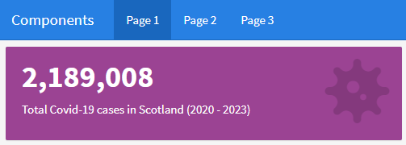

```{r setup, include=FALSE}
# Author: Ross Burns
# Original Date: September 2023
# Version of R: 4.1.2

# See here for learnr package documentation: https://rstudio.github.io/learnr/

# Include packages here that are required throughout the training
library(learnr)         # Required to build the Shiny app
library(gradethis)      # Required for specific code checking and specific feedback

knitr::opts_chunk$set(echo = FALSE)

tutorial_options(
  exercise.checker = gradethis::grade_learnr
)
```

```{r phs-logo, echo=FALSE, fig.align='right', out.width="40%"}
knitr::include_graphics("images/phs-logo.png")
```

## Introduction

Welcome to the tutorial for building dashboards with flexdashboard in R. This course is designed to provide an overview of how to get started building dashboards using the `flexdashboard` package for R. It can be used as a tutorial to get you started with the package, or as a point of reference when building your own dashboard.  

<div class="info_box">
  <h4>Course Info</h4>
  <ul>
    <li>If you are new to using **R Markdown**, I recommend completing this course prior to flexdashboard: [Intro to R Markdown](https://scotland.shinyapps.io/phs-learnr-rmarkdown)</li>
    <li>This course is built to flow through sections and build on previous knowledge. If you're comfortable with a particular section, you can skip it.</li>
    <li>The course will also show progress through sections, a green tick will appear on sections you've completed, and it will remember your place if you decide to close your browser and come back later.</li>
  </ul>
</div>
</br>

### What is flexdashboard?

`flexdashboard` is an R package that allows you to create dashboard-style outputs from R Markdown. Flexdashboard handles the overheads involved with laying out content in html, making it easy to display the results of your R code within content panels using R Markdown's syntax (headings and code chunks). 
Examples of the content that can be included in a flexdashboard are:
<ul>
  <li>Interactive data visualisations such as Leaflet, Plotly and DataTable. These are called [htmlwidgets](https://www.htmlwidgets.org/showcase_leaflet.html)</li>
  <li>R graphical output such as ggplot2</li>
  <li>Tabular data</li>
  <li>Value boxes to highlight key summary data or provide links</li>
  <li>Gauges for displaying a value within a fixed range on a meter</li>
  <li>Text descriptions and annotations</li>
</ul>

The resulting output when you knit an R Markdown file set to flexdashboard as the output format, is an html file which can be easily shared with others while retaining the dashboard's content and interactivity.


### Install flexdashboard

Use the following code to install the `flexdashboard` package before continuing:

```{r install-flexdashboard, echo=TRUE, eval=FALSE}

# Install the flexdashboard package
install.packages("flexdashboard")

```


### Why use flexdashboard in PHS?

Flexdashboard can be used as an alternative way to display results of an analysis in a reproducible format. It has the advantage of interactivity, simple design, and does not require knowledge of Shiny to get the most out of your dashboard.

It may be useful as an alternative to a Shiny dashboard where the results need to be collated in a dashboard layout but do not require to be hosted on a server.


### Knowledge Check

```{r introduction-quiz}
quiz(
  question("[Question]",
    answer("[Incorrect answer]", correct = FALSE),
    answer("[Incorrect answer with feedback]", correct = FALSE, message = "[Specific feedback.]"),
    answer("[Correct answer]", correct = TRUE),
    incorrect = "[General feedback for any incorrect answer.]",
    allow_retry = TRUE,
    random_answer_order = TRUE
  )
)
```


## Create a new flexdashboard

### Using the default template

In Posit R Studio, go to "*File > New File > R Markdown...*". Select "*From Template*", then scroll down the list of templates until you find "*Flex Dashboard*" and select "**OK**". 
If you can't see this in the list of templates, ensure you have the flexdashboard package installed and start a new R session in Posit. 
Alternatively, if you are certain that flexdashboard is installed, you can use the default R Markdown template for an HTML document and ensure the YAML header matches the formatting below.


### Layout

Using the template, you get an R Markdown file which looks like this with some minor differences from a typical Rmd file.

```{r rmd-template-screenshot, fig.align='right', out.width="100%"}

```


### YAML Header

The YAML is the text at the top of the document (lines 1-7) which specifies some of the formatting options for the dashboard.
<ul>
  <li>The document `output` is set to "flexdashboard::flex_dashboard"</li>
  <li>The `orientation` is set to "columns". This can also be set to "rows". It determines whether we want the Level 2 Headings to be displayed as "columns" or "rows" on our dashboard pages by default.</li>
  <li>The `vertical_layout` option is set to "fill". This can also be set to "scroll". This determines if we want content on each page to "fill" the screen or if we want content to bleed off the page and allow us to "scroll" through the content.</li>

### Setup

This code chunk (lines 9-11) comes right after the YAML, it is a useful place to load the required packages or to source another R script.

### Level 2 Headings

Level 2 Headings specify a new column or row, they can be represented by `##` or underlined with `---`. The latter makes it easier to visualise the layout as you are building your document but both will work the same.

```
Column
--------------------------------------------
```
is the same as
```
## Column
```

### Level 3 Headings

Level 3 Headings specify a chart within a column or row. These are placed beneath a Level 2 Heading to dictate where they appear on the page. Content can be embedded in the form of text or an R code chunk which outputs a graph, table or visualisation.

### Knitting the Dashboard

First, make sure to rename your dashboard title to something meaningful such as "My First Dashboard". Replace "Untitled" on Line 2 with your new dashboard title.
When you click "*Knit*", it will prompt you to save the document. Make sure to save it somewhere meaningful, ideally in it's own folder or R Project so that any other required data and scripts can be sourced easily. 
Once the document has been knitted, it produces a dashboard with a left-hand column and one chart, and a right-hand column with two charts underneath. 

```{r first-dashboard-screenshot, fig.align='right', out.width="100%"}

```

It is often helpful to open your dashboard in a new browser tab to see how it would look to a user who opens the html file in their web browser. Click the window icon at the top-left of the "Viewer" pane in R Studio to open the dashboard in a browser. You will notice that a html file with the same name as your R Markdown document has been created in the same directory, you can also click this file to view the dashboard in a web browser.


## Layouts

There are many options when it comes to laying out content on a flexdashboard. We'll start by looking at the options for single-page layouts using rows and columns.

Using the default flexdashboard template that we created in the last section, change the orientation of the dashboard from "columns" to "rows":

```
---
title: "My First Dashboard"
output: 
  flexdashboard::flex_dashboard:
    orientation: rows
    vertical_layout: fill
---
```

Knit the document and observe how the layout has changed. Chart A now fills across the top of the page horizontally, while Charts B and C fill the bottom row of the page.

```{r row-layout-screenshot, fig.align='right', out.width="100%"}

```


### Re-sizing content

Next, we may want to add another chart and re-size our content. This would be a good point to tidy up some of our headings. Notice that our Level 2 Headings for each row are labelled "Column" with a specifier for "data-width". To avoid confusion, rename the first Level 2 Heading to "Row 1" and the second to "Row 2".

Add a "Chart D" to the bottom-right area of the screen, sitting next to Chart C. We also want the charts on Row 2 to appear more prominent on the page, so we will specify the `data-height` parameter for each row.

The existing `data-width` parameter for each row has no effect as it currently sits. Flexdashboard automatically sizes the charts on each row to have an equal width. Replace the `data-width` parameter with `data-height`. Set the height of Row 1 to 200 and the height of Row 2 to 800.

Our code should now look like this:

````
---
title: "My First Dashboard"
output: 
  flexdashboard::flex_dashboard:
    orientation: rows
    vertical_layout: fill
---

```{r setup, include=FALSE}`r ''`
library(flexdashboard)
```

Row 1 {data-height=200}
-----------------------------------------------------------------------

### Chart A

```{r}`r ''`

```

Row 2 {data-height=800}
-----------------------------------------------------------------------

### Chart B

```{r}`r ''`

```

### Chart C

```{r}`r ''`

```

### Chart D

```{r}`r ''`

```

````

When we Knit the document, we can see how the extra chart and the sizes change the layout of the page.
The dashboard should look like this. Annotations have been added to describe what the layout sizes represent, the data-height and data-width parameters are proportions of 1000.

```{r sizes-screenshot, fig.align='right', out.width="100%"}

```

```{r sizes-code-screenshot, fig.align='right', out.width="100%"}

```


### Scrolling

So far we have seen how flexdashboard works with the `vertical_layout` set to `fill`. This is useful for making smaller charts align neatly in a single page, however if we wanted to add more charts or add bigger charts that require more space, we could use a `scroll` layout. 

The `fill` layout automatically re-sizes charts to fit the page, whereas the `scroll` layout stacks charts vertically at their natural height, extending the boundary of the page if necessary. The user can then scroll down the page to view the rest of the content.

Copy the following code into a new R Markdown document to see how the scrolling layout functions in the browser:

````
---
title: "Scrolling Layout"
output: 
  flexdashboard::flex_dashboard:
    orientation: column
    vertical_layout: scroll
---

```{r setup, include=FALSE}`r ''`
library(flexdashboard)
```

### Chart A

```{r}`r ''`

```

### Chart B

```{r}`r ''`

```

### Chart C

```{r}`r ''`

```

### Chart D

```{r}`r ''`

```

````


### Tabsets

When you have multiple charts which are too big to display all in one page, it might be better use tabs. These work in the same way as tabsets on an R Markdown document, allowing users to click through each tab to view a different chart instead of having all charts spread out across the page.

The `{.tabset}` attribute can be added in a Level 2 Header to specify if the row/column should contain tabs.
Each subsequent Level 3 Header is then treated as a new tab. 

````
---
title: "Tabset Layout"
output: 
  flexdashboard::flex_dashboard:
    orientation: column
    vertical_layout: fill
---

```{r setup, include=FALSE}`r ''`
library(flexdashboard)
```

Column 1 {.tabset}
--------------------------------------------

### Tab A

```{r}`r ''`

```

### Tab B

```{r}`r ''`

```

### Tab C

```{r}`r ''`

```

Column 2 {.tabset-fade data-width=350}
--------------------------------------------

### Tab D

```{r}`r ''`

```

### Tab E

```{r}`r ''`

```

````

Note that in Column 2, the `data-width` attribute is also specified along with `.tabset-fade` - multiple attributes can be specified within the parenthesis and separated by a space.


## Advanced Layouts

This page covers some of the advanced layout options which help you to organise your dashboard content.
<ul>
  <li>Pages</li>
  <li>Navigation Menus</li>
  <li>Icons</li>
  <li>Links</li>
  <li>Sidebars</li>
  <li>Storyboards</li>
</ul>


### Pages

If you have many charts you want to include in the dashboard, you may want to split them onto seperate pages. To add a new page, use a Level 1 Header above the sections you want to seperate: `======` or `#`

For example, this code creates a dashboard with two pages - Page 1 has one column and one chart, Page 2 has two columns with one chart in each column:

````
---
title: "Pages"
output: 
  flexdashboard::flex_dashboard:
    orientation: columns
    vertical_layout: fill
---

```{r setup, include=FALSE}`r ''`
library(flexdashboard)
```


Page 1
=======================================================================

Column
-----------------------------------------------------------------------

### Chart A

```{r}`r ''`

```


Page 2
=======================================================================

Column {data-width=350}
-----------------------------------------------------------------------

### Chart B

```{r}`r ''`

```

Column {data-width=650}
-----------------------------------------------------------------------

### Chart C

```{r}`r ''`

```

````

Each page appears as a tab in the navigation bar with the corresponding header title:

```{r pages-screenshot, fig.align='right', out.width="100%"}

```

It is also possible to specify different layout orientations for each page. For example, this code specifies the default orientation as `columns`, but Page 2 is set to use `rows` instead. This is defined in the Level 1 header attribute as `{data-orientation=rows}`

````
---
title: "Page Orientation"
output: 
  flexdashboard::flex_dashboard:
    orientation: columns
    vertical_layout: fill
---

```{r setup, include=FALSE}`r ''`
library(flexdashboard)
```


Page 1
=======================================================================

Column
-----------------------------------------------------------------------

### Chart A

```{r}`r ''`

```

### Chart B

```{r}`r ''`

```


Page 2 {data-orientation=rows}
=======================================================================

Row {data-width=350}
-----------------------------------------------------------------------

### Chart C

```{r}`r ''`

```

### Chart D

```{r}`r ''`

```

````


### Navigation Menu

Each page you add to the dashboard uses it's own tab on the navigation bar by default, so if you want to include lots of pages on your dashboard, it may be helpful to use navigation menus to organise your pages.

Navigation menus are tabs on the navigation bar which hold a list of pages. To add pages to a navigation menu, use the Level 1 header attribute `{data-navmenu="Menu Title"}` for the pages you want to add.

For example, the following code creates two navigation menu tabs called "Menu A" and "Menu B", which both contain two pages.

````
---
title: "Page Navigation Menus"
output: flexdashboard::flex_dashboard
---

```{r setup, include=FALSE}`r ''`
library(flexdashboard)
```

Page 1 {data-navmenu="Menu A"}
=====================================


Page 2 {data-navmenu="Menu A"}
=====================================  


Page 3 {data-navmenu="Menu B"}
=====================================


Page 4 {data-navmenu="Menu B"}
=====================================  

````

When we click the tabs in the navigation bar, we will see a drop-down list of all the pages in that group.

```{r nav-menu-screenshot, fig.align='right', out.width="100%"}

```


### Icons

At this point, we may also want to add icons to help visually distinguish each page in the navigation bar.

To add an icon to a page, use the Level 1 header attribute: `{data-icon="icon-name"}`

You can specify page icons from three different icon sets. Use the links below to search the catalogues for the icon you want to use:
<ul>
  <li>[Font Awesome v5*](https://fontawesome.com/v5/search?o=r&m=free)</li>
  <li>[Ionicons*](https://ionic.io/ionicons/v2/)</li>
  <li>[Bootstrap Glyphicons](https://getbootstrap.com/docs/3.3/components/)</li>
</ul>

Each icon will have a name which can be found on the icon set websites. To use them, make sure to copy the icon's full name along with the prefix. Examples of valid icon names are "fa-filter", "ion-clipboard" or "glyphicon-flag".

*Disclaimer: some icons in these sets may not work if they have been introduced in a later update that isn't supported by R Markdown. If you try using an icon that isn't compatible with R Markdown it will appear blank in the dashboard - in this case you will need to search for an alternative icon to use.


The following code adds icons for Page 1, Page 2 and Page 3:

````
---
title: "Page Icons"
output: flexdashboard::flex_dashboard
---

```{r setup, include=FALSE}`r ''`
library(flexdashboard)
```

Page 1 {data-icon="fa-house-user"}
=====================================================

Page 2 {data-icon="fa-filter"}
=====================================================

Page 3 {data-icon="fa-hospital-o"}
=====================================================

````

Unfortunately it isn't currently possible to use the icon sets on navigation bar menus, contrary to the flexdashboard documentation. If this is an important requirement for your dashboard, an easy work-around could be to embed a [Unicode symbol](https://www.utf8icons.com/) in the menu title, despite it looking a bit less elegant than the icon sets. It may be possible to counter this problem using CSS, but this would be out of the scope of this training course.

To add a Unicode icon to a navigation menu, copy the Unicode character and paste it into the menu title. This example uses the Warning Sign symbol: `{data-navmenu="⚠ Menu A"}`

````
---
title: "Page Menu Icons"
output: flexdashboard::flex_dashboard
---

```{r setup, include=FALSE}`r ''`
library(flexdashboard)
```

Page 1 {data-icon="fa-house-user" data-navmenu="⚠ Menu A"}
=====================================================

Page 2 {data-icon="fa-filter" data-navmenu="⚠ Menu A"}
=====================================================

Page 3 {data-icon="fa-hospital-o"}
=====================================================

````

Note that the icons for Page 1 and Page 2 are retained in the navigation menu using the `data-icon` attribute.

```{r page-menu-icons-screenshot, fig.align='right', out.width="100%"}

```


### Source Code

You can share the source code for your dashboard script by including the `source_code: embed` option in the YAML header. This adds another button to the Navigation Bar, and once clicked, shows the source code of the R Markdown script used to create the dashboard. This is useful for sharing work internally as it allows others to see at a glance how the dashboard was put together.

````
---
title: "Source Code"
output: 
  flexdashboard::flex_dashboard:
    source_code: embed
---

```{r setup, include=FALSE}`r ''`
library(flexdashboard)
```

Page 1
=====================================

Column 1
-------------------------------------

### Chart A

```{r}`r ''`

```

````

```{r source-code-screenshot, fig.align='right', out.width="100%"}

```


Alternatively, if your dashboard depends on other scripts which carry out most of the data analysis/processing workload, it may be more useful to link to a github repo containing all of the source code in your project. To do this, replace `embed` with a URL string pointing to your github repo, such as `source_code: "https://github.com/Public-Health-Scotland/learnr-online/"`


### Additional Navigation Buttons

You can add extra buttons to the navigation bar which link to other web pages. You may want to have an 'About' button which links to a separate web page. You can specify custom buttons using the following syntax in the YAML header.

````
---
title: "Navigation Buttons"
output: 
  flexdashboard::flex_dashboard:
    navbar:
      - { title: "About PHS", href: "https://publichealthscotland.scot/", align: left }
      - { title: "Data Science Knowledge Base", icon: "fa-book", href: "https://public-health-scotland.github.io/knowledge-base/", align: right }
---

```{r setup, include=FALSE}`r ''`
library(flexdashboard)
```

````
<ul>
  <li>Specify a `title` and/or `icon` from the available [icon sets](#icons).</li>
  <li>Add the URL string to `href`.</li>
  <li>Use `align` to place the button on the `left` or `right` side of the navigation bar.</li>
</ul>

```{r nav-buttons-screenshot, fig.align='right', out.width="100%"}

```


### Links

You can embed links within your dashboard which take you to other pages. Page links have the same markdown syntax as you would use with external hyperlinks, except you can refer to the dashboard page title directly or refer to the page's ID.

Links are created by surrounding the page title in square brackets - `[Page Title]`
Or, by including the page ID in curved brackets next to some custom text - `[Custom Text](#page-id)`

As shown on Line 35 in the code example below, you can also define a custom page ID in the page's Level 1 header attribute, prefixed by a `#` - i.e `Page 1 {#custom-page-id}`

You may also want to include a dashboard page which is not visible on the navigation bar but is only accessible via link. This can be achieved using the `{.hidden}` header attribute on the page you want to hide.

````
---
title: "Page Links"
output: flexdashboard::flex_dashboard
---

```{r setup, include=FALSE}`r ''`
library(flexdashboard)
```

Page 1
===================================== 

You can link to a dashboard page using the page title surrounded by square brackets:

[Page 2]

Or you can use the page ID if you want a custom name for the link 
(rather than just using the page title):

[Page Two](#page-2)

A custom page ID can also be defined in the page's header attribute:

[Page Three](#the-third-page)

Link to a hidden page:

[Secret Page](#page-4)


Page 2
=====================================     

### Chart A
    
```{r}`r ''`
```

Page 3 {#the-third-page}
=====================================

### Chart B
    
```{r}`r ''`
```

Page 4 {.hidden}
=====================================

### Chart C
    
```{r}`r ''`
```

````


### Sidebars

Sidebars can be used to add extra information about your dashboard such as information on how to use the dashboard and it's content. Sidebars are defined as a header attribute - `{.sidebar}`.

If the `.sidebar` attribute is specified in a Level 1 header, it will show on all of the pages.

````
---
title: "Global Sidebar"
output: flexdashboard::flex_dashboard
---

```{r setup, include=FALSE}`r ''`
library(flexdashboard)
```

Sidebar {.sidebar}
=====================================

You could use this space to add information about data sources, how to use the dashboard, assumptions etc.


Page 1
=====================================

### Chart A

```{r}`r ''`

```


Page 2
=====================================

### Chart B

```{r}`r ''`

```
````

If the `.sidebar` attribute is specified in a Level 2 header, it will only appear on that specific page. It is also possible to adjust the width of the sidebar using the `.data-width` attribute.

````
---
title: "Page Sidebar"
output: flexdashboard::flex_dashboard
---

```{r setup, include=FALSE}`r ''`
library(flexdashboard)
```


Page 1
=====================================

Sidebar {.sidebar data-width=200}
-------------------------------------

You could use this space to add filters or information related to the page.


Column 1
-------------------------------------

### Chart A

```{r}`r ''`

```


Page 2
=====================================

### Chart B

```{r}`r ''`

```
````


### Storyboards

Storyboards are a unique layout scheme which can be used as an alternative to the rows and columns structure we have seen previously.
In this layout, each frame contains a main panel which focuses on a single piece of content (such as a chart or map), displayed alongside a commentary panel which can be used to discuss the content.

To get an idea of how the storyboard layout might be used in practice, see the [HTML Widgets Showcase](https://testing-apps.shinyapps.io/flexdashboard-storyboard/). This demonstrates some of the types of interactive visualisations you can include in a flexdashboard. You can find other [flexdashboard examples](https://rstudio.github.io/flexdashboard/articles/examples.html) on the official website along with the source code used to build them.

```{r storyboards-screenshot, fig.align='right', out.width="100%"}


```

To enable the storyboard layout in your flexdashboard, use the `storyboard: true` option in the YAML header. 

Each Level 3 header (`###`) in the document specifies a new **frame**, the text in the header title will be inserted as a navigation caption. Therefore, the header title should normally provide a short summary of the content in the frame.

The R code chunk underneath the header contains the **content** to display in the frame.

To add a **commentary panel**, use `***` underneath the R code chunk. Any text underneath this marker will be added to the commentary panel. The default width of the commentary panel is 300 pixels. To specify a custom width for the commentary panel, use the `{data-commentary-width}` attribute in the header title.

The following code creates a basic dashboard with the storyboard layout:

````
---
title: "Storyboard"
output: 
  flexdashboard::flex_dashboard:
    storyboard: true
---

### Frame 1 Caption

```{r}`r ''`

```


### Frame 2 Caption {data-commentary-width=400}

```{r}`r ''`

```

*** 

Some commentary about Frame 2.

````

If you want to use the storyboards in addition to the traditional rows and columns layout, you can implement each style in seperate dashboard pages.

To do this, remove the `storyboard: true` option from the YAML header and add the `{.storyboard}` attribute to one of your page headers:

````
---
title: "Storyboard Pages"
output: flexdashboard::flex_dashboard
---

Storyboard Page {.storyboard}
=========================================

### Frame 1 Caption

```{r}`r ''`

```


### Frame 2 Caption {data-commentary-width=400}

```{r}`r ''`

```

*** 

Some commentary about Frame 2.


Column Page
=========================================

Column 1
-----------------------------------------

### Chart A

```{r}`r ''`

```

````


## Components

Once you know how to use the different layout options in flexdashboard, the only thing left to do is add your content. This section will look at how to implement some basic components into a dashboard:
<ul>
  <li>Value Box</li>
  <li>Gauge</li>
  <li>R Graphics (and how to size content)</li>
  <li>Tables</li>
  <li>Adding text annotations</li>
</ul>

For the data in these examples, we will use two open Covid-19 datasets which can be downloaded from here:
<ul>
  <li>[Covid-19 Daily Case Trends by Local Authority](https://www.opendata.nhs.scot/dataset/covid-19-in-scotland/resource/427f9a25-db22-4014-a3bc-893b68243055)</li>
  <li>[Daily and Cumulative counts and rates for positive COVID-19 cases and deaths](https://www.opendata.nhs.scot/dataset/covid-19-in-scotland/resource/287fc645-4352-4477-9c8c-55bc054b7e76)</li>
</ul>

Note that the datasets above have since been archived and only contain data up to **1st October 2023**. The code example in the following section uses the ['phsopendata'](https://github.com/Public-Health-Scotland/phsopendata) R package to extract this data from the PHS Open Data website into our R environment directly.


### Open Data Setup

The first step in most projects is to import the data and packages required for the task. The following code loads the required packages, imports the two datasets and does some quick tidying of the data.

To demonstrate, I have included the code in a setup chunk at the top of the R Markdown script with the parameter `include=FALSE`. This ensures that the code in this chunk does not display in the final output of the document, but it will be necessary to execute this code so that the following code chunks will work.

````
---
title: "Components"
output: 
  flexdashboard::flex_dashboard:
    orientation: rows
---

```{r setup, include=FALSE}`r ''`

## 1 - Setup -----------------------------------

#### Load packages ----

libs <- c("dplyr", 
          "janitor",        # Tidy open data
          "tidyr",          # Re-organise dataframes
          "phsopendata",    # Access open data from PHS
          "phsstyles",      # PHS colours for formatting
          "ggplot2",        # Create static plots
          "scales",         # Number formatting
          "lubridate",      # Parse dates
          "flexdashboard")
lapply(libs, require, character.only = TRUE)


#### Import Open Data ----

## Import Covid 19 case trends data from the PHS Open Data repository.

# Get Covid-19 Daily Case Trends by Local Authority
# https://www.opendata.nhs.scot/dataset/covid-19-in-scotland/resource/427f9a25-db22-4014-a3bc-893b68243055
daily_la <- get_resource(res_id = "427f9a25-db22-4014-a3bc-893b68243055") %>%
  # Tidy column names & date formats
  clean_names() %>%
  mutate(date = ymd(date))

# Get Daily and Cumulative counts and rates for positive COVID-19 cases and deaths.
# https://www.opendata.nhs.scot/dataset/covid-19-in-scotland/resource/287fc645-4352-4477-9c8c-55bc054b7e76
daily_totals <- get_resource("287fc645-4352-4477-9c8c-55bc054b7e76") %>%
  # Tidy column names & date formats
  clean_names() %>%
  mutate(date = ymd(date))


#### Lookups ----

# Create a lookup for Council Authorities
ca_lookup <- daily_la %>%
  select("code" = ca, ca_name) %>%
  unique()


## 2 - Value Box -----------------------------------

current_totals <- daily_totals %>% 
  filter(date == max(date))

cum_total_cases <- current_totals %>% 
  pull(cumulative_cases)


## 3 - Gauge ---------------------------------------

current_percent_reinfections <- current_totals %>%
  pull(percent_reinfections)


## 4 - R Graphics ----------------------------------

# Get the cumulative total infections by Local Authority (Council Area) for the most recent date available
current_totals_la <- daily_la %>%
  filter(date == max(date)) %>%
  # Select only the necessary columns for our chart, 
  # we want also want to show how many infections were First Infections vs Reinfections
  select(date, ca_name, "First Infection" = first_infections_cumulative, "Reinfection" = reinfections_cumulative) %>%
  # Pivot the Infections columns in order to plot the number of infections by infection type
  pivot_longer(cols = c("First Infection", "Reinfection"), 
               names_to = "infection_type", 
               values_to = "infections")
  
# Plot the cumulative total infections per CA and how many were first infections vs reinfections
current_totals_la_plot <- current_totals_la %>%
  ggplot(aes(infections, ca_name, fill = infection_type)) +
  geom_col() +
  
  # Use label_comma() to force numbers to display in decimal format and add more axis breaks  
  scale_x_continuous(labels = label_comma(), n.breaks = 6) +
  
  # Reverse the order in which Council Areas are displayed on the chart
  scale_y_discrete(limits = rev) +
  
  # Use PHS colours to distinguish between infection types
  scale_fill_discrete_phs(type = "qual", palette = "main") +
  
  # Add annotations and theme options
  labs(title = "Cumulative number of positive Covid-19 cases by Council Area",
       x = "Cumulative Total Cases",
       y = "Council Area",
       fill = "Infection Type") +
  theme_minimal()


## 5 - Tables --------------------------------------

# Create a simple data table with kable()
# Council Areas ranked in order of total positive infections in the most recent full week of data
last_week_totals_ca <- daily_la %>%
  select(date, ca_name, daily_positive) %>%
  mutate(week = floor_date(date, "week")) %>%
  # Filter for the week prior to the most recent week of data,
  # due to incomplete data/no. of days in the final week
  filter(week == max(week) - 7) %>%
  group_by(week, ca_name) %>%
  summarise(weekly_positive = sum(daily_positive)) %>%
  ungroup() %>%
  arrange(desc(weekly_positive))

# Obtain last week's date for dashboard annotations
last_week_start <- last_week_totals_ca %>% pull(week) %>% unique()


## 6 - Plotly --------------------------------------

# Get the weekly counts for Covid-19 cases in Scotland
# to remove some of the jitter when plotted as a time-series chart
weekly_totals <- daily_totals %>%
  select(date, daily_cases) %>%
  mutate(week = floor_date(date, "week")) %>% 
  group_by(week) %>%
  summarise(weekly_cases = sum(daily_cases)) %>%
  filter(week != max(week))

# Plot the weekly counts for Covid-19 cases in a ggplot line chart
weekly_totals_plot <- weekly_totals %>%
  ggplot(aes(week, weekly_cases)) +
  
  # Add PHS colour formatting
  geom_line(colour = phs_colours("phs-magenta")) +
  
  labs(title = "Weekly cases of Covid-19 across Scotland",
       x = "Week",
       y = "Number of cases") +
  theme_minimal()

```
````

Alternatively, you can choose to keep setup code like this in a separate R script within your project directory and source it from the R Markdown document. This is useful for larger projects where there is a higher level of complexity.

For example, here I have moved the code in the setup chunk into a new script within my project called `open_data_setup.R`. The `source()` function is used to execute this script and ensure the variables can be accessed within the environment of the R Markdown script.

````
---
title: "Components"
output: 
  flexdashboard::flex_dashboard:
    orientation: rows
---

```{r setup, include=FALSE}`r ''`

# File path to setup code
source("flexdashboard_materials/open_data_setup.R")

```
````

For the purpose of keeping things concise, I would recommend using the latter method and call the `open_data_setup.R` script, but you may find it easier to follow along by keeping all the setup code together in a single R Markdown script.

Below the setup code chunk, paste the following code to define page layouts for each of the components we want to insert:

````

Page 1
=====================================

Row 1 {data-height=200}
-------------------------------------

### Value Box

```{r}`r ''`

```

### Gauge

```{r}`r ''`

```


Row 2 {data-height=800}
-------------------------------------

### Total Covid-19 Cases by Council Area

```{r}`r ''`

```

### Covid-19 Cases in the last week by Council Area

```{r}`r ''`

```


Page 2
=====================================

Row 1 {.tabset}
-------------------------------------

### Weekly Covid-19 Cases in Scotland

```{r}`r ''`

```

### Chart Data

```{r}`r ''`

```

### Daily Totals Open Data

```{r}`r ''`

```


Page 3
=====================================

Sidebar {.sidebar}
-------------------------------------

### Sidebar Content


Row 1
-------------------------------------

### Covid Cases Map

```{r}`r ''`

```

````

When you knit the dashboard, the layout on Page 1 should look like this:

```{r components-layout-screenshot, fig.align='right', out.width="100%"}


```


### Value Box

The first component we will look at is the **Value Box**, which does pretty much what it says on the tin. This let's you display a single numerical value such as a key statistic in your data that you want to emphasize on your dashboard.

Add the following R code chunk to your R Markdown script inside the panel labelled `Value Box` on Page 1, then knit the dashboard:

````
# Use the valueBox function to create a tile containing a summary statistic or other key information
valueBox(
  value = cum_total_cases
)

````

You should now see a tile on Page 1 which looks like this:

```{r value-box-basic-screenshot, fig.align='right', out.width="100%"}


```

We passed a numeric variable to the `valueBox()` function which represents the cumulative total number of Covid-19 cases in Scotland from the start of the pandemic, up to the 1st October 2023.

Note that the function automatically takes the Level 3 header `### Value Box` and uses this as a caption.

If we want to customise this to make the box more visually attractive to the user, we can pass additional parameters to the `valueBox()` function to change it's appearance. Try replacing the value box with the code below and knit the dashboard:

````

valueBox(
  value = prettyNum(cum_total_cases, big.mark = ","), 
  icon = "fa-virus", 
  caption = "Total Covid-19 cases in Scotland (2020 - 2023)", 
  color = phs_colours("phs-magenta"),
  href = "#page-2"
)

````

Parameters:
<ul>
  <li>`value` - can be *numeric* or *character* values. To make the number more readable, we can wrap the value with the `prettyNum()` function to add a comma seperator.</li>
  <li>`icon` - specify an icon in a similar way to the navigation menus from the previous sections.</li>
  <li>`caption` - Manually specify a caption for context.</li>
  <li>`color` - specify a background colour.</li>
  <li>`href` - add a URL string to make the value box interactive. In this example the URL links to Page 2 of the dashboard, try clicking it to see if it works!</li>
</ul>

Output:

```{r value-box-advanced-screenshot, fig.align='right', out.width="100%"}



```


### Gauge

In a similar fashion to the Value Box, the **Gauge** is useful for displaying a key value in your data. It displays a value, and visualises it on a meter so it works well for displaying percentages or values that have a defined range.

This code calls the `gauge()` function and passes a value which represents the percentage of all Covid-19 cases which were re-infections, for the most recent days worth of data.
Paste the following code into the chunk below `### Gauge`

````
gauge(
  value = current_percent_reinfections, 
  min = 0, 
  max = 100, 
  symbol = "%",
  label = "Reinfections",
  gaugeSectors(
    colors = phs_colours("phs-blue")
  )
)
````

We may also want to add a caption underneath the gauge to explain what it's value represents.

Add the following line beneath the R code chunk which displays a Gauge:

````
> Current percentage of new daily Covid-19 infections that are reinfections in Scotland
````

R Markdown recognises text prefaced by the `>` symbol, then displays it underneath the chart panel on the dashboard as a caption.

We may also want to hide the chart panel title above our gauge (defined by `### ...`) which does nothing except from stating the obvious at the moment. Add the option `{.no-title}` next to the Level 3 header for 'Gauge'. 

The dashboard output should look like this:

```{r gauge-screenshot, fig.align='right', out.width="100%"}


```

Parameters:
<ul>
  <li>`value` - a numeric value to display on the gauge</li>
  <li>`min` - the minimum numeric value in the range</li>
  <li>`max` - the maximum numeric value in the range</li>
  <li>`symbol` - a symbol to display next to the value such as "%"</li>
  <li>`label` - a text label to display underneath the value</li>
</ul>

If you only want to use a single colour for the gauge, you can pass the colour's character string to the `colors` parameter within the `gaugeSector()` function like in the example above.

The `gaugeSectors()` function is normally used to define the range of values and colours for each sector. You can think of sectors as 'warning levels' where by default, a value in the `success` range would show as green, `warning` as amber and `danger` as red.

Try replacing the `gauge()` code with the example below to assign a colour based on sectors.
What colour do you expect to see when you knit the dashboard?

````
gauge(
  value = current_percent_reinfections, 
  min = 0, 
  max = 100, 
  symbol = "%",
  label = "Reinfections",
  gaugeSectors(
    success = c(0, 24.9),  # colour = green if value less than 25%
    warning = c(25, 74.9), # colour = amber if value between 25% and 75% 
    danger = c(75, 100)    # colour = red if value greater than or equal to 75%
  )
)

````


### R Graphics

It is possible to add charts created with standard R graphics (such as with base R's `plot` or `ggplot2`) into your flexdashboard the same way you would with any other type of R Markdown document.

Copy the variable name below containing a ggplot object into `### Total Covid-19 Cases by Council Area`:

````
current_totals_la_plot
````

When we knit the dashboard, we can see that the plot doesn't quite fit into it's panel perfectly:

```{r r-graphics-default-screenshot, fig.align='right', out.width="100%"}


```

By defining values for the `fig.height` and `fig.width` options on the R code chunk, we can be more precise with the chart's size on the page.

```{r r-graphics-dimensions-screenshot, fig.align='right', out.width="100%"}


```

It's difficult to tell what size the chart needs to be, with busier charts like in the example above, the title gets cropped or elements overlap each other on the chart.<br>
It is usually a process of trial and error to find the perfect size for an R graphic on your dashboard, but we will look at an alternative solution to this problem in the next section using *htmlwidgets*.


### Simple Tables

If we have a small table or dataframe we want to show on our dashboard, that has maybe 50 records or less, the standard `knitr::kable()` function is a good solution. This creates a static HTML table, such that the content fits nicely into it's container on the dashboard and includes a scrollbar for records that don't fit onto the screen.

Add the following code under the section titled `### Covid-19 Cases in the last week by Council Area`.

````
last_week_start <- last_week_totals_ca %>% pull(week) %>% unique()

last_week_totals_ca %>%
  select("Council Area" = "ca_name", "Total Cases" = "weekly_positive") %>%

  # Use knitr::kable() to add a basic data table
  knitr::kable(
    row.names = TRUE,
    caption = paste0("Total Covid-19 cases in the last complete week of data, week beginning: ",
                     format(last_week_start, "%d %b %Y"))
    )
    
````
We pipe a dataframe into the `knitr::kable()` function which contains total Covid-19 cases in the most recent weeks worth of data, grouped by *Council Area*. The parameter `row.names = TRUE` enables row indexes, which is useful for showing the rank of Council Areas in this scenario. `caption` adds a brief description above the table for additional context. More information on the `kable` function can be found [here](https://bookdown.org/yihui/rmarkdown-cookbook/kable.html).

```{r simple-table-screenshot, fig.align='right', out.width="100%"}


```

The problem with `kable` is that it's not great for displaying large datasets. We will look at the `DT` datatable package in the next section, which allows us to add more advanced table features.


## Advanced Components (htmlwidgets)

So far we have looked at basic components that can be added to a flexdashboard, however we encounter some issues with the standard R graphics. Content doesn't fit perfectly into containers and the dashboard lacks a bit of the interactive elements that are supposed to give dashboards the advantage over other static formats of displaying data.

This is where the [htmlwidgets](https://www.htmlwidgets.org/) framework comes in. The framework provides high-level R bindings for JavaScript visualization libraries, which can be used via a suite of R packages. These packages allow us to produce interactive charts, tables and maps that will dynamically re-size themselves to fit their dashboard containers.

The packages we will look at in this section are:
<ul>
  <li>[`plotly`](https://plotly.com/r/) - create detailed, high-quality interactive charts from scratch, or directly convert a ggplot object into an interactive plotly chart.</li>
  <li>[`DT`](https://rstudio.github.io/DT/) - create HTML data tables with interactive features like filtering, sorting and pagination.</li>
  <li>[`leaflet`](https://rstudio.github.io/leaflet/) - an interface to the JavaScript Leaflet library for producing interactive maps.</li>
</ul>

There are many other htmlwidget libraries available, you can see some examples of the more popular htmlwidgets [here](https://www.htmlwidgets.org/showcase_leaflet.html) or search for them in the htmlwidgets [gallery](https://gallery.htmlwidgets.org/).


### Plotly

The `plotly` package has 3 main advantages which make it ideal for data visualisation in flexdashboard.
<ul>
  <li>`plotly` charts are html-widgets, meaning they will **automatically re-size** themselves to fit their container so that content is always easy to read regardless of the browser window's dimensions.</li>
  <li>Charts are **interactive** - meaning the user can zoom, pan and scale charts themselves to find insights. We can add hover-labels for data points which allows the user to quickly see values of specific data points by hovering over them with the mouse cursor.</li>
  <li>`plotly` provides a function called `ggplotly()` which takes a ggplot object as a parameter, and converts it into a plotly object, whilst retaining the content and formatting of the original chart.</li>
</ul>


Add the following code underneath the Page 2 heading `### Weekly Covid-19 Cases in Scotland` and knit the dashboard:

````
# Use ggplotly() to convert this ggplot object into an interactive plotly chart
ggplotly(weekly_totals_plot)

````

Open your dashboard in a new browser window, go to Page 2 and try re-sizing the window by clicking and dragging the edge of the browser. You should notice that the elements on the chart adjust their size to fill the dashboard screen. Compare this to the chart on Page 1, and notice how it stays fixed in place when the browser is re-sized. This is because the chart on Page 1 is effectively a static PNG image, meaning it cannot re-adjust it's content to fill the screen.

```{r html-elements-screenshot, fig.align='right', out.width="100%"}


```

Have a look at our newly created plotly chart on Page 2, try zooming into an area of the chart using the zoom buttons at the top-right of the chart window. Hover the mouse cursor over the trend line to see covid cases for a particular week.

```{r ggplotly-screenshot, fig.align='right', out.width="100%"}


```

The default call to `ggplotly()` works well here but there are some things which can be improved.
<ol>
  <li>The y-axis does not have many tick labels, which makes it difficult to interpret trends when we zoom into the plot.</li>
  <li>The labels that appear when we hover the mouse over a data point are a bit difficult to read with their default formatting.</li>
</ol>

There is a simple fix for point 1, which is to provide the parameter `dynamicTicks = TRUE` to the `ggplotly()` function:

````
# The dynamicTicks parameter automatically rescales the tick labels 
# when we zoom into an area of the plot.
ggplotly(weekly_totals_plot, dynamicTicks = TRUE)

````

Now when we zoom into a small area of the chart, the tick labels on both axes scale nicely:

```{r ggplotly-dynamic-ticks-screenshot, fig.align='right', out.width="100%"}


```

Unfortunately, the default formatting for numeric tick labels truncates values over 1000 (i.e to "5k", "10k"). To modify this, I will pipe our new plotly object into the `layout()` function, and specify the `tickformat` attribute of `yaxis`.

The `config()` function allows us to modify what tools are included in the chart's mode bar (i.e Zoom, Pan, Autoscale). Some tools are hidden by default, so I am going to enable spike lines, to make it easier to see where data points fall on each axis. 

````
ggplotly(weekly_totals_plot, dynamicTicks = TRUE) %>%
  
  # layout() can be used to modify the appearance of y-axis ticklabels 
  # to use commas instead of truncating numbers over 1000
  layout(yaxis = list(tickformat = ",")) %>%
  
  # config() contains options to modify the Mode Bar icons (Zoom, Pan etc.)
  config(displayModeBar = TRUE,
         modeBarButtonsToAdd = c("toggleSpikelines"))
  
````

Now when we zoom into the plot, and click the 'Toggle Spike Lines' icon at the top-right of panel we can easily interpret the values on screen.

```{r ggplotly-formatted-ticks-screenshot, fig.align='right', out.width="100%"}


```

Finally, to improve the formatting of the hover-info labels we can pipe the ggplotly object into the `style()` function. We then supply the `hovertemplate` parameter with a formatted string to specify how we want each label to look.

````
ggplotly(weekly_totals_plot, dynamicTicks = TRUE) %>%
  layout(yaxis = list(tickformat = ",")) %>%
  config(displayModeBar = TRUE, 
         modeBarButtonsToAdd = c("toggleSpikelines")) %>%
  
  # style() is used to modify the tooltip text to make it more presentable
  style(hovertemplate = paste0("<i>Cases</i>: %{y:,.0f}",
                               "<br><i>Week Start</i>: %{x|%_d %b %Y}",
                               "<extra></extra>"))
                               
````

Hover labels now look a bit more readable:

```{r ggplotly-hover-label-screenshot, fig.align='right', out.width="100%"}


```

Here is a brief explanation of what the formatting means:
<ul>
  <li>`<i>Cases</i>: ` - this is plain text wrapped with html tags to *italicize* the word.</li>
  <li>`%{y:,.0f}` - the `%{y}` represents a y-axis value. Everything after the colon `:` defines the number's formatting. In this case, `,.0f` is a comma seperated, fixed-point number with 0 decimal places.</li>
  <li>`<extra></extra>` - these html tags allow you to add a secondary hover box with text, in this case it is blank so we only see one box.</li>
</ul>

Further information on hover text and formatting can be found within Plotly's [documentation](https://plotly.com/r/hover-text-and-formatting/).<br> 
More information about the formatting style used in hover templates can found in the D3 format [documentation](https://github.com/d3/d3-format/tree/v1.4.5#d3-format).

You can build interactive charts in `plotly` from scratch to match the visual quality of charts typically produced using the `ggplot` package. For this tutorial we have only focused on the `ggplotly()` function and how to add some additional options.

If you are new to `plotly`, I would recommend learning about the [fundamental features](https://plotly.com/r/plotly-fundamentals/) of plotly charts to gain a better understanding of they are constructed, and therefore also gain a better understanding of how to modify them when using the `ggplotly()` function for convenience.


### DT (Data Table)

The `DT` package allows us to create HTML tables with additional interactive features compared to knitr's `kable()`. These include filtering, pagination, sorting, editing, functionality to export data and [more](https://rstudio.github.io/DT/).

To create a DT data table from an R data frame, use the `datatable()` function. Add the following line of code to the chunk under the section heading `### Chart Data`. `weekly_totals` is the dataframe used to create the initial ggplot chart for the 1st tab on Page 2:

````
# Use DT::datatable() function to create a data table containing the data used to make the plotly chart in the 1st tab
datatable(weekly_totals)

````

Knit the dashboard and go to Page 2, then click on the Chart Data tab to see the new table. Compare this table with the one we made in the previous section on Page 1 using `kable()`.

```{r data-table-screenshot, fig.align='right', out.width="100%"}


```

<ul>
  <li>By default, `datatable()` splits our data into seperate pages with 10 rows each and an option to change the number of entries shown on each page.</li> 
  <li>We also have a search bar which looks for matches in all columns.</li> 
  <li>We can also click the column headers to toggle sorting by values.</li>
</ul>

To take our data table a step further, we will use a the `daily_totals` dataframe which contains information on daily level Covid-19 cases.

Add the following code under the section header `### Daily Totals Open Data` and knit the dashboard:

````
# Add the open data extract to the dashboard as a DT data table with additional formatting options
daily_totals %>%
  
  # Remove some columns that aren't relevant to keep info concise (depends on the intended use)
  select(-matches("(lfd|pcr|percent|deaths)")) %>% 
  
  # Add columns to represent Year and Month of each record as a factor. 
  # This allows easier filtering by year/month in comparison to the default slider bar on the Date column
  mutate(year = factor(year(date)), month = month(date, label = TRUE), .after = 1) %>%
  
  # Change column names to Title Case for readability
  clean_names(case = "title") %>%
  
  # Pipe data into the DT datatable() function and specify custom options
  datatable(
    rownames = FALSE,    # Remove the default row number column
    
    # Add a caption for the table
    caption = "Daily and cumulative counts and rates for positive COVID-19 cases at Scotland level.",
    
    # Add filter boxes to the top of each column
    filter = "top",
    
    # Enable extensions which allow Buttons and Column Re-ordering features
    extensions = c("Buttons", "ColReorder"),
    
    # Specify formatting options
    options = list(
      dom = "Brtip",    # Specify the position of table elements from top to bottom
      colReorder = TRUE,    # Enable click-and-drag column re-ordering
      pageLength = 20,    # Specify the max number of rows visible per page
      
      # Disable filters on columns with index 3 to 8 (the 4th column to 9th column)
      columnDefs = list(list(targets = 3:8, searchable = FALSE)),    
      
      buttons = list(list(extend = 'colvis'),    # Add button to hide/show specific columns
                     # Add buttons to allow the user to copy or download a CSV/PDF version of the table
                     list(
                       extend = "collection",
                       text = "Export",
                       align = "button-right",
                       buttons = c("copy", "csv", "pdf")
                     )
      )
    )
  )

````

Open the new table by navigating to Page 2, then click the 'Daily Totals Open Data' tab. There are some new features available:
<ul>
  <li>We have 2 drop-down buttons at the top-left corner of the table. **'Column visibility'** allows us to select columns we want to be shown or hidden. **'Export'** gives us some options to export the data with. If filters have been applied to the table, it will let you export the filtered data instead.</li>
  <li>Columns can now be re-arranged by clicking and dragging the column header.</li>
  <li>Filters can be applied to specific columns, instead of using a search on the full dataset. Some filters have been disabled, indicated by the greyed out cells.</li>
</ul>

Notice the difference between the filter bars in the **Date** column and the **Year/Month** columns. By default, the filter boxes in a data table will use a slider to let you filter for a specific range of values. This doesn't always work great and restricts you to filtering between 2 values. The solution I have used here is to extend the dataframe to include factor columns representing the Year and Month. Data Table lets the user filter these columns using a drop-down list for specific months and/or years with relative ease.

```{r data-table-filter-screenshot, fig.align='right', out.width="100%"}


```

There are many customisation options within the `DT` package which allow you to customise the data tables functionality. Most of these options can be specified within the parameters of the `datatable()` function. Comments have been included in the code snippet above to explain what each line is doing. 

To see more examples of what can be achieved with the `DT` package in R see the [github documentation](https://rstudio.github.io/DT/). For advanced users, it may be helpful to refer to the original DT documentation written for [JavaScript](https://datatables.net/) when the meanings of certain parameters are not immediately obvious.


### Leaflet (Optional)

Leaflet is a powerful package for producing interactive maps which can be easily embedded within a flexdashboard. Like the other HTML widgets, Leaflet is an open-source JavaScript library with a convenient package to allow for easy integration with R.
Some of the key interactive/visual features of `leaflet` maps include:
<ul>
  <li>Panning and zooming</li>
  <li>Tiles</li>
  <li>Markers</li>
  <li>Polygons</li>
  <li>Lines</li>
  <li>Text annotations</li>
  <li>Pop-ups</li>
</ul>

The aim of this tutorial is to show what is possible with flexdashboard and provide practical demonstrations for you to reproduce. Therefore, this section won't go into too much detail about the workings of the `leaflet` package and it's syntax.

The following example is a map which uses the same Covid data we looked at in the previous sections to calculate the total Covid-19 cases in each Local Authority (Council Area) within Scotland, as well as crude rates per 1000 population based on the population estimates data. 

Below is the code snippet that can be copied into your setup chunk after the existing setup code:

````
## 1 - Setup -----------------------------------

#### Set environment variables to point to installations of geospatial libraries ----

## Amend 'LD_LIBRARY_PATH'

# Get the existing value of 'LD_LIBRARY_PATH'
old_ld_path <- Sys.getenv("LD_LIBRARY_PATH") 

# Append paths to GDAL and PROJ to 'LD_LIBRARY_PATH'
Sys.setenv(LD_LIBRARY_PATH = paste(old_ld_path,
                                   "/usr/gdal34/lib",
                                   "/usr/proj81/lib",
                                   sep = ":"))

rm(old_ld_path)

## Specify additional proj path in which pkg-config should look for .pc files

Sys.setenv("PKG_CONFIG_PATH" = "/usr/proj81/lib/pkgconfig")

## Specify the path to GDAL data

Sys.setenv("GDAL_DATA" = "/usr/gdal34/share/gdal")

## Ensure geospatial packages have been loaded

dyn.load("/usr/gdal34/lib/libgdal.so")
dyn.load("/usr/geos310/lib64/libgeos_c.so", local = FALSE)

#### Load Packages ----

library(leaflet)    # Create a map widget
library(sf)         # Read in geospatial data
library(htmltools)  # Edit HTML formatting for map features


## 2 - Population Lookup ---------------------

# Read in the population estimate lookup file to be used to calculate rates per 1,000 population for the map
pop_lookup <- readRDS('/conf/linkage/output/lookups/Unicode/Populations/Estimates/CA2019_pop_est_1981_2021.rds') %>%
  clean_names() %>%
  # filter for most recent years data
  filter(year == max(year)) %>% 
  # population is split by age and gender so it needs to be grouped by council area
  group_by(year, ca2019) %>%
  summarise(pop = sum(pop)) %>%
  ungroup() %>%
  select(-year) %>%
  # Rename column to match the shp file
  rename(code = "ca2019") 


## 3 - Import Data --------------------------

# Join CA codes and Population estimates to last week's Covid-19 cases,
# to calculate crude rate per 1,000 population to be shown on the map.
last_week_rates_ca <- last_week_totals_ca %>%
  left_join(ca_lookup, by = "ca_name") %>%
  left_join(pop_lookup, by = "code") %>%
  mutate(rate = 1000 * weekly_positive / pop) %>%
  select(-week)

## Load Council Area shapefile for map boundaries using sf::st_read()
# This shapefile has been simplified to improve performance within flexdashboard,
# but the original shapefile (and many others) can be found in the lookup folder area:
# "/conf/linkage/output/lookups/Unicode/Geography/Shapefiles/"
ca <- st_read(dsn = "flexdashboard_materials/data/council_area_2019_shapefile")

# Remove the unnecessary fields of data in the shp file
ca <- ca %>% select(code, geometry)

# Convert the shapefile to use latitude and longitude
ca <- st_transform(x = ca, crs = 4326)

# Attach data to the shape files
ca <- merge(ca, last_week_rates_ca, "code", duplicateGeoms = TRUE)


## 4 - Formatting ----------------------------

# Create colour palette for number of cases
pal <- colorNumeric(
  palette = colorRampPalette(c("yellow","red"))(length(ca$code)), 
  # set the minimum value to just above zero so that nil values or NA values stay grey
  domain = c(0.1:max(ca$weekly_positive+1)))

# 2nd palette for the 2nd indicator included in the map (rate per 1,000 population)
pal2 <- colorNumeric(
  palette = colorRampPalette(c("yellow","red"))(length(ca$code)), 
  domain = seq(min(ca$rate)-0.01, max(ca$rate)+0.01, 0.01))

# Create title to be displayed on Map
tag.map.title <- tags$style(HTML("
                                 .leaflet-control.map-title { 
                                 transform: translate(-50%,20%);
                                 position: fixed !important;
                                 left: 50%;
                                 text-align: center;
                                 padding-left: 10px; 
                                 padding-right: 10px; 
                                 background: rgba(255,255,255,0.75);
                                 font-size: 22px;
                                 }
                                 "))
title <- tags$div(
  tag.map.title, HTML(paste0("<b>Total COVID-19 Cases</b><br>", 
                             "<i>(Week Beginning ", format(last_week_start, "%d %b %Y"), ")</i>")))


## 5 - Create Map --------------------------------------

map <- leaflet() %>%
  
  # Specify map layer
  addMapPane("polygons", zIndex = 420) %>% 
  
  # Add background map 
  addProviderTiles(provider = providers$CartoDB.PositronNoLabels) %>%
  
  ## Add the shapes which will be filled according to the selected measure
  # Total Positive Cases:
  addPolygons(data = ca, stroke = T, weight = 2, color = "grey",
              fillOpacity = .9, fillColor = pal(ca$weekly_positive),
              popup = paste0("Local Authority: <b>", ca$ca_name,"<br/>",
                             "Positive Cases: ", format(ca$weekly_positive, big.mark = ","), "<br/>",
                             "Population: ", format(ca$pop, big.mark = ",")),
              options = leafletOptions(pane = "polygons"), group = "Total Cases") %>%
  
  # Rate per 1,000 Population:
  addPolygons(data = ca, stroke = T, weight = 2, color = "grey",
              fillOpacity = .9, fillColor = pal2(ca$rate),
              popup = paste0("Local Authority: <b>", ca$ca_name,"<br/>",
                             "Rate per 1,000 Population: ", format(ca$rate, big.mark = ","),"<br/>",
                             "Population: ", format(ca$pop, big.mark = ",")),
              options = leafletOptions(pane = "polygons"), group = "Rate per 1,000 Population") %>%
  
  # Add legends to show the range of the fill colour gradients
  addLegend("bottomright", pal = pal, values = ca$weekly_positive,
            title = "Total Cases",
            opacity = 1, bins = 5, group = "Total Cases") %>%
  
  addLegend("bottomright", pal = pal2, values = ca$rate,
            title = "Rate per 1,000<br>Population",
            opacity = 1, bins = 5, group = "Rate per 1,000 Population") %>%
  
  # Add toggle buttons switch between map layers
  addLayersControl(baseGroups = c("Total Cases", "Rate per 1,000 Population"),
                   options = layersControlOptions(collapsed = FALSE)) %>%
  
  # Add HTML title to the map
  addControl(title, position = "topleft", className = "map-title")


````

As before with the Open Data setup code, you could add the Leaflet setup code above to a seperate .R script, and source it from your dashboard's setup code chunk. The code must be included after the `open_data_setup.R` file has been run:

````
```{r setup, include=FALSE}`r ''`

# Source the statistics data from our setup file
source("flexdashboard_materials/open_data_setup.R")

# Source the Leaflet setup script to load Leaflet map example using covid data
source("flexdashboard_materials/leaflet_setup.R")

```
````

The Leaflet setup code also uses the `sf` package to read in the geospatial data and the `htmltools` package to apply some formatting to the annotations on the map. Finally, `leaflet` is used to build the map widget, which will be stored as an object called `map`.

To insert our leaflet map, simply add the `map` object to the code chunk underneath the `### Covid Cases Map` header on Page 3 of the dashboard:

````
### Covid Cases Map

```{r}`r ''`

map

```

````

After knitting the dashboard, the output on Page 3 should look like this:

```{r leaflet-screenshot, fig.align='right', out.width="100%"}


```

Each tile represents a Council Area, which displays a label containing the total Covid-19 cases for that region once clicked. There are also radio buttons at the top-right of the map to switch between the 'Total Cases' and 'Rate per 1000 Population' measures.

Page 3 is a useful place to include a sidebar to add extra information about the map.
For example, you could replace the text underneath the column `Sidebar {.sidebar}` with something like this:

````
Sidebar {.sidebar}
-------------------------------------

### Covid Cases Map

The Covid-19 cases map uses the Leaflet package to visualise Covid-19 cases in the most recent week of data in two formats:

- **Total Cases**
- **Crude Rate per 1,000 Population**

Information on Covid-19 datasets can be found on the [open data website](https://www.opendata.nhs.scot/dataset/covid-19-in-scotland).

For new Covid-19 data, see [Viral Respiratory Diseases (Including Influenza and COVID-19) Data in Scotland](https://www.opendata.nhs.scot/dataset/viral-respiratory-diseases-including-influenza-and-covid-19-data-in-scotland).

````

```{r sidebar-screenshot, fig.align='right', out.width="100%"}


```


## Themes

### Default Themes


### Logo & Favicon

It is possible to add a **logo** to the left-side of the navigation bar for your dashboard by simply specifying an image file in the YAML header of the document using the following syntax: `logo: "path_to_image_file"`.

As a rule of thumb, the logo should have an image height of **48 pixels** to fit the navigation bar nicely, however this may require a bit of trial and error to get the size right.

Similarly, we can add a **favicon** for the dashboard using `favicon: "path_to_favicon_file"`. A favicon is the small logo which shows up on your browser tab when you have a website page open. The common size for a favicon image is **16 x 16 pixels**.

The following example uses the PHS logo and favicon with the flexdashboard `bootstrap` theme. The light background of `bootstrap` makes it easy to see the logo. 

````
---
title: "Logo & Favicon"
output: 
  flexdashboard::flex_dashboard:
    theme: bootstrap
    logo: "flexdashboard_materials/images/phs-logo.png"
    favicon: "flexdashboard_materials/images/phs-favicon.ico"
---

Page 1
=========================================

Column 1
-----------------------------------------

### Chart A

```{r}`r ''`

```
````

```{r logo-favicon-screenshot, fig.align='right', out.width="100%"}


```

### CSS Styles


### PHS Theme


## Flexdashboard vs R Shiny


## [Training-Example]

### Knowledge Check

```{r example-quiz}
quiz(
  question("[Question]",
    answer("[Incorrect answer]", correct = FALSE),
    answer("[Incorrect answer with feedback]", correct = FALSE, message = "[Specific feedback.]"),
    answer("[Correct answer]", correct = TRUE),
    incorrect = "[General feedback for any incorrect answer.]",
    allow_retry = TRUE,
    random_answer_order = TRUE
  )
)
```

### Code Exercise

```{r example-code-q, exercise=TRUE}
# Hello World example
hello_world <- "Hello World"

print(hello_world)
```

```{r example-code-q-check}
grade_result(
  pass_if(~ startsWith(.result, "Hello") & .result != "Hello World"),
  fail_if(~ identical(as.character(.result), "Hello World"), "Try changing the output from Hello World."),
  fail_if(~ TRUE, "Have you entered a string to say Hello?")
)
```


## Help & Feedback

#### Feedback

[Insert iframe for Google/Microsoft Forms]

