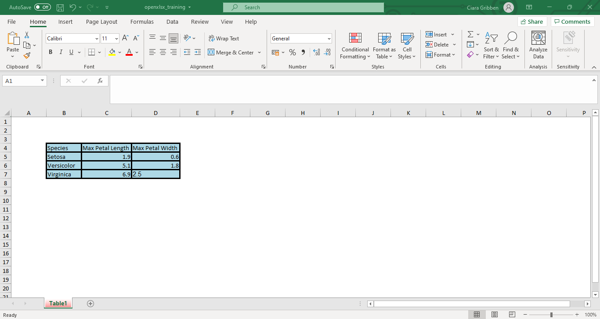

```{r setup, include=FALSE}
# Author: Ciara Gribben
# Date: Feb 2022
# R Version: 3.6.1

# Learnr Package Documentation: https://rstudio.github.io/learnr/

# Packages
library(learnr)
library(dplyr)
library(janitor)
library(stringr)
library(openxlsx)


knitr::opts_chunk$set(echo = FALSE)

# Formatting text table
annotation <- c("#", "##", "###", "\\*italics\\*", "\\*\\*bold\\*\\*", "\\* bulleted list")
formatting <- c("Header 1", "Header 2", "Header 3", "Format text to italics", "Format text to bold", "Create bulleted list")

formattext <- data.frame(Annotation = annotation, Formatting = formatting, stringsAsFactors = FALSE)
```

```{r phs-logo, fig.align='right', out.width="40%"}
knitr::include_graphics("images/phs-logo.png")
```

## Introduction

Welcome to an introduction to the openxlsx R package. This course is designed as a self-directed introduction to openxlsx for anyone in Public Health Scotland. 

<div class="info_box">
<h4>Course Info</h4>
<ul>

<li>

This course is built to flow through sections and build on previous knowledge. If you're comfortable with a particular section, you can skip it.

</li>

<li>

Some sections have multiple parts to them. Navigate the course by using the buttons at the bottom of the screen to Continue or go to the Next Topic.

</li>

<li>

The course will also show progress through sections, a green tick will appear on sections you've completed, and it will remember your place if you decide to close your browser and come back later.

</li>

</ul>

There are some exercises designed to accompany this course which can be downloaded from [Github](https://github.com/Public-Health-Scotland/). These can either be completed bit by bit as you work through the course or as a whole exercise at the end.  
  </div>
</br>


### What is openxlsx?

Openxslx is an R package that allows us to read, write and edit xlsx files from within the RStudio interface. This will let us automate the creation and formatting of the excel files that usually accompany our publications. 

Usually, the process to create these excel publication files is very manual and involves several copy/paste steps. This can result in errors with data being pasted in the wrong place or wrong format which can have serious consequences. For example, in 2003 the Candian power company TransAlta lost $24 million due to a copy paste error causing misaligned rows in a spreadsheet containing bids for contracts. So automating the production of these excel files is key. 

```{r openxlsx-horst, echo=FALSE, fig.align='centre', out.width="100%"}

```


### Why use Excel?
You might wonder why we should still provide data in an excel format, aren't dashboards and infographics the way forward? 

While dashboards and infographics are a great way of showing results and delivering messages they don't suit everyone. Many of our customers can't access dashboards due to IT setup in their organisations and others may just want the data in a spreadsheet to take away and do their own analysis. 

### Knowledge Check
```{r intro-quiz}
quiz(
  question("Which of the following can openxlsx do?",
    answer("Read data in from excel", correct = TRUE),
    answer("Write data out to excel", correct = TRUE),
    answer("Format excel files using the RStudio interface", correct = TRUE),
    answer("Write publications for us"),
    incorrect = "Not quite, have another go!",
    allow_retry = TRUE,
    random_answer_order = TRUE
  )
)
```

## Data Setup
For the purposes of this course we'll use the iris dataset - this is a dataset that is in-built to R and means the code will be reproducible in your RStudio. However, please note that the datatset is not really important, we're just using it as an example.  

Let's look at the iris data:
```{r iris-head, exercise=TRUE}
# Read in iris data
iris <- iris

# Look at the first 5 rows of the iris data
head (iris)
```

First we need to do some data wrangling and produce tables to be included in the excel output:
```{r iris-wrangling, exercise=TRUE}
# Clean variable names and data
data <- iris %>%
  clean_names() %>%
  mutate(species = str_to_title(species))

# Create a table with the minimum and maximum petal length for each iris species
data_table <- data %>%
  group_by(species) %>%
  summarise(max_pet_length = max(petal_length),
            max_pet_width = max(petal_width)) %>% 
  rename(Species = species, 
         `Max Petal Length` = max_pet_length,
         `Max Petal Width` = max_pet_width)

# Create a table with a count of each iris species
data_table2 <- data %>%
  group_by(species) %>%
  summarise(number = n())
```

We will also produce a simple chart to insert into the excel document:
```{r iris-chart, exercise=TRUE}
graph1 <- data %>%
  ggplot(aes(sepal_length, sepal_width, color = species))+
  geom_point()+
  theme_classic()+
  labs(x="Sepal Length", y="Sepal Width",
       title = "Sepal Length by Sepal Width Across Different Species",
       color = "Species")

graph1
```


## Create the excel output
We will now create the excel output and output the tables and chart into it. Refer to the accompanying exercises to follow along with this section. 

The following code creates a blank excel template that you build on. Note that you can't view it as you go along, only once it is saved out, so you have to keep track of what you are adding. 

````
wb <- createWorkbook()
````

Before we can add any data to the workbook we have to create a worksheet for the data to go in. Note that the order you add the sheets to the workbook is the order they appear in, this is not set in code.

````
addWorksheet(
  # Name of the workbook we want to add the sheet to
  wb = wb,
  
  # Define the name of the worksheet 
  sheetName = "Table1",
  
  # Do we want to show gridlines? The default is TRUE so we have to specify if we don't want them
  gridLines = FALSE,
  
  # Colour of the tab - either use from colours() list or use hex code (optional)
  tabColour = "red", # Uses in built colour
  
  # Add headers - as a character vector for positions left, centre and right
  # You can use some in built things
  # (such as page numbers, date, time, filename etc)
  header = c("ODD HEAD LEFT", "ODD HEAD CENTER", "ODD HEAD RIGHT"))
````

````
writeData(wb, 1, data_table, startCol = 2, startRow = 4)
````

Let's save the workbook out at this point and have a look!

````
saveWorkbook(
  # Workbook to save
  wb = wb,
  
  # The file path to save out to
  # - only short version here as working directory is set by the project
  file = "openxlsx_training.xlsx",
  
  # If a file with the same name exists, do you want to overwrite it?
  overwrite = TRUE)
````

```{r save_1_screenshot, fig.align='right', out.width="100%"}
knitr::include_graphics("images/openxlsx/openxlsx-first-save.PNG")
```

So we do have data there but it doesn't look very good! Let's apply some formatting to make it look better.

## Creating Styles
We can set particular styles to apply to certain areas of the workbook. 

### Header Style
Let's set a style for the table headers, borders, the contents of any tables and any non-header text:

````
header_style <- createStyle(fontSize = 14,
                            fontName = "Arial",
                            halign = "Center", # Horizontal Align
                            valign = "Center", # Vertical align
                            wrapText = TRUE,
                            # Can add multiple decorations in a vector
                            textDecoration = c("bold", "underline"))

table_style <- createStyle(fontSize = 11,
                           fontName = "Arial",
                           valign = "Bottom",
                           halign = "Right",
                           border = "TopBottomLeftRight",
                           numFmt = "COMMA")
                           
body_style <- createStyle(fontSize = 11,
                          fontName = "Arial",
                          valign = "Bottom",
                          halign = "Left",
                          border = "TopBottomLeftRight",
                          numFmt = "TEXT")
                          
border_style_dash = createStyle(border = "TopBottomLeftRight",
                                borderStyle = c("dashed"))
                                
border_style_thick = createStyle(border = "TopBottomLeftRight",
                                 borderStyle = c("thick"))
````

You can also define colours using hex codes and use these colours within styles:

````
blue <- "#add8e6"
gray <- "#ededed"

blue_style = createStyle(
  fgFill = blue
)

gray_style = createStyle(
  fgFill = gray
)
````

Let's apply these styles to our workbook:

`````
wb <- createWorkbook()

addWorksheet(
  # Name of the workbook we want to add the sheet to
  wb = wb,
  
  # Define the name of the worksheet 
  sheetName = "Table1",
  
  # Show gridlines? 
  gridLines = FALSE,
  
  # Colour of the tab 
  tabColour = "red", # Uses in built colour
  
  # Add headers - as a character vector for positions left, centre and right
  # You can use some in built things
  # (such as page numbers, date, time, filename etc)
  header = c("ODD HEAD LEFT", "ODD HEAD CENTER", "ODD HEAD RIGHT"))
  
writeData(

# Name of workbook to add the data to
wb, 

# Sheet to insert data into
"Table1", 

# Name of object we want to write
data_table, 

# Which column/row should we start writing the data to
startCol = 2, startRow = 4)

# Apply style to table body
addStyle(

# Name of workbook object we're working on
wb, 

# Sheet to apply style to, can either use sheet number or sheet name
sheet = "Table1", 

# Style to apply
style = body_style, 

# Rows and Columns to apply style to
rows = 7, 
cols = 4)

# Apply border style
addStyle(
wb,
"Table1", 
border_style_thick, 
rows = 4:7, 
cols = 2:4, 
gridExpand = TRUE,
stack = TRUE)

# Apply colour to the table         
addStyle(
wb,
"Table1", 
blue_style, 
rows = 4:7, 
cols = 2:4, 
gridExpand = TRUE,
stack = TRUE)

saveWorkbook(
  wb = wb,
  file = "openxlsx_training.xlsx",
  overwrite = TRUE)  
`````

```{r save_2_screenshot, fig.align='right', out.width="100%"}

```

This looks much better! But we can do more and add some formatting.

## Formatting Worksheets.
We can merge cells:

`````
mergeCells(
# Specify workbook to apply to
wb, 

# Define worksheet for formatting to apply to
sheetName = "Table1",

# Define columns and rows to merge
cols = 2:5, rows = 7:11)

`````

Set row heights and column widths:

`````
setColWidths(
# Specify workbook to apply to
wb, 

# Define worksheet for formatting to apply to
sheet = "Table1", 

# Columns to apply to
cols = 2:5, 

# Width - check within excel by right clicking on column and clicking "Column Width"
widths = 20) 
`````

Add a table title and better column names:

`````
title_table <- "Max Petal Length and Width in Each Species Within Iris Dataset"
writeData(wb, "Table1", title_table, startCol = 2, startRow = 2)

names(data_table) <- c("Species", "Max Petal Length", "Max Petal Width")
writeData(wb, "Table1", data_table, startCol = 2, startRow = 4)
`````

## Excel Functionality
### Adding Pivot Tables
We can write our datasets to excel as pivot tables instead of static tables (like we did in the previous section): 

`````
# Rename the columns of the dataset
names(data_table2) <- c("Species", "Number")

# Add a title for this table
title_table2 <- "Number of each Iris Species in Dataframe"

# This function creates a pivot table in excel
writeDataTable(wb, sheet = "Data_Tables", startCol = 6, x = data_table2,
startRow = 4,
# You can check the names by hovering over table styles in excel
tableStyle = "TableStyleLight15",
# Names the table - not necessary in most situations though
tableName = "Data_Table_2")

writeData(wb, "Data_Tables", title_table2, startCol = 6, startRow = 2)
`````

This gives us the output below:

```{r save_3_screenshot, fig.align='right', out.width="100%"}

```

### Adding Formulae
Let's add an excel function to calculate the total. We could just add a total row to the dataframe but adding a formula to the excel output allows the output to dynamically update with inputs.

`````
# Add another table to the workbook
names(data_table2) = c("Species", "Number")

# This function creates an actual table in excel
writeDataTable(wb, sheet = "Data_Tables", startCol = 6, x = data_table2,
               startRow = 4,
               # You can check the names by hovering over table styles in excel
               tableStyle = "TableStyleLight15",
               # Names the table - not necessary in most situations though
               tableName = "Data_Table_2")

# Adding "Total"
writeData(
wb, 
"Data_Tables",
x = "Total",
startCol = 6, 
startRow = 8)

# Use this function to write excel formulae
writeFormula(
wb, 
"Data_Tables", 
x = "=SUM(G5:G7)",
startCol = 7, 
startRow = 8)
`````

```{r save_4_screenshot, fig.align='right', out.width="100%"}

```
