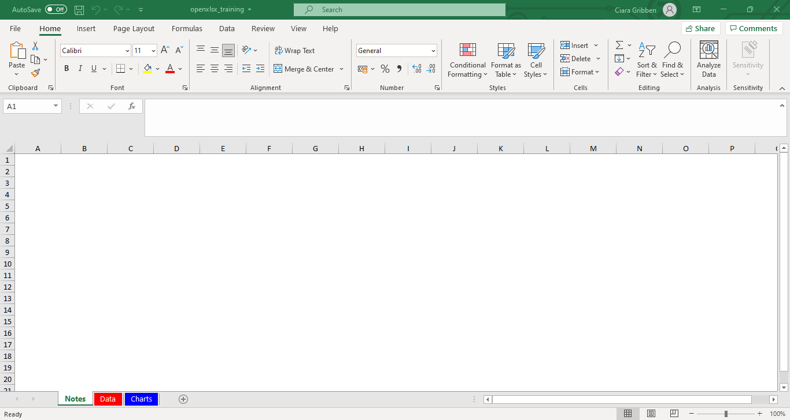
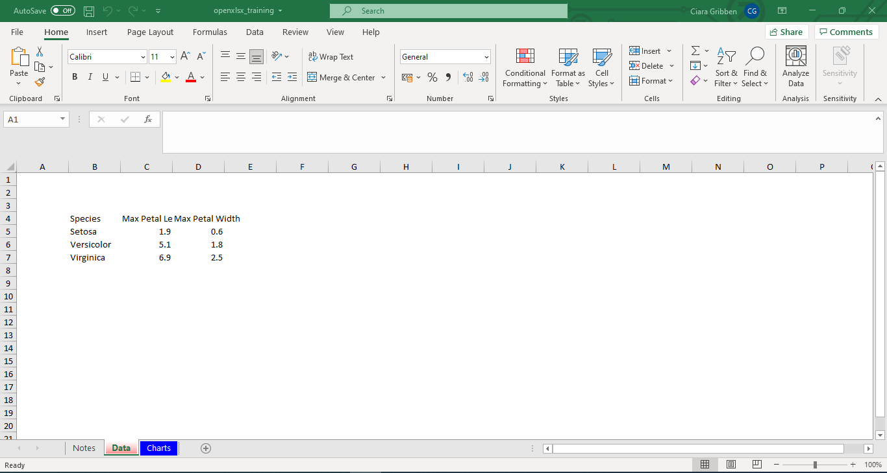
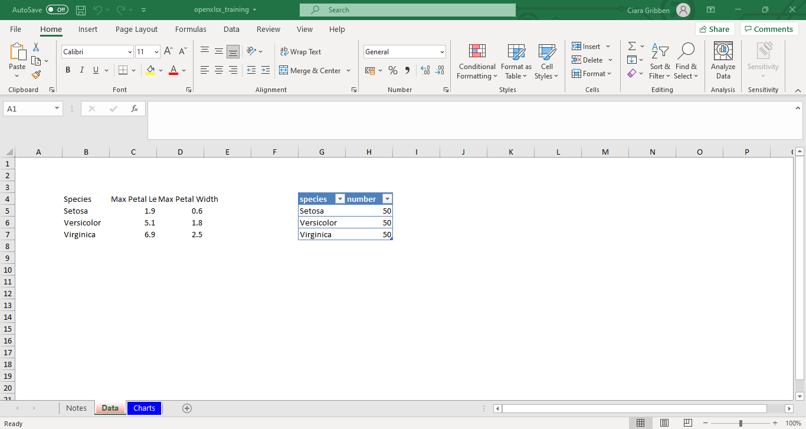
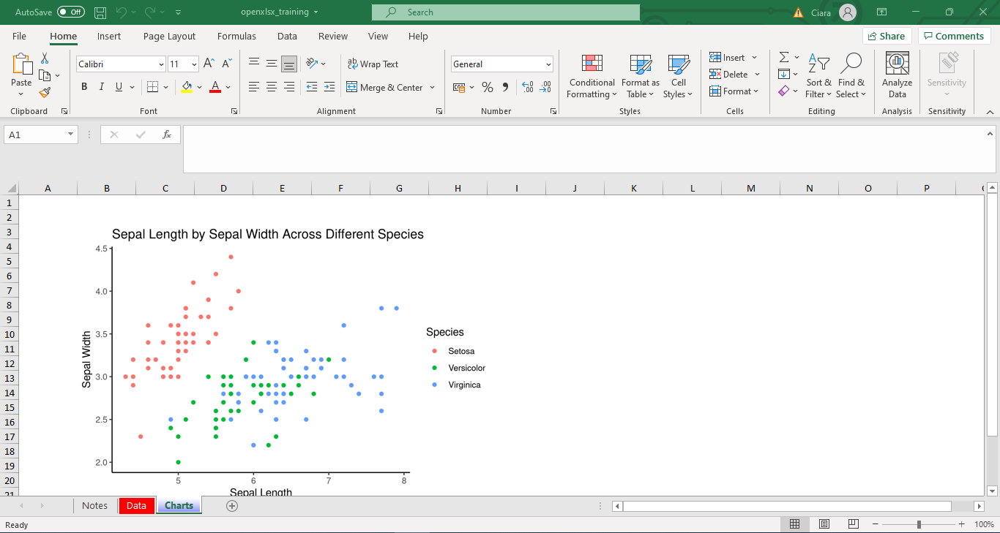
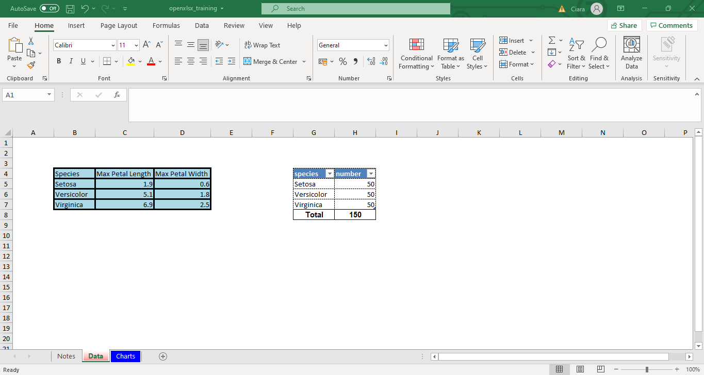
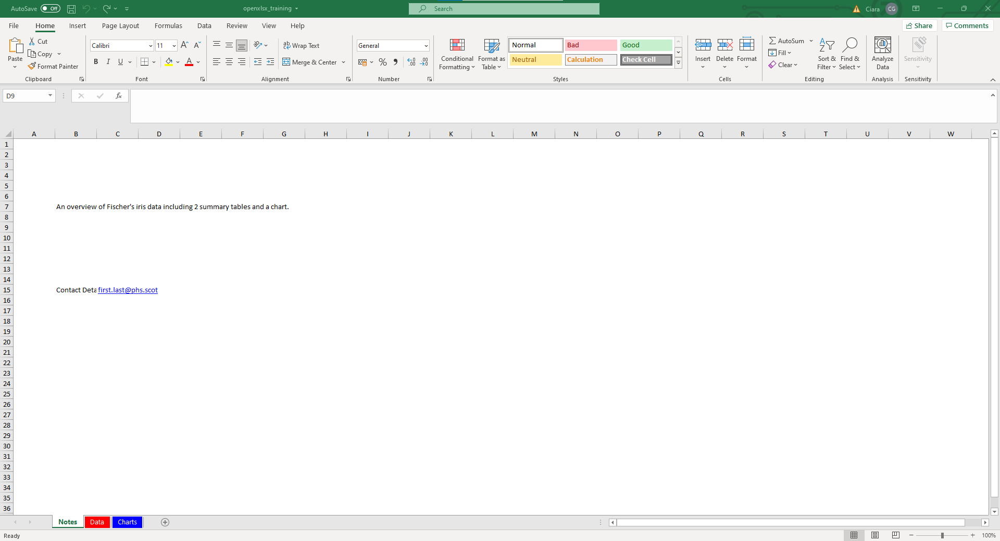
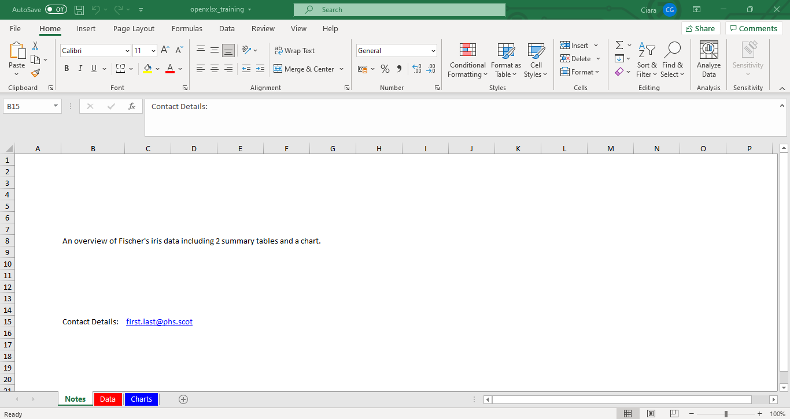
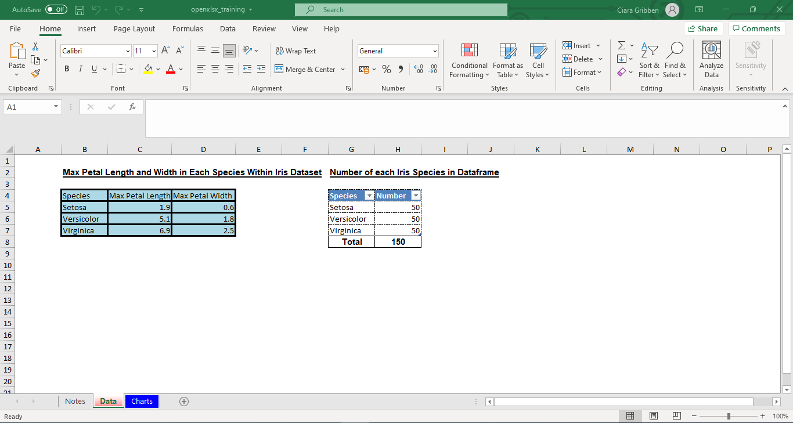

```{r setup, include=FALSE}
# Author: Ciara Gribben
# Date: Feb 2022
# R Version: 3.6.1

# Learnr Package Documentation: https://rstudio.github.io/learnr/

# Packages
library(learnr)
library(dplyr)
library(janitor)
library(stringr)
library(openxlsx)
library(ggplot2)

knitr::opts_chunk$set(echo = FALSE)

# Formatting text table
# annotation <- c("#", "##", "###", "\\*italics\\*", "\\*\\*bold\\*\\*", "\\* bulleted list")
# formatting <- c("Header 1", "Header 2", "Header 3", "Format text to italics", "Format text to bold", "Create bulleted list")

# formattext <- data.frame(Annotation = annotation, Formatting = formatting, stringsAsFactors = FALSE)
```

```{r phs-logo, fig.align='right', out.width="40%"}
knitr::include_graphics("images/phs-logo.png")
```

## Introduction

Welcome to an introduction to the openxlsx R package. This course is designed as a self-directed introduction to openxlsx for anyone in Public Health Scotland. 

<div class="info_box">
<h4>Course Info</h4>
<ul>

<li>

This course is built to flow through sections and build on previous knowledge. If you're comfortable with a particular section, you can skip it.

</li>

<li>

Some sections have multiple parts to them. Navigate the course by using the buttons at the bottom of the screen to Continue or go to the Next Topic.

</li>

<li>

The course will also show progress through sections, a green tick will appear on sections you've completed, and it will remember your place if you decide to close your browser and come back later.

</li>

</ul>

There are some examples designed to accompany this course, these can either be completed bit by bit as you work through the course or as a whole at the end.  There is also an exercise for you to try when you finish the course to apply what you've learned. Both can be downloaded from [Github](https://github.com/Public-Health-Scotland/).
  </div>
</br>


#### What is openxlsx?

Openxslx is an R package that allows us to read, write and edit xlsx files from within the RStudio interface. This will let us automate the creation and formatting of the excel files that usually accompany our publications. 

The process to create these excel publication files is usually very manual and involves several copy/paste steps. This can result in errors with data being pasted in the wrong place or wrong format which can have serious consequences. 

For example, in 2003 the Candian power company TransAlta lost $24 million due to a copy paste error causing misaligned rows in a spreadsheet containing bids for contracts. For more examples of excel errors see this [blog post](https://www.linkedin.com/pulse/7-biggest-excel-mistakes-all-time-andrew-hoag).

```{r openxlsx-horst, echo=FALSE, fig.align='centre', out.width="100%"}
knitr::include_graphics("images/openxlsx/openxlsx_horst.jfif")
```


### Why use Excel?
You might wonder why we should still provide data in an excel format, aren't dashboards and infographics the way forward? 

While dashboards and infographics are a great way of showing results and delivering messages they don't suit everyone. Many of our customers can't access dashboards due to IT setup in their organisations and others may just want the data in a spreadsheet to take away and do their own analysis. 

## Creating the basic excel output
### Create the Blank workbook
We will start by creating a blank workbook and then slowly build it up by adding tables, charts and formatting. 

The following code creates a blank excel template that you build on. Note that you can't view it as you go along, only once it is saved out, so you have to keep track of what you are adding. 

````
wb <- createWorkbook()
````

### Adding worksheets
Before we can add any data to the workbook we have to create worksheets for the data to go in. Note that the order you add the sheets to the workbook is the order they appear in, this is not set in code. We will add 3 worksheets:

* A notes page
* A data page
* A charts page

Notes page:
````
# Add Notes Page
addWorksheet(
# Name of the workbook we want to add the sheet to
wb = wb,

# Define the name of the worksheet 
sheetName = "Notes",

# Do we want to show gridlines? The default is TRUE so we have to specify if we don't want them
gridLines = FALSE,

# Add headers - as a character vector for positions left, centre and right
# You can use some in built things
# (such as page numbers, date, time, filename etc)
header = c("&[Date]", NA, NA))
````

Data Page:
````
# Add Data Page
addWorksheet(
# Name of the workbook we want to add the sheet to
wb = wb,

# Define the name of the worksheet 
sheetName = "Data",

# Do we want to show gridlines? The default is TRUE so we have to specify if we don't want them
gridLines = FALSE,

# Colour of the tab - either use from colours() list or use hex code (optional)
tabColour = "red", # Uses in built colour

# Add headers - as a character vector for positions left, centre and right
# You can use some in built things
# (such as page numbers, date, time, filename etc)
header = c("ODD HEAD LEFT", "ODD HEAD CENTER", "ODD HEAD RIGHT"))
````

Charts Page:
````
# Add Charts Page
addWorksheet(
# Name of the workbook we want to add the sheet to
wb = wb,

# Define the name of the worksheet 
sheetName = "Charts",

# Do we want to show gridlines? The default is TRUE so we have to specify if we don't want them
gridLines = FALSE,

# Colour of the tab - either use from colours() list or use hex code (optional)
tabColour = "blue", # Uses in built colour

# Add headers - as a character vector for positions left, centre and right
# You can use some in built things
# (such as page numbers, date, time, filename etc)
header = c("ODD HEAD LEFT", "ODD HEAD CENTER", "ODD HEAD RIGHT"))
````

This gives a workbook that looks like this:

```{r save_1_screenshot, fig.align='right', out.width="100%"}

```

### Adding Tables
For the purposes of this course we'll use the iris dataset - this is a dataset that is in-built to R and means the code will be reproducible in your RStudio. However, please note that the datatset is not really important, we're just using it as an example.  

Let's look at the iris data:
```{r iris-head, exercise=TRUE}
# Read in iris data
iris <- iris

# Look at the first 5 rows of the iris data
head (iris)
```

First we need to do some data wrangling and produce tables to be included in the excel output:
```{r iris-wrangling, exercise=TRUE}
# Clean variable names and data
data <- iris %>%
  clean_names() %>%
  mutate(species = str_to_title(species))

# Create a table with the minimum and maximum petal length for each iris species
min_max_data <- data %>%
  group_by(species) %>%
  summarise(max_pet_length = max(petal_length),
            max_pet_width = max(petal_width)) 

min_max_data

# Create a table with a count of each iris species
count_data <- data %>%
  group_by(species) %>%
  summarise(number = n())

count_data
```

We have two options for writing data out from R to excel, normally(??) or as a pviot table. Let's look at the normal option first. We're going to write out the dataset with the minimum and maximum petal length for each iris species to the Data tab of the workbook we created:

````
writeData(
# Name of the workbook we want to add the sheet to
  wb = wb,
  
  # Name of tab to save the data to 
  sheetName = "Data", 
  
  # Name of the object we want to write out
  min_max_data, 
  
  # Row and column we want to have the top left cell of the data in
  startCol = 2, 
  startRow = 4)
````

```{r save_2_screenshot, fig.align='right', out.width="100%"}

```

We can aso write data to a pivot table. We'll use the dataset containing the count of iris species for this:

````
writeDataTable(
# Name of the workbook we want to add the sheet to
wb, 

# Name of tab to save the data to 
"Data", 

# Name of the object we want to write out
count_data,

# Row and column we want to have the top left cell of the data in
startCol = 7, 
startRow = 4)
`````

```{r save_3_screenshot, fig.align='right', out.width="100%"}

```

### Adding Charts
Let's create a chart using the iris data:

```{r iris-chart, exercise=TRUE}
graph1 <- data %>%
  ggplot(aes(sepal_length, sepal_width, color = species))+
  geom_point()+
  theme_classic()+
  labs(x="Sepal Length", y="Sepal Width",
       title = "Sepal Length by Sepal Width Across Different Species",
       color = "Species")

graph1
```

Openxlsx automatically adds the most recently used plot to the workbook. The easiest way to make sure you use the correct chart is to print the chart you want and then add it. 

`````
# Print chart
print(graph1)

insertPlot(wb = wb, 

          # Sheet number/name
           sheet = "Charts",
           
           # Width/height of the graph - you might need to play around to get the right ratio
           width = 6, 
           height = 4, 
           
           # Define where the top and left side of the chart should sit
           startRow = 3, 
           startCol = 2, 
           
           # Resolution of the chart
           dpi = 300) 
`````

```{r save_4_screenshot, fig.align='right', out.width="100%"}

```

### Adding Formulae
Let's add an excel function to calculate the total of the second table. We could just add a total row to the dataframe but adding a formula to the excel output allows the output to dynamically update with inputs.

`````
# Adding "Total" row to data
writeData(
wb, 
"Data",
x = "Total",
startCol = 7, 
startRow = 8)

# Add the excel formula to caclulate the total
writeFormula(
wb, 
"Data", 
x = "=SUM(H5:H7)",
startCol = 8, 
startRow = 8)
`````

```{r save_5_screenshot, fig.align='right', out.width="100%"}
knitr::include_graphics("images/openxlsx/openxlsx-with-formula.png")
```

## Styles & Formatting
### Styles
So now we have a workbook with data and a chart in it, but it doesn't look very good. We can apply style and formatting to certain areas of the workbook to make it look better. 

Let's set a style for the table headers, borders, the contents/totals of any tables and any non-header text:

````
header_style <- createStyle(fontSize = 14,
                            fontName = "Arial",
                            halign = "Center", # Horizontal Align
                            valign = "Center", # Vertical align
                            wrapText = TRUE,
                            # Can add multiple decorations in a vector
                            textDecoration = c("bold", "underline"))

table_style <- createStyle(fontSize = 11,
                           fontName = "Arial",
                           valign = "Bottom",
                           halign = "Right",
                           border = "TopBottomLeftRight",
                           numFmt = "COMMA")
                           
total_style <- createStyle(fontSize = 11,
                          fontName = "Arial",
                          valign = "Bottom",
                          halign = "Center",
                          border = "TopBottomLeftRight",
                          numFmt = "TEXT",
                          textDecoration = "bold")
                           
body_style <- createStyle(fontSize = 11,
                          fontName = "Arial",
                          valign = "Bottom",
                          halign = "Left",
                          border = "TopBottomLeftRight",
                          numFmt = "TEXT")
                          
border_style_dash = createStyle(border = "TopBottomLeftRight",
                                borderStyle = c("dashed"))
                                
border_style_thick = createStyle(border = "TopBottomLeftRight",
                                 borderStyle = c("thick"))
````

You can also define colours using hex codes and use these colours within styles:

````
blue <- "#add8e6"
gray <- "#ededed"

blue_style = createStyle(
  fgFill = blue
)

gray_style = createStyle(
  fgFill = gray
)
````

Let's apply these styles to our workbook, we'll add styles to the tables:

`````
# Apply style to table total to table 2
addStyle(

  # Name of workbook object we're working on
  wb,

  # Sheet to apply style to
  "Data",

  # Style to apply
  style = total_style,

  # Rows and Columns to apply style to
  rows = 8,
  cols = 7:8)
  
# Apply border style to both tables
addStyle(
wb,
"Data", 
border_style_thick, 
rows = 4:7, 
cols = 2:4, 
gridExpand = TRUE,
stack = TRUE)

addStyle(
wb,
"Data", 
border_style_dash, 
rows = 4:7, 
cols = 7:8, 
gridExpand = TRUE,
stack = TRUE)

# Apply colour to table 1        
addStyle(
wb,
"Data", 
blue_style, 
rows = 4:7, 
cols = 2:4, 
gridExpand = TRUE,
stack = TRUE)
`````

```{r save_6_screenshot, fig.align='right', out.width="100%"}

```

This looks much better! But we can do more and add some formatting.

### Formatting Worksheets.
Let's add some information to the notes page. Let's add a title, a hyperliked email address and a description of what's contained in the workbook. First we define them:

````
# Title
contact <-  "Contact Details:"

# Email
email <- "mailto:first.last@phs.scot"
names(email) <- "first.last@phs.scot"
class(email) <- "hyperlink"

# Description
notes_text <- paste0("An overview of Fischer's iris data including 2 summary tables and a chart.")
````

Then we add them to the Notes page of the workbook:

````
# Adding "Contact details:"
writeData(wb, sheet = 1, x = contact, startCol = 2, startRow = 15)

# Adding the email address hyperlink
writeData(wb, sheet = 1, x = email, startCol = 3, startRow = 15)

# Adding the home text
writeData(wb,"Notes", notes_text, startCol = 2, startRow = 7)
````

```{r save_7_screenshot, fig.align='right', out.width="100%"}

```

This looks ok but we could tidy it up a bit. Let's merge the cells containing the description and change the column width so 'Contact Details' isn't cut off:

`````
# Merge cells for description
mergeCells(
# Specify workbook to apply to
wb, 

# Define worksheet for formatting to apply to
Name = "Notes",

# Define columns and rows to merge
cols = 2:7, rows = 7:8)

# Set row heights and column widths:

setColWidths(
  # Specify workbook to apply to
  wb, 
  
  # Define worksheet for formatting to apply to
  sheet = "Notes", 
  
  # Columns to apply to
  cols = 2, 
  
  # Width - check within excel by right clicking on column and clicking "Column Width"
  widths = 15) 
`````

```{r save_8_screenshot, fig.align='right', out.width="100%"}

```

### Format tables and add table/chart titles 
We can also tidy up the table 2 by adding better column names and add titles to both tables and the chart:

````
# Table 1 
## Title
title_table1 <- "Max Petal Length and Width in Each Species Within Iris Dataset"
writeData(wb, "Data", title_table1, startCol = 2, startRow = 2)

## Column Names
names(min_max_data) <- c("Species", "Max Petal Length", "Max Petal Width")
writeData(wb, "Data", min_max_data, startCol = 2, startRow = 4)

# Table 2
## Title
title_table2 <- "Number of each Iris Species in Dataframe"
writeData(wb, "Data_Tables", title_table2, startCol = 6, startRow = 2)

names(data_table2) <- c("Species", "Number")
writeDataTable(wb, "Data", count_data, startCol = 7, startRow = 4)
`````

```{r save_9_screenshot, fig.align='right', out.width="100%"}

```


